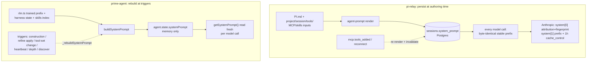
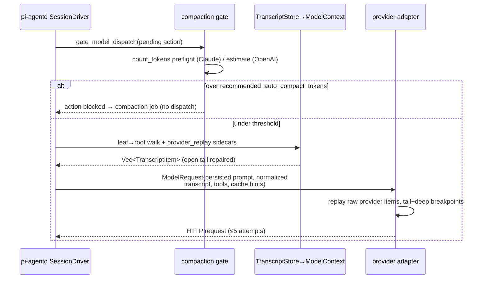
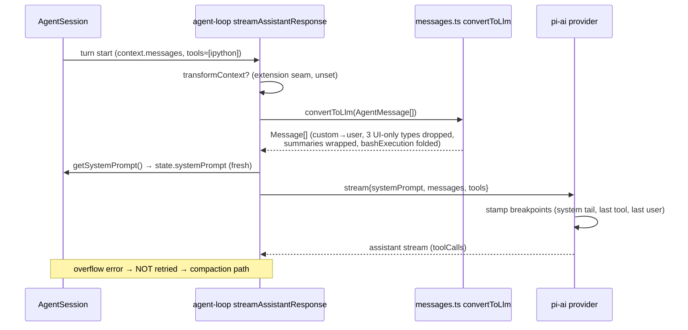
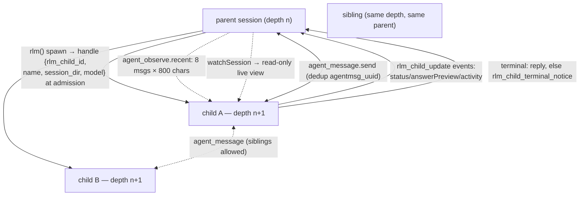
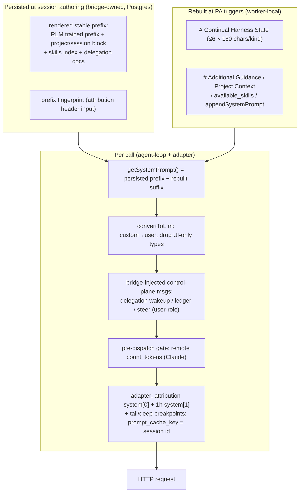

# Context Engineering — Exactly What Enters Every Model Call, and When

(cross-codebase comparison for the pi-relay → prime-agent migration)

> **Sources** (ground truth; all in this directory): `pi-relay-rust-backend.md` §8,
> `pi-relay-frontend-contract.md` §7, `prime-agent-deep.md` §8 (+§5, §7.2),
> `pi-mono-deep.md` §10 (+§9.2), `omp-deep.md` §6–8, `omp-batteries.md` §34 (+§7, §17, §32–33).
> Sibling syntheses: `GAP-ANALYSIS.md`, `MIGRATION-STRATEGIES.md`.
> Path citations are repo-relative exactly as the source reports use them
> (pi-relay: relative to `rust/crates/`; prime-agent: relative to
> `repos/prime-agent/packages/coding-agent/src/` unless noted; OMP/pi-mono: package-relative).
>
> **Abbreviations:** PA = prime-agent (migration target), PM = pi-mono (upstream),
> OMP = oh-my-pi, PR = pi-relay (migration source).

## 1. The four doctrines at a glance

**pi-relay (source) — the persisted-prefix doctrine.** The system prompt is rendered **once at session
authoring time** from `PI.md` (`agent-prompt/src/lib.rs` + `agent-daemon/src/provider_runtime/prompt.rs`),
persisted to `sessions.system_prompt`, and reused byte-identically on every call; per-call variance lives only
in the transcript suffix, tool list, and cache hints (`pi-relay-rust-backend.md` §8.1). Caching is explicit and
per-provider (§8.2); compaction is provider-native and proactively gated (§8.5/§8.8); disclosure = index lines
+ `LoadSkill` + handoff file refs (§8.4); there is **no memory subsystem** (§8.11).

**prime-agent (target) — the rebuild-at-triggers doctrine.** The prompt is a single string built by
`core/system-prompt.ts::buildSystemPrompt` around the RLM trained prefix (`core/prompts/rlm.ts`), rebuilt
**wholesale** at ~7 triggers (`prime-agent-deep.md` §8.1.2); caching is left to the pi-ai provider layer
(§7.2). The defining discipline: **everything dynamic is a `user`-role message** — `core/messages.ts::
convertToLlm` maps every custom type to user text, dropping three UI-only customTypes (§8.1.1). Disclosure is
kernel-mediated (indexes/doctrines in the prompt, payloads pulled via files/`help()`/host handlers, §8.2); a
**continual harness** is the memory layer (§5, §8.5).

**pi-mono (upstream reference) — cached prompt + extension hooks.** `buildSystemPrompt()` cached in
`_baseSystemPrompt`, rebuilt only on tool-set change; extensions swap the prompt per run (`before_agent_start`)
and rewrite messages per request (`context` / `before_provider_headers` / `before_provider_request`)
(`pi-mono-deep.md` §10.1). No wakeups, roster, or memory upstream; `pi.appendEntry` is the persistence
primitive (§10.6).

**OMP (batteries reference) — block array + five hook seams.** `AgentContext.systemPrompt` is a **`string[]`**
("splicing-friendly", `packages/agent/src/types.ts`), 1–4 blocks prepped in parallel under one 5s deadline
(`omp-batteries.md` §34.1). Per request, `prepareProviderCall` runs five seams (`convertToLlm`,
`transformContext`, `transformProviderContext`, `appendOnlyContext`, tool normalizer) and may rewrite
everything into an **owned dialect** — in-band tool calling, `tools: undefined` on the wire (`omp-deep.md`
§6.2–6.3). Injections use a declared **XML-tag vocabulary**; large bodies are referenced by **internal URL
schemes** (`skill://`, `rule://`, `memory://`…) pulled through `read` (`omp-batteries.md` §34.6). Three memory
backends inject via explicit hooks (§7); secrets are reversibly obfuscated before provider replay (§32).

| Dimension | pi-relay | prime-agent | pi-mono | OMP |
|---|---|---|---|---|
| **Prompt structure** | Single persisted string, 8 sections + subagent appends (§2.1) | Single string, fixed 7-part order around RLM prefix (§2.2) | Base + tool snippets + `<project_context>` + skills index (§2.3) | **`string[]`, 1–4 blocks**; 17KB master template (§2.4) |
| **When (re)built** | Once at authoring; persisted to `sessions.system_prompt` | Wholesale at ~7 triggers; harness CRUD waits for a trigger | Session start + tool-set change; per-run swap via `before_agent_start` | Per session start (parallel prep, 5s); subagent splice per spawn |
| **Caching** | Explicit: attribution fingerprint, 1h system + tail/deep transcript breakpoints, `prompt_cache_key` (§2.1) | None in prompt; pi-ai stamps system-tail/last-tool/last-user (§2.2) | Byte-stable prefix; compaction disables cache writes | Append-only context; handoff side-requests share live cache key |
| **Injection channels** | Queued inputs, `DaemonToolObservation` wakeups, post-compaction ledger (§6.1) | Everything a `user` message via `convertToLlm`; action store delivery (§3.2, §6.2) | Steer/follow-up queues + extension custom messages | XML-tag vocabulary + hidden/visible custom messages + TTSR (§6.4) |
| **Compaction** | Proactive `count_tokens` gate → provider-native → summary + replay checkpoint + ledger (§7.1) | 3 triggers → session-internal summary, summary-first rebuild (§7.2) | Same schema upstream; overflow recovery strips erroring response (§7.3) | 6 triggers; classic/snapcompact/handoff; fixed 6-section skeleton (§7.4) |
| **Memory** | None (transcript forest + handoff files + human files) (§8.1) | Continual harness: dual-scope store, 4 kinds, ≤6×180-char menu (§8.4) | `appendEntry` custom entries, excluded from LLM context (§8.3) | `MemoryBackend` seam: local / hindsight / mnemopi (§8.2) |

## 2. System prompt assembly

### 2.1 pi-relay — rendered once, persisted, cache-engineered

Render order (`PI.md` top→bottom; `agent-prompt/src/lib.rs` + `agent-daemon/src/provider_runtime/prompt.rs`;
`pi-relay-rust-backend.md` §8.2):

1. Identity/behavior preamble (fixed template). 2. `project.agents_md` inlined when the session has a project.
3. Session block: `session.cwd`, `session.has_project`, `session.workspaces_markdown`. 4. `tools.specs` —
name + description + input schema per first-party tool (`tools.aliases.edit`/`shell` call-outs; canonical
`Bash` requires `call_description`). 5. `mcp.servers_markdown` — `- server: \`tool\`` lines only; no
schemas/fingerprints/health (test-enforced). 6. Skills index — `available_skills` JSON (name, description,
path; `workspace/` prefix). 7. Instruction files — `RawInstructionFile`s under scope headings (global /
`### Project: …` / `#### <workspace>`). 8. Subagent-delegation section — gated by `capabilities.can_delegate`
(absent from the subagent profile). 9. *(Subagent sessions only*, `subagents.rs::child_system_prompt`)
contract + `# Subagent role` + `# Preloaded skill:` blocks; persisted on the child row.

**When built:** once at authoring → `sessions.system_prompt`; normal turns never re-render. The frontend reads
this exact text via `system.prompt` (`{template, rendered}`), invalidated on reconnect and
`mcp.tools_added`/`mcp.add` (`pi-relay-frontend-contract.md` §7.1).

**Cache layout** (`agent-provider/src/openai.rs`, `anthropic.rs`): Anthropic `system[0]` = attribution header
with stable-prefix fingerprint (cross-session cacheable); `system[1]` = prefix + 1h `cache_control`; transcript
breakpoints on the latest cacheable block (5m) + a deep marker ~18 blocks back; deliberately **no tool-level
`cache_control`** (Anthropic hashes tools→system→messages cumulatively); `thinking` hardcoded adaptive
(per-request toggles would invalidate message-content cache). OpenAI: `instructions` = prefix;
`prompt_cache_key` = override → session id (Codex `thread_id` semantics) → fresh UUID; `store:false`,
`stream:true`, `include:["reasoning.encrypted_content"]`, `service_tier:"priority"`.

### 2.2 prime-agent — fixed 7-part order, rebuilt at triggers

`buildSystemPrompt()` (`core/system-prompt.ts`) + `buildRlmPrompt()` (`core/prompts/rlm.ts`), exact order on
the default path (`prime-agent-deep.md` §8.1.2):

1. **`buildRlmPrompt()`** — identity preamble; `Working directory` / `Conversation log` / `Recursive agent
   depth` + package list; **child doctrine** (depth>0: spawned-by, `[task from parent]`, reply contract);
   installed-skills paragraph; family-reach restrictions; **recursion block** (`rlm()` semantics, when
   `allowRecursion && hasIpython`); **`IPYTHON_CONTROL_PROMPT`**; refine nudge.
2. **`buildSubagentGuidance()`** — `# Delegating to sub-agents`, before the harness menu (mirrors Claude
   Code's Agent-tool ordering, per code comment).
3. **`formatHarnessStateForPrompt()`** (`refinement/refinement.ts:429`) — `# Continual Harness State`: per-kind
   counts, ≤6 entries/kind (title + 180-char clip + path hints), ≤5 recent refinements, local/global policy.
4. **`# Additional Guidance`** — deduped tool-contributed `promptGuidelines`.
5. **`# Project Context`** — AGENTS.md et al. under `## <absolute path>` headings.
6. **`<available_skills>`** index — `skills.ts::formatSkillsForPrompt`, metadata only; only with file access.
7. **`appendSystemPrompt`** last.

A `customPrompt` replaces block 1; blocks 3/5/6 + child doctrine still append. **Rebuilt wholesale** at:
session construction, `setRlmHeartbeatController`, RLM max-depth change, `setActiveToolsByName`, refine apply,
extension `resources_discover` (all `_rebuildSystemPrompt` call sites); harness state re-merged (global +
local) from disk at each rebuild — **mid-session harness CRUD is invisible until a trigger fires.**
`getSystemPrompt` is read fresh per call. **Cache breakpoints:** none inserted by prime-agent; the pi-ai
Anthropic provider stamps `cache_control: ephemeral` on the system tail block, last tool, and last user
message; `cacheRetention` short(5m)/long(1h)/none (`prime-agent-deep.md` §7.2).

### 2.3 pi-mono — cached base, extension-swappable

`buildSystemPrompt()` (`core/system-prompt.ts`; `pi-mono-deep.md` §9.2): base (identity + tool doctrine) →
per-tool snippets+guidelines (active tools only) → `appendSystemPrompt` → `<project_context>` with
`<project_instructions path="…">` AGENTS.md blocks → skills index (only if read tool active). Cached in
`_baseSystemPrompt`; rebuilt on tool-set change; replaceable per run via `before_agent_start` (§10.1).

### 2.4 OMP — parallel-prep block array

`buildSystemPrompt()` (`packages/coding-agent/src/system-prompt.ts`) runs ~9 prep steps **in parallel under one
5s deadline**, failed steps degrading to minimal fallbacks (`omp-batteries.md` §34.1). Result = 1–4 blocks:

- **Block 0 — master template** (`prompts/system/system-prompt.md`): `<system-conventions>` (XML tags
  authoritative even inside user messages) → `ROLE` → `RUNTIME` (skills index with MUST-read `skill://`
  directive; `<generic-rules>` deduped by paragraph-block containment; `<domain-rules>` index; internal-URL
  catalog; tool inventory — `toolListMode` list or full `renderToolInventory()`; `# xd:// Tool Devices`) →
  `TOOL POLICY` (incl. secrets-placeholder notice) → `EXECUTION WORKFLOW` → `DELIVERY CONTRACT`.
- **Block 1** — computer-safety appendix (only with `computer` tool).
- **Block 2 — project footer** (`project-prompt.md`): `<workstation>`, `<repo-rules>`, `<dir-context>`,
  `<workspace-tree>` (depth ≤3), `<workspace-roots>`, date+cwd, closing `<critical>`, `appendPrompt` last.
- **Block 3** — active-repo context.

Subagents: same array spliced — `[...defaultPrompt.slice(0,-1), subagentPrompt, defaultPrompt.at(-1)]`
(environment block stays last; `omp-deep.md` §8.2). `NULL_PROMPT=true` → empty array (bench escape hatch).

### 2.5 The core doctrinal difference (persisted vs rebuilt)


## 3. Per-model-call assembly pipeline

What happens between "turn starts" and "HTTP request".

### 3.1 pi-relay — materialize transcript + replay sidecars + breakpoints

All calls: `agent-daemon/src/provider_runtime/requests.rs::build_model_request` (or sidecar/compaction
siblings) → `ModelRequest` (`agent-provider/src/lib.rs`) → adapter (`pi-relay-rust-backend.md` §8.1, §8.3):

1. **Gate** (`runtime/compaction.rs::gate_model_dispatch`): token accounting (Claude: remote `count_tokens`
   preflight with the exact local tool surface; OpenAI: usage-anchored estimate) against
   `recommended_auto_compact_tokens` ⇒ over-budget actions are `blocked` and compaction runs *before* dispatch
   (full detail in §7.1 below).
2. **Transcript materialization**: `TranscriptStore` (forest) → `ModelContext` (active leaf→root walk +
   parallel `provider_replay` vectors) → `provider_runtime/transcript.rs` →
   `agent-provider/src/transcript.rs::normalize_transcript_for_provider` (per-entry `limit_tool_output`;
   canonical tool-name rewrite per replay provider).
3. **Open-turn repair** (`agent-session/src/model_context.rs::close_open_turn*`): crashed tails closed with
   synthesized crashed `ToolResult`s + `TurnFinished{Crashed}` — both providers see a closed conversation.
4. **Adapter render**: OpenAI replays assistant/compaction entries as **raw Responses items** from the replay
   sidecar (preserving reasoning + `encrypted_content`); Anthropic replays provider blocks where present;
   `DaemonToolObservation` → one plain user-role text block (daemon honesty: no synthetic
   `inspect_delegation` call/result fabricated). Then `add_transcript_cache_breakpoints`.
5. **Tools** merged per call: first-party profile tools (`provider_tools_for_session`) + session MCP snapshot
   (`mcp_snapshot.provider_tools`).



### 3.2 prime-agent — `convertToLlm` discipline, minimal machinery

Every call (root, subagent, retry): `packages/agent/src/agent-loop.ts::streamAssistantResponse`
(`prime-agent-deep.md` §8.1.1):

1. `messages = context.messages`; optional `transformContext` extension pre-map (unset by default).
2. `llmMessages = await config.convertToLlm(messages)` — prime-agent installs
   `core/messages.ts::convertToLlm` (inherited verbatim by RLM children). Mapping: `user`/`assistant`/
   `toolResult` pass through; `bashExecution` → `user` text (skipped when `excludeFromContext` — the `!!`
   prefix); `custom` → `user` verbatim **except `session_slash_command`, `session_slash_command_result`,
   `compaction_outcome` — dropped**; `branchSummary`/`compactionSummary` → `user` wrapped in PREFIX/SUFFIX.
3. `systemPrompt = config.getSystemPrompt?.() ?? context.systemPrompt` — read **fresh per call**.
4. `tools = context.tools` — normally just `ipython` (one `code` param).
5. Retry via `streamSimple` + `_handleRetryableError`; **context-overflow errors are not retried** — they
   route to compaction (§7 below).



### 3.3 pi-mono — hook chain into the provider payload

Per call (`pi-mono-deep.md` §10.1, §10.7): `buildSessionContext()` (`session-manager.ts:461`, leaf→root,
compaction-aware) → `convertToLlm()` (bash/custom/branchSummary → user text) → steering queues drained
(`getSteeringMessages`) → extension hooks **in order**: `context` (may rewrite `messages[]`) →
`before_provider_headers` → `before_provider_request` (may replace the raw payload) → provider request
`system + tools[] + messages[]`. `before_agent_start` can inject messages and replace the system prompt at run
start.

### 3.4 OMP — `prepareProviderCall` and the five seams

Fresh before **every** LLM request (`packages/agent/src/agent-loop.ts`; `omp-deep.md` §6.2):

1. Per-request resolvers: `getModel`, apiKey, reasoning, serviceTier, cwd; `metadataResolver` re-resolves
   *after* credential selection so `account_uuid` matches the credential used.
2. `transformContext?.(context.messages, signal)`.
3. `convertToLlm(messages)` — the **required** seam; the only AgentMessage→wire conversion.
4. `normalizeMessagesForProvider(llmMessages, model)` — provider fixups.
5. `llmContext = {systemPrompt, messages, tools: normalizeTools(tools, {injectIntent, pruneDescriptions})}` —
   can inject an `intent` field into every schema or strip descriptions.
6. `transformProviderContext?.(llmContext, model)`.
7. **Owned-dialect rewrite** (§6.3): tool schemas rendered into the system prompt (`renderInbandToolPrompt`),
   history re-encoded (`encodeInbandToolHistory`), `tools: undefined` on the wire; `wrapInbandToolStream`
   re-materializes native tool-call blocks and **aborts if the model fabricates a `<tool_response>`**.

Migration-relevant (`omp-deep.md` §6.4): re-hosting OMP-style assembly needs exactly five hooks —
`convertToLlm`, `transformContext`, `transformProviderContext`, `appendOnlyContext`, tool normalizer. OMP also
records the entire request payload as OTel span attributes (`startChatSpan`) — request logging for free.
## 4. Progressive disclosure inventory

What is **always** in context vs **pulled on demand**, and the pull mechanism. The universal pattern (named in
`pi-mono-deep.md` §10.3 as "the pattern to copy"): *indexes (names+descriptions+locations) in the stable
prompt; bodies pulled through tools the model already has; truncation + spill-to-disk for large outputs.*

| Resource | pi-relay | prime-agent | pi-mono | OMP |
|---|---|---|---|---|
| **Skills bodies** | Index JSON (name/desc/path); body via **`LoadSkill` tool** (`provider_runtime/skills.rs::load_skill_result`, exact `exposed_name()` match; error text teaches usage) | `<available_skills>` metadata only; body = model **reads SKILL.md** via ipython/bash; Python skills pre-imported + `help()`/`inspect.signature()` | Index (name+desc+location); body via **read tool** | Index + MUST-read directive; body via **`read skill://<name>`** (traversal-guarded; `skill://<name>/<asset>`); `/skill:<name>` injects body as custom message |
| **Tool declarations** | Only session-selected tools declared (first-party profile + MCP snapshot); subagent profile drops 6 delegation tools, keeps `LoadSkill` | Only `ipython` declared (one `code` param); nothing in prompt body | All active tools declared per request; usage guidelines spliced into prompt | `essential` declared; **`discoverable` mounted as `xd://<tool>` devices** — invoked by writing JSON args via `write`; schema revealed on demand / on invalid args |
| **MCP tools** | Prompt: `- server: \`tool\`` lines only; declarations only for manifest tools; picker shows per-tool `context_token_estimate` | Nothing in prompt; `McpManager.hostHandlers()` over kernel bridge | n/a upstream (extension `registerTool` after handshake) | `mcp://` internal URL; per-provider tool-format conversion (`docs/toolconv/*`) |
| **Memories / learned state** | n/a (no memory subsystem) | Harness menu ≤6 × 180-char/kind; full content via `rlm.harness.*` reads / files | `appendEntry` entries persist but are **excluded from LLM context** unless re-injected | `<memories>` block (≤5000 tokens) first turn; `memory://root/...` URLs; backend hooks |
| **Child transcripts** | Never inlined; wakeup snapshot carries **file refs only** (`.pi-handoff/<delegation_id>/…`); bodies via `delegation.read_handoff_file` | Nothing; bounded previews via **`agent_observe.recent`** (8 msgs × 800 chars default, clamped, `truncated` flags) | Parent sees only final stdout (tool result); `tool_execution_update` is UI-only | Child never sees parent conversation by construction; parent gets the assembled **`yield` result** only |
| **Role/spec catalogs** | Role **names** disclosed via tool descriptions; catalog lives on runtime host | Harness subagent-spec menu (title + 180-char clip); full spec read by the spawn path | Agent names+descriptions in the subagent tool description (`agents/*.md` frontmatter) | Definitions discovered from bundled + `~/.omp/agent/agents/*.md` + `.omp/agents/*.md` |
| **History / session log** | Transcript forest; `history.context` RPC exists (unused in prod UI) | **Conversation-log path is in the prompt**; model greps its own session JSONL | `/tree`, `get_entries`, branch summaries | `history://` URL scheme |
| **Large tool outputs** | 10k-token budget (40k chars), head 3/5 + tail 2/5 + omission marker; re-bounded by daemon; bounded again at provider normalization | Truncated preview + **`fullOutputPath`** spill ("[Output truncated. Full output: …]") | Same truncate.ts + `fullOutputPath` pattern | Same truncation family; `context-window-truncated-output.md` prompt |
| **Handoffs** | `.pi-handoff/` artifacts on disk; daemon "intentionally does not inline raw task prompts, final-message prose, or transcript bodies" (`types.ts:181-187`) | n/a (child terminal notice carries a last-text preview only) | n/a upstream | Handoff doc injected into the **new** session as `<handoff-context>` custom message |
| **Kernel/live state & model catalog** | n/a; static `MODEL_OPTIONS` in UI | **The kernel itself is the state store** (doctrine only in prompt); **`rlm.find_models(query, limit≤20)`** host handler — "without adding it to the system prompt" (rlm-runtime.ts) | n/a; static config | eval kernel bridged via `parentEvalSessionId`; `pi-catalog` |

**Frontend corollary** (`pi-relay-frontend-contract.md` §7.1–7.2): the operator's window into context
engineering is exactly **four observability surfaces** — (1) the **system-prompt viewer** (`system.prompt` →
`{template, rendered}`, lazy "See system prompt" disclosure at transcript top, invalidated on reconnect and
`mcp.tools_added`/`mcp.add`); (2) **session-start parameters** (provider/effort, workspace scope, MCP selection
with per-tool `context_token_estimate` → "About N context tokens", `compaction_config`); (3) the
**`history.context` RPC** ("what would the model see from this leaf" — facade-defined, zero production call
sites, still contractually required); (4) **context-size signals** — the *only* numeric context feedback in the
UI (MCP token estimates + "N tokens summarized" on compaction rows; no usage/cost/window meter). The UI never
sees the assembled message array or provider payloads. Beyond those, catalogs arrive as summaries with stable
ids/revisions and detail is fetched lazily by id (`delegation.list` rows → `delegation.read_handoff_file`;
paged `workspace.list_dir` → prefix `workspace.read_file`; collapsed turns → `transcript.turn_detail`).
Notably: **zero skills UI** exists in the web frontend; subagent roles reach the *model* via the prompt, never
the UI — so the replacement backend must keep serving `system.prompt` faithfully: it is the only place learned
context (skills, roles, instructions) becomes operator-visible.

## 5. Inter-subagent visibility & communication

### 5.1 pi-relay — delegation ledger + daemon observations + single wakeup

(`pi-relay-rust-backend.md` §8.7, §8.9.) Subagents are ordinary sessions with `parent_session_id` set, created
by `delegate_writing_task` / `delegate_readonly_tasks`. Visibility is asymmetric and deliberately minimal:

- **Parent → children**: `inspect_delegation` (tool or `delegation.status` RPC) → snapshot: per-child
  `progress_view {expected, spawned, terminal, running, failed}`, status, 120-char outcomes,
  `inspectable_handoff_artifacts` **file refs** (live while Running/Done/DoneWithFailures; empty for
  Cancelling/Cancelled/Failed). Bodies via `delegation.read_handoff_file`. Control: `steer_subagent` /
  `interrupt_subagent`.
- **Children → parent**: **none while running, by design.** The child's final assistant message is the durable
  handoff → `final_message.md` + (bounded) in the wakeup snapshot. Child prompt contract: "parent can
  inspect/steer/interrupt/merge; no nested delegations; final message is the durable handoff."
- **Terminal notification**: when all children are terminal, the barrier (`finish_delegation` DB CAS,
  single-flight) renders the handoff and enqueues **exactly one** `DaemonToolObservation` input on the parent
  — a plain user-role message containing the inspect_delegation JSON; crash-safe via a boot sweep that
  re-renders handoff gaps.
- **Bounds**: ≤8 subagents/delegation in ledgers, 120-char outcomes (`delegation_context.rs`); post-compaction
  the daemon appends a fresh bounded delegation ledger so the model never reconstructs delegation state (§8.8).
- **Browser → everything**: the UI sees all sessions incl. hidden subagents (`session.list` + events); humans
  are the mid-flight steering channel.

### 5.2 prime-agent — nuclear-family messaging + observation previews (target model)

(`prime-agent-deep.md` §8.3, §8.4.) Reach restricted to **parent, siblings, direct children**, computed from a
persisted parent-edge catalog (`AgentFamilyCatalogEntry`); broadcast rejected (`assertDirectAgentMessageTarget`),
reach enforced by `assertAgentFamilyReach`.

- **`agent_message`** — direct text between reachable agents; `list_agents()` → roster `{current, entries
  [{relationship, name, id, depth, status, repliedSinceTask?}]}`. Delivery deduped by id (`agentmsg_<uuid>`)
  with per-id delivery/completion deferreds.
- **`agent_observe`** — read-only previews: `list/get/recent` → `AgentObserveAgentSummary` (status,
  streaming/compacting flags, counts, first/latest previews); `recent` defaults 8 msgs × 800 chars (clamps
  1–50 / 80–2000) with `truncated` flags; tool calls render `[tool_call:<name>]`.
- **Spawn snapshot** (what a child sees): a *fresh* system prompt from its own `_rebuildSystemPrompt` (same
  project context + skills index, fresh merged harness, depth+1 doctrine naming the parent, recursion block
  only if depth < maxDepth), inherited tool names, new kernel, **empty transcript** — the task arrives as the
  first `custom` message `"[task from parent]\n\n<prompt>"`. Parent transcript never copied; spawn handle =
  `{rlm_child_id, name, session_dir, model}` only (admission, not results).
- **Parent-side live view**: `rlm_child_update` events (`{status, answerPreview, toolUseCount, tokenCount,
  activity, repliedSinceTask, …}`) + `watchSession(activeSessionId)` — read-only live view of any child
  (AgentConnection; daemon-implemented via `worker_subscribe`) (`prime-agent-deep.md` §9.2).
- **Terminal notices**: if the child never replied → `rlm_child_terminal_notice` (completed_without_reply +
  last-text preview) / `rlm_child_failure` / cancelled — delivered preferably through the *child's own* message
  controller (child-attributed); stored as `custom_message` → survives compaction/reload.



### 5.3 pi-mono — subprocess isolation

(`pi-mono-deep.md` §10.4, §10.7c.) No in-process roster, no `agent_message`, no previews. The subagent
extension spawns `pi --mode json -p --no-session` as a **subprocess** with fully isolated context (own system
prompt/AGENTS.md/skills; no parent transcript); the parent sees **only final stdout as a tool result**;
streamed JSONL events become `tool_execution_update` UI events. Multi-client attach (shared/exclusive leases)
is multi-consumer, not multi-agent.

### 5.4 OMP — in-process splice + hub peer roster + yield protocol

(`omp-deep.md` §8; `omp-batteries.md` §2–3, §34.3.) Subagents run **in-process** on the main thread
(`src/task/executor.ts`; `mapWithConcurrencyLimitAllSettled` + `Semaphore`), each a full `createAgentSession`
with a **spliced** prompt array (§2.4). Context flows in by inheritance (workspace tree, rules, context files,
skills list, parent memory-backend session aliasing, MCP manager, `taskDepth+1`) — but **the child never sees
the parent conversation** ("each assignment carries every requirement its slice needs"). Peer visibility: the
**hub tool** — the `COOP` prompt section carries an IRC-style peer roster (self id, peers,
coordinate-before-edit, `replyTo`/`await`). Completion is explicit via the hidden **`yield` tool** (added only
when `session.requireYieldTool`), `assembleYieldResult` building the final report; soft request-budget
crossings inject `[budget notice]` steers; at 1.5× the run is force-stopped into a final yield. Recursion
guards: `maxRecursionDepth` default 2; self-spawn ban via `blockedAgent`.

## 6. Notification timeline

For each codebase: an async event fires → exactly **when** and **in what shape** it becomes model-visible.

### 6.1 pi-relay (`pi-relay-rust-backend.md` §8.10)

| Async event | Durable record | Shape when model-visible | Timing guarantee |
|---|---|---|---|
| Delegation terminal | `delegations` status CAS + handoff files | One `DaemonToolObservation` queued input → plain **user-role message** with inspect_delegation JSON → `StartDaemonObservationTurn` when parent idle / at ReadyToContinue | **Exactly once**; survives daemon crash (boot sweep re-checks) |
| Subagent steer accepted | `queued_inputs` subagent-control row | Child transcript user message | Accepted-before-drive; inline if interrupt-or-idle, else detached `spawn_drive_until_blocked` |
| Runtime reconnect | `runtimes.last_seen_at` | Re-drive sweep for sessions stuck queued/consuming | Fixes "stuck queued forever" race (WORKLOG 2026-07-29) |
| Compaction done/failed | actions + `CompactionSummary` entry | Blocked action re-dispatched **under lease**; parents get a fresh delegation ledger in the summary output | Lease guards stale completions |
| MCP inventory change; workspace/fs changes | inventory revision bump; runtime progress/push frames | **Not model-visible** — picker UI gets `mcp_inventory_changed` on stale selection (re-author required); fs frames are browser-only, interest-filtered | — / ephemeral |

### 6.2 prime-agent (`prime-agent-deep.md` §8.4)

Everything lands as a **`custom`/`user` message committed to the transcript**, then mapped to wire-`user` by
`convertToLlm`. Delivery machinery: the session action store (`session-action-store.ts`) — prepared turn
actions with `delivery: "next_turn_boundary"` (steer) or `"when_run_idle"` (follow-up); guards: 20
pending/session, 16,384 chars/message, token-bucket rate limit (capacity 3, refill 1/s).

| Async event | Path to model visibility |
|---|---|
| **Subagent terminal** | Detached task in `_startRlmChildRun` observes settle → if `_parentReplyCount` unchanged, build notice (completed_without_reply + last-text preview; crash → failure; cancel → cancelled w/ reason) → delivered via the **child's own message controller** (child-attributed; `_promptInjectedMessage` fallback) → stored as `custom_message` (`rlm_child_terminal_notice`/`rlm_child_failure`, survives compaction/reload) → wire-`user` literal text. Dedup: once per run (`run.settled`) + per-id message dedup. |
| **Steer (mid-run)** | Prepared action `next_turn_boundary` → `_steeringStopPending` → at the **next turn boundary** `shouldStopBeforeTurn/AfterTurn` ends the run **cooperatively** (no abort; in-flight tool results already in transcript) → input pump (gated on `waitForIdle`, refine-idle) drains per `steeringMode` (`all`/`one-at-a-time`) → fresh `agent.prompt(...)` commits steered content as new `user`/`custom` messages → durable only if present in `agent.state.messages` post-settle, else rolled back. (pi-agent-core's `Agent.steer()/followUp()` queues exist but **AgentSession never uses them**.) |
| **Heartbeat fires** | `cron-jobs.ts` job fires → `createHeartbeatPromptMessage(job)` (`customType:"heartbeat_prompt"`, details `{jobId, schedule, status, runCount, nextRunAt, lastRunAt}`) → queued as prepared prompt (delivery per job, default steer) → wire-`user` with the job's prompt. Matching `session_job` entry records delivery mode. |
| **Compaction completes** | `compaction_start`/`compaction_end` events (reason `manual\|threshold\|overflow\|requested`); `compaction_outcome` custom message enters the transcript but is **dropped by `convertToLlm`** (UI/state only); the summary materializes as the **leading `compactionSummary` message** on the next call via `buildSessionContext`; auto-refine may be scheduled. |
| **MCP tools change** | extension `resources_discover` → `_rebuildSystemPrompt` → visible in the **next** call's system prompt. |
| **Kernel restore** | on resume, `ipython_state_restored` custom message → wire-`user`. |

### 6.3 pi-mono (`pi-mono-deep.md` §10.5)

| Async event | Path into context |
|---|---|
| User types mid-run | editor → `steer` queue → `getSteeringMessages()` polled each inner-loop iteration → pushed into `context.messages` **before the next assistant stream** |
| User types after run | `followUp` queue → outer loop → same path |
| Tool progress | `tool_execution_update` → **UI only** |
| Compaction finished | `compaction` entry appended → later `buildSessionContext` sees summary instead of prefix |
| Extension message | `pi.sendMessage()` / `before_agent_start` → custom entries → user-role next turn |
| **Wakeups/heartbeats** | **absent upstream** — no daemon push into context |

### 6.4 OMP (`omp-batteries.md` §34.6, §26)

All runtime→model injections use the declared XML-tag discipline (authoritative per `<system-conventions>`,
even inside user messages):

| Event | Shape | When visible |
|---|---|---|
| TTSR rule violation | `<system-interrupt reason="rule_violation" …>` replaces aborted partial output; `<system-reminder …>` prepended to later tool results; `ttsr_injection` session entry replayed into reconstruction | Immediate (aborts the turn) + every replay |
| Advisor note | `<advisory advisor="Name" severity="concern" …>…</advisory>` in the primary transcript | Next turn (watchdog over the live session; emission-guarded) |
| Handoff | `<handoff-context>…</handoff-context>` + continuation sentence as agent-attributed `custom_message` in the **new** session | First call of new session |
| Rewind completed | Hidden `rewind-report` custom message; context rebuilt from the new branch — the exploratory branch never reaches the next provider call | At `turn_end` after `rewind` |
| Plan constraint; magic keyword | `plan-mode-context` / `plan-mode-reference` custom messages; per-turn hidden user-attributed keyword notice (visible word stays in the prompt) | On entering plan mode / that turn |
| Subagent budget | `[budget notice]` steer at soft-budget crossing; force-yield at 1.5× | Mid-run |
## 7. Compaction

### 7.1 pi-relay — proactive gate, provider-native, lease-fenced

(`pi-relay-rust-backend.md` §8.5, §8.8.)

- **Trigger**: proactive — `runtime/compaction.rs::gate_model_dispatch` before every dispatch. Eligibility
  (`check_compaction_eligible`; skipped when transcript ends in a bare `CompactionSummary`, and for harness
  sessions) → limit from model metadata `recommended_auto_compact_tokens` → accounting
  (`context_accounting.rs::model_input_tokens_for_gate`: Claude = **remote `count_tokens` preflight** with the
  exact local tool surface incl. web wrappers as client JSON tools; OpenAI = usage-anchored local estimate) →
  over ⇒ action `blocked`, compaction job spawned. Manual `compaction.request` shares the machinery; policy =
  session `metadata "/compaction/config"` over `StoredCompactionPolicy::default`; `CompactionAutoState` tracks
  consecutive failures / suppression / recompaction count.
- **Who authors the summary**: **the provider, natively.** Claude: rendered `PI.compaction.md` + "do not call
  tools" (budget <6,000 tokens, bullets, actionable state only). OpenAI: native `/responses/compact` via
  `compact_body`. Tools suppressed for the call.
- **What survives**: a `CompactionSummary` entry (source ids, `tokens_before`) **plus a provider replay
  checkpoint** — post-compaction replays use the provider's own compacted state. Parents additionally get
  `append_delegation_ledger_to_output` (fresh bounded ledger; the model never reconstructs delegation state).
  Subagent compactions summarize only the subagent's own role/task/history.
- **Cache alignment / fencing**: post-compaction dispatch is a new model action **under lease** — guards stale
  completions, fences corrupt intents; needed because compaction races in-flight external dispatches.

### 7.2 prime-agent — session-internal, three triggers

(`prime-agent-deep.md` §8.1.4.)

- **Triggers** (`_checkCompaction`, after each assistant message end and at turn boundaries):
  1. **Overflow** — provider context-overflow error (`isContextOverflow`: ~20 provider regexes + silent-overflow
     heuristics + non-overflow exclusions; report §7.2). Erroring assistant message **stripped from in-memory
     context** (kept in the session file); one compact-and-retry (`_overflowRecovery: idle → attempted →
     reported`).
  2. **Model-requested** — `compact` skill's `compact.run` → `_pendingRequestedCompaction`, consumed at next
     turn boundary (works with auto-compaction disabled).
  3. **Threshold** — `contextTokens > contextWindow − reserveTokens` (usage-based, chars/4 fallback). Defaults:
     `reserveTokens 16384`, `keepRecentTokens 20000`, `enabled: true`; may queue an autonomous continuation.
- **Who authors**: internal `generateSummary` (`core/compaction/compaction.ts`): `convertToLlm(messages)` in
  `<conversation>…</conversation>`, optional `<previous-summary>` (incremental merge), then
  `SUMMARIZATION_PROMPT` — fixed schema **Goal / Constraints & Preferences / Progress[Done|In
  Progress|Blocked] / Key Decisions / Next Steps / Critical Context** ("preserve exact paths, function names,
  errors") — plus `KERNEL_PERSIST_SUMMARY_NOTE` ("the IPython kernel keeps running… record names worth
  remembering"). `completeSimple`, `maxTokens = floor(0.8 × reserveTokens)`; split-turn compactions summarize
  the dangling prefix in parallel (0.5× reserve) and merge.
- **What survives**: `findCutPoint` keeps ≈`keepRecentTokens` at a safe boundary (never splits
  tool-call/result pairs); accumulated file operations fold across compactions (`CompactionDetails`). Rebuild
  is **summary-first** (`buildSessionContext`: compactionSummary → retained tail → post-compaction messages).
  Extension seam: `session_before_compact` may cancel or supply a pre-built result.
- **Cache alignment**: purely session-internal — no external dispatches to fence (lease machinery unneeded);
  the trade-off: **no remote `count_tokens` gate** (`GAP-ANALYSIS.md` §1.3).

### 7.3 pi-mono — same schema, cache-write discipline

(`pi-mono-deep.md` §10.2, §10.7d.) Upstream origin of PA's design: identical `shouldCompact` defaults and
6-section schema, plus: the summarization call runs with a **fresh routing session id and prompt-cache writes
disabled**, and branch summarization (`/tree`) stores a separate `branch_summary` re-injected wrapped when the
path re-enters context.

### 7.4 OMP — six triggers, strategy-pluggable, fixed skeleton

(`omp-batteries.md` §8, §34.4–34.5.) Six triggers; default **`snapcompact`** (`packages/snapcompact`), classic
and **handoff** behind `compaction.strategy`. Pre-compaction reduction prunes tool results — but **`skill`
results and `read` of `skill://` paths are never pruned** (§17). Prompts in
`packages/agent/src/compaction/prompts/*`: `summarization-system.md` ("NEVER continue the conversation"),
`compaction-turn-prefix.md` (snapcompact per-turn split: `## Original Request / ## Early Progress / ## Context
for Suffix`), `compaction-update-summary.md` (incremental), `snapcompact-archive-context.md` (feeds prior
archive forward). The fixed skeleton — shared by compaction and handoff, worth stealing wholesale (§34.4):

```
## Goal / ## Constraints & Preferences / ## Progress (### Done [x], ### In Progress, ### Pending)
## Key Decisions — **[Decision]**: [Rationale] / ## Critical Context / ## Next Steps (numbered)
```

`compaction-summary.md` adds: "preserve the exact unanswered trailing question"; "preserve exact file paths,
function names, error messages, tool outputs; include repo state (branch, uncommitted changes)". Stored entry:
`summary + shortSummary + firstKeptEntryId + tokensBefore + details + preserveData`; reconstruction emits
summary + kept tail. The **handoff strategy** generates the same skeleton as a side request with the **base
prompt pinned, the live provider cache key, and a unique side session id `<sid>:side:<snowflake>`** (the
request shares the turn's cache prefix; `toolChoice:"none"`, tools still present for cache-prefix
compatibility). Injection into the new session: `<handoff-context>` custom message; old session unmutated;
steer/follow-up queues survive `agent.reset()`; input-overflow falls back to in-place compaction.
## 8. Continual learning / memory

### 8.1 prime-agent — the continual harness (adopt this)

(`prime-agent-deep.md` §5, §8.5.)

- **Storage**: dual-scope JSON store — `harness/` under the session's local state dir + a global equivalent
  (`getGlobalHarnessStateDir()`), merged per prompt-build by `mergeHarnessStates()`. `HarnessEntry` = `{id,
  kind: "prompt"|"memory"|"skill"|"subagent", title, content, path, scope, reference?, arguments?, metadata?,
  source?, timestamps, version}`; skills/subagents carry a Python `reference` + `arguments` contract
  (REPL-callable). Audit log: `refinements.jsonl`, merged across global file + session `custom` entries.
  **Python is authoritative**: kernel-side CRUD (`rlm.harness.create_memory/create_skill/create_subagent/
  create_prompt_note`, update/delete, `record_refinement`, `overview()`) writes to disk immediately.
- **Prompt injection**: `formatHarnessStateForPrompt()` (`refinement/refinement.ts:429`) → `# Continual Harness
  State` (placement and bounds: §2.2 block 3) — compact summaries only, so the menu cannot blow the context
  budget.
- **Mutation paths**: kernel CRUD (visible at next rebuild trigger) or `await refine.run()` (host handler →
  background plan → serialized apply → `appendCustomEntry("prime-agent.refinement")` →
  `_rebuildSystemPrompt()` → next call sees the updated menu). Auto-refine can be scheduled after compaction.
  Global entries merge into every new session's prompt; local entries stay with the session.

### 8.2 OMP — three backends behind one seam, with explicit context hooks

(`omp-batteries.md` §7.) `MemoryBackend` (`src/memory-backend/types.ts`), mutually exclusive via
`memory.backend ∈ off|local|hindsight|mnemopi`. The three context-injection hooks (the contract worth copying):

- **`buildDeveloperInstructions()`** — markdown appended to the system prompt on every rebuild.
- **`beforeAgentStartPrompt()`** — the ONLY hook that can affect the first answer of a fresh session.
- **`preCompactionContext()`** — extra context spliced into the compaction summarization prompt.

Backends: **local** — two-phase pipeline over persisted JSONLs (per-session extraction, 8-way concurrency,
SQLite job queue + leases → consolidation into `MEMORY.md` / `memory_summary.md` / skill playbooks); injection
shares a 5000-token budget, framed as heuristic; `learn` tool appends deduped redacted lessons (≤100 × 2000
chars) to `learned.md` for **next-session** injection only — never mutates the live prompt-cache prefix.
**hindsight** — remote server; auto-recall on first model turn, auto-retain every 3 user turns, `/memory
enqueue` = strong durability boundary; subagents alias parent client/bank/scope. **mnemopi** — standalone
package `@oh-my-pi/pi-mnemopi` (SQLite + FTS + optional local ONNX embeddings, graph triples + facts,
`recallLimit` 8 / 5000-token cap, auto-retain every 4 user turns, tools `recall`/`retain`/`reflect`/
`memory_edit`, 1.5s bounded shutdown drain; ships an MCP-server mode).

### 8.3 pi-mono — primitives only

(`pi-mono-deep.md` §10.6.) No built-in memory system. Analogous primitives: **skills** (curated procedural
memory), **AGENTS.md** (always in context), **`pi.appendEntry`** custom entries (extension-managed,
session-persistent, **excluded from LLM context** unless re-injected via `before_agent_start`/`context`),
**compaction summaries** (automatic episodic memory, fixed schema), prompt templates, pi packages. A
prime-agent-style system maps onto: `appendEntry` for durability + `before_agent_start` for re-injection +
skills for learned procedures.

### 8.4 pi-relay — nothing (and why that's fine)

(`pi-relay-rust-backend.md` §8.11; `pi-relay-frontend-contract.md` §7.5.) No memory store, prompt notes,
cross-session learning, or skill authoring. The durable residue playing analogous roles: the transcript forest
(switchable/forkable), `.pi-handoff/` artifacts, human-maintained skills/roles/AGENTS.md on the runtime host,
session metadata JSON. The frontend has no continual-learning surface (no skills/memory/harness UI;
`harness.model.complete/fail` RPCs exist server-side but serve the agent loop). The events stream and handoff
writer are named as the natural attachment points for a future layer.

### 8.5 Recommendation

**Adopt prime-agent's continual harness wholesale** — it is the only option already integrated into the
target's prompt assembly (rebuilt by the same `_rebuildSystemPrompt` triggers), dual-scope out of the box
(global entries follow the operator across sessions), and bounded by construction. If a heavier backend is ever
wanted, OMP's `MemoryBackend` hook shape is the right contract and mnemopi is cleanly extractable (MCP-server
mode included): map `buildDeveloperInstructions` → harness menu entries, `beforeAgentStartPrompt` → a prepared
first-turn message, `preCompactionContext` → PA's `<previous-summary>`/file-operations fold. Do not port OMP's
extraction pipelines in v1.
## 9. Secrets in context

**OMP** (`omp-batteries.md` §32; `packages/coding-agent/src/secrets/{index.ts, obfuscator.ts, regex.ts}`,
`secrets.enabled`, off by default) is the only codebase with a real design: provider-visible text gets secrets
swapped for **deterministic reversible placeholders before leaving the process**; placeholders are **restored
in model-authored tool arguments before execution** and **re-obfuscated before provider replay** (session
context keeps real values for local display/resume). Placeholder = `$$<12-char-hash>(:caseHint)$$` or
`$$FRIENDLYNAME_<hash>(:hint)$$`; the hash is an **HMAC of the exact secret under a per-install private key**
(`~/.omp/agent/secret-placeholder.key`, never sent to models), so transcript readers can't dictionary-attack
placeholders. Sources in order: secret-named env vars (values ≥8 chars) → `secrets.yml` (global + project,
`plain|regex`, `obfuscate|replace` modes) → built-in reversible regex for GitHub/GitLab/OpenAI-style tokens.
`replace` mode is one-way. The TOOL POLICY prompt section carries a secrets-placeholder notice so the model
treats placeholders as opaque-but-passable; the handoff pipeline obfuscates its snapshot before generation
(§34.4).

**pi-relay**: no obfuscation layer; the adjacent disciplines are preventive — MCP auth state stays out of the
prompt (server lines carry no schemas/fingerprints/health, test-enforced), delegation artifacts are referenced
by path, and credentials touch the wire only in the provider adapters. OMP's module is rated *very high*
extractability for exactly this gap ("don't leak API keys into model context", §32 extractability note).

**prime-agent / pi-mono**: nothing equivalent; secrets live in the provider credential path only — nothing
scrubs transcript text before `convertToLlm`.

**Migration consequence**: port OMP's obfuscator as a small standalone module at two points in the target
pipeline: (1) `convertToLlm` output (or a `transformProviderContext`-style seam) for obfuscation, (2)
kernel/tool-argument ingress for restoration. The restore-in-tool-args / re-obfuscate-on-replay asymmetry is
the core insight to preserve.
## 10. The migration synthesis — the target context pipeline

End-state = **Strategy A** (`MIGRATION-STRATEGIES.md` §1): prime-agent daemon as session runtime; a new TS
**bridge** terminates the browser WSS and drives prime-agent via `DaemonClient`; Postgres stays as the
control-plane store. Context engineering for the migrated system = **prime-agent's assembly core,
re-disciplined by pi-relay's persisted-prefix cache engineering, with the bridge injecting control-plane
context as user-role messages** (the one channel both systems already agree on).

### 10.1 What enters every model call (target)



Assembly rules:

1. **Split the prompt into a persisted prefix and a rebuilt suffix.** The bridge renders and persists the
   pi-relay-style stable prefix at session authoring (RLM trained prefix in the identity/preamble position;
   project/session/workspace/MCP/skills-index sections keep pi-relay's order §2.1). PA's
   `_rebuildSystemPrompt` rebuilds only the volatile suffix (harness state, guidance, project context) at its
   existing triggers — recovers pi-relay's byte-stable caching (§2.5) without forking PA's loop
   (`getSystemPrompt` is already read fresh per call).
2. **Keep `convertToLlm` as the only message-mapping layer** (§10.3.1); bridge control-plane injections enter
   as `custom` messages and ride the existing mapping to wire-`user`.
3. **Keep the single-`ipython`-tool surface**; per-session tool variance (MCP selections) is authored into the
   persisted prefix + PA's `setActiveToolsByName` (already a rebuild trigger).
4. **Gate before dispatch**: port pi-relay's remote `count_tokens` preflight (§10.2.3) as a bridge/PA host-side
   check in front of `streamAssistantResponse`; PA's three compaction triggers remain the in-session backstop.

### 10.2 Port from pi-relay (behaviors the target must not lose)

Cache-parity findings verified against source (PA `packages/ai/src/providers/anthropic.ts`,
`openai-responses.ts`; upstream `packages/ai/src/api/anthropic-messages.ts`,
`coding-agent/src/core/compaction/compaction.ts`; PA `coding-agent/src/core/compaction/compaction.ts`):

0. **What PA already has (inherited from upstream, verified):** the standard 3-breakpoint Anthropic pattern —
   `cache_control` on the system block (1h TTL only when retention="long" AND model supports it), on the last
   tool declaration, and on the last block of the last user message; `CacheRetention` none/short/long;
   OpenAI `prompt_cache_key = sessionId` + `prompt_cache_retention: "24h"` when long; cache-aware cost
   accounting (5m vs 1h pricing). Mechanism-level, PA is exactly at upstream-pi par.
1. **Attribution header with stable-prefix fingerprint** — Anthropic `system[0]` (`x-anthropic-billing-header`
   + fingerprint) for cross-session cache reuse (`pi-relay-rust-backend.md` §8.2; `GAP-ANALYSIS.md` §1.2). PA
   stamps breakpoints but has no fingerprinted attribution block — and its per-session identity
   (cwd/session-log-path/depth) heads the system prompt, so cross-session prefix reuse is impossible until
   the persisted-prefix split (§10.1 rule 1) lands.
2. **Dual transcript cache breakpoints** — pi-relay stamps the tail (5m) AND a deep marker ~18 blocks back;
   PA/upstream stamp ONLY the last user message. With a single tail breakpoint, any tail perturbation
   (turn-boundary steer splice, retry-after-abort, post-compaction tail) falls back to the tools breakpoint
   and rewrites the whole conversation. Anthropic allows 4 breakpoints; adding a deep marker is a small
   `convertMessages` patch. Also port: `thinking` hardcoded adaptive (per-request toggles invalidate
   message-content cache).
3. **1h prefix TTL actually engaged** — PA's agent layer NEVER passes `cacheRetention` (grep-verified: no
   reference in `coding-agent/src` outside tests), so everything runs at default "short" (5m TTL) unless the
   global `PI_CACHE_RETENTION=long` env is set. For a relay product with idle gaps (waiting on subagents,
   heartbeats), 5m TTL means full-prefix cache rewrites after every quiet stretch. Plumb per-session
   retention ("long" for the prefix) through AgentSession stream options.
4. **Compaction cache isolation** — upstream pi-mono sends summarization with `cacheRetention: "none"` +
   fresh `sessionId: uuidv7()` ("standalone requests… avoid cache writes that cannot be reused"). PA lacks
   this (`generateSummary` passes neither) → every compaction pays a full-conversation cache WRITE that can
   never be re-read. NOTE: upstream added it POST-fork (9b3a2059, 2026-07-22; PA forked at v0.74.0) — PA
   predates it rather than dropping it (upstream-divergence.md §3). Cherry-pick: 2 lines.
5. **Remote `count_tokens` gate** — Claude preflight with the exact local tool surface, checked *before*
   dispatch against `recommended_auto_compact_tokens` (§8.5). PA has no remote gate (`GAP-ANALYSIS.md` §1.3).
6. **`LoadSkill`-style disclosure as a tool** — exact-name match, error text that teaches usage; subagent
   profiles keep it while dropping delegation tools (§8.4). Provider-declared, works in no-fs profiles.
7. **Handoff-refs-not-prose** — wakeup snapshots and delegation rows carry `.pi-handoff/` file refs; bodies
   only via explicit read (`delegation.read_handoff_file`); ledgers bounded (≤8 children, 120-char outcomes)
   (§8.4, §8.9; frontend `types.ts:181-187`).
8. **Delegation ledger in parent summaries** — after every compaction, a fresh bounded ledger is appended so
   the model never reconstructs delegation state (§8.8). Equivalent: a bridge-injected `custom` message folded
   into PA's post-compaction context.
9. **Exactly-once terminal wakeup** — one daemon-observation input per delegation at terminal status, durable
   through crashes via a sweep (§8.10). PA's per-child terminal notices fire per child without a barrier; the
   barrier/CAS semantics move to the bridge's delegation-control store.

### 10.3 Adopt from prime-agent as-is

1. **`convertToLlm` discipline** — every dynamic event becomes a `user`-role message; three dropped UI-only
   customTypes; summary wrapping (`prime-agent-deep.md` §8.1.1). No system-role side-channel to port.
2. **Kernel-pull progressive disclosure** — pre-imported Python skills + `help()`/`inspect.signature()` + file
   reads; `rlm.find_models`; conversation-log path in the prompt instead of history (§8.2). Replaces pi-relay's
   declaration-heavy prompt §4 with a smaller, more stable prefix.
3. **Harness menu** — `# Continual Harness State` (≤6 × 180 chars/kind) + refine-apply → rebuild loop (§5.2,
   §8.5). Net-new capability for the product (§8.4).
4. **Compaction triggers** — overflow (strip erroring message, one compact-and-retry), model-requested
   (`compact.run`), threshold (`contextWindow − 16384`, `keepRecentTokens` 20000), summary-first rebuild,
   `KERNEL_PERSIST_SUMMARY_NOTE` (§8.1.4). Session-internal ⇒ pi-relay's lease fencing unnecessary
   (`GAP-ANALYSIS.md` §1.3).
5. **Steering as turn-boundary stop** — `shouldStopBeforeTurn/AfterTurn` → cooperative end → action-store drain
   (`all`/`one-at-a-time`) → durable-delivery check (§8.4). Maps 1:1 onto pi-relay's steer-at-
   `ReadyToContinue` (`GAP-ANALYSIS.md` §1.1).

### 10.4 Borrow from OMP (small, proven, optional)

(`omp-batteries.md` §36 tiers.) The fixed compaction/handoff **skeleton** (§7.4 verbatim above); the **secrets
obfuscator** with restore-in-tool-args / re-obfuscate-on-replay (§9); **`xd://`-style discoverable tools** if
MCP selection ever exceeds declaration budgets; the **checkpoint/rewind pair** as model-driven manual
compaction for investigations (§33); OTel full-request spans as the request-logging hook (`omp-deep.md` §6.4).

### 10.5 Explicit non-goals

Do not port: pi-relay's provider-replay sidecar format (PA's JSONL + `convertToLlm` re-render suffices once
encrypted-reasoning retention is confirmed per provider — verify against `agent-provider` behavior as the
spec); OMP's extraction-pipeline memory backends in v1 (§8.5); PM's extension-hook mutation chain (the bridge
owns those responsibilities out-of-band); any system-role injection channel (source and target agree:
everything is a user message).
