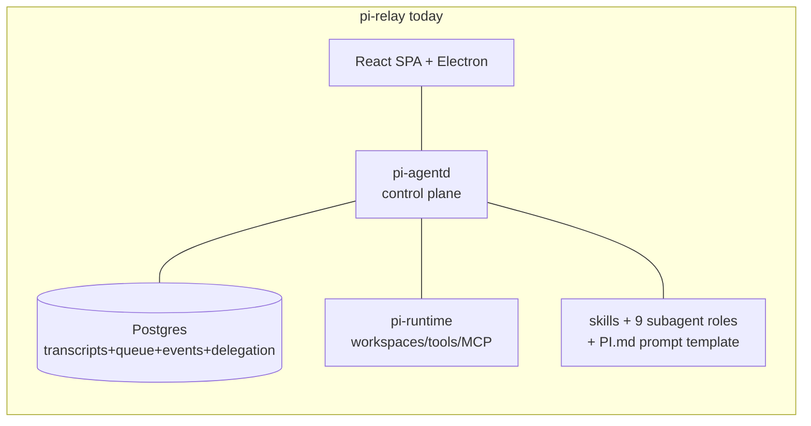
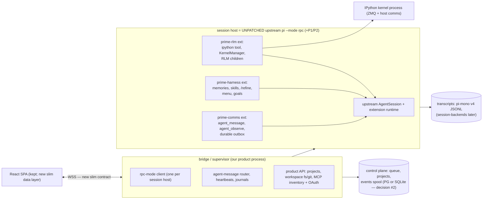
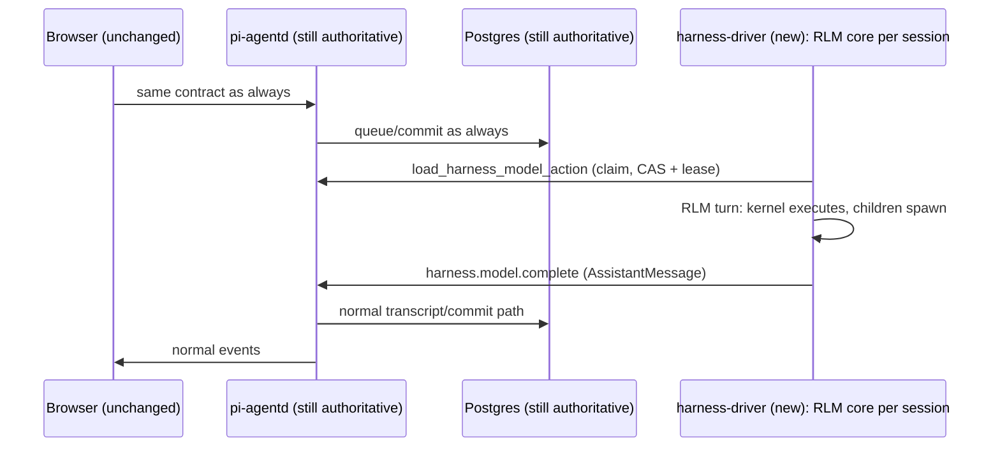

# Migration Strategies — pi-relay Rust backend → upstream pi + RLM extensions

> **Audience:** someone with *some* familiarity with pi-relay and with pi/RLM
> concepts, who didn't develop either. Terminology is pinned in §0.
>
> **DECISION LOG:**
> - **2026-08-09 (1):** The frontend is NOT frozen. The React SPA codebase stays
>   (product surface: session list, transcript, sub-agent tree, workspace/git
>   views), but the 54-method websocket-rpc contract is NOT an invariant — most
>   of it encodes pi-agentd/pi-runtime concepts the migration *subsumes*. The
>   new contract will be slim and RLM-native (open decision #6).
> - **2026-08-09 (2):** The target backend is **upstream pi
>   (earendil-works/pi) + PA-derived extension packages** — NOT the prime-agent
>   fork. Audits: `upstream-divergence.md`, `upstream-seams.md`; synthesis:
>   `UPSTREAM-ALIGNMENT.md`. Path A′ (§3) is THE PLAN. Original Path A
>   (§5) is the fallback.
>
> **Companion docs:** `UPSTREAM-ALIGNMENT.md` (why A′), `GAP-ANALYSIS.md`
> (evidence matrix), `CONTEXT-ENGINEERING.md` (model-call content),
> `t3-code-frontend-assessment.md` (frontend rendering donor), and the
> per-codebase reports.

---

## 0. Terminology in one screen

| Term | What it is |
|---|---|
| **pi-agentd** | pi-relay's Rust control-plane daemon. Serves the browser WebSocket RPC (54 methods + 34 events), owns session lifecycle, delegation, compaction. Being retired. |
| **pi-runtime** | pi-relay's Rust host worker: btrfs workspaces, tool execution, skills/roles, MCP servers. Being retired (possibly kept as multi-host sidecar — decision #1). |
| **the (old) contract** | The 54-method/34-event WebSocket protocol today's SPA speaks. **Not an invariant** — replaced by a new slim contract. The audit (`pi-relay-frontend-contract.md`) remains as a feature inventory + UX-discipline reference. |
| **upstream pi** | `earendil-works/pi` (formerly badlogic/pi-mono). The modular agent harness: `pi-ai` (providers), `pi-agent-core` (loop), `pi-coding-agent` (session app: extensions, skills, compaction, modes), `pi-protocol/client/server` (nascent client/server split). |
| **prime-agent (PA)** | The RLM harness this machine runs; a fork of upstream pi at v0.74.0 + net-new packages (kernel, RLM children, continual harness, daemon). In A′: a **code donor**, not the runtime base. |
| **extension** | Upstream pi's plugin system: npm/local packages that register tools, commands, and event hooks into `pi-coding-agent` without forking it. |
| **`--mode rpc`** | Upstream pi running as a subprocess driven by JSON-lines commands over stdio (~35 commands: prompt/steer/follow_up/abort/compact/fork/get_tree/…). The working-today programmatic control surface. |
| **AgentHarness** | Upstream's planned "embed pi as a library" object (pi-agent-core). **Currently an empty shell** — every method rejects `HarnessNotImplemented`. Revisit when it lands. |
| **prime-rlm / prime-harness / prime-comms** | The 3 extension packages we extract from PA's code: kernel+RLM children; continual harness (memory/skills/`/refine`); inter-agent messaging. |
| **bridge / supervisor** | The new PA-owned product process: terminates browser WSS, spawns and drives per-session rpc-mode hosts, owns durable queue/projects/MCP-OAuth, routes agent messages. Successor to pi-agentd AND to PA's daemon. |
| **RLM core** | IPython-as-sole-tool + `rlm()` subagent recursion + continual harness. Adopted from PA, delivered via extensions. |
| **harness seam** | Existing pi-relay escape hatch (`metadata.harness=true` + `harness.model.complete/fail`) letting an external driver run sessions. Entry route for validation (§4). |
| **v4 JSONL** | pi-mono's session-file format behind a `SessionStorage` interface (lanes, durable records, conformance suite; SQLite backend in `session-backends/sqlite-node`). |

---

## 1. What has to migrate, no matter what

| # | Asset | Size/shape | Fate in A′ |
|---|-------|-----------|------------|
| A1 | React SPA + Electron | static Pages build | **Kept.** Data layer redesigned against the new slim contract; git/file views get `@pierre/diffs`+`@pierre/trees` (`t3-code-frontend-assessment.md`) |
| A2 | Old contract | 54 methods/34 events | **Replaced** (decision log 1). Its audit stays as feature inventory + UX disciplines (idempotency keys, resumable streams, error taxonomy) |
| A3 | Session data in Postgres | transcript forests, queues, compaction lineage | One-shot migrator (W1) → v4 JSONL files + slim control-plane tables |
| A4 | Provider behavior | Codex/Claude subscription adapters, cache engineering | Published `pi-ai` + `registerProvider` for Prime Inference + W2 cache-parity bundle (5 small ports, `CONTEXT-ENGINEERING.md` §10.2) |
| A5 | MCP incl. OAuth (Slack/Linear/Outlook/NVCarPs) | runtime-hosted, per-session | Upstream MCP extension or bridge-served; W5 parity matrix before cutover |
| A6 | btrfs workspaces, multi-dir per session | ~2.5k LoC Rust | **workspace-lib** (new Python package; btrfs top-level per session) + bridge RPCs |
| A7 | Skills + 9 subagent roles + PI.md | markdown + config | W4: roles → harness subagent specs; skills format-compatible |
| A8 | Delegation semantics | 1 writer + 8 readers, wakeup barrier, handoff files | RLM subagent tree (arbitrary depth) via prime-rlm; handoff-file doctrine kept as policy; frontend views redesigned around the tree |
| A9 | Deployment | docker-compose + Tailscale Serve WSS | Incremental; bridge/supervisor added; rollback = frontend profile switch |

**Cross-cutting workstreams (every path):** W1 session-data migrator (one-shot,
idempotent, topological; `storage-strategy.md` §8) · W2 cache-parity bundle ·
W3 feature-parity test suite (was: contract replay) · W4 roles/skills port ·
W5 MCP parity matrix.

---

## 2. The paths at a glance

| Path | One-liner | Status |
|---|---|---|
| **A′ — upstream-aligned** | Bridge/supervisor drives per-session **unpatched upstream `pi --mode rpc`** hosts loaded with `prime-rlm`+`prime-harness`+`prime-comms`; pi-ai/pi-agent-core are published npm deps; PA's fork retired. Only upstream asks: patches **P1/P2** (~5 lines each). | **THE PLAN (decided 2026-08-09).** §3. |
| **B — strangler via harness seam** | PA's RLM core drives *existing* pi-relay sessions through `harness.model.*` while pi-agentd keeps running. | **Entry route** into A′ (Phases 0–1). §4. |
| **A — façade over prime-agent-as-is** | Bridge drives PA's daemon unchanged. | **Fallback** if A′ Phase-0 spikes fail. §5. |
| **C — pi-mono rebase (full)** | Build our own server on upstream packages, port RLM machinery ourselves. | Superseded — A′ *is* the good version of this. §6. |
| **D — OMP as base** | Fork OMP, port RLM core in. | Rejected (entangled monolith); batteries harvested. §7. |

---

## 3. Path A′ — THE PLAN: upstream pi + RLM extensions

### 3.1 What the architecture becomes

**Who owns what:** upstream owns the agent runtime (providers, loop, session
app, extension system). We own: the bridge/supervisor, three extension
packages, workspace-lib, the migrator. **Every boundary is an upstream seam** —
that is the "modular like the original pi harness" requirement, met by
construction.

### 3.2 What migrates / what's built / what retires

| Asset | Fate | Effort |
|---|---|---|
| A1 SPA | kept; new data layer + pierre rendering | medium (frontend work, now unblocked) |
| A2 contract | redesigned slim (sessions, prompt/steer, sub-agent tree, workspace fs/git, MCP inventory, projects) | small-medium |
| A3 session data | W1 migrator | medium (outline exists) |
| A4 providers | published pi-ai + registerProvider + W2 | small-medium |
| A5 MCP | upstream MCP extension / bridge + W5 matrix | medium |
| A6 workspaces | workspace-lib (Python) + bridge RPCs | medium |
| A7 skills/roles | W4 | small |
| A8 delegation | prime-rlm child spawning + supervisor routing; frontend sub-agent-tree views | small-medium |
| **NEW: extensions** | extract PA's kernel/RLM code → `prime-rlm`; harness → `prime-harness`; comms → `prime-comms` (mostly *moved, not rewritten* — deps already upstream-compatible). Hosts run with tool allowlist = `[ipython]` only (`--tools` flag); bash/fs/git go through the kernel (`%%bash`) — single-tool doctrine verified in PA source | **the core build** |
| **NEW: bridge/supervisor** | WSS termination, rpc-mode session hosts (spawn/journal/respawn/resync), durable queue, projects, MCP OAuth, message router | **the core build** |

**Retires:** all 12 Rust crates (pi-runtime optionally kept for multi-host —
decision #1) · PA's fork of pi-ai/pi-agent-core/pi-tui/pi-coding-agent · PA's
daemon protocol · pi-relay's 54-method contract.

### 3.3 Pros / cons

**Pros:** zero fork — upstream updates become `npm update`, not a merge · PA's
differentiators survive as *packages with clean seams* (replaceable
individually) · several upstream seams are cleaner than PA's fork internals
(`before_agent_start` system-prompt replace) · process-per-session gives crash
isolation + recovery for free · RLM children stay in-process per host (no
subprocess tax) · upstream grew toward us post-fork (protocol, session-backends,
AgentHarness) — alignment compounds over time.

**Cons:** upstream velocity (1,601 commits/quarter) — pin versions, contract
tests at the rpc boundary, monthly bump cadence · `--mode rpc` becomes
load-bearing (stdio JSONL, single-client — supervisor hardens
journal/respawn/resync around it) · `prime-rlm` is an unusually demanding
extension (owns a kernel, spawns child sessions) — derisked by Phase-0 spike ·
P1/P2 acceptance risk (worst case: carry two ~5-line patches — still ≈zero
fork) · AgentHarness hopes deferred (it's a shell today).

### 3.4 Main risks and their spikes

| Risk | Phase-0 spike |
|---|---|
| Extension API can't host the kernel/RLM | Load `prime-rlm` skeleton into unpatched pi; run a cell; spawn a child session; attribute usage (needs P1) |
| rpc-mode gaps (queue durability, multi-client) | Drive 2 sessions from one supervisor; kill -9 mid-turn; verify resync |
| P2 durable queue missing | Extension outbox PoC; spec P2 |
| Provider parity (Codex/Claude subscriptions) | Diff request shapes old-vs-new |
| btrfs from Python | workspace-lib clone/materialize spike |

---

## 4. Path B — the entry route (strangler via the harness seam)

pi-relay already ships the takeover seam: sessions with `metadata.harness=true`
do no internal dispatch; an external driver claims pending model actions
(CAS-guarded, lease-fenced) and posts completions via
`harness.model.complete/fail`.

Nothing migrates at first: B0 drives one scratch session; B1 drives selected
real sessions behind a flag. This validates the RLM core against the real
control plane (queue, steer, compaction interplay) **before any cutover
commitment**, with near-zero risk. Then Phase 2+ swaps the browser-facing side
per A′. (`pi-relay-rust-backend.md` §10 seam 1.)

## 5. Path A (original) — the fallback

Bridge drives the **existing PA daemon** unchanged (the versioned daemon
protocol, capability negotiation). Same bridge work as A′, but the runtime
stays PA's fork: we inherit its supervision/recovery/kernel provisioning for
free, and we also inherit 499 commits of private fork to maintain against
upstream's 1,601. Becomes the plan only if A′'s Phase-0 spikes show the
extension seams can't carry the kernel/RLM weight. (Original analysis:
git history of this doc + `bridge-transport-options.md`.)

## 6. Path C — full pi-mono rebase (superseded)

Build our own server on upstream packages, port the RLM machinery ourselves.
A′ *is* the good version of C: it uses upstream packages AND reuses PA's
already-built RLM machinery via extensions, instead of rebuilding it.
Upstream's pi-server/protocol path (C's transport) is adopted later if it
matures (decision #6).

## 7. Path D — OMP as base (rejected)

Fork OMP (batteries included), port the RLM core via its 5 rehost hooks.
Rejected: 410k-LoC entangled monolith, Bun/N-API stack, no supervisor/durable
queue; MCP/subagents come free but we'd still port the core. Batteries and
patterns harvested instead (`GAP-ANALYSIS.md` §12 tier-list).

## 8. Side-by-side

| | **A′ (plan)** | B (route) | A (fallback) | C | D |
|---|---|---|---|---|---|
| Fork to maintain | **none** (P1/P2 ≈10 lines) | pi-relay's Rust | PA's 499-commit fork | none (but rebuild everything) | OMP's monolith |
| RLM core from | PA code, repackaged as extensions | PA core drives old sessions | PA runtime as-is | rebuilt by us | ported by us |
| Frontend | kept, new data layer | unchanged | kept, new data layer | new transport possible | façade |
| Session host | upstream `pi --mode rpc` | pi-agentd | PA worker | our server | OMP process |
| Effort | medium | low-medium | medium | high | high |
| End-state cleanliness | **highest** | n/a | medium | high | medium |
| Main risk | extension seams carry kernel/RLM | constrained by seam | fork drift | duplicated effort | entanglement |

## 9. Phased plan

**Phase 0 — spikes (days, zero prod risk):** the 5 spikes of §3.4 (extension
skeleton + child spawn + P1; rpc-mode kill/resync; durable-queue outbox;
provider-parity diff; workspace-lib btrfs) + B0 harness-seam drive of a scratch
session.

**Phase 1 — strangler validation + migrator (weeks 1–3):** B1 on selected real
sessions behind a flag · W1 migrator built and verified against copies ·
bridge/supervisor skeleton: WSS termination, spawn rpc-mode hosts, attach/
snapshot/resync, event spool · frontend pointed at bridge for NEW sessions
only, against a minimal new contract.

**Phase 2 — extension extraction (weeks 3–7):** `prime-rlm` (kernel tool, host
bridge, snapshots, child spawning + P1) · `prime-harness` (memories/skills/
`/refine`/menu/goals) · `prime-comms` (agent_message/agent_observe + outbox) ·
durable queue (outbox → P2) · workspace RPCs via workspace-lib · MCP inventory/
OAuth (W5 matrix) · W2 cache-parity bundle · P1/P2 submitted upstream.

**Phase 3 — feature completion (weeks 7–10):** W4 roles/skills port · sub-agent
tree UI + pierre git/file views in the SPA · W3 feature-parity suite green ·
multi-day parallel soak (old vs new side by side).

**Phase 4 — cutover & decommission (week 10+):** migrate all old sessions (W1),
verify, freeze pi-agentd · archive Rust crates (pi-runtime only if decision #1
keeps multi-host) · drop legacy PG tables · optional upgrades:
session-backends/sqlite-node, pi-protocol transport when its surface matures,
OMP Tier-1 batteries, harness-v2 adoption when upstream lands it.

**Rollback posture:** until Phase 4, pi-agentd + Postgres stay authoritative
for old sessions; the frontend profile switch IS the rollback. No
backwards-compat code paths — the boundary lives at deployment level (per repo
policy).

## 10. The only upstream asks (P1/P2)

- **P1 — usage attribution:** `SessionManager.appendChildUsageAttribution(...)`
  (or `recordUsage` on AgentSession) so RLM-child token spend lands on parent
  entries. Spec in `upstream-seams.md` §5.
- **P2 — durable queues:** persist steer/follow-up queues in the session store
  (upstream keeps them in-memory only). Until merged, `prime-comms` carries an
  extension outbox.

If declined: carry both as a ~10-line patch set on a pinned upstream version —
still effectively zero fork.

## 11. Open decisions for the owner

1. **Multi-host execution:** keep pi-runtime hosts or collapse to single-host?
2. **Control-plane store:** Postgres (ops-known) vs SQLite for bridge tables;
   `session-backends/sqlite-node` is now also a transcript-side option.
3. **Prompt doctrine:** *leaning resolved* — upstream-native: bridge-owned
   stable prefix + extension-owned volatile suffix via `before_agent_start`;
   cache bundle (CONTEXT-ENGINEERING §10.2) at the pi-ai layer.
4. **Read-only fanout snapshots:** drop with top-level btrfs, or keep as
   optional per-child snapshots from workspace-lib?
5. **Transcript format:** v4 JSONL confirmed; revisit relational backend when
   session-backends matures.
6. **New frontend transport:** (a) pi-protocol/pi-client when mature, (b) slim
   product JSON-RPC now — *leaning (b) now, (a) later*.
