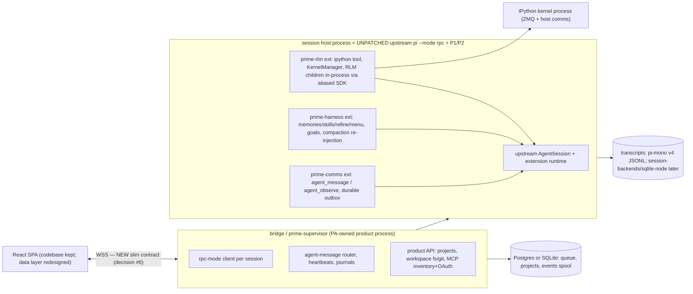

# Upstream Alignment — "Refactor prime-agent toward upstream pi" (Path A′)

> Synthesizes `upstream-divergence.md` (per-package fork deltas, git evidence) and
> `upstream-seams.md` (differentiator × upstream-seam matrix, file:line citations).
> Question posed by the owner: *track upstream pi (earendil-works/pi) as much as
> possible; use only what is really necessary from prime-agent; treat the work as
> refactoring PA toward upstream consistency — via the pi plugin/extension system
> and process splits where the seams allow.*
>
> **Headline: the instinct survives contact with the data.** Every PA
> differentiator has an upstream home as an extension, an RPC process, or one of
> two ≤5-line patches. Nothing is fork-forcing once the architecture is
> re-based onto upstream's seams.

## 1. The divergence facts (upstream-divergence.md)

- PA forked at **upstream v0.74.0 (2026-05-08, merge-base 0bcaab4)**; since then
  **499 PA commits vs 1,601 upstream commits, never merged**. Upstream is now
  v0.84.1 and grew *toward* PA's needs post-fork (protocol/client/server,
  session-backends, AgentHarness scaffolding, skills, compaction improvements).
- Per-package verdicts:

| Package | Delta vs fork point | Verdict | Consequence |
|---|---|---|---|
| `packages/ai` | +11.4k/−4.7k (only ~2.5k hand-written source; rest generated model catalog) | **USE-UPSTREAM + small PRs** | Depend on published `@earendil-works/pi-ai`; Prime Inference via `registerProvider`/models.json; PR stream-failure logging + cache pricing; MCP-OAuth glue stays ours |
| `packages/agent` (pi-agent-core) | +1.8k/−266 | **PATCH-UPSTREAM** | 3 loop hooks (`getContinuationMessages`, `shouldStopBeforeTurn`, `getSystemPrompt`), abort determinism, queue drain — plausible PRs; upstream's post-fork AgentHarness work may subsume some |
| `packages/tui` | +7.8k/−439 (both sides rewrote the render core) | fork-justified but **DROP for pi-relay** — we ship a web SPA, no terminal UI | Entire fork surface deleted |
| `packages/coding-agent` | +183k/−19.7k, 416 new files | structurally forked today | Composition: daemon (~18k LoC), kernel, goals, ACP are **net-new additions**; core surgery is AgentSession 3.1k→11.2k lines. The A′ move: relocate net-new machinery into extension packages over *unpatched* upstream coding-agent |
| upstream `protocol`/`client`/`server`/`session-backends` | never taken (all **post-fork** upstream additions) | **adopt when ready** | pi-protocol's snapshot/progress model is the right *shape* for the browser contract; surface is minimal today (§3) |
| PA net-new: kernel + refinement | 4.3k LoC | **NET-NEW-KEEP, extractable** — deps already upstream-compatible | Becomes `prime-rlm`/`prime-harness` extension packages |
| PA net-new: daemon/modes/rlm-runtime/skills/prime-agent-runtime | ≈36k LoC | NET-NEW-KEEP but currently **fork-bound** (imports forked AgentSession internals) | The re-hosting work of A′ |

## 2. The seam facts (upstream-seams.md, baseline v0.84.1)

Every PA differentiator, mapped to its upstream home:

| PA differentiator | Verdict | Upstream home (evidence in upstream-seams.md §3) |
|---|---|---|
| IPython kernel as sole tool | EXTENSION-CLEAN | `registerTool` extension owns KernelManager lifecycle |
| Kernel host comms bridge | EXTENSION-CLEAN | extension owns the comm target |
| Dill snapshots + restore notice | EXTENSION-CLEAN | extension files + `sendMessage` on session_start |
| RLM children (in-process per host) | EXTENSION-CLEAN + **P1** | aliased SDK `createAgentSession`; P1 = usage-attribution append (≤5-line intent) |
| Harness CRUD + `/refine` | EXTENSION-CLEAN | custom slash-command + model-call precedents |
| Harness menu in system prompt | EXTENSION-CLEAN | `before_agent_start` full system-prompt replace — **cleaner than PA's fork** |
| Post-compaction re-injection | EXTENSION-CLEAN | menu survives compaction; `session_compact` post-hook exists |
| Skills `python_import` bootstrap | EXTENSION-CLEAN | bootstrap lives in the extension-owned kernel |
| Durable queue (steer/follow-up persistence) | **P2** | upstream queues in-memory only; extension outbox covers agent-originated traffic until P2 |
| `agent_message` / `agent_observe` | **RPC-PROCESS** | supervisor routes cross-process; extension-clean within one process |
| Daemon/supervision (~90 commands) | **RPC-PROCESS** | supervisor is a *client* of per-session hosts; product code, not fork |
| Heartbeats, goals, RLM base prompt | EXTENSION-CLEAN | `sendMessage` nextTurn/triggerTurn; `--system-prompt` |

**FORK-FORCING RESIDUE: NONE.** Total ask: patches **P1** (usage attribution)
and **P2** (durable queues), each spec'd at ≤5 lines of intent.

**Caveat discovered:** upstream's `AgentHarness` (pi-agent-core
`harness/agent-harness.ts:305`) is currently a **non-functional shell** — every
method rejects `HarnessNotImplemented`. Do not bank on it; the working embed
paths today are `sdk.ts` (in-process) and `--mode rpc` (subprocess).

**The three browser-facing options, graded:** (a) pi-server + a WS listener we
add — right long-term shape (snapshot-authoritative protocol suits React) but
unwired, 9-command surface can't express compact/follow_up/queues/custom
messages; (b) **bridge drives per-session `pi --mode rpc` subprocesses — works
today** with the full ~35-command surface; extensions load inside each host;
**(c)** bridge embeds sessions in-process via sdk.ts — fewest moving parts but
bridge owns lifecycle/recovery that (b) gets free from process boundaries.
**Recommendation: (b) now, (c) inside each host for RLM children, revisit (a)
when upstream lands its server + harness-v2.**

## 3. Reconciling the two audits

`upstream-divergence.md` §6 lists **10 hard fork dependencies** ("none
re-addable via upstream's 27 seams"); `upstream-seams.md` finds **zero
fork-forcing residue**. Both are true, at different levels:

- The divergence audit measured PA's *current implementation shape*: the forked
  11.2k-line AgentSession with in-process children, kernel handlers, durable
  queue, leases — that shape indeed cannot be re-added through extension seams.
- The seam audit measured the *capabilities*: re-architected onto upstream's
  extension API + process boundaries, every capability has a home, at the cost
  of P1/P2 and an explicit choice to let **process boundaries** (rpc-mode hosts,
  supervisor) carry what PA's fork carried **in-object** (session surgery).

That reconciliation *is* Path A′: **PA's code stops being a fork and becomes a
product layer over upstream** — supervisor + 3 extension packages + bridge.

## 4. The A′ architecture

- **Single-tool doctrine (verified in PA source 2026-08-09):** the model sees EXACTLY
  ONE tool — `ipython` (PA `tools/index.ts`: `allToolNames = {"ipython"}`; bash/edit/read/write
  factories exist but are never registered). Shell runs through the kernel as `%%bash` cells
  (with a configurable command prefix); `bashExecution` transcript entries are folded to
  user-role text for the LLM (`messages.ts` `bashExecutionToText`). A′ preserves this:
  session hosts launch with a tool ALLOWLIST of exactly the extension's `ipython` tool —
  upstream supports this natively (`--tools/-t` allowlist flag; `activeToolNames` in
  `createCodingAgentHarness`, which also builds the system prompt from only the selected
  tools). Rationale: don't confuse the model with overlapping tool surfaces; the kernel
  subsumes shell/fs/git.
- **Upstream code consumed as published npm packages**: `@earendil-works/pi-ai`,
  `pi-agent-core`, `pi-coding-agent` (+P1/P2 until merged). No fork to rebase.
- **PA-owned code**: bridge/supervisor, `prime-rlm`, `prime-harness`,
  `prime-comms`, workspace-lib (btrfs), the W1 migrator. All product code with
  clean seams — the "modular like the original pi harness" requirement is met
  by construction, because upstream's seams are the module boundaries.
- **pi-tui, PA's TUI work, PA's daemon protocol: retired.** The supervisor is a
  client, not a protocol owner.

## 5. What changes vs the original Path A (façade over prime-agent-as-is)

| | Original A | A′ (upstream-aligned) |
|---|---|---|
| Core runtime | PA daemon + workers (fork maintained by us) | upstream coding-agent rpc-mode hosts + PA supervisor |
| RLM children | PA in-worker child sessions | in-process per host via aliased SDK (+P1), or rpc subprocesses later |
| pi-ai | PA fork | published upstream + registerProvider |
| pi-tui | PA fork (dead weight for us) | dropped |
| Fork maintenance | 499-commit private fork vs 1601-commit upstream drift | **zero fork**; P1/P2 as PRs |
| New work | bridge + workspace-lib | bridge + workspace-lib + **3 extension packages** (extract PA's kernel/harness/comms) |
| Frontend | contract emulation → redesigned slim contract | same (unchanged by this decision) |
| Storage | v4 JSONL via seam | same; upstream `session-backends/sqlite-node` now a native option |
| Risk profile | PA-fork drift risk ours alone | upstream-velocity risk (extension API stability), rpc-mode as load-bearing interface, P1/P2 acceptance |

**Effort estimate shift:** Phase-2 "contract parity" work (already shrunk by the
2026-08-09 constraint update) is replaced by extension-package extraction —
PA's kernel/harness/comms code is mostly *moved, not rewritten* (its deps are
already upstream-compatible per the divergence audit). Net: comparable total,
but the end state carries **no fork**.

## 6. New risks A′ introduces (honest list)

1. **Upstream velocity/instability**: 1,601 commits in 3 months; extension API
   and rpc-mode shapes can shift. Mitigation: pin versions, own contract tests
   at the rpc-mode boundary, budget a monthly upstream-bump cadence.
2. **`--mode rpc` becomes load-bearing**: it's stdio JSONL built for
   single-client control; multi-client fanout, backpressure, and crash
   semantics need hardening *in the supervisor* (journal + respawn + snapshot
   resync — PA's supervisor already knows how to do this for its own workers).
3. **Extension API depth**: the matrix verdicts rest on seams exercised mostly
   by upstream's own extensions; `prime-rlm` is unusually demanding (owns a
   kernel, spawns child sessions). Phase-0 spike list gains: "load prime-rlm
   skeleton into unpatched pi, spawn child session, attribute usage (P1)".
4. **P1/P2 acceptance risk**: if upstream declines, two ≤5-line patches carried
   as a minimal fork of coding-agent — still vastly smaller than today's fork,
   but nonzero.
5. **AgentHarness hopes deferred**: if harness-v2 lands, re-evaluate (c)/(a);
   until then it's a shell.

## 7. Impact on the phased plan and open decisions

- Phases 0–4 of MIGRATION-STRATEGIES.md §8 stand; Phase 0 gains the
  extension-skeleton spike; Phase 2's bridge work targets the slim NEW contract
  (decision #6) over rpc-mode hosts.
- Open decisions now: (1) multi-host — unchanged; (2) PG vs SQLite — now with
  `session-backends/sqlite-node` as a transcript-side option too; (3) prompt
  doctrine — resolved toward **upstream-native**: the `before_agent_start`
  full-replace seam makes the persisted-prefix split *easier* than in PA's fork
  (bridge-owned stable prefix + extension-owned volatile suffix; cache bundle
  from CONTEXT-ENGINEERING.md §10.2 still applies at the pi-ai provider layer);
  (4) fanout snapshots — unchanged; (5) transcript format — v4 confirmed, now
  with upstream's own seam; (6) frontend transport — lean **(b)-inspired slim
  product JSON-RPC** now, adopt pi-protocol when its surface matures.
