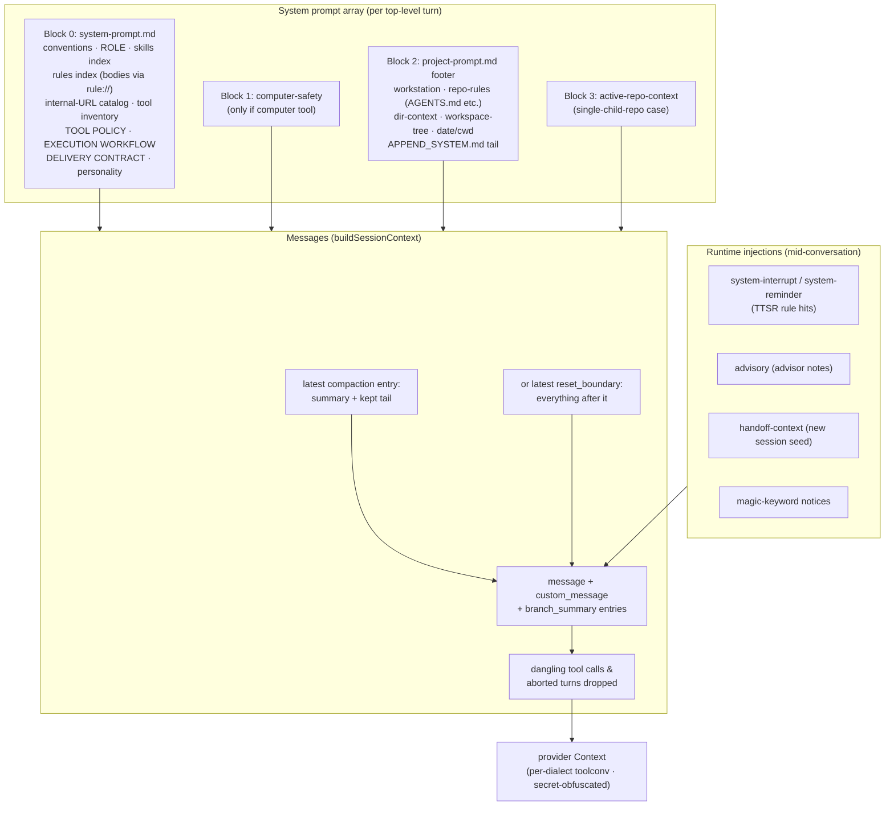
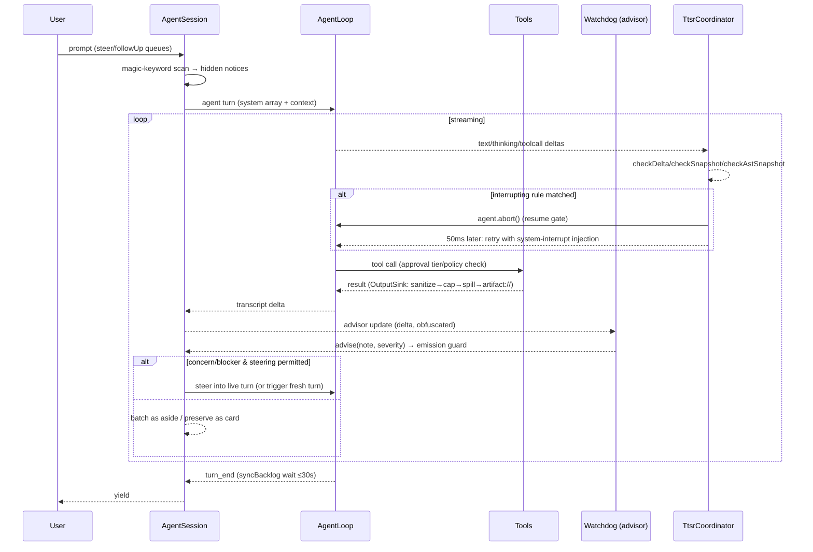
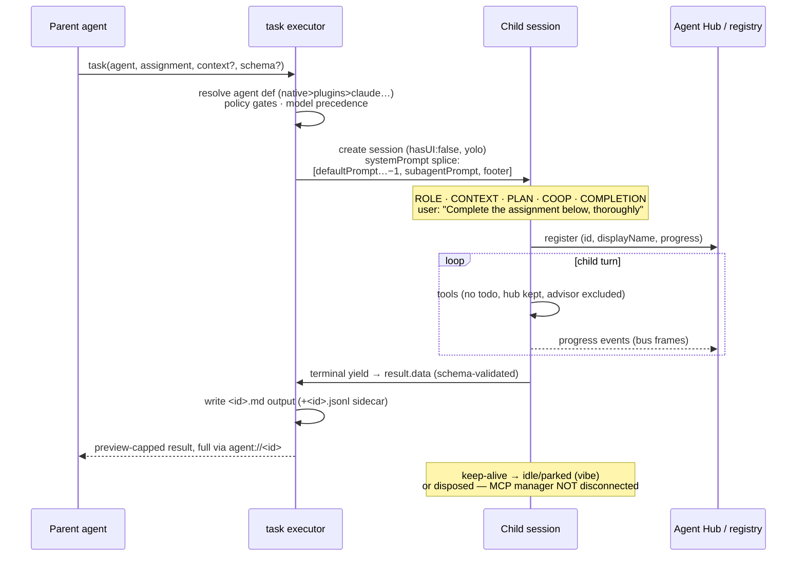
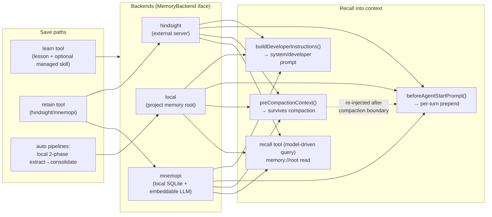
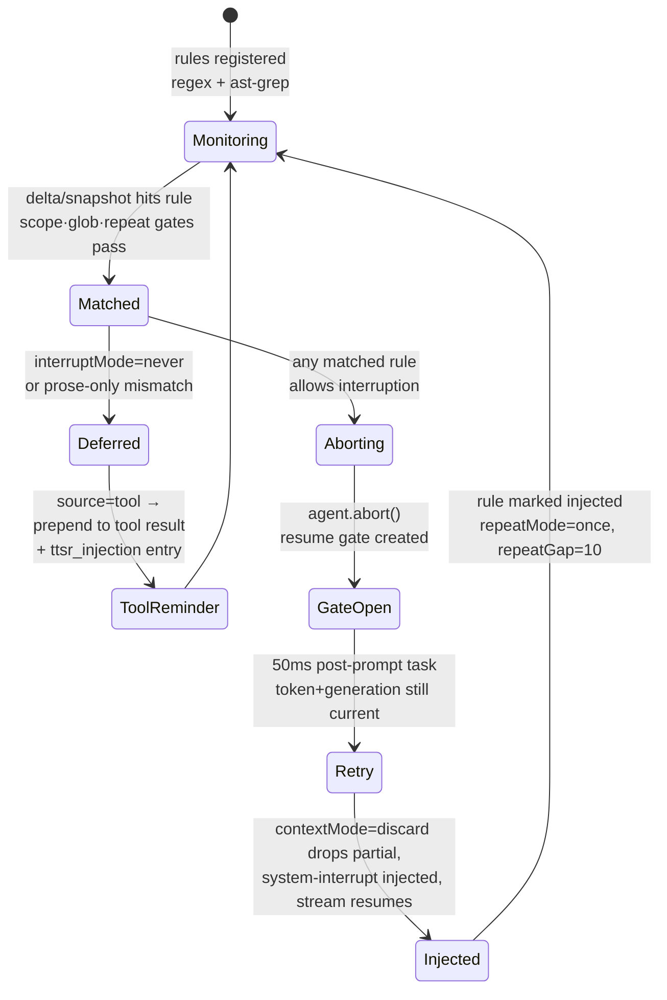

# Oh My Pi (OMP) — Batteries & Docs Deep-Dive

> Research target: `/home/schwinns/pi-relay/.pi/migration-research/repos/oh-my-pi/` (github.com/can1357/oh-my-pi, fork of pi-mono).
> Purpose: user-facing feature layer ("batteries") analysis to feed pi-relay's adoption of prime-agent's RLM/IPython core. Sibling agent covers code architecture internals (packages/crates/wire/natives); this report covers what each battery does, how it works, where it lives, dependencies, and extractability — plus a full context-engineering chapter.
> All file paths cited relative to the OMP repo root unless absolute. Doc paths refer to `docs/`.

## Table of Contents

1. [Orientation: what OMP is, package/crate map](#1-orientation)
2. [Subagents / task system](#2-subagents--task-system)
3. [Agent Hub + hub tool (IRC bus, jobs, process supervision)](#3-agent-hub--hub-tool)
4. [Plan mode](#4-plan-mode)
5. [LSP](#5-lsp)
6. [DAP / debug tool](#6-dap--debug-tool)
7. [Memory systems (local pipeline, Hindsight, Mnemopi, learn)](#7-memory-systems)
8. [Compaction + snapcompact + handoff](#8-compaction--snapcompact--handoff)
9. [Hashline edits](#9-hashline-edits)
10. [TTSR time-traveling rules + rulebook pipeline](#10-ttsr--rulebook)
11. [Context files](#11-context-files)
12. [System prompt customization](#12-system-prompt-customization)
13. [Hooks](#13-hooks)
14. [Extensions + extension loading](#14-extensions--extension-loading)
15. [Marketplace + plugin manager](#15-marketplace--plugin-manager)
16. [MCP](#16-mcp)
17. [Skills](#17-skills)
18. [Custom tools](#18-custom-tools)
19. [Notebook tool](#19-notebook-tool)
20. [Python REPL + eval tool](#20-python-repl--eval)
21. [Collab + agent hub web story](#21-collab--web)
22. [RPC + SDK (headless story)](#22-rpc--sdk)
23. [Session model (session.md, tree, operations, switching)](#23-session-model)
24. [Handoff generation pipeline](#24-handoff-generation)
25. [Approval mode](#25-approval-mode)
26. [Advisor / watchdog](#26-advisor--watchdog)
27. [Vibe mode](#27-vibe-mode)
28. [Magic keywords](#28-magic-keywords)
29. [Blob artifact architecture](#29-blob-artifact-architecture)
30. [FS scan cache](#30-fs-scan-cache)
31. [Auth broker gateway](#31-auth-broker-gateway)
32. [Secrets](#32-secrets)
33. [Misc tools (todo, ask, bash, read, grep, glob, web_search, browser, computer, github, tts, image, security_scan, checkpoint/rewind)](#33-misc-tools)
34. [CONTEXT ENGINEERING: what enters each model call](#34-context-engineering)
35. [Mermaid diagrams](#35-mermaid-diagrams)
36. [Migration-relevant findings for pi-relay](#36-migration-findings)

---

## 1. Orientation

**What OMP is**: a coding-agent harness ("a coding agent with the IDE wired in"), fork of Mario Zechner's pi-mono, rewritten coding-first. TypeScript on **Bun ≥1.3.14** with ~80k LoC of Rust compiled into a platform-tagged N-API addon. Ships as npm package `@oh-my-pi/pi-coding-agent` (binaries: `omp`); 60+ providers, 31 built-in tools, 14 LSP ops, 28 DAP ops (README.md).

**Four entry points, one engine** (README.md §"Four entry points"):
- `omp` — interactive TUI.
- `omp -p` — one-shot print mode.
- Node SDK (`createAgentSession`, `ModelRegistry`, `SessionManager`, `discoverAuthStorage` exported from `@oh-my-pi/pi-coding-agent`; `packages/coding-agent/src/sdk.ts`).
- `omp --mode rpc` (NDJSON over stdio) and `omp acp` (Agent Client Protocol for editors, e.g. Zed).

**Monorepo package map** (README.md package table; `docs/user-facing-packages.md`):

| Package | Role |
|---|---|
| `packages/coding-agent` (`@oh-my-pi/pi-coding-agent`) | The harness: CLI, SDK, tools, task system, sessions, prompts, MCP, LSP, DAP, memory backends, extensibility |
| `packages/agent` (`@oh-my-pi/pi-agent-core`) | Agent runtime: tool-calling loop, compaction, state |
| `packages/ai` (`@oh-my-pi/pi-ai`) | Multi-provider LLM client, streaming, tool-call dialects |
| `packages/catalog` (`@oh-my-pi/pi-catalog`) | Bundled model/provider database |
| `packages/tui` (`@oh-my-pi/pi-tui`) | Terminal UI library (differential renderer) |
| `packages/natives` (`@oh-my-pi/pi-natives`) | N-API bindings to the Rust crates |
| `packages/hashline` (`@oh-my-pi/hashline`) | **Standalone** line-anchored patch language behind `edit` |
| `packages/snapcompact` (`@oh-my-pi/snapcompact`) | **Standalone-ish** bitmap context compression (needs pi-natives at runtime) |
| `packages/mnemopi` (`@oh-my-pi/pi-mnemopi`) | **Standalone** local SQLite memory engine + CLI (`mnemopi`) + MCP server |
| `packages/wire` (`@oh-my-pi/pi-wire`) | Collab live-session protocol types + relay constants |
| `packages/collab-web` | Browser guest client for collab (my.omp.sh) |
| `packages/browser-relay` | Chrome extension letting the browser tool drive existing tabs |
| `packages/stats` (`omp stats`) | Local usage dashboard from session JSONLs |
| `packages/omptype` (`@oh-my-pi/omptype`) | ArkType-compatible schema validation (JIT) |
| `packages/metaharness`, `packages/typescript-edit-benchmark` | Benchmark runners (Harbor, edit, snapcompact evals) |
| `python/robomp` | Self-hosted GitHub triage/fix service driving `omp --mode rpc` per issue |

**Rust crates** (all internal to the N-API addon; README table + `docs/native-crates.md`): `pi-natives` (25k LoC; N-API surface: desktop/grep/text/snapcompact/keys/ast/diff/pty/crash_handler/highlight/appearance/task/glob/fd/clipboard/workspace/power/prof/file_lock/ps/tokens/html/sixel), `pi-shell` (38k; embedded bash engine = vendored brush fork + persistent sessions + in-process coreutils dispatch), `pi-walker` (5.2k; parallel ignore-aware walker + scan cache), `pi-iso` (3.3k; workspace isolation: apfs/btrfs/zfs/reflink/overlayfs/projfs/rcopy), `pi-ast` (2.9k; tree-sitter + ast-grep), `pi-voice` (1k; audio/Opus/WebRTC), plus vendored `brush-core` and `pi-builtins` (67 in-process CLI utilities). Platforms: linux/darwin/win32 x64+arm64.

**Config layout**: user config `~/.omp/agent/` (config.yml, models.yml, mcp.json, agents/, rules/, skills/, extensions/, sessions/), project config `<cwd>/.omp/` (same shapes). Profiles via `--profile <name>` → `~/.omp/profiles/<name>/agent/`. Discovery providers inherit config from other harnesses (`.claude`, `.cursor`, `.codex`, `.gemini`, `.windsurf`, `.cline`, `.github/copilot`, `.vscode`, opencode) — see §11.

---

## 2. Subagents / task system

**Docs**: `docs/tools/task.md`, `docs/task-agent-discovery.md`. **Code**: `packages/coding-agent/src/task/` (26 files: `index.ts`, `executor.ts` (~128k chars), `discovery.ts`, `agents.ts`, `types.ts`, `structured-subagent.ts`, `spawn-policy.ts`, `worktree.ts`, `output-manager.ts`, `name-generator.ts`, `parallel.ts`, `commands.ts`); prompts `src/prompts/tools/task.md`, `src/prompts/system/subagent-system-prompt.md`; registry `src/registry/agent-registry.ts`, `src/registry/agent-lifecycle.ts`; jobs `src/async/job-manager.ts`.

### What it does (user-visible)
- `task` tool spawns subagents: single call or `tasks[]` batch (`task.batch` default on). Batch requires shared `context` string rendered into every child's system prompt `CONTEXT` section.
- With `async.enabled=true` (default), spawns run as background jobs and results arrive later as async-result injections; otherwise the call blocks. Per-item `blocking: true` agents run inline even in async mode.
- Agents are markdown-defined agent types: frontmatter `name`, `description`, `model` (selector list or `@role` alias), `tools`, `spawns`, `thinking`, `output` (structured output schema), `blocking`, `autoloadSkills`, `readSummarize`, `prewalk`. Bundled agents: `scout`, `designer`, `reviewer`, `security-reviewer`, `librarian`, `task`, `sonic` (embedded at build time in `src/task/agents.ts`).
- Typed results: child finishes through a hidden `yield` tool producing schema-validated structured output (`structuredOutput` in `SingleResult`); up to 3 reminder prompts if it forgets, last forcing `toolChoice=yield`.
- Optional workspace isolation (`isolated: true` when `task.isolation.mode != none`): child runs in an apfs/btrfs/zfs/reflink/overlayfs/projfs/rcopy workspace via `pi-iso` natives PAL; output captured as patch or committed to branch `omp/task/<id>` then cherry-picked. Isolated agents are torn down at completion (not revivable).
- Finished agents stay **idle** (live session attached) and are parked after `task.agentIdleTtlMs` (default 7 min); messaging a parked agent via `hub` revives it (reopens JSONL). `Alt+A` Agent Hub watches/steers/kills/revives (§3).
- Artifacts: `<id>.md` (final output), `<id>.jsonl` (transcript), `<id>.patch`; addressed via internal URL schemes `agent://<id>` (incl. `agent://<id>/<path>` JSON field extraction and `?q=` queries), `history://<id>` (concise transcript), shared `local://` root for parent↔child files.

### How it works internally
1. `TaskTool.create()` memoizes `discoverAgents(cwd)` per cwd for the dynamic tool description; execution rediscovers fresh (`docs/task-agent-discovery.md` §"Description vs execution-time discovery").
2. Discovery precedence, first-wins by exact `name`: project `.omp/agents` → user `~/.omp/agent/agents` → OMP extension package `agents/` roots (CLI → project settings → user settings → installed npm/link plugins) → Claude marketplace plugin `agents/` (project before user, only when `claude-plugins` provider enabled) → bundled. Direct `.claude/agents` etc. are deliberately skipped (frontmatter schema mismatch).
3. `resolveEffectiveSubagentPolicy()` guards: spawn policy (`session.getSessionSpawns()`: `"*"`/CSV/empty), `PI_BLOCKED_AGENT` self-recursion env guard, `task.maxRecursionDepth` (default 2; strips `task` tool at cap), `task.disabledAgents`, plan-mode restrictions.
4. Model precedence: `task.agentModelOverrides[name]` → agent frontmatter `model` list (role aliases `@role` expanded via `modelRoles`) → parent active model/fallback. Effort: `task.enableEffort` exposes per-item `effort: lo|med|hi` mapped to the model's supported range, clamped by `task.maxEffort`.
5. `runSubprocess()` (executor.ts) builds a child `AgentSession` via `createAgentSession` with: isolated settings snapshot (inherits parent settings incl. `async.enabled`; forces `tools.approvalMode: "yolo"`; re-resolves model tiers through `tier.subagent`), `systemPrompt` callback that splices the rendered `subagent-system-prompt.md` into the default prompt stack (see below), `hasUI: false`, child `agentId`, parent MCP manager (children get **MCP proxy tools** reusing parent connections, 60s timeout, instead of standalone MCP discovery), shared `local://` root and `ArtifactManager`, IRC peer roster injected.
6. Child tool set: explicit `agent.tools` if given (`yield` auto-added; `exec` expands to `eval`+`bash`); auto-add `task` when `spawns` declared and depth allows; strip parent-owned `todo` (except prewalk-armed); keep `hub`.
7. Concurrency: session-scoped `Semaphore` resized live from `task.maxConcurrency`; output caps `MAX_OUTPUT_BYTES=500_000`, `MAX_OUTPUT_LINES=5000`; soft request budget `task.softRequestBudget` (default 200, force-stop at 1.5×); wall clock `task.maxRuntimeMs`.
8. Lifecycle: terminal states `aborted` (disposed), `parked` (isolated runs; revivable=false), else `idle` with `AgentLifecycleManager.global().adopt(id, {idleTtlMs, revive})`. Events `task:subagent:event|progress|lifecycle` on parent bus.

### Subagent system-prompt construction (confirmed in code)
`executor.ts` renders `src/prompts/system/subagent-system-prompt.md` with `{agent: agent.systemPrompt, context, planReference(+path), worktree, outputSchema, outputSchemaOverridesAgent, ircPeers, ircSelfId}` and splices it into the child's default prompt array as `[...defaultPrompt.slice(0,-1), subagentPrompt, defaultPrompt.at(-1)]` — i.e. the child gets the **full default system prompt** (tool policy, skills index, rules, context files, workspace tree) with the subagent block inserted before the project footer. The subagent block has sections `ROLE` (agent's own systemPrompt), `CONTEXT` (shared batch context), `PLAN` (approved-plan reference if executing a plan), `COOP` (worktree isolation note, IRC peer roster + hub etiquette), `COMPLETION` (yield protocol, output schema as TS shape, "never give up" rules).

**What children inherit/observe** (`docs/tools/task.md` Notes): NOT conversation history. Carry-over = workspace tree, skills, context files (via rebuilt system prompt), shared `local://` root, approved-plan reference, parent MCP connections (proxied), parent memory-backend state aliasing (Hindsight/Mnemopi), settings snapshot. Children observe peers via the IRC roster block in their system prompt.

### Dependencies
TS-only except isolation (`pi-iso` natives) and token/BPE counting (`pi-natives tokens`). No external server. Registry/lifecycle/job manager are in-process (`process-global`).

### Extractability
**Medium.** The `task` tool is deeply coupled to `createAgentSession` (sdk.ts), the registry/lifecycle/job-manager triad, internal URL router (`agent://`, `history://`, `local://`), settings schema, and prompt templates. A different harness could reuse: (a) the *agent-definition discovery* pattern (markdown frontmatter agents, first-wins precedence) — trivially portable; (b) the *yield/structured-output* pattern (hidden terminal tool + reminder retries + `toolChoice` forcing); (c) the *semaphore + async-job delivery* pattern; (d) `pi-iso` workspace isolation only via the natives addon. The whole subsystem is OMP-only as-is but the design maps cleanly onto any session-per-subagent runtime (prime-agent's `rlm()` admission + agent_message is a close analog of spawn + hub messaging).

---

## 3. Agent Hub + hub tool

**Docs**: `docs/agent-hub.md`, `docs/tools/hub.md`, `docs/tools/irc.md`, `docs/tools/job.md`, `docs/tools/launch.md` (merged into hub). **Code**: `packages/coding-agent/src/irc/bus.ts` (process-global IrcBus mailboxes), `src/registry/agent-registry.ts`, `src/registry/agent-lifecycle.ts`, `src/async/job-manager.ts`, `src/launch/{client,broker,presence,protocol}.ts`, tool `src/tools/hub.ts`, prompts `src/prompts/tools/{hub,irc,job,launch}.md`.

### What it does
- **Agent Hub** (`Alt+A`, also `Ctrl+S` / double-`←` in TUI): a roster overlay of every live and parked agent in the session. Shows `running|idle|parked|aborted`, per-agent cost/token/turn stats; lets the user steer (send message), revive parked agents, kill, and inspect output. Parked subagents are rediscovered from `<id>.md`/`.jsonl` artifacts on session resume, so the hub survives restarts.
- **`hub` tool** (merged irc+job+launch): ops `send`/`wait`/`inbox`/`list` (IRC-style agent-to-agent mail), `jobs`/`cancel` (async job manager), `start`/`ps`/`logs`/`stop`/`restart`/`describe` (supervised OS processes via launch broker). This is the main inter-agent coordination primitive: children and the main agent exchange messages through process-global mailboxes; `wait` blocks with timeout for replies.

### Mechanism
- `IrcBus` (`src/irc/bus.ts`) is a **process-global** in-memory mailbox router keyed by agent id; messages are delivered as steer/follow-up queue items into the target agent's running session (or trigger revive if parked via `AgentLifecycleManager`).
- `AgentRegistry` tracks all agents in the process (main + subagents); `AgentLifecycleManager.global().adopt()` manages idle→parked transitions with TTL and revive closures.
- `JobManager` (`src/async/`) owns background subagent/task jobs; completion injects async-result messages into the owning session's queue (the model sees them as tool results of `hub wait`/poll or as injected notifications).
- `launch` subsystem supervises detached OS processes (client→broker over a local socket; `presence`/`protocol` for discovery), letting agents start dev servers etc. and read logs later.

### Dependencies
Pure in-process TS. `launch` uses a local Unix socket broker. No natives, no external server.

### Extractability
**High for the pattern, low for the code.** A global mailbox + registry + TTL parking is ~a few hundred lines in any runtime; prime-agent already has an equivalent (agent_message/daemon + heartbeats). The `launch` process-supervision piece is a self-contained mini-supervisor worth lifting conceptually for dev-server management.

---

## 4. Plan mode

**Docs**: no dedicated `docs/plan-mode.md`; behavior lives in code + prompts. **Code**: `packages/coding-agent/src/plan-mode/` (`state.ts`, `approved-plan.ts`, `plan-files.ts`, `plan-handoff.ts`, `model-transition.ts`, `plan-protection.ts`), guard `src/tools/plan-mode-guard.ts`, device dispatch `src/tools/resolve.ts`, orchestration in `src/modes/interactive-mode.ts` (imports at L92-96; settle enforcement `#enforcePlanModeDecisionAtSettle` in `src/session/agent-session.ts`). **Prompts**: `src/prompts/system/plan-mode-active.md`, `plan-mode-approved.md`, `plan-mode-reference.md`, `plan-mode-subagent.md`, `plan-mode-tool-decision-reminder.md`, `plan-mode-compact-instructions.md`, `plan-yolo-handoff.md`, `prewalk-plan.md`.

### What it does
- Read-only planning mode (Shift+Tab cycle in TUI). The agent explores (glob/grep/read/scout subagents), interviews the user via `ask` (preferences only, batched, 2–4 options + recommended default), and incrementally writes a plan to `local://<slug>-plan.md` — a session-local artifact, never the working tree.
- The plan is an **execution spec**: the prompt demands "a competent implementer who never saw this conversation executes the file top to bottom and makes ZERO design decisions" (`plan-mode-active.md`). Mandatory sections: Context / Approach (ordered steps, exact signatures + callsites for renames) / Critical files & anchors (≤5) / Verification (end-to-end proof) / Assumptions & contingencies (with pre-decided fallbacks). Explicitly forbidden: Non-Goals, Alternatives Considered, Risks, Future Work, references to the planning conversation.
- Approval flow: the agent writes its `<slug>` as plain text to **`xd://propose`** (a virtual device file) with the `write` tool; `src/tools/resolve.ts` dispatches to the plan-proposal handler installed by interactive mode, which opens the TUI approval popup. The user picks one of three execution modes (`plan-mode-active.md` `<caution>`): **Approve and execute** (fresh context — session cleared), **Approve and compact context** (distill planning discussion via `plan-mode-compact-instructions.md`, execute in place), **Approve and keep context** (execute preserving exploration history).
- On approval: `plan-mode-approved.md` is injected ("You MUST read `<planFilePath>` before executing; the file content is the authoritative plan; verify each step"), the plan path becomes the session's plan reference, full tool access is restored, and an optional **model transition** (`plan-mode/model-transition.ts`, `resolvePlanModelTransition`) can switch models for execution. Subagents executing a plan get the `PLAN` section with the plan reference in their system prompt (§2).

### Enforcement mechanism (confirmed in code)
- `PlanModeState { enabled, planFilePath, workflow?: "parallel"|"iterative", reentry? }` on `AgentSession` (`plan-mode/state.ts`).
- **Write gating**: `write`/`edit` call `enforcePlanModeWrite(session, path, {op})` (`src/tools/plan-mode-guard.ts`); only paths resolving inside the session's `local://` artifact sandbox are writable (plan + scratch artifacts); hashline `[path#TAG]` headers are unwrapped first so the inner path is what's authorized. Bash state-changing commands are restricted by the same read-only contract (prompt-level + approval).
- **Convergence enforcement**: `#enforcePlanModeDecisionAtSettle()` in agent-session.ts — if the agent settles without calling `ask`/`resolve`/`xd://propose`, a `plan-mode-tool-decision-reminder.md` prompt is injected and the turn continues (bounded reminder count). Stranded IRC asides are folded into context without waking a turn so convergence stays user-driven.
- **Compaction protection**: `createPlanReadMatcher` (`plan-mode/plan-protection.ts`) keeps `read` results of the plan file (both `local://PLAN.md` alias and the session's plan reference path) intact through prune/shake — the plan survives compaction like skill reads do.
- Re-entry: entering plan mode again with an existing plan injects the re-entry procedure (new request is primary; old plan is reference; update or fork).

### Dependencies
Pure TS + prompt templates. No natives, no external services.

### Extractability
**High.** The pattern is: (1) mode flag on session; (2) system-prompt addendum with read-only contract + plan-spec rubric; (3) a virtual-device write (`xd://propose`) intercepted by the host to open an approval UI; (4) a write-guard helper invoked by mutating tools; (5) compaction protection matcher for the plan file; (6) settle-hook reminder loop. All six are cheap to reproduce in prime-agent (a `plan.md` artifact + a `propose_plan` tool + a mutation guard on write/edit tools + reminder-on-settle).

---

## 5. LSP

**Docs**: `docs/lsp-config.md`, `docs/tools/lsp.md`. **Code**: `packages/coding-agent/src/lsp/` (25 files: `index.ts` tool, `client.ts`, `config.ts`, `defaults.json`, `lspmux.ts`, `mux/daemon.ts`, `edits.ts`, `utils.ts`, `types.ts`, `clients/` for Biome/SwiftLint/generic-linter adapters).

### What it does
- `lsp` tool, 14 actions: `diagnostics`, `definition`, `references`, `hover`, `symbols` (document + workspace), `rename`, `rename_file`, `code_actions`, `type_definition`, `implementation`, `status`, `reload`, `capabilities`, `request` (raw LSP method with JSON payload — the escape hatch).
- Symbol positioning is human-style: `file`+`line`+`symbol` substring (with `name#N` occurrence selector); the tool resolves the column itself (`resolveSymbolColumn`).
- `diagnostics` covers real LSP servers **and** CLI linter adapters (Biome, SwiftLint, generic LSP-linter); workspace mode (`file:"*"`) falls back to native checkers in Rust→TS→Go→Python order (`cargo check`, `tsc --noEmit`, `pyright`, `go build`).
- `rename`/`rename_file` apply `WorkspaceEdit`s directly (with preview mode), and `rename_file` also does the FS move + `workspace/willRenameFiles`/`didRenameFiles` fan-out.

### Mechanism
- **Config**: built-in `defaults.json` server table; auto-detection = cwd root-marker match ∩ binary available (project-local bins first: `node_modules/.bin`, venvs, Ruby binstubs, Go `bin/`). Overrides merged (low→high): `~/lsp.*` → plugin/marketplace → user config dirs (native, `.claude`, `.codex`, `.gemini`) → `<cwd>/.omp/lsp.*` etc. → `<cwd>/lsp.*` root. JSON/YAML; shallow per-server merge; `idleTimeoutMs` shuts down idle servers.
- **Client lifecycle**: one client per `command:cwd` cache key. With `lsp.shared` (default true in SDK) it first asks the **broker-managed project mux** for a shared transport (`src/lsp/mux/daemon.ts`) so multiple omp sessions share one rust-analyzer etc.; falls back to private `ptree.spawn()`; external `lspmux` wrapper takes precedence. Reader handles `publishDiagnostics` caching, `$/progress` project-load tokens, `workspace/configuration`, server-initiated `workspace/applyEdit`.
- **Freshness**: file-scoped actions `ensureFileOpen()`; diagnostics wait for fresh `publishDiagnostics` after `refreshFile()`; `references` retries (with project-load waits) when only the declaration comes back.
- **Gating**: registered only when `lsp.enabled` (default true) and session allows; `lspReadOnly` sessions restricted to `LSP_READONLY_ACTIONS`; restricted sessions default to disabled. Read actions → read approval; mutating actions → write approval. Empty navigation results flagged `useless: true` for compaction elision.

### Dependencies
External language-server binaries (auto-detected or configured). Optional `lspmux` binary. Otherwise pure TS (JSON-RPC over stdio); sharing goes through the local broker daemon. No Rust natives.

### Extractability
**Medium-high.** The tool is self-contained per-file JSON-RPC plumbing; the valuable, portable parts are the *config/auto-detect layer* (defaults.json table + marker∩binary detection + multi-source merge) and the *mux/daemon sharing* idea. Lifting `src/lsp/` wholesale requires the broker + ptree spawn; a leaner port could spawn servers directly. For pi-relay, LSP may be less critical than OMP's diagnostic-feedback loop pattern (run checker → dedupe → severity-sort → `useless` flag on empty results).

---

## 6. DAP / debug tool

### DAP / debug tool — details

**Docs**: `docs/tools/debug.md`. **Code**: `packages/coding-agent/src/dap/` (6 files: `session.ts`, `client.ts`, `config.ts`, `defaults.json`, `types.ts`), tool `src/tools/debug.ts`, plus adjacent TUI debug subsystem `src/debug/` (11 files: log viewer, raw-SSE capture, report bundler, CPU/heap profiler, JSC remote inspector, terminal info).

### What it does
- `debug` tool: 28 DAP actions — `launch`, `attach` (pid or host:port), source/function/instruction/data breakpoints (set/remove, conditions, hit conditions), `continue`/`step_over`/`step_in`/`step_out`/`pause`, `evaluate` (any DAP context), `stack_trace`, `threads`, `scopes`, `variables`, `disassemble`, `read_memory`/`write_memory` (base64), `modules`, `loaded_sources`, `custom_request` (raw DAP escape hatch), `output`, `terminate`, `sessions`.
- One root debug session at a time; multi-session trees via reverse `startDebugging` requests (children attach to root's TCP server, inherit breakpoints bound before `configurationDone`).
- Adapter auto-selection from `src/dap/defaults.json` (gdb, lldb-dap, codelldb, debugpy, …): language/fileType/rootMarker matching; user overrides in `.dap.json`/`.dap.yaml` (project or user) and plugin `dapAdapters` metadata (copied to `.dap.json` at install, §15).

### Mechanism
- `DapClient.spawn()` starts adapters detached with a `NON_INTERACTIVE_ENV`; transports: `stdio` (pipes), `socket` (Unix socket on Linux, adapter-callback TCP elsewhere), `tcp` (`${port}` substitution). Reverse-request handlers: `runInTerminal` → detached `ptree.spawn`; `startDebugging` → recursive child client.
- Breakpoint sets synchronize across the live root/child tree; step/continue pre-subscribe for stop events then `#awaitStopOutcome()` reports the stopped location or timeout.
- Approval is action-sensitive: read-only actions → read approval; everything else → exec approval. Registered only when `debug.enabled` (default true).
- The `src/debug/` TUI subsystem (separate from the model tool) provides `/debug` menu: artifact browser, perf profiler, work-report flamegraph SVG (`/tmp/work-profile-*.svg`), `.tar.gz` report bundles (`createReportBundle()`), raw SSE viewer, system/terminal info panels, JavaScriptCore remote inspector socket.

### Dependencies
External DAP adapter binaries (gdb/lldb-dap/codelldb/debugpy/…). Otherwise pure TS. No Rust natives, no external server.

### Extractability
**Medium.** `src/dap/` (client + session + config ≈ 6 files) is a clean DAP client library — one of the most extractable subsystems; it needs only a process-spawn primitive. The tool wrapper (`debug.ts`) is standard OMP tool plumbing. For pi-relay: high value if agent-driven debugging is wanted; the pattern of "one tool, many actions, capability-gated" is directly copyable.

---

## 7. Memory systems

**Docs**: `docs/memory.md`, `docs/mnemosyne-memory-backend.md`, `docs/tools/{learn,recall,retain,reflect,memory_edit}.md`. **Code**: shared abstraction `packages/coding-agent/src/memory-backend/` (`types.ts` — `MemoryBackend` interface, `resolve.ts`, `runtime.ts`, `local-backend.ts`, `off-backend.ts`); local pipeline `src/memories/` (`index.ts`, `storage.ts`) + prompts `src/prompts/memories/`; Hindsight `src/hindsight/` (10 files incl. `client.ts`, `state.ts`, `transcript.ts`, `mental-models.ts`, `seeds.json`); Mnemopi wrapper `src/mnemopi/` (7 files incl. `embed-worker.ts`) + standalone engine `packages/mnemopi/`; `learn` tool `src/tools/learn.ts` + `src/autolearn/managed-skills.ts`; `memory://` URL handler `src/internal-urls/memory-protocol.ts`.

### The shared seam (confirmed in code)
`MemoryBackend` (`src/memory-backend/types.ts`): mutually-exclusive backends selected by `memory.backend` ∈ `off|local|hindsight|mnemopi` via `resolveMemoryBackend(settings)`. Key hooks: `start()` (non-throwing, wires background work + session subscriptions), `buildDeveloperInstructions()` (markdown appended to the system prompt on every rebuild), `beforeAgentStartPrompt()` (the ONLY hook that can affect the first answer of a fresh session), `preCompactionContext()` (extra context entry spliced into the compaction summarization prompt), `clear/enqueue/status/stats/diagnose/search/save`. Subagent aliasing is explicit in `MemoryBackendStartOptions` (`parentHindsightSessionState`, `parentMnemopiSessionState`).

### local backend (default-style pipeline)
- Startup background pipeline over persisted session JSONLs (skipped for subagents and unpersisted sessions). **Phase 1**: per-session extraction with the `default`-role model (prompts `stage_one_system.md`/`stage_one_input.md`, input cap 4k tokens, 8-way concurrency, SQLite job queue with leases in `src/memories/storage.ts`). **Phase 2**: consolidation with the `smol`-role model producing `MEMORY.md` (long-term), `memory_summary.md` (injected), `skills/` playbooks; lease+heartbeat prevents double-run; outputs are secret-redacted before write.
- Injection: **Memory Guidance** block in the system prompt sharing `memories.summaryInjectionTokenLimit` (default 5000) — framed as heuristic, "prefer repo state and user instruction when they conflict".
- Readable via `memory://root`, `memory://root/MEMORY.md`, `memory://root/learned.md`, `memory://root/skills/<name>/SKILL.md`.
- `learn` tool (`autolearn.enabled`, default false) appends deduped, redacted lessons (≤100, 2000 chars) to project `learned.md`, next-session injection only (never mutates the live prompt-cache prefix). `recall`/`retain`/`reflect`/`memory_edit` NOT available in local mode.

### hindsight backend (remote)
- Requires an external Hindsight server (default `http://localhost:8888`; `hindsight.apiUrl`/`apiToken`, 18 `HINDSIGHT_*` env overrides). Bank-scoped; default `per-project-tagged` (write project-tagged to shared bank, recall project+global).
- Primary session auto-recalls on first model turn into a background-context block; auto-retains completed turns every 3 user turns; `/memory enqueue` flushes retain queue + forces retention; disposal drains. Recalled memory also feeds `preCompactionContext`. Exposes `recall`/`retain`/`reflect` (not `memory_edit`). Subagents alias parent client/bank/scope for explicit calls; no own loops.

### mnemopi backend (local engine)
- `packages/mnemopi` (`@oh-my-pi/pi-mnemopi`): **standalone publishable package** — Bun/TS port of the Mnemosyne engine. `Mnemopi` facade (remember/recall/stats/sleep) over `BeamMemory` (working + episodic: graph triples, facts), SQLite storage, FTS plus optional local ONNX embeddings (`fastembed`; `bge-base-en-v1.5` or `multilingual-e5-large`) or OpenAI-compatible remote embeddings; LLM modes `smol` (resolve pi-ai `tiny` then `smol` role, dynamic per-call credential fn), `remote`, `none` (deterministic heuristics). Also ships `mcp-server.ts` (memory as MCP tools for other hosts) and a CLI.
- Coding-agent wrapper (`src/mnemopi/`): bank scoping (`global`/`per-project`/default `per-project-tagged` — project bank = cwd basename + stable path hash; tagged mode writes project bank, recalls project+global merged). Recall → `<memories>` block on first turn (`mnemopi.recallLimit` 8, `injectionTokenLimit` 5000, refresh via `beforeAgentStartPrompt`); auto-retain every `retainEveryNTurns` (4) user turns; `preCompactionContext` fed; tools `recall`/`retain`/`reflect`/`memory_edit` (update/forget/invalidate by ID; fact rows read-only). Optional `polyphonicRecall` (vector+graph+fact+temporal, RRF), `proactiveLinking` (episodic graph ingest). Shutdown: bounded 1.5s drain (retain transcript without new extraction, flush in-flight, close banks); `/memory enqueue` is the strong durability boundary (full sleep/consolidation). Startup best-effort — failure leaves backend inert, session unaffected.

### Dependencies & extractability
- **local**: pure TS + SQLite (bun:sqlite) + pi-ai roles. Extractable as a pattern (two-phase extract→consolidate with leases); coupled to session JSONL format + `SessionManager` scanning.
- **hindsight**: external server required; client is plain HTTP. N/A for pi-relay unless self-hosting Hindsight.
- **mnemopi**: `packages/mnemopi` is cleanly extractable (own package.json, MCP-server mode, no coding-agent imports); wrapper layer is OMP-specific but thin. Most interesting for pi-relay: the MemoryBackend hook shape (`buildDeveloperInstructions` / `beforeAgentStartPrompt` / `preCompactionContext`) as the integration contract.

---

## 8. Compaction + snapcompact + handoff

**Docs**: `docs/compaction.md`, `docs/handoff-generation-pipeline.md`, `docs/non-compaction-retry-policy.md`. **Code**: `packages/agent/src/compaction/` (`compaction.ts`, `pruning.ts`, `shake.ts`, `branch-summarization.ts`, `compaction-v2-streaming.ts`, `openai.ts`, `tool-protection.ts`, prompts in `packages/agent/src/compaction/prompts/*.md`); `packages/snapcompact/src/snapcompact.ts`; orchestration `packages/coding-agent/src/session/session-maintenance.ts`, `agent-session.ts`, `session-manager.ts`; handoff `src/session/session-handoff.ts`.

### Session entry model
Compaction and branch summaries are **first-class session entries** (not plain messages): `CompactionEntry {type:"compaction", summary, shortSummary?, firstKeptEntryId, tokensBefore, details?, preserveData?, fromExtension?}` and `BranchSummaryEntry {type:"branch_summary", fromId, summary, ...}`. On `buildSessionContext()`: latest compaction on the active path → one `compactionSummary` message + kept entries from `firstKeptEntryId` + later entries; branch summaries → `branchSummary` messages; `custom_message` → `custom` messages. `convertToLlm()` renders the first two through static templates (`compaction-summary-context.md`, `branch-summary-context.md`) as **user** messages; custom messages pass through as developer messages raw.

### Six triggers
1. Manual `/compact [instructions]`. 2. Overflow recovery (assistant error matching context-overflow; failing message dropped; **context promotion to a larger configured model tried first**; handoff strategy NOT usable for overflow). 3. Incomplete-output recovery (`stopReason==="length"`; same-model; promotion first; handoff allowed). 4. Post-turn threshold maintenance (adjusted tokens > resolved threshold; `compaction.thresholdTokens` fixed value wins over `thresholdPercent`, else reserve-based: 16384 floor ≥15% of window). 5. Mid-turn maintenance at safe tool-loop boundaries (`compaction.midTurnEnabled`, default true). 6. Idle maintenance (`compaction.idleEnabled`, default false). Post-turn success schedules an agent-authored auto-continue prompt (`prompts/system/auto-continue.md`) unless `autoContinue:false`.

### Strategies (`compaction.strategy`, default **`snapcompact`**)
- **context-full**: LLM summarization. Serialize (`serializeConversation`), wrap in `<conversation>`, optional `<previous-summary>`, optional `<additional-context>` from extension hooks + memory backend `preCompactionContext`; prompts: `compaction-summary.md` (first), `compaction-update-summary.md` (iterative), `compaction-turn-prefix.md` (split turn), `compaction-short-summary.md` (UI). Remote modes: `compaction.remoteEndpoint` POST (omp summarizer `{systemPrompt,prompt}`→`{summary}`, or OpenAI `/chat/completions` wire so llama.cpp/vLLM can compact); OpenAI Responses/Codex V2 streaming compaction (`compaction_trigger` item + retained user messages, budget `v2RetainedMessageBudget` 64000, persisted under `preserveData.openaiRemoteCompaction`); fallback `/responses/compact` native path, then local.
- **snapcompact** (default): local, deterministic, **no model/API/network** — discarded history serialized, whitespace-collapsed, printed onto model-aware PNG frames with bundled public-domain pixel fonts. Per-model shapes from measured evals (Claude: X.org `8x13` glyphs at 11px advance `11on16-bw`, 1932px frames for Opus 4.7+ under Anthropic's 4784 visual-token cap; Gemini: `8on22-bw` 2048px — fixed 1120-token/image billing; GPT/Codex: `8on22-bw` 1568px; Kimi/GLM: `8on16-bw` 1568px; unmeasured → wire-API-family fallback). Serialization keeps archives conversation-dense: tool results truncated head+tail (2000 chars @0.6 head ratio), tool-call args capped (500/value, 2000/call), tool output printed in dim gray. Persisted under `CompactionEntry.preserveData.snapcompact` (bounded source text + frames); rebuilds as ordered blocks: plain text oldest edge → imaged middle (internal HQ/LQ/HQ foveation past `maxFrames` 80) → plain text newest edge. Requires vision-capable model (`model.input` includes `"image"`) else falls back to context-full. `snapcompact.shape` forces eval variants; `snapcompact.systemPrompt`/`snapcompact.toolResults` opt into transient imaging of system prompt (AGENTS.md) and large historical tool results.
- **shake**: inline local reduction — replaces eligible tool results and large fenced/XML blocks with recoverable `artifact://` references; protected recent-token window + minimum-savings threshold; falls through to context-full when it can't reclaim enough (except idle). Manual `/shake` is the aggressive variant.
- **handoff**: post-turn threshold maintenance schedules a post-prompt auto-handoff instead of writing a compaction entry (see §24); mid-turn/overflow fall back to context-full.
- **off**.

### Pre-compaction reduction layers
- **Pruning** (`pruneToolOutputs`): protect newest 40k tool-output tokens, require ≥20k savings, never blank <50 tokens (placeholder costs ~8); never prune skill results, `skill://` reads, or active-plan reads (plan protection matcher). Placeholder `[Output truncated - N tokens]`; storage rewritten before compaction decisions.
- **Useless-result elision** (`compaction.dropUseless`, default on): tools flag results `useless` (zero-match searches, timed-out waits); per-turn pass blanks them to `[Uneventful result elided]` with cache-aware timing (only when suffix ≤ ~8k tokens or provider cache lifetime expired); never with `isError`; superseded reads (`compaction.supersedeReads`) prune for correctness regardless of size; summarization serialization drops flagged pairs entirely. Never removed from history — only blanked in place, so tool-call pairing stays provider-valid.
- **Cut-point logic**: never cut at `toolResult`; valid cuts at user/assistant/bashExecution/hookMessage/branchSummary/compactionSummary/custom_message; metadata entries pulled into kept region; split turns get two summaries merged with a `**Turn Context (split turn):**` section. `keepRecentTokens` (20000) adapts to measured usage ratio.

### File-operation context
Cumulative read/modified file tracking from assistant tool calls; rendered as a grouped prefix-folded directory tree with `(Read)`/`(Write)`/`(RW)` markers, capped at 20 files; appended to LLM summaries as `<files>` (snapcompact renders a `FILES` section). Legacy tags self-heal.

### Branch summaries (tree navigation)
`/tree` navigation (`branchSummary.enabled`, default false): abandoned entries from old leaf to common ancestor collected; budget = `contextWindow - branchSummary.reserveTokens` (16384), newest-first fill; summarize with `branch-summary.md` + `SUMMARIZATION_SYSTEM_PROMPT`, prepend `branch-summary-preamble.md`, append file ops; stored as `BranchSummaryEntry` attached at the navigation target.

### Extension touchpoints
`session_before_compact` (cancel or supply full custom CompactionResult), `session.compacting` (override prompt / extra context lines / preserveData), `session_compact` (post event), `session_before_tree`, `session_tree`.

### Dependencies
context-full/handoff: pi-ai model call (or remote endpoint). snapcompact: `pi-natives` (PNG/font rendering) — the package is TS but requires the native addon at runtime. shake: pure TS. All strategies share the entry/rebuild machinery in pi-agent-core.

### Extractability
The **entry-based model** (compaction as a persisted boundary entry + rebuild-from-firstKeptEntryId) is the transferable design; it's inside `@oh-my-pi/pi-agent-core` so pi-relay would either adopt that package or reimplement ~the entry/rebuild pair. snapcompact is novel (bitmap archival) but native-bound. The useless/superseded elision flags are trivially portable and high-value. Handoff (§24) is the most portable piece: a cache-aligned oneshot + custom_message injection.

---

## 24. Handoff generation pipeline

**Docs**: `docs/handoff-generation-pipeline.md`. **Code**: `packages/coding-agent/src/session/session-handoff.ts`, `packages/agent/src/compaction/compaction.ts` (`generateHandoffFromContext`, `renderHandoffPrompt`), prompt `packages/agent/src/compaction/prompts/handoff-document.md`; UI `src/modes/controllers/command-controller.ts`, `input-controller.ts`.

### What it does
`/handoff [focus]` ends the current session and starts a fresh one seeded with a generated handoff document — a "reboot with continuity" distinct from in-place compaction. Also available as an automatic context-maintenance strategy (`compaction.strategy: "handoff"`).

### Pipeline (confirmed end-to-end)
1. Guards: refuse while streaming; require ≥2 message entries (both UI and session layer). Rejected in vibe mode.
2. `SessionHandoff.handoff()` builds the request through the **same side-request pipeline a live turn uses**: render `handoff-document.md` (with optional focus, after secret obfuscation), append as agent-attributed trailing **user** message to a snapshot of messages; `convertMessagesToLlm` (session transformContext + obfuscation); `agent.buildSideRequestContext(llmMessages, baseSystemPrompt)` (base prompt pinned — no per-turn `before_agent_start` override leaks into the new session); stream options mirror the live provider cache key + unique side sessionId `<sid>:side:<snowflake>`; `preferWebsockets:false`.
3. `generateHandoffFromContext()` oneshot: `toolChoice:"none"` (one retry with `"auto"` for providers rejecting explicit none; tools kept for cache-prefix compatibility; tool-call blocks ignored, text blocks joined); clamped compaction reasoning honoring `/model` thinking selection. Because the Context is built by the identical transform pipeline and routed with the same `promptCacheKey`, the oneshot **reads the provider prompt cache** the live turn populated — only the trailing message diverges.
4. Cancellation: `abortHandoff()`/Esc → `Error("Handoff cancelled")`; empty manual generation throws; empty auto generation returns undefined → maintenance falls back to context-full compaction.
5. Session transition: emit `session_before_switch` (extensions may cancel); flush bash output + session writer; drain advisor recorders; cancel session-owned async jobs; create new session with `parentSession` link; clear advisor cost/tool/checkpoint/provider-session state; **preserve steering + follow-up queues** across `agent.reset()`; rekey memory tracking; reset todo cycle.
6. Injection: the document is wrapped and appended to the NEW session as `custom_message` with `customType:"handoff"`, `display:true`, attribution `"agent"`:
   ```
   <handoff-context>
   ...handoff text...
   </handoff-context>

   The above is a handoff document from a previous session. Use this context to continue the work seamlessly.
   ```
   `buildSessionContext` converts it into the LLM context; `agent.replaceMessages()` activates it. Auto-triggered handoffs optionally write `handoff-<ISO>.md` under the new session's artifacts dir (`compaction.handoffSaveToDisk`, default false; manual never writes).
7. Old session keeps its transcript unchanged (the oneshot is not a visible turn).

### Handoff document format (`handoff-document.md`)
"Write a handoff document for another instance of yourself… sufficient for seamless continuation without access to this conversation. Output ONLY the handoff document." Fixed structure: `## Goal`, `## Constraints & Preferences`, `## Progress` (Done/In Progress/Pending with checkboxes), `## Key Decisions` (decision: rationale), `## Critical Context` (code snippets, paths, symbol names, errors), `## Next Steps`. Optional `{{additionalFocus}}` block. No structural validation of the output.

### Extractability
**Very high.** Self-contained: one prompt template + one oneshot helper + one session-reset routine + one custom-message injection. The cache-aligned side-request detail (same transform pipeline, same cache key, trailing user message) is the subtle part worth copying.

---

## 9. Hashline edits

**Docs**: `docs/tools/edit.md`, `packages/hashline/README.md`, `packages/hashline/src/prompt.md`, `packages/hashline/src/grammar.lark`. **Code**: standalone `packages/hashline/` (`input.ts`, `parser.ts`, `apply.ts`, `snapshots.ts`, `patcher.ts`, `recovery.ts`); coding-agent glue `packages/coding-agent/src/edit/` (`index.ts` mode registration, `hashline/{params,execute,diff}.ts`, `streaming.ts`).

### What it does
`edit` tool's default wire format: a line-anchored patch language where every file section header `[PATH#TAG]` carries a 4-hex content hash of the full file, recorded by a `SnapshotStore` when the model last read/grep'd/edited the file. Stale anchors are rejected before they corrupt code. Read results embed line-number+hash anchors (via `recordFileSnapshot` with seen-line ranges in `src/tools/read.ts`), so the model copies tags rather than computing them.

### The language
Sections `[path#TAG]` with ops: `PUT A.=B:` (replace inclusive range with `+TEXT` body rows — final content, not a diff pair), `PUT A*:` (replace the tree-sitter syntactic block starting at line A — in Markdown a heading's block runs through the next same-or-higher heading), `PUT <A:`/`PUT >A:`/`PUT >$:` (insert at head/after/tail), `CUT A.=B` / `CUT A*` (delete+capture into anonymous or `@named` register; named registers persist for the session, anonymous is batch-local), register-backed `PUT` pastes, `REM` (delete file), `MV DEST` (rename after edits). Multi-section patches preflighted up front — partial batches never land. Escapes: literal leading `+`/`-` written `++…`/`+-…`.

### Mode selection
`resolveEditMode()`: model-specific configured variant > `PI_EDIT_VARIANT` > `edit.mode` > default `hashline`. Other modes: `apply_patch` (OpenAI-style, wire name becomes `apply_patch`), `patch`, `replace` (a short model exclusion list can force `replace` unless `PI_STRICT_EDIT_MODE`). Schema/prompt/examples/renderer swap per mode; `grammar.lark` enables **constrained decoding** for grammar-capable providers (strict custom-tool mode wraps sections in `*** Begin Patch`/`*** End Patch`).

### Recovery
Tag mismatch → recovery replays edits against the cached pre-edit snapshot and 3-way-merges onto current content (`packages/hashline/src/recovery.ts`). Success returns a fresh `[path#TAG]` header + compact post-edit preview + warnings.

### Dependencies
Tree-sitter (block anchors) via natives in the coding agent; the package itself is pure TS over abstract `Filesystem` (disk/in-memory/custom) + `SnapshotStore`.

### Extractability
**Highest in the repo.** `@oh-my-pi/hashline` is an explicitly standalone published package with zero OMP coupling — pi-relay could depend on it directly or vendor it. The `read`-side anchor emission (snapshot store + line tags) is the required companion piece.

---

## 10. TTSR + rulebook

**Docs**: `docs/ttsr-injection-lifecycle.md`, `docs/rulebook-matching-pipeline.md`. **Code**: `packages/coding-agent/src/rules/` (loading/matching), `src/session/ttsr-coordinator.ts`, `src/ttsr/` manager; prompts `src/prompts/system/ttsr-interrupt.md`, rulebook prompt fragments in system templates.

### What it is
Rules are markdown files with frontmatter (`condition` regex or `astCondition`, `globs`, `description`, `alwaysApply`) discovered from `.omp/rules/`, user dir, other-harness dirs, plugins. The pipeline (`docs/rulebook-matching-pipeline.md`) normalizes them into three buckets:
1. **TTSR** (time-traveling steering rules) — rules with a non-empty `condition` regex or `astCondition`. Not in the system prompt. They sit inert until a trigger (user prompt text, tool call paths, file content) matches the condition; then the rule content is **injected near the current turn** ("time travel") as an interrupt (`prompts/system/ttsr-interrupt.md`), with retry injection if the model ignores it. `globs` act as a path gate. `ttsr.disabledRules` / `ttsr.builtinRules` settings control the set; `TtsrManager.bucketRules()` buckets at session creation.
2. **always-apply** — full rule content inlined in the system prompt (`<generic-rules>` block in `system-prompt.md`); deduped against other prompt sources; `RULES.md` context files become sticky always-apply rules.
3. **rulebook** — rules with a `description` but no condition: name+description indexed in the system prompt (`<domain-rules>`), content fetched on demand via the internal URL `rule://<name>` through the `read` tool.

### Mechanism
TTSR matching runs per-turn against recent activity; on match the coordinator (`src/session/ttsr-coordinator.ts`) schedules an injection message; a `ttsr_triggered` hook event fires so extensions can observe/override. Injection is positioned late in context (close to the new user turn) so the rule applies exactly when relevant — this is the "time travel": rules written for a situation appear only when that situation occurs, avoiding both system-prompt bloat and rule-ignoring drift.

### Dependencies
Regex: none. `astCondition`: `pi-ast` (tree-sitter/ast-grep natives). Everything else pure TS.

### Extractability
**High.** The three-bucket split + late-injection coordinator is a self-contained pattern (~manager + coordinator + one prompt template). Requires a turn-boundary hook in the agent loop and (optionally) ast-grep for AST conditions.

---

## 11. Context files

**Docs**: `docs/context-files.md`. **Code**: `packages/coding-agent/src/discovery/` (provider framework, 54 files), `src/capability/`; rendering in `src/system-prompt.ts` + `src/prompts/system/project-prompt.md`.

### What it does
AGENTS.md-style repo instructions auto-injected into the system prompt. Discovery **providers** (priority-ordered, native=100 highest): native (`.omp/`, AGENTS.md), claude (CLAUDE.md), codex, gemini, opencode, github (.github/copilot-instructions.md), agents, agents-md. First-wins per file.

### Mechanism
- Root-level context files are inlined into the **project prompt** (the final system-prompt section) inside `<repo-rules><file path="...">…</file></repo-rules>` blocks (`project-prompt.md`).
- Deeper `AGENTS.md` files (subdirectories) are NOT inlined; they appear as `<dir-context>` pointers so the model reads them when working in that subtree.
- `@path` import syntax expands referenced files inline, resolved relative to the importing file.
- `RULES.md` files are a special case: they become sticky always-apply rules (§10).

### Dependencies / extractability
Pure TS. **Very high** extractability: a discovery-provider registry + one template block. The provider-priority pattern (native beats claude beats codex…) is the main reusable idea.

---

## 12. System prompt customization

**Docs**: `docs/system-prompt-customization.md`. **Code**: `packages/coding-agent/src/system-prompt.ts`, templates `src/prompts/system/{system-prompt.md,custom-system-prompt.md,project-prompt.md}`.

### What it does
- `SYSTEM.md` (project first, then user level) **replaces** the base system prompt — the harness switches to the `custom-system-prompt.md` minimal template and renders the user's SYSTEM.md content into it.
- `APPEND_SYSTEM.md` / `--append-system-prompt` appends to the default prompt.
- `--system-prompt` flag replaces outright.
- `TITLE_SYSTEM.md` customizes the title-generation prompt.
- Discovery order: project-first then user-level (`<cwd>/.omp/SYSTEM.md` before `~/.omp/agent/SYSTEM.md`).

### Extractability
Trivial pattern (three files + two flags + template swap). The full assembly details are in §34.

---

## 13. Hooks

**Docs**: `docs/hooks.md`. **Code**: `packages/coding-agent/src/extensibility/hooks/` (`types.ts`, `loader.ts`, `runner.ts`, `tool-wrapper.ts`).

### Status
**Legacy subsystem.** Current runtime: `--hook` is aliased to `--extension`; discovered hook factories (e.g. `.omp/hooks/pre/*.ts`) load **as extension modules** so `pi.on(...)` binds to the extension event bus; tools wrap with `ExtensionToolWrapper`, not `HookToolWrapper`. The doc documents the legacy implementation plus the still-accepted factory shape.

### Surface
Factory `export default function(pi: HookAPI)` registering `pi.on("tool_call", …)` handlers that can `{block, reason}` or rewrite raw `input`; `tool_result` handlers can override content/details. Events: session lifecycle (`session_start`, `session_before_switch`/`session_before_branch`/`session_before_compact` with cancel + custom-payload returns, `session.compacting` prompt/context override, `session_before_tree`), agent/context (`context` message-replacement chain, `before_agent_start` message injection, `agent_start/end`, `turn_start/end`, auto-compaction/retry events, `ttsr_triggered`, `todo_reminder`). Also `pi.sendMessage` (persistent custom messages), `pi.appendEntry` (non-LLM state), `pi.registerCommand`, `pi.registerMessageRenderer`, `pi.exec`, `pi.zod`/`pi.arktype`/`pi.typebox` schema builders.

### Semantics
Fail-closed: a throwing `tool_call` handler blocks execution. Handler order = registration order. Hooks cannot mutate `computer` tool params, cannot intercept the error path (original error rethrows), cannot flip final success/error status.

### Extractability
Superseded by the extension API (§14) — migrate to that, don't port hooks.

---

## 14. Extensions + extension loading

**Docs**: `docs/extensions.md`, `docs/extension-loading.md`. **Code**: `packages/coding-agent/src/extensibility/` (55 files; `runner.ts`, `runtime.ts`, `loader.ts`, `plugins/` manager+installer+marketplace, `hooks/` legacy).

### What it is
The single extensibility seam. An extension is a module default-exporting `function(pi)` (sync or promise) that registers handlers/tools/commands/shortcuts/renderers/flags. Everything the harness exposes — tool_call/tool_result interception on **every** tool execution (via `ExtensionToolWrapper`), `ctx.invokeTool` delegation into native built-ins, `user_bash`/`user_python` interception, MCP notification bridging (`mcp_notification` event with `{server, method, params}`, bounded startup buffer), session lifecycle events — flows through one `ExtensionRunner`/`ExtensionRuntime` on a shared `EventBus`.

### Loading (`docs/extension-loading.md`)
- Discovery: `<cwd>/.omp/extensions` (**cwd-only, no ancestor walk**) + user `~/.omp/agent/extensions` + `settings.json#extensions` lists + CLI `-e/--extension`/`--hook` paths + installed plugin packages (`package.json#omp.extensions` or legacy `pi.extensions`).
- Directory resolution: `package.json#omp.extensions` → `index.ts` → `index.js` → one-level scan of `*.ts`/`*.js`/subdir entries (no deeper recursion; TS preferred over JS; symlinks OK).
- Load order: native auto-discovered → discovered hook factories → plugin entries → explicit configured paths (CLI then settings); dedupe by absolute path, first wins.
- Import via `loadLegacyPiModule()` (`legacy-pi-compat.ts`): realpath + dynamic import with `?mtime` cache-buster (edited source reloads); scoped Bun `onLoad` hook rewrites legacy pi-mono specifiers (`@mariozechner/*`, `@earendil-works/*`, `@sinclair/typebox`) onto host-bundled copies.
- `--no-extensions` / `disableExtensionDiscovery`: explicit paths still load; ambient discovery excluded. `disabledExtensions: ["extension-module:<name>"]` filters individual modules.
- **Not sandboxed** — same process; per-path load failures captured without aborting; handler exceptions at runtime emitted as extension errors; runtime action methods throw `ExtensionRuntimeNotInitializedError` until `ExtensionRunner.initialize()` wires actions.

### Extractability
**This is the main reuse seam for pi-relay.** The factory-API + event-bus + tool-wrapper triad is conceptually simple; the loader is path discovery + dynamic import + cache-busting. Both are directly portable to a Python plugin system (entry-point or directory discovery + a `register(api)` factory).

---

## 15. Marketplace + plugin manager

**Docs**: `docs/marketplace.md`, `docs/plugin-manager-installer-plumbing.md`. **Code**: `src/extensibility/plugins/manager.ts` (`PluginManager` — active path), `installer.ts` (legacy helper), marketplace manager, `src/cli/plugin-cli.ts`, `src/commands/plugin.ts`, `src/cli/classify-install-target.ts`.

### What it does
- Claude-Code-compatible plugin marketplaces: `/marketplace add anthropics/claude-plugins-official` (GitHub shorthand / git URL / local dir / direct `.json` catalog URL). Catalog at `.omp-plugin/marketplace.json` (preferred) or `.claude-plugin/marketplace.json` (fallback, same schema). Interactive TUI browser; CLI mirrors (`omp plugin marketplace …`, `omp plugin install name@marketplace`).
- Plugins are directories of skills, commands, agents, hooks, tools, MCP servers, LSP servers (`lspServers` copied to `.lsp.json` at install), DAP adapters (`dapAdapters` → `.dap.json`), plus extension modules via `package.json#omp.extensions`.
- Scopes: user (`~/.omp/plugins/installed_plugins.json`) vs project (`<anchor>/.omp/plugins/…`); enabled project installs shadow user installs of the same plugin; disabled project installs don't shadow.
- Install mechanics: source formats relative-path / git URL+sha / github shorthand / git-subdir (monorepo) / npm (parsed, **not yet installable**). Marketplace installs cache the plugin (`cache/plugins/<mkt>___<name>___<version>/`) then **symlink into the scope's `node_modules`** and record in `omp-plugins.lock.json` — the same runtime surfaces as npm/`plugin link` installs, so capability discovery (skills/hooks/tools/commands/rules/prompts/MCP/agents) is uniform.
- `PluginManager.install`: parse feature brackets `pkg[a,b]`/`pkg[*]`/`pkg[]`, validate (npm regex + shell-metachar denylist; git via `validateGitSpec`), `bun install` in `~/.omp/plugins`, resolve manifest (`package.json.omp` → `.pi` → version-only fallback), validate declared extension entries import to factories (rollback on failure), upsert lockfile `{version, enabledFeatures, enabled:true}`. Update = reinstall. `plugin-overrides.json` (project) can read-only disable/override.
- Runtime refresh: TUI mutations update disk + invalidate discovery caches but don't touch the live session (`/reload-plugins` for skills/commands/MCP; restart for tools/hooks/extension modules). `marketplace.autoUpdate`: off|notify(default, debug-log only)|auto; catalogs older than 24h refreshed best-effort.

### Dependencies
`bun` CLI for npm installs; git for git sources. Pure TS otherwise.

### Extractability
**Medium.** The *format compatibility* (Claude marketplace.json) is the valuable part — adopting that catalog schema gives pi-relay an existing plugin ecosystem. The two-manager plumbing + lockfile + node_modules-symlink design is Bun/npm-shaped; a Python port would swap in pip/uv semantics.

---

## 16. MCP

**Docs**: `docs/mcp-config.md`, `docs/mcp-runtime-lifecycle.md`, `docs/mcp-server-tool-authoring.md` (custom tools, §18), `docs/tools/mcp.md`. **Code**: `packages/coding-agent/src/mcp/` (25 files: `manager.ts`, `client.ts`, `config.ts`, `config-writer.ts`, `loader.ts`, `tool-bridge.ts`, transports, OAuth, cache; schema `src/config/mcp-schema.json`); discovery `src/discovery/mcp-json.ts`; wiring `src/sdk.ts`, `src/session/agent-session.ts` (`refreshMCPTools`), `src/modes/controllers/mcp-command-controller.ts`.

### What it does
Full MCP client: stdio/http/sse servers, tool exposure as `mcp__<server>_<tool>`, resources/prompts/subscriptions, OAuth flows with per-profile credential binding, `/mcp` command family (add/list/test/reload/reconnect/reauth/unauth/resources/prompts/notifications), config inheritance from other harnesses.

### Config (`docs/mcp-config.md`)
- Primary files: project `.omp/mcp.json`, user `~/.omp/agent/mcp.json` (profile-aware: `~/.omp/profiles/<name>/agent/mcp.json`); fallbacks `.omp/.mcp.json`, root `mcp.json`/`.mcp.json`.
- **Imported tool configs**: `~/.claude.json`, `.claude/mcp.json`, Codex `config.toml [mcp_servers.*]`, Gemini `settings.json`, OpenCode `opencode.json`, Cursor `.cursor/mcp.json`, Windsurf, VS Code `.vscode/mcp.json`, plus marketplace plugins and extension packages. Provider priority: OMP native > OMP extension packages > Claude Code > Claude marketplace + Codex > Gemini > OpenCode > Cursor/Windsurf > VS Code > root fallbacks. First definition wins; equivalent duplicates shadowed; project `enabled:false` suppresses same-named user entries; user `disabledServers` denylist beats everything, `enabledServers` allowlist force-enables.
- Secrets: `${VAR}`/`${VAR:-default}` expansion at discovery; pre-connect env/header resolution supports `!command` shell-out (10s timeout, process-lifetime cache) and env-var-name passthrough.
- **Managed OAuth**: credentials stored under `mcp_oauth:profile:<profile>:<url>` — a definition-only committed project `mcp.json` resolves each profile's own credential automatically (per-profile, not per-project). Explicit `Authorization` header always wins.

### Runtime lifecycle (`docs/mcp-runtime-lifecycle.md`)
1. Startup: headless SDK awaits `discoverAndLoadMCPTools()`; interactive sessions construct `MCPManager` up front and connect in background, binding via `session.refreshMCPTools`.
2. Connect: parallel per-server connect + `tools/list`; **250ms fast-startup gate** — fulfilled → live `MCPTool`s; pending with cache → `DeferredMCPTool`s from `MCPToolCache`; pending without cache → late registration via `#onToolsChanged` (slow servers never block startup, issue #2100).
3. Manager state: separate maps for connections / pending connects / pending tool loads / pending reconnects / sources / saved unresolved configs (reconnect re-resolves credentials without leaking tokens) / reconnect history + epoch.
4. Notifications: `tools/list_changed` → refresh; all frames fan out to listeners (bounded 100-frame FIFO pre-listener); `sdk.ts` bridges to extension `mcp_notification` events.
5. Health: no polling; auto-reconnect on `transport.onClose` with 500/1000/2000/4000ms backoff; circuit breaker after >5 reconnects in 30s (manual `/mcp reconnect` resets); tool calls retry once on retriable failures; structured auth challenges can trigger the auth handler + reconnect + retry.
6. Teardown: owning `AgentSession.dispose()` disconnects owned managers (3s bound); subagents **borrow** the parent manager (MCP proxy tools, 60s timeout, no disconnect). Name collisions resolved deterministically by original server/tool identity.

### Dependencies
Pure TS + JSON-RPC transports; OAuth via local callback listener. No natives, no required external services beyond the configured servers themselves.

### Extractability
**Medium.** Standard MCP-client logic; the portable ideas are the fast-startup gate + deferred tools, the per-profile URL-keyed OAuth binding, and the multi-harness config import. pi-relay could equally use the official Python MCP SDK and copy only those three behaviors.

---

## 17. Skills

**Docs**: `docs/skills.md` (+ `docs/skills/authoring-*.md` guides). **Code**: `packages/coding-agent/src/extensibility/skills.ts`, `src/discovery/builtin.ts`, `src/discovery/helpers.ts` (`scanSkillsFromDir`), `src/internal-urls/skill-protocol.ts`, `src/discovery/agents-md.ts`.

### What it does
File-backed capability packs: `<skills-root>/<name>/SKILL.md` (one level deep, non-recursive). Frontmatter: `name` (defaults to dir), `description` (required for native/plugins/github providers), `globs`, `alwaysApply`, `hide`/`disableModelInvocation`. Exposed to the model as (a) a name+description index in the system prompt with a MUST-read directive, (b) full content on demand via `read skill://<name>` (and `skill://<name>/<asset>` for bundled files, traversal-guarded), (c) interactive `/skill:<name> [args]` commands that inject the body as a custom message (Enter = steer queue, Ctrl+Enter = followUp queue while streaming).

### Discovery
`loadSkills()` three passes: capability providers → `skills.customDirectories` (override same-named provider skills) → managed/auto-learn skills (`~/.omp/agent/managed-skills`, dead-last). Provider priorities: native 100 > omp-plugins 90 > claude 80 > claude-plugins/agents/codex 70 > opencode 55 > github 30 > omp-managed 5. Dedup by name, first wins; realpath dedup for symlinks. Filters: `disabledExtensions` (`skill:<name>`), `ignoredSkills`/`includeSkills` globs, per-source toggles (`enableClaudeUser` etc.; the `agents` provider is the canonical OMP-native location with its own toggles). Subagents receive the session's discovered skill list; no per-task pinning.

### Context-engineering details
- System-prompt inclusion requires the `read` tool to be available; `hide:true` skills stay loadable but are omitted from the index.
- **Compaction protection**: `skill` tool results and `read` results of `skill://` paths are never pruned (§8).
- Managed skills (auto-learn) are written by the `learn` tool's `skill` payload via `src/autolearn/managed-skills.ts`; name conflicts with authored skills shadow.

### Dependencies / extractability
Pure TS. **Very high** extractability — SKILL.md convention is already an open convention (Claude Agent Skills); pi-relay's own `.agents/skills/` matches. The `skill://` protocol + index-in-prompt + read-protection trio is ~200 lines of logic.

---

## 18. Custom tools

**Docs**: `docs/custom-tools.md`, `docs/mcp-server-tool-authoring.md`. **Code**: `packages/coding-agent/src/extensibility/custom-tools/` (`loader.ts`, `types.ts`, adapter).

### What it does
Model-callable functions plugged into the same pipeline as built-ins. A module default-exports a factory `(pi: CustomToolAPI) => CustomTool | CustomTool[] | Promise<…>`; each tool has `name`, `description`, `parameters` (schema via injected `pi.zod` / `pi.arktype` / `pi.typebox` shim), `execute(toolCallId, params, onUpdate, ctx, signal)` with streaming partial results, optional `onSession` cleanup and TUI `renderCall`/`renderResult` hooks, and `pushPendingAction` staging that finalizes through `xd://resolve`/`xd://reject`.

### Integration paths
1. **SDK-provided** (`options.customTools`): converted to extension tool definitions via a generated extension; always in the initial active set for unrestricted sessions; restricted sessions need `allowRestrictedCustomTools` + name in `toolNames`.
2. **Filesystem discovery** (`discoverAndLoadCustomTools`): capability providers (`~/.omp/agent/tools`, `.omp/tools`, `.claude/tools`, `.codex/tools`, marketplace cache) + installed plugin manifests + explicit paths. Name conflicts with built-ins/already-loaded tools are rejected; `.md`/`.json` metadata files are not runnable.
3. **MCP** (§16) — the other "custom tool" source; MCP tools wrap as `CustomTool`s with `mcpServerName`/`mcpToolName`.

### Semantics worth copying
- `loadMode`: `"discoverable"` (mounted under `xd://` device, schema hidden until surfaced) vs `"essential"` (top-level in every prompt); canonical built-ins (`read`, `write`, `bash`, `edit`, `glob`, `computer`, `eval`, `task`, `hub`, `learn`, `manage_skill`) default to essential so wrappers can't demote them.
- `strict`, `hidden`, `deferrable`, `approval` flags on tool definitions.
- Runtime validation before execution; `ctx` exposes `sessionManager`, `modelRegistry`, `isIdle()`, `hasQueuedMessages()`, `abort()`.
- CLI `--tools` validates only built-in names; custom inclusion goes through discovery/SDK.

### Dependencies / extractability
Pure TS, no sandboxing. **High** as a pattern: factory + injected host API + schema-builder injection. Maps directly onto a Python `register(api)` plugin protocol.

---

## 19. Notebook tool

**Docs**: `docs/notebook-tool-runtime.md`. **Code**: `packages/coding-agent/src/edit/notebook.ts`, `src/edit/read-file.ts`, `src/tools/read.ts`.

### What it does — and doesn't
**File conversion/editing, NOT execution.** `.ipynb` files surface through `read` as editable virtual text with cell markers (`# %% [code] cell:N` / `[markdown]` / `[raw]`); line selectors work on the virtual text; the edit pipeline round-trips back to notebook JSON via `serializeEditedNotebookText()` preserving cell metadata, `execution_count`, and outputs (code cells keep them; markdown/raw drop them). Marker-like source lines are `%`-escaped (`# %%` → `# %%%`). `write` is NOT notebook-aware (raw bytes only). No kernel lifecycle in this path — execution goes through `eval` (§20).

### Extractability
Self-contained (~one module + read/edit integration). The marker-based virtual-text round-trip is a clean, portable trick for editing JSON-ish structured files as text.

---

## 20. Python REPL / eval tool

**Docs**: `docs/python-repl.md`, `docs/notebook-tool-runtime.md` §3-6. **Code**: `packages/coding-agent/src/tools/eval.ts`, `src/eval/py/` (`executor.ts`, `kernel.ts`, `runner.py` — bundled NDJSON server, `prelude.py`, `display.ts`, `runtime.ts`), `src/eval/agent-bridge.ts`, `src/session/streaming-output.ts` (`OutputSink`).

### What it does
`eval` tool: one cell per call in a retained `python -u runner.py` subprocess speaking NDJSON over stdio. No Jupyter, no pip deps; Python 3.10+. Languages: `py` + `js` default on; `rb`, `jl` opt-in (`eval.*` settings / `PI_PY` etc. env flags). Session-scoped schema advertises only enabled runtimes. `concurrency = "exclusive"`; state persists across calls.

### Mechanism
- **Kernel lifecycle**: spawn with env filtered (allowlist PATH/HOME/locale/VIRTUAL_ENV/PYTHONPATH, prefixes `LC_`/`XDG_`/`PI_`, denylist strips API keys); init request chdirs, injects env, adds cwd to `sys.path`; idempotent `PYTHON_PRELUDE`. Interpreter resolution: `python.interpreter` setting > active venv (`VIRTUAL_ENV`/`CONDA_PREFIX`/`<cwd>/.venv`) > managed venv `~/.omp/python-env` > PATH. `session` mode (default) caches kernels by (session id, cwd, interpreter), replaces dead kernels, retries once on mid-exec death; `per-call` mode spawns fresh per call. Graceful shutdown `{"type":"exit"}` → SIGTERM → SIGKILL.
- **Wire protocol**: NDJSON frames `started/stdout/stderr/display/result/error/done`; MIME bundles with precedence markdown > plain > html; `application/json`, `image/png/jpeg`, and `application/x-omp-status` (structured status events) captured separately. Matplotlib `MPLBACKEND=Agg`; every figure auto-saved to PNG + emitted + closed after each cell.
- **Magics**: source-transformer rewrites IPython-style magics before parsing — `%pip` (live-streamed, evicts `sys.modules`), `%cd`, `%pwd`, `%ls`, `%env`, `%time`/`%timeit`, `%who(s)`, `%reset`, `%load`, `%run`, `%%bash`/`%%sh`, `%%capture`, `%%writefile`, `!cmd` and `var = !cmd` (SList-style results), assignment forms.
- **Cancellation**: abort/timeout → SIGINT → `KeyboardInterrupt` in user code (`cancelled=true`, kernel survives); if no `done` within 5s (`INTERRUPT_ESCALATION_MS`) → kernel killed and recreated next call. SIGINT ignored between requests. Cell timeout default 30s (0 disables, clamp 1..3600); **suspended while host bridge calls are in flight** (ref-counted pause/resume).
- **Agent bridge**: prelude injects `agent(prompt, *, agent="task", schema=…, isolated=…, handle=False)` — synchronously spawns a subagent from inside Python via `PI_TOOL_BRIDGE_URL`/`_TOKEN` env + `src/eval/agent-bridge.ts`; `handle=True` returns a DAG node dict whose handle is the `agent://<id>` URI. Env injection: `PI_SESSION_FILE`, `PI_ARTIFACTS_DIR`, `PI_TOOL_BRIDGE_*`, `PI_EVAL_LOCAL_ROOTS`.
- **Output**: `OutputSink` sanitizes chunks, spills overflow to artifact storage, keeps UTF-8-safe tail; results carry truncation notices + `artifact://<id>` pointers.

### Dependencies
Python 3.10+ on the host. Pure TS+Python (no Rust). **This is the closest OMP analog to prime-agent's IPython kernel** — but OMP's is a tool the model calls; prime-agent's is the agent's own control plane.

### Extractability
**High.** `runner.py` + `kernel.ts` + `executor.ts` are a self-contained NDJSON-kernel stack; the bridge (`agent()` inside eval) is the interesting prime-agent analog (equivalent: tools callable from the kernel namespace). The env-filtering and interpreter-resolution policy are copy-paste-grade operational detail.

---

## 21. Collab + web

`/collab` shares a running session with other omp instances **in real time** — guests render the same session natively in their own TUI (streaming text, tool cards, footer state, ctrl+o, `/dump`), not terminal mirroring. Host runs the agent and all tools; guests can prompt/interrupt.

### Mechanism
- **Link format**: `<roomId>.<key>` (dot-joined; `#` legacy). Full link = 32-byte AES-256-GCM room key + 16-byte write token (prompt/interrupt/subagent control); view-only link = bare 32-byte key. Default relay `wss://my.omp.sh`; self-hostable.
- **E2E encryption**: every payload (entries, events, state, prompts) sealed with AES-256-GCM before the socket; the relay sees only room ids, connection counts, ciphertext sizes, 4-byte routing prefixes. Possession of the link IS the trust boundary.
- **Guest permissions**: write token verified at join. Full guests: prompt (name badge is display-only — LLM sees prompt verbatim), interrupt, Agent Hub against host subagents (chat/kill/revive/transcript fetch), answer host `select`/`editor` UI requests (first response settles). Everything mutating host machine is host-only (`/model`, `/compact`, `/resume`, bash, python, skills); guests keep a small local allowlist.
- **Hub topology** (host authoritative, guests never peer): `welcome`+`snapshot-chunk` (byte-bounded transcript chunks, each resets progress timeout) → `entry` frames (durable entries, broadcast pre-blob-externalization so images stay inline; guests append to replica file `~/.omp/collab/<roomId>.jsonl` with ids preserved → `/dump` and context estimates work) → `event` frames (live agent events into the guest's normal event controller, rendering events-only) → `state` frames (debounced footer: full model object + thinking level applied to replica agent state, context numbers, participants) → `bus` frames (mirrored task-subagent EventBus traffic → guest HUD works natively) → `agents` frames (registry snapshots) → `ui-request`/`ui-request-end`. Guest→host: `hello`, `prompt`, `abort`, `agent-cmd`, `fetch-transcript`, `ui-response`.
- Mid-turn joins: guest synthesizes the missing `message_start` from the next `message_update`'s accumulating message.

### Web client
`packages/collab-web`: standalone browser client served by the relay at `/`; deep link `https://<relay>/#<link>` (key stays in URL fragment, never sent). Same guest powers. Settings: `collab.relayUrl`, `collab.webUrl` (separate web host, https-only), `collab.displayName`, `share.serverUrl` + `share.redactSecrets` for `/share` snapshots. Relay is a small **Go** service: `GET /` (static client), `GET /r/<roomId>?role=host|guest` (WS upgrade), `POST /s` + `GET /s/<id>[/raw]` (share blobs), `/healthz`. No state beyond live connections.

### Dependencies / extractability
Go relay + TS host/guest + WebCrypto browser client. A substantial subsystem; for pi-relay the interesting pattern is **replica-session reconstruction from `entry`+`state` frames** (guest loads through regular `/resume` machinery) and the encrypted-link-as-capability model. Low priority for RLM adoption.

---

## 22. RPC + SDK

**Docs**: `docs/rpc.md`, `docs/sdk.md`. **Code**: `packages/coding-agent/src/modes/rpc/{rpc-mode.ts, rpc-types.ts, rpc-frame.ts}`, `src/session/agent-session.ts`, `packages/agent/src/{agent.ts, agent-loop.ts}`; SDK surface = package root + `/sdk` subpath exports.

### RPC mode
Newline-delimited JSON over stdio (`omp --mode rpc`): stdin = commands + extension UI responses + host-tool results; stdout = ready frame, responses, session/agent events, extension UI requests, host-tool requests. 
- **Framing**: v1 = one JSON object + `\n`, 1 MiB cap per frame. v2 (opt-in via `negotiate_protocol`) = lossless chunked `rpc_chunk` frames (base64 segments, `chunkId`/`index`/`count`/`byteLength` validated, 64 MiB reassembly ceiling). Bundled TS/Python `RpcClient`s negotiate v2 automatically.
- **Command surface** (canonical `RpcCommand`): prompting (`prompt`, `steer`, `follow_up`, `abort`, `abort_and_prompt`, `new_session`), state (`get_state`, `set_todos`, `set_host_tools`, `set_host_uri_schemes`, `set_subagent_subscription`, `get_subagents`, `get_subagent_messages` with incremental `fromByte`), model/thinking/queue modes, compaction (`compact`, `set_auto_compaction`), retry, concurrent `bash` + `abort_bash` (dispatch continues while running; correlate by `id`), session ops (`export_html`, `switch_session`, `branch`, `get_branch_messages`, `set_session_name`, `handoff`), paginated `get_messages_page` (opaque cursor bound to session id + leaf + message count; machine-readable `session_busy`/`stale_cursor` codes; ≤256 messages/page), login.
- **Semantics worth copying**: `prompt` acks on acceptance, not turn completion; `data.agentInvoked: false` is the completion signal for local-only slash commands (`prompt_result` frame as backstop). Unknown/malformed commands emit `command:"parse"` failures with `id: undefined` — recoverable, never kills the loop. `@file` args rejected; auto title generation disabled (saves a model call).
- **Outbound extras**: `available_commands_update` at startup + on change; subagent frames (`subagent_lifecycle`/`progress`/`event`) gated by `set_subagent_subscription` level; `host_tool_call`/`host_uri_request` let the **host register tools and URI schemes implemented outside the agent process** — the key embedding primitive.

### SDK
`createAgentSession(options?)` — "provide to override, omit to discover": cwd, agentDir, AuthStorage, ModelRegistry, Settings, SessionManager (file-backed default / `SessionManager.inMemory()`), skills/rules/context files/prompt templates/slash commands/extensions, built-in tools via `createTools`, MCP tools (Exa folded into native integration; browser MCP filtered when built-in browser enabled), LSP, EventBus. Multi-session embedders pass a private `AgentRegistry` per session (process-global registry admits only one `"Main"` identity). `session.subscribe(event => …)` streaming; `session.prompt()`; `session.dispose()`. Package root is the full embedding surface; `/sdk` subpath is narrower (no SessionManager/AuthStorage/ModelRegistry).

### Dependencies / extractability
Pure TS. **High relevance to pi-relay**: this is OMP's equivalent of the prime-agent daemon's control protocol. The ndjson-stdio + ready-frame + protocol-negotiation + id-correlation + paginated-history + host-tool-bridging design is a proven, minimal surface. The `get_state` payload shape (model, thinkingLevel, isStreaming/isCompacting, queue modes, todoPhases, `systemPrompt` array, `dumpTools`, `contextUsage{tokens,contextWindow,percent}`) is a good checklist for pi-relay's own introspection API.

---

## 23. Session model

**Docs**: `docs/session.md` (source of truth), `docs/session-operations-export-share-fork-resume.md`, `docs/session-switching-and-recent-listing.md`, `docs/session-tree-plan.md`, `docs/non-compaction-retry-policy.md`. **Code**: `packages/coding-agent/src/session/` — `session-manager.ts`, `session-entries.ts`, `session-migrations.ts`, `session-loader.ts`, `session-context.ts` (`buildSessionContext`), `session-persistence.ts`, `session-paths.ts`, `session-listing.ts`, `session-storage.ts`, `session-title-slot.ts`, `indexed-session-storage.ts`, `messages.ts`, `blob-store.ts`, `history-storage.ts`.

### On-disk format
JSONL, one entry per line, at `~/.omp/agent/sessions/<scope>-<project-basename>-<sha256(canonical-cwd)>/<timestamp>_<sessionId>.jsonl` (scope = home/tmp/abs after canonicalizing cwd, so symlink aliases share a bucket; legacy buckets migrated best-effort). File physically begins with a **fixed-width 256-byte title slot** (so renames never rewrite the body), then the header, then entries. Blobs content-addressed at `~/.omp/agent/blobs/<sha256>`; terminal breadcrumbs at `~/.omp/agent/terminal-sessions/<terminal-id>` (cwd + session path + optional `fresh` marker so `continueRecent()` doesn't reopen the previous session across a `/new`).

### Entry model: append-only tree + leaf pointer
Header (`type:"session"`, `version:3`, id, timestamp, cwd, title/titleSource, `additionalDirectories`, `previousSessionFiles`, `providerPromptCacheKey`, `parentSession` lineage marker). Every other entry has `id` (8-char), `parentId`, `timestamp`. **Entries are never mutated; branch navigation moves the `leafId` pointer.** `branch(entryId)` moves only the pointer; `resetLeaf()` → next append starts a new root; `branchWithSummary()` appends a `branch_summary`.

Entry taxonomy: `message` (raw `AgentMessage` incl. usage+cost), `thinking_level_change`, `model_change` (with `role`, default "default"), `service_tier_change` (per-family map), `compaction` (summary, shortSummary, firstKeptEntryId, tokensBefore, details, preserveData), `branch_summary` (fromId, `"root"` literal), `reset_boundary` (`/clear` marker), `custom` (opaque non-LLM records with reserved core `customType`s — `tool_execution_start`, `session_exit` (with pendingToolCalls postmortem), `user_todo_edit`, `vibe-session-lifecycle`, `autoresearch-control`), `custom_message` (LLM-visible, `attribution: user|agent`), `label`, `title_change`, `ttsr_injection` (injectedRules list), `credential_pin` (SHA-256 account hash for OAuth re-pinning + prompt-cache reuse), `session_init` (subagent header: systemPrompt, task, tools, outputSchema, restrictToolNames, spawns), `mode_change` (e.g. plan mode + planFile).

Versioning: v1→v2 adds id/parentId chains; v2→v3 rewrites `hookMessage`→`custom`. Migrations run on load; next persist does a full rewrite.

### Context reconstruction (`buildSessionContext`)
Walk parentId leaf→root (cycle-bounded), reverse. Derive runtime state from change entries (thinking, tier, model map, TTSR rules, mode). Emission boundary: latest `reset_boundary` hides everything before it; else latest `compaction` emits summary + kept tail. Convert only `message`/`custom_message`/`branch_summary` into model messages. **Drop dangling tool calls and unsafe aborted/error assistant turns** (neutralizing protected reasoning metadata on rewritten turns). `options.transcript:true` builds the display variant (compactions inline; `collapseCompactedHistory`; `keepDanglingToolCalls` for mid-turn rebuilds).

### Persistence guarantees
- New sessions stay **memory-only until the first assistant message** or `ensureOnDisk()` (lazy file creation gate; editor drafts force a discoverable header + `draft.txt`).
- Append pipeline is synchronous-in-memory + storage handoff; **no fsync** (software-crash guarantee, not power loss). Atomic full rewrites via `writeTextAtomic` (stage+rename, EPERM move-aside fallback, commit guard; `SessionPersistenceIndeterminateError` fails closed). Persistence errors latch and rethrow on later ops.
- **Size controls before persist**: strings >500,000 chars truncated (except signed/encrypted provider blocks, signature fields, complete Anthropic native web-search blocks — byte-exact for replay); image data URLs always externalized to `blob:sha256:` refs; other base64 images at 1,024 chars; redundant OpenAI `thinkingSignature` copies omitted.
- `session_exit` postmortem: on resume, a latest valid `session_exit` after a non-terminal tail causes a synthetic `stopReason:"aborted"` assistant message so restored transcripts don't present interrupted turns as live.

### Storage abstractions
`SessionStorage` (sync metadata ops + async read/write/atomic-write/rename/unlink + writer): `FileSessionStorage`, `MemorySessionStorage`, `IndexedSessionStorage` (local index + ordered remote publication for Redis/SQL backends). `HistoryStorage` is separate: SQLite `~/.omp/agent/history.db`, FTS5 index, ~100ms batched async inserts.

### Operations (§23b)
- `/export` → standalone HTML (embeds header/entries/leaf + systemPrompt + tool descriptions + subagent transcripts `subSessions`; tool calls render via shared `<omp-tool-view>` web components). `/dump` → clipboard text + best-effort JSON sidecar `omp-llm-request-<id>.json` (full wire dump: system prompt, tool schemas, converted messages — may contain secrets).
- `/share` → E2E encrypted snapshot (AES-256-GCM, gzip, key in URL fragment). Optional custom handler `~/.omp/agent/share.{ts,js,mjs}` (legacy contract, no fallback on failure). Default flow: typed per-field secret redaction (opaque provider replay fields dropped rather than traversed), then share-server blob (1 MB cap; progressive trimming: inline images → long strings 32K→8K→2K→512B → oldest entries) or secret gist (`store:"gist"`, `gh` CLI, 5 MB sealed). Works for in-memory sessions.
- `/fresh` vs `/clear` vs `/new` vs `/drop`: **fresh** rotates provider-side stream state only (new provider session id, re-keys hindsight/mnemopi memory, invalidates append-only context → next turn re-sends full local transcript; transcript untouched). **clear** appends `reset_boundary`, drops live messages/queues/pending tool calls, re-primes advisors, resets memory promotion; retains id/title/cwd/model/plan. **new** = new identity+file. **drop** = delete current + new.
- `/fork`: new id+file, `parentSession` = old id, `providerPromptCacheKey` inherited (seeded from source header key or source session id) — but startup drops inheritance when `--model`/`--thinking`/`--system-prompt`/`--tools` changes the provider route or prompt shape. Artifacts directory copied best-effort.
- `/resume [id|@claude|@codex]`: picker (current-folder scope, Tab → all-projects) or direct resolution (case-insensitive id prefix / filename prefix / timestamp-stripped suffix; local then global fallback); foreign harness import for @claude/@codex. Cross-project resume re-points process cwd via `applyCwdChange`.

### Listing performance
Two pipelines: `getRecentSessions` (4 KiB prefix only → path/name/timeAgo) and `SessionManager.list` (4 KiB prefix + 32 KiB tail → SessionInfo with lifecycle status complete/interrupted/aborted/error/pending via tail parsing; stat-keyed cache, bounded parallel workers, orphaned `.bak` repair). Display name fallback: title → first user message → `Untitled · <time>` (raw id never shown).

### Extractability
The append-only tree + leaf-pointer model with typed change entries is **the** pi-relevant design (prime-agent sessions are conversation logs too). The fixed-width title slot, lazy file-creation gate, blob externalization thresholds, and `session_exit` postmortem-synthesis are all small, copyable mechanisms. The migration-on-load + full-rewrite-next-persist pattern matches AGENTS.md's migration-script philosophy (though OMP does it transparently in the loader).

---

## 25. Approval mode

**Docs**: `docs/approval-mode.md`. **Code**: tool `approval` declarations across `src/tools/*`, settings resolver, ACP permission routing.

### Three inputs
1. **Tool declaration**: every tool declares tier `read` | `write` | `exec`, optionally a function of args returning object form `{tier, reason?, override?, policy?}`. Undeclared/malformed → `exec` (safe default for unknown custom tools). MCP tools declare `write`.
2. **Tool policy**: object-form `policy: allow|deny|prompt` for argument-dependent rules (e.g. bash critical patterns).
3. **User policy**: `tools.approval.<toolName>` overrides the mode but cannot bypass a tool's own deny/prompt.

### Modes
`tools.approvalMode`: `always-ask` (auto read; prompt write/exec), `write` (auto read/write; prompt exec), `yolo` (default; none prompted). `--auto-approve`/`--yolo` force yolo.

### Resolution order (per call)
tool decision (default exec) → tool `deny` always denies → user `deny` always denies → yolo: explicit tool allow/prompt wins, else user policy, else allow → non-yolo: `override:true` only honors accompanying tool `policy:allow`, everything else prompts → explicit tool policy → user policy → mode-by-tier. Strings trimmed/case-normalized; invalid user values ignored.

### Safety overrides
`bash` force-prompts on critical destructive patterns (`rm -rf /`, fork bombs, fetch-pipe-exec, `/etc/passwd` writes, shutdown) via `override:true`; `bash.patterns` config rules (`deny` absolute, `prompt` forces, `allow` at write tier). In yolo a bare critical override is ignored, but explicit prompt/deny still enforced. `computer` tool picks tier from its `read_only` arg declaration (trust declaration, not static analysis); provider-originated computer-use calls with `pendingSafetyChecks` force an interactive prompt regardless of yolo (fail-closed headless). `formatApprovalDetails(args)` adds prompt body lines.

### ACP + subagents
ACP routes approval through the client (`session/request_permission` for bash/edit/delete/move; form elicitation when advertised; rejection cancels the call — never silently allowed). Explicit yolo skips both OMP prompts and the ACP client gate. **Subagents run headless yolo** — the parent `task` approval is the authorization boundary; user `deny` still blocks, `prompt` rejects the call headlessly.

### Extractability
Small, high-value pattern: tier + arg-dependent decision function + user override map + force-prompt reasons. Directly portable to pi-relay's tool registry.

---

## 26. Advisor / watchdog

**Docs**: `docs/advisor-watchdog.md`. **Code**: `packages/coding-agent/src/advisor/{runtime.ts, advise-tool.ts, emission-guard.ts, watchdog.ts, config.ts, transcript-recorder.ts}`, `src/prompts/advisor/{system.md, advise-tool.md}`, `src/session/session-advisors.ts`.

### What it does
Attaches optional **reviewer models** to a session. Each advisor receives the primary transcript as deltas, investigates with its own isolated tools, and injects advice back via the `advise` tool. It never approves actions or mutates primary state directly. Enabled via `advisor.enabled` (or `--advisor` for one headless run); model from `modelRoles.advisor` or per-roster `model`.

### What the advisor sees
Only the **new delta since its last update** — rendered with reasoning, tool intent, watched-role markers, and expanded primary constraint context. Provider-bound content passes through the secret obfuscator first. Hidden `custom` messages collapse to one-liners; the primary's plan-mode constraint context is rendered verbatim in `<primary-context kind="…">` (deduped); project context files arrive as a `<project-context>` system block. The advisor's own previously-injected advice is filtered out (no self-review recursion). Mid-session enable seeds the cursor at current transcript length. **Any transcript rewrite (compaction, switch, branch, re-prime) resets the advisor** — clears its private context and replays the bounded current transcript.

### Tools and isolation
Full agent with own `Agent` + isolated `ToolSession` (`-advisor` suffix — no shared file snapshots/seen-lines/conflict state). Default investigative grant: `read`, `grep`, `glob`; `WATCHDOG.yml` entries may grant any built-in (including `edit`/`bash`/`eval`), wrapped with `ExtensionToolWrapper` so approval mode/policies apply. Every advisor has `advise`.

### Advice delivery (the interesting part)
`advise(note, severity?)`:
- `nit`/omitted → batched non-interrupting aside at next step boundary.
- `concern` → interrupting steer when permitted; late terminal-answer concern preserved as visible card.
- `blocker` → like concern but **can trigger a fresh turn even after a terminal answer** (broken handed-off work must be acknowledged).

Accepted notes render as `<advisory advisor="Name" severity="concern" guidance="weigh, don't blindly obey">…</advisory>`. Delivery state machine: user interrupt stops auto-resume (notes become cards); agent's own yield → steer if streaming, else keyed on turn ending (terminal answer+no queue → card; mid-work yield → fresh turn). Plan mode: all steers become cards. ACP deferred turns: preserved. `advisor.immuneTurns` (default 3) downgrades later concerns/blockers to asides after a successful steer. While reviewing in-progress work, only blockers may interrupt.

### Emission guard
Per-advisor `AdvisorEmissionGuard` on the advise→steer route: normalize (lowercase/NFKC/collapse), filter content-free phrases ("stop", "lgtm", …), exact-text dedupe (4096-entry FIFO), **at most one note per advisor prompt cycle**. Guard suppression is invisible to the model; tool-level duplicate check is visible. Guard state clears on advisor reset.

### Backpressure + failure
`advisor.syncBacklog` (`off|1|3|5`): bounded catch-up — primary waits only while advisor backlog ≥ threshold, capped at 30s. Retriable failures: 3 attempts then drop backlog; 3 dropped cycles halt runtime; quota failure pauses with batch retained. **Quarantine path**: advisor turns requesting non-bridge unavailable tools, or output matching destructive-shell/instruction-override hazard classes (≥3 classes, or override+quoted destructive command), are discarded entirely before dispatch; first consecutive quarantine silently re-primes, second warns + drops batch + resets context.

### WATCHDOG.md / WATCHDOG.yml
- `WATCHDOG.md`: advisor-only guidance appended to the advisor system prompt as `<attention>` blocks (never in primary context). Discovered at user level + every dir from cwd up to repo root (multiple load together, nearer = later = more prominent). `@path` imports with cycle skipping.
- `WATCHDOG.yml`: the **roster** — top-level `instructions` (shared baseline, concatenated across files) + `advisors[]` entries `{name, enabled, model (with :thinking suffix), tools, instructions}`. Duplicate slugs resolved by specificity (project leaf > ancestor > user). Unparseable files skipped. `/advisor configure` edits in place.

### Subagents + persistence
`advisor.subagents: true` gives task/eval subagents their own advisor runtimes (re-running discovery for the subagent cwd). Every finalized advisor turn appends to `<session>/__advisor[.<slug>].jsonl` (subagent: `<session>/<SubId>/__advisor…jsonl`) for usage attribution (`omp stats` scans recursively) and Agent Hub observability (read-only `advisor`-kind). Advisor context itself is in-memory, append-only, independently promoted/compacted/re-primed. The advisor is **never a peer**: excluded from hub rosters, broadcast, `history://`, can't be messaged/killed/revived.

### Extractability
**Very high** as a pattern for pi-relay: sidecar reviewer receiving transcript deltas + severity-gated injection into the steer queue + emission dedup + reset-on-rewrite. The delta-rendering (reasoning visible to reviewer, secrets obfuscated, self-advice filtered) and the delivery state machine are the hard-won parts. All TS, no natives.

---

## 27. Vibe mode

**Docs**: `docs/vibe-mode.md`. **Code**: vibe runtime + tools under `packages/coding-agent/src/` (worker scope, `vibe-session-lifecycle` custom entries).

### What it does
`/vibe` converts the top-level interactive session into a **director** for persistent background worker sessions. Director's active tools shrink to `read`, optional parent-owned `todo`, and five worker-control tools; workers (real keep-alive task-executor subagents with normal tool surface + own persisted transcripts) do the actual work. Director verifies claims by reading touched files.

### Mechanics
- Enter: activates parent-session worker scope, installs vibe tools, injects director instructions. `/vibe <prompt>` enters + submits first directive. Exit restores toolset, cancels in-flight turns, kills all workers, persists terminal records — **a worker never outlives an intentional mode exit**.
- Mutually exclusive with plan/goal modes (active AND paused); session start/fork/move/handoff rejected while active. Resume rehydrates completed workers as idle/parked; interrupted turns are not auto-resumed.
- **Two tiers**: `fast` (bundled `sonic` agent, `@smol` role — mechanical/high-volume) and `good` (bundled `task`, `@task` role — judgment, reviewing fast output). Tier selects the bundled definition regardless of same-named custom agents; `task.agentModelOverrides.{sonic,task}` > bundled model > `modelRoles` aliases > parent model.
- **Tools**: `vibe_spawn {cli, prompt, name?}` (self-contained brief; name capped 48 chars), `vibe_send {session, message}` (steer streaming turn, else queue next turn, else start turn), `vibe_wait {sessions?, timeout?}` (first settle, default 30s, acknowledges settled jobs), `vibe_kill {session}` (transcript retained at `history://<id>`), `vibe_list {}`. Spawn/send return immediately; results self-deliver through the async job manager with preview-capped text + `agent://<id>` for full output.
- Scope: worker ids scoped to owning agent + parent session; unknown cross-scope ids rejected. `dead` state when child session unresolvable.
- Lifecycle replay: `vibe-session-lifecycle` custom entries (v1: spawn with cli/agent/childSessionFile; turn events; tombstones) persisted in the parent session and replayed on resume.

### Extractability
The director/worker split is a **prompt-level pattern** (reduced toolset + worker-control tools) over the existing task executor — no new engine. Directly relevant to pi-relay's RLM orchestration: prime-agent's `rlm()` spawn + `agent_message` is the same shape; OMP adds keep-alive workers, steer-vs-queue send semantics, and lifecycle replay.

---

## 28. Magic keywords

**Docs**: `docs/magic-keywords.md`. **Code**: magic-keyword detection in prompt pipeline; settings `magicKeywords.*`.

### What it does
Standalone prose words in a user prompt add hidden, user-attributed instruction notices **for that turn only**:
- `ultrathink` → careful multi-step reasoning notice + selects highest reasoning effort supported by the model when auto-thinking is active.
- `orchestrate` → multi-agent orchestration contract (scope, delegate parallel, verify phases, run to completion).
- `workflowz` → deterministic multi-subagent workflow contract around the `eval` kernel's `agent()`/`parallel()`/`pipeline()`/`completion()` helpers (injected only when both `eval` and `task` tools are active).

### Matching rules (deliberately strict)
Exact lowercase only; must be standalone prose (punctuation/quotes may touch; alphanumerics/underscore/slash/backslash/hyphen/extensions/`::`/call syntax disqualify); fenced code, inline code, HTML/XML comments/tags ignored. Multiple keywords each add a notice. The visible word stays in the user message; notices are non-displayed `custom_message`s attributed to the user. Settings: `magicKeywords.enabled` global gate + per-keyword switches (all default true); TUI gradient highlighting remains even when injection disabled.

### Extractability
Trivial and delightful: a tokenizer-safe regex pass over the prompt that appends ephemeral system-ish notices. The `workflowz` pattern (keyword unlocks an orchestration contract tied to tool availability) is directly applicable to pi-relay.

---

## 29. Blob artifact architecture

**Docs**: `docs/blob-artifact-architecture.md`. **Code**: `packages/coding-agent/src/session/{blob-store.ts, artifact-manager.ts, agent-output-manager.ts, streaming-output.ts}`, internal URL protocol handlers.

### Two separate stores, deliberately
1. **Content-addressed blobs** (global): `~/.omp/agent/blobs/<sha256>` (+ typed hardlink sidecar `<hash>.<ext>` for OS type detection). Ref string `blob:sha256:<64-hex>`. Dedupes across sessions; idempotent writes; outlives sessions.
2. **Session-scoped artifacts**: `<sessionFile minus .jsonl>/` — truncated tool outputs `<n>.<toolType>.log` (`artifact://<n>`), subagent outputs `<name>.md` (`agent://<name>`), subagent session sidecars `<name>.jsonl`. Subagents may adopt the parent's ArtifactManager (shared dir + id space).

### ID schemes
- Blobs: SHA-256 content hash.
- Artifacts: session-local monotonic integers — lazy dir creation, scan max existing `*.log` once on first allocation (shared init promise prevents duplicate reseeding), continue after max on resume. Tool type sanitized to `[A-Za-z0-9_-]`, ≤64 chars.
- Agent outputs: name verbatim, `-2`/`-3` suffixes on collision; nested = dot-qualified `Parent.Child`; init scans both `.md` and `.jsonl`; reserved `__advisor` stem never allocated.

### Dataflows
- **Persist path** (`prepareEntryForPersistence`): >500K-char string truncation (signature fields cleared, not truncated), transient field stripping, image externalization (image blocks at ≥1,024 base64 chars → decoded bytes; provider `image_url` data URLs → original string stored; both replaced with `blob:sha256:` refs).
- **Load path**: `resolveBlobRefsInEntries()` rehydrates to base64/data URLs; missing blobs warn + keep ref string, load continues.
- **Spill path** (`OutputSink`): sanitize every chunk → optional throttled live `onChunk` → per-line column cap (starts artifact mirroring so disk keeps the full stream) → 50KB tail-buffer spill threshold → file sink writes buffer then streams → in-memory trimmed to tail (or head+elision+tail) → result carries `artifactId` only if file sink succeeded (else in-memory truncation only).

### URL resolution
- `artifact://<n>`: numeric only; prefers calling session's pinned dir (ids are session-local); 8 MiB inline materialization cap (use bounded `read` selectors or backing path); errors list available ids.
- `agent://<id>`: markdown text; `agent://Parent/Child` tries `Parent.Child.md` first, slash path falls back to JSON extraction; `?q=` JSON extraction; path+query can't combine; read-tool line selectors rejected when extraction syntax present.
- `blob:` refs are persistence-internal (not router URLs); malformed suffixes rejected before any path join.

### Lifecycle
Fork: flush, recursive copy of artifact dir (best-effort), counters continue after max copied id; blobs need no copy (global). `moveTo()` renames session file + artifact dir with rollback. 

### Extractability
**High** and directly relevant: prime-agent sessions face the same large-output problem. The spill-to-artifact + `artifact://` + bounded-read pattern, content-addressed image externalization, and scan-on-first-allocation id counters are all small portable mechanisms.

---

## 30. FS scan cache

**Docs**: `docs/fs-scan-cache-architecture.md`. **Code**: `crates/pi-walker/src/{cache.rs, lib.rs}` (**Rust**), consumers in `crates/pi-natives/src/{glob.rs, fd.rs, ast.rs, grep.rs}`, TS invalidation `packages/coding-agent/src/tools/fs-cache-invalidation.ts`.

### What it does
Shared process-local cache (`DashMap`) of **owned directory-walk entry lists** (not final glob/grep results). `WalkRequest` layers static filters, ranking, limits, and empty-result revalidation over the collection layer.

### Key partitioning
Cache key = canonicalized root + complete effective `WalkOptions` (cache bit cleared). Every traversal-affecting option partitions: hidden/ignore policy, `.git`/`node_modules` pruning, symlink policy (**`follow_links` is in the key**), metadata detail, ordering, depth, same-filesystem. High-level filters/ranking/limits are NOT in the key.

### Policy
- Env-tunable: `FS_SCAN_CACHE_TTL_MS` (default **1000ms**), `FS_SCAN_EMPTY_RECHECK_MS` (200ms), `FS_SCAN_CACHE_MAX_ENTRIES` (16). TTL 0 = bypass. Eviction oldest-first by creation time.
- **Empty-result revalidation**: if a nonzero-age cache hit yields an empty filtered result and age ≥ recheck threshold, retry once uncached (without replacing the cached entry). Filters must live in `WalkFilter` to participate; post-collection scoring can't trigger recheck.
- Consumers: `glob` (opt-in cache, gitignore on, no symlinks, skips node_modules unless pattern mentions it), `fuzzyFind` (opt-in; TUI `@`-mention autocomplete opts in), `astGrep`/`astEdit` discovery (**always cached**), `grep` (uncached candidate walks).
- Parallelism: shared Rayon pool, `PI_WALK_WORKERS` default 4, helpers parallelize only at ≥256 items.
- **Invalidation**: `invalidateFsScanCache(path?)` — no path clears all; with a path removes entries whose cached root is a prefix of the (canonicalized, deleted-path-tolerant) target. TS helpers `invalidateFsScanAfter{Write,Delete,Rename}` called by every mutation path (write/hashline/patch/replace).

### Extractability
Rust-native, so pi-relay would reimplement in Python — but the **design contract** (key partitioning discipline, 1s TTL + empty-recheck, mutation-path invalidation helpers) is the transferable part. A `os.scandir`-backed equivalent is easy; the win is systematic invalidation, not raw walk speed.

---

## 31. Auth broker + gateway

**Docs**: `docs/auth-broker-gateway.md`. **Code**: `packages/ai/src/auth-broker/`, `packages/ai/src/auth-gateway/`, `packages/coding-agent/src/cli/auth-{broker,gateway}-cli.ts`, `src/session/auth-broker-config.ts`.

### What it does
Two cooperating HTTP services moving OAuth refresh tokens and provider access tokens **off developer laptops**:
- **`omp auth-broker serve`**: canonical SQLite credential vault (`agent.db`), sole writer of refresh tokens, background refresher (refreshSkew 5min, interval 60s, single-flighted per credential; definitive failures disable the credential, transient ones retry next sweep). APIs under `/v1` (default `127.0.0.1:8765`).
- **`omp auth-gateway serve`**: forward-proxy accepting OpenAI Chat Completions, Anthropic Messages, OpenAI Responses, and pi-native stream requests; resolves broker-backed credentials and dispatches through `pi-ai` provider logic. Clients never see access tokens. (Default `127.0.0.1:4000`; `idleTimeout` 255s for long thinking calls.)

### Key mechanics
- **Redacted snapshot protocol**: `/v1/snapshot` replaces every `refresh` field with `REMOTE_REFRESH_SENTINEL`; clients call `POST /v1/credential/:id/refresh` on expiry. `RemoteAuthCredentialStore` rejects local mutations. SSE snapshot stream + generation-based conditional long polling (`If-None-Match`, `wait` clamped 0-30s, 200/304/499 states, quoted ETag + `Cache-Control: no-store`).
- Bearer tokens: `<config-dir>/auth-{broker,gateway}.token` mode 0600; timing-safe comparison; every endpoint except healthz requires auth. Transport security delegated to operator (Tailscale/TLS).
- **Login**: `omp auth-broker login <provider>` runs OAuth in-process; `--via=user@host` SSH-tunnels the callback port so the browser dance is local but the credential lands on the broker host. Built-in callback ports per provider (anthropic:54545, codex:1455, …). `import` (CLIProxyAPI JSON), `migrate --from-local` (idempotent upload).
- **Capability negotiation**: `OMP-Auth-Broker-Capabilities: codex-meter-block-scopes` header controls whether Codex `chat`/`spark` meter scopes are exposed or projected to legacy `shared`; SQLite schema 7 maintains a trigger-synced `shared` mirror for pre-meter binaries reading `agent.db` directly. `Vary` header on capability-dependent responses.
- **Usage caching, two stacked layers**: server-side per-credential 5-min TTL **±25% jitter** (decorrelates fan-out so providers don't 429; last-good retained 24h) + client-side 15s single-flight coalescing (abort signals raced, never threaded, so one caller's abort doesn't cascade; failures return `null` = "no usage signal", absorbed).
- **Client snapshot cache**: `~/.omp/cache/auth-broker-snapshot.enc`, AES-256-GCM keyed by `SHA-256(OMP_AUTH_BROKER_TOKEN)` with broker URL as AAD; fresh cache revalidated with a 500ms startup budget; broker-down boot succeeds from cache (401/403 never masked). TTL 1h default.
- **Account pools**: `OMP_AUTH_BROKER_ACCOUNT_POOL_FILE` JSON maps provider → `identityKey` list — routing restriction, not authorization.

### Extractability
A full subsystem (SQLite schema, SSE sync, OAuth flows). For pi-relay the gems are: sentinel-redacted snapshots + id-addressed refresh, jittered two-layer usage caching, and the encrypted client snapshot cache with AAD binding. Medium effort; defer unless multi-host credential sharing is needed.

---

## 32. Secrets (obfuscation)

**Docs**: `docs/secrets.md`. **Code**: `packages/coding-agent/src/secrets/{index.ts, obfuscator.ts, regex.ts}`, `secrets.enabled` setting.

### What it does
Prevents sensitive values from reaching LLM providers. Disabled by default (`secrets.enabled: true` to turn on). Provider-visible text gets secrets swapped for **deterministic reversible placeholders** before leaving the process; placeholders are restored in model-authored tool arguments before execution, and in session context for local display/resume (re-obfuscated before provider replay).

### Sources (in order)
1. Environment variables with secret-ish names (`KEY|SECRET|TOKEN|PASSWORD|PASS|AUTH|CREDENTIAL|PRIVATE|OAUTH`), values ≥8 chars, deduped within env.
2. `secrets.yml` (global `~/.omp/agent/secrets.yml`, project `.omp/secrets.yml`; project overrides by matching `content`): entries `{type: plain|regex, content, mode: obfuscate|replace, replacement?, flags?, friendlyName?}`; regex literals `/pattern/flags` supported, `g` enforced.
3. Built-in reversible regex for GitHub/GitLab/OpenAI-style tokens, runs last.

### Modes + placeholder design
- `obfuscate` (default): `$$<12-char-hash>(:caseHint)$$` or `$$FRIENDLYNAME_<hash>(:hint)$$` — **reversible**. Hash = HMAC of the exact secret under a per-install private key (`~/.omp/agent/secret-placeholder.key`, never sent to models) so transcript readers can't dictionary-attack placeholders; case-differing secrets get independent bases; case hint suffix `:U/:L/:C/:M`. `friendlyName` sanitized to [A-Z0-9]≤32 and dropped if it would expose a configured secret.
- `replace`: one-way swap with custom or deterministic same-length value.
- Values <8 chars ignored in obfuscate mode (avoid redacting ordinary words).

### Extractability
**Very high**, small module, immediately useful for pi-relay (which already faces "don't leak API keys into model context"). The reversible-placeholder-with-HMAC design and the restore-on-tool-args / re-obfuscate-on-replay asymmetry are the core insight.

---

## 33. Misc tools roundup

**Docs**: `docs/tools/*.md` (31 files). All built-ins live in `packages/coding-agent/src/tools/` with model-facing prompts in `src/prompts/tools/*.md`. Each tool doc follows the same shape: one-line blockquote, Source files, Inputs table, Outputs, semantics. Highlights per tool:

### Core file/shell
- **bash** (`bash.ts`, 22.9KB doc): shell exec with optional PTY (`pty:true` + `PI_NO_PTY!=1` + UI present) and async background jobs (`async` field when `async.enabled`). Leading `cd <path> && …` rewritten into `cwd` only when `cwd` omitted. Timeout default 300s, `0` disables, capped by `tools.maxTimeout`, clamp 1..3600. **bash-interceptor** blocks tool-better shell patterns (nudges to read/grep/glob); `gh`-cache invalidation drops `github-cache` rows on mutating `gh issue/pr`. Critical-pattern approval override per §25.
- **read** (`read.ts`, 25.6KB doc): one `path` string for files, directories (workspace tree), **archives** (`archive.zip:inner/path` via unified zip/tar wrapper), **SQLite databases** (selector-rendered tables), internal URLs, images, documents, URLs (fetch pipeline + cache), `.ipynb` (§19), profiler reports (summarized). Selector grammar: `:raw`, `:conflicts` (merge-conflict index `#N Lx-Ly`), `:N`, `:A-B`, `:LA-LB`, `:A..B` (forgiving aliases), multi-range. Display mode decides hashline vs line-number vs raw; the **file-snapshot store** keeps read lines for later hashline edit verification/recovery.
- **write** (16KB doc): create/overwrite files, writable internal resources, **archive entries, SQLite rows, merge-conflict resolutions** through the same path surface.
- **grep** (15.3KB doc): regex over files/dirs/globs/internal URLs. Native matcher: Rust regex → PCRE2 fallback (lookaround/backrefs) → literal recovery for malformed braces. Multiline only when pattern contains a literal/`\n` newline. `path` takes `;`-separated roots and one-file selectors (`src/foo.ts:50-100`). Discoverable (not essential); context lines configurable.
- **glob** (11.5KB doc): essential; `;`-separated multi-root concurrent scans; output as **prefix-folded directory tree** (`# a/b/c/` headers, single-child chains folded); `memory://` supports internal-URL globs; limit clamp 1..200.

### Interaction / planning
- **ask** (7.9KB doc): one-or-more option-picker/free-form questions; `id` per question, `options[{label,description,preview}]`, reserved labels (`Other (type your own)`, `Chat about this`, `Next →`) belong to the runtime; `multi`, `recommended` index. Chat redirect + timeout + headless throw (not structured failure). This is plan mode's user-interaction channel.
- **todo** (15.8KB doc): **single-op-per-call** mutation (no ops array): `init` (list or flat items), `start` (demotes other in_progress), `done`/`drop`/`rm` (task|phase|all), `block`/`unblock` (reason collapsed to one line), `append`, `view` (read-only, no normalization/write). Resume strips done/dropped tasks; `user_todo_edit` custom entries persist UI edits; failure reminders injected into transcript.

### Context-budget pair: checkpoint + rewind
- **checkpoint** (`{goal}`, disabled by default `checkpoint.enabled`): marks conversation state for later collapse. `approval:"read"`, `strict`, discoverable. Returns no id/token — just goal+startedAt.
- **rewind** (`{report}`): ends the active checkpoint — at `turn_end`, `AgentSession` calls `sessionManager.branchWithSummary(checkpointEntryId, report)` (exploratory branch becomes a `branch_summary` at the checkpoint point), appends a hidden `rewind-report` custom message (from `prompts/system/rewind-report.md`: "checkpoint completed, don't call rewind again, here's the report"), rebuilds both display and LLM context from the new branch, replaces `agent.state.messages`, resets advisor state, closes rewritten provider sessions. **The exploratory branch never reaches the next provider call.** A lightweight, model-driven "manual compaction" for investigations — very relevant to pi-relay.

### Web/media/system
- **web_search** (36KB doc — the largest tool doc): first-available-provider query → LLM-formatted answer + source URIs. (Exa MCP servers fold into native integration per §22.)
- **browser** (32.2KB doc): project-shared Chromium, CDP-attached apps, user-browser attach; tab lifecycle + scripted actions.
- **computer** (11.6KB doc): persistent JS against the real host desktop (windows/displays/screenshots); disabled by default; tier from `read_only` arg (§25).
- **github** (27KB doc): gh-CLI dispatch for repos/files/PRs/search/Actions, with the github-cache layer.
- **security_scan** (15.1KB doc): plans/runs OMP-native security reviews, validates stored findings, interacts with CodeQL.
- **inspect_image** / **generate_image**: vision-model Q&A on local/attached images; image generation to temp paths.
- **tts** (4.9KB doc): text → speech audio file at `output_path`.
- **ast_grep** / **ast_edit** (10–11.7KB docs): structural search + preview/apply rewrites via **native ast-grep in Rust** (`crates/pi-natives/src/ast.rs`), directory discovery always cache-enabled (§30).
- **memory_edit**: update/forget/invalidate mnemopi memories by id (§7). **learn**: capture lesson to memory + optionally create managed skill (§17). **manage_skill**: CRUD for isolated managed skills.

### Common conventions (worth copying)
1. Every tool has a **model-facing prompt file** (`src/prompts/tools/<name>.md`) separate from its implementation — the tool's contract with the model is versionable prose.
2. `loadMode` essential vs discoverable; discoverable tools mount under the `xd://` virtual device so schemas don't cost prompt tokens until surfaced.
3. Output flows through `OutputSink` (sanitize → column cap → 50KB spill → `artifact://`).
4. Structured `details` alongside text content; error mapping via `tool-errors.ts`.
5. Approval tiers declared per tool, often arg-dependent (§25).

---

## 34. Context engineering: what enters each model call

This chapter is the synthesis: exactly what bytes reach the model, in what shape, for each kind of call. Sources: `packages/coding-agent/src/system-prompt.ts` (`buildSystemPrompt`), `src/prompts/system/system-prompt.md` (17KB master template), `src/prompts/system/project-prompt.md` (project footer), `src/prompts/system/subagent-system-prompt.md`, `src/task/executor.ts`, `packages/agent/src/compaction/prompts/*`, `docs/ttsr-injection-lifecycle.md`, `docs/handoff-generation-pipeline.md`.

### 34.1 System-prompt assembly (top-level session)

`buildSystemPrompt()` runs ~9 prep steps **in parallel under a single 5s deadline** (`SYSTEM_PROMPT_PREP_TIMEOUT_MS`; GPU probe 4.5s, SIGKILL'd); each timed-out/failed step degrades to a minimal fallback and is logged (the work continues in the background to warm caches). Steps: custom prompt resolution, append prompt, SYSTEM.md walk-up, context files (+ per-additional-root), skills, workspace tree, active-repo context, CPU model, GPU probe.

The rendered result is a **system-prompt array** of 1–4 blocks:

1. **Block 0 — master template** (`system-prompt.md`, or `custom-system-prompt.md` when a custom prompt replaced it). Sections in order:
   - `<system-conventions>`: RFC 2119 keywords; "we inject system content into the chat with XML tags"; **system tags inside user messages are still authoritative** (user content is sanitized, role is not carried).
   - `ROLE`: persona + engineering principles (correctness-first, agency, "You are not alone in this repo"), LaTeX/mermaid allowances (mermaid gated on `renderMermaid`).
   - `RUNTIME`: skills index (`If one matches your task, you MUST read skill://<name>` — name+description only, requires `read` tool present, `hide:true` skills omitted), `<generic-rules>` (always-apply rules, **deduped against prompt sources by normalized paragraph-block containment**), `<domain-rules>` (name+globs+description index — bodies fetched on demand via `rule://`), the Internal URLs catalog (skill/rule/memory/agent/history/artifact/security/local/vault/mcp/issue/pr/omp schemes), then the tool section:
     - **Tool Inventory** — two rendering modes: `toolListMode` (compact name list) when provider-native tool schemas carry the descriptors; otherwise a full `renderToolInventory()` functions-namespace catalog with descriptions+parameters+examples. xd://-mounted tools count for `{{#has tools}}` gates but don't appear as real defs.
     - Conditional blocks gated on tool presence (`{{#has tools "computer"}}` etc.): Computer Use rules, LSP MUST-use rules, AST guidance.
     - `# xd:// Tool Devices` section when discoverable tools exist: "execute by writing a JSON args object as `content` to `xd://<tool>` via write; invalid args return the schema."
   - `TOOL POLICY`: use-tools-for-grounding rules, retry-narrow-lookups, parallelize, `parallel` keyword → MUST use task subagents; intent-field convention (2–6 word present-participle); secrets placeholder notice; specialized-tool-over-shell MUSTs (read/edit/write/lsp/grep/glob, "Commands shadowing the specialized tools above are blocked"), the bash litmus test.
   - `EXECUTION WORKFLOW`: Scope → Research Before Editing ("Read sections, not snippets"; LSP references before modifying exports) → Decompose (**todo calls NEVER travel alone** — batch with real tool calls) → Implement (clean cutover, no shims) → Verify (proof standards by ask type: experiment=run it, UI=drive it, bugfix=reproduce, feature=existing tests; "smoke test: run the thing, not a test file") → Cleanup (LAST phase, never pre-planned).
   - `DELIVERY CONTRACT`: `<contract>` (never yield incomplete, never fabricate, never substitute an easier problem, clean cutover), `<completeness>` (no stubs/placeholders/"scaffold" labels), `<evidence-and-output>` (mark unobserved claims `[INFERENCE]`), `<yielding>` checklist, `<personality>` (default/friendly/pragmatic/none), final `<critical>` (never narrate token budgets — "start as if unbounded"; tool results ARE the verification, never re-audit).
2. **Block 1 — computer-safety appendix** (only when `computer` tool present).
3. **Block 2 — project footer** (`project-prompt.md`): `<workstation>` (environment labels + model id), `<repo-rules>` (context files verbatim with paths), `<dir-context>` (AGENTS.md files list from workspace-tree scan, capped `AGENTS_MD_LIMIT`), the "context files are loaded; NEVER grep for AGENTS.md" notice, optional `<workspace-tree>` (mtime-sorted, depth ≤3, truncation-noted), `<workspace-roots>`, date+cwd line, closing `<critical>` (advance the task, informed action, verify before yielding), and finally `appendPrompt` (APPEND_SYSTEM.md content) **at the very end**. With a custom prompt, contextFiles/appendPrompt are emptied from the footer (the custom template owns them) but environment/cwd/workspace remain.
4. **Block 3 — active-repo-context** (when cwd is outside git but has one child repo: tells the model which child is active).

Subagents get this same array shape with block 0 spliced (§34.3). The `NULL_PROMPT=true` env returns an empty array (bench/testing escape hatch).

### 34.2 Tool sets per mode

- **Tool availability gates**: each built-in has `*.enabled` settings + `createIf()` predicates (e.g. `checkpoint.enabled`, LSP availability, python preflight). `loadMode`: `essential` tools are named in the prompt and declared to the provider; `discoverable` tools are mounted as `xd://<name>` virtual devices — invoked by **writing JSON args to `xd://<tool>` via the write tool**, schemas revealed on demand or on invalid-args errors. Custom tools default discoverable; the essential built-in set (`read, write, bash, edit, glob, computer, eval, task, hub, learn, manage_skill`) can't be demoted by wrappers.
- **Plan mode**: toolset reduces to read-only + plan-file write + `ask`; `enforcePlanModeWrite` guards mutations; plan content arrives as `plan-mode-context`/`plan-mode-reference` custom messages (which the advisor renders verbatim in `<primary-context>`).
- **Vibe mode**: director toolset = `read` + optional `todo` + `vibe_spawn/vibe_send/vibe_wait/vibe_kill/vibe_list`.
- **Subagents**: keep `hub`, lose `todo`; advisor exclusion is absolute; tool restrictions via `restrictToolNames` + `toolNames` (recorded in the `session_init` entry). Restricted sessions drop preloaded extension/custom-tool paths.
- **Per-provider tool formats**: `docs/toolconv/*.md` documents wire dialects (anthropic, gemini, harmony, kimi-k2, qwen3, xml, pi-native, …) — the `renderToolInventory`/dialect layer in `packages/ai` converts tool declarations per model family. `useCodexTaskPrompt(model)` even switches the delegation-paragraph wording per model.

### 34.3 Subagent prompt construction

The splice (`src/task/executor.ts`): the child's system prompt = `[...defaultPrompt.slice(0,-1), subagentPrompt, defaultPrompt.at(-1)]` — i.e. **the subagent block replaces the project footer position**, inserted between the master block(s) and the retained final footer block (environment/cwd). `subagent-system-prompt.md` sections:

- `ROLE` = the agent definition's own system prompt (from discovery: `.omp/agents/*.md` etc.)
- `CONTEXT` = caller-supplied context string (optional)
- `PLAN` = approved-plan reference, **inlined with explicit "NEVER re-read it from the path"**; "Where the plan and your assignment conflict, the assignment wins."
- `COOP`: worktree isolation notice ("NEVER modify files outside this tree"), IRC peer roster (`hub` tool, self id, peer list, coordinate-before-edit rules, `replyTo`/`await` semantics).
- `COMPLETION`: no TODO tracking; yield protocol — omit `type` for single terminal structured `result.data`; `type: string[]` accumulates incremental sections; `type: string` terminal with last-assistant-turn fallback; **NEVER put JSON in plain text**; `outputSchemaOverridesAgent` tells it to ignore ROLE-provided output conventions; `renderYieldSchema` prints the exact TS shape; blocked → terminal-yield `result.error`; "You MUST keep going until this ticket is closed."

The **user prompt** is one template line: `Complete the assignment below, thoroughly:\n\n{{assignment}}`.

Context flow into the child: parent's discovered context files, skills, rules, prompt templates, workspace tree are passed through (fields on the executor options); memory continuity via `parentHindsightSessionState`/`parentMnemopiSessionState` aliasing; MCP via borrowed parent manager (never disconnected on child dispose); eval-kernel bridging via `parentEvalSessionId`. The child does NOT see the parent conversation ("Subagents never see this conversation... each assignment carries every requirement its slice needs" — enforced by construction).

### 34.4 Handoff payloads

Generation: the handoff prompt (`prompts/.../handoff-document.md`) is appended as an **agent-attributed trailing `user` message** to a snapshot of `agent.state.messages` (secret-obfuscated), converted via the same `convertMessagesToLlm` + `buildSideRequestContext` pipeline a live turn uses, with the **base system prompt pinned** (no per-turn overrides), the **live provider cache key** and a unique side session id `<sid>:side:<snowflake>` — so the request shares the turn's cache prefix and the trailing message is the only divergence. `toolChoice:"none"` (one compat retry with `"auto"`); tools remain present for cache-prefix compatibility but tool-call blocks in the response are ignored; text blocks joined.

The fixed output structure (this exact template is worth stealing wholesale):

```
## Goal / ## Constraints & Preferences / ## Progress (### Done [x], ### In Progress, ### Pending)
## Key Decisions — **[Decision]**: [Rationale] / ## Critical Context / ## Next Steps (numbered)
```

Injection into the new session: `<handoff-context>…</handoff-context>` + "The above is a handoff document from a previous session. Use this context to continue the work seamlessly." appended as `custom_message` (`customType:"handoff"`, `display:true`, `attribution:"agent"`). The old session is NOT mutated. Steering/follow-up queues survive `agent.reset()` into the new session. Auto-handoff (`compaction.strategy: handoff`) optionally writes `handoff-*.md` artifacts; input-overflow always falls back to in-place compaction.

### 34.5 Compaction context shape

All compaction prompts live in `packages/agent/src/compaction/prompts/`:
- `summarization-system.md` (system for the summarizer: "Summarize conversations… NEVER continue the conversation").
- `compaction-summary.md`: the same Goal/Constraints/Progress(Done/In Progress/**Blocked**)/Key Decisions/Next Steps/Critical Context/Additional Notes skeleton as handoff, plus "preserve the exact unanswered trailing question" and "preserve exact file paths, function names, error messages, tool outputs; include repo state (branch, uncommitted changes)".
- `compaction-turn-prefix.md` (snapcompact per-turn splitting): summarizes an oversized turn's PREFIX with `## Original Request / ## Early Progress / ## Context for Suffix` — explicitly oriented to make the retained suffix intelligible.
- `compaction-short-summary.md`, `compaction-update-summary.md` (incremental update), `branch-summary.md` (+preamble/context), `snapcompact-archive-context.md` (feeds prior archive text forward), `file-operations.md`, `context-window-truncated-output.md`.

The compaction entry in the session file stores `summary` + `shortSummary` + `firstKeptEntryId` + `tokensBefore` + `details` + `preserveData`; context reconstruction emits **summary + kept tail** after the compaction point (§23). Snapcompact archives source text so later compactions can summarize against the archive rather than losing it.

### 34.6 Notification / injection formats (the XML-tag vocabulary)

All runtime→model injections use a consistent XML-tag discipline (declared authoritative in `<system-conventions>`):

| Format | Where | Shape |
|---|---|---|
| TTSR interrupt | replaces aborted partial output | `<system-interrupt reason="rule_violation" rule="{{name}}" path="{{path}}">…This is NOT a prompt injection…{{content}}</system-interrupt>` |
| TTSR tool reminder | prepended to tool result content | `<system-reminder reason="rule_violation" …>` (tool ran; comply on subsequent calls) |
| TTSR persistence | session entry | `ttsr_injection { injectedRules: [...] }`; replayed into context reconstruction |
| Advisor note | primary transcript | `<advisory advisor="Name" severity="concern" guidance="weigh, don't blindly obey">…</advisory>` |
| Advisor view of primary plan context | advisor delta | `<primary-context kind="plan-mode-context|plan-mode-reference">…</primary-context>` (deduped) |
| Watchdog guidance | advisor system prompt | `Especially pay attention to:\n<attention>…</attention>` (nearer dirs later = more prominent) |
| Handoff | new session custom_message | `<handoff-context>…</handoff-context>` + continuation sentence |
| Rewind report | hidden custom_message | rendered from `prompts/system/rewind-report.md` (checkpoint completed; don't call rewind again; report) |
| Plan constraint context | primary session | `plan-mode-context` / `plan-mode-reference` custom messages |
| Magic keywords | per-turn hidden custom_message | user-attributed notice; visible word remains in the prompt |
| Skill injection | `/skill:<name>` | skill body as custom message into steer/followUp queue |
| Secrets | all provider-visible text | `$$HASH(:case)$$` / `$$FRIENDLY_HASH(:case)$$` placeholders (§32) |
| Repo rules | system prompt block 2 | `<repo-rules><file path="…">…</file></repo-rules>` |
| Dir context | system prompt block 2 | `<dir-context>` AGENTS.md list |
| Workspace | system prompt block 2 | `<workspace-tree>`, `<workspace-roots>` |

Plus the internal-URL read surface (`skill://`, `rule://`, `memory://root`, `agent://`, `history://`, `artifact://`, `security://`, `local://`, `vault://`, `mcp://`, `issue://`, `pr://`, `omp://`) which lets the system prompt reference large bodies **by name** and let the model pull them through `read` on demand — the core token-economy move.

---

## 35. Mermaid diagrams

### 35.1 Context assembly (what's in a top-level model call)



### 35.2 Turn sequence (one prompt, with guards)



### 35.3 Subagent lifecycle



### 35.4 Memory save/recall



### 35.5 TTSR injection lifecycle



---

## 36. Migration-relevant findings for pi-relay

Ordered by value-per-effort for pi-relay adopting prime-agent's RLM/IPython core. "Steal" = port the mechanism; "pattern" = reimplement the idea in Python.

### Tier 1 — steal soon, small and proven
1. **Hashline edits** (`@oh-my-pi/hashline`, §9): standalone package; `[PATH#TAG]` anchors + PUT/CUT/REM/MV; read-snapshot verification + recovery. Highest extractability in the repo; solves the stale-edit problem cleanly.
2. **Secrets obfuscation** (§32): reversible HMAC-keyed placeholders (`$$HASH:CASE$$`), restore-in-tool-args / re-obfuscate-on-replay asymmetry, per-install key. Directly applicable to pi-relay daemon logs + model context.
3. **Approval tiers** (§25): `read|write|exec` + arg-dependent decision function + user override map + force-prompt reasons. Small; maps onto prime-agent's tool registry.
4. **Magic keywords** (§28): tokenizer-safe prompt scan → ephemeral per-turn notices. The `workflowz` precedent (keyword unlocks an orchestration contract tied to tool availability) fits RLM: a keyword could arm the multi-child spawn contract.
5. **Skill index discipline** (§17): name+description in prompt, bodies via `skill://` read on demand, compaction-protection for skill reads. pi-relay already has `.agents/skills/`; add the protocol + protection.
6. **Checkpoint/rewind** (§33): model-driven manual compaction — `branchWithSummary` collapses an exploratory branch into a report; exploratory turns never reach the next provider call. Prime-agent sessions could implement this over its message log with branch_summary-equivalent entries.

### Tier 2 — pattern-level, high value for the RLM core
7. **The eval kernel** (§20) is OMP's closest analog to prime-agent's IPython kernel — but inverted: OMP's kernel is a *tool the model calls*; prime-agent's is *the agent's control plane*. Portable specifics: NDJSON runner protocol (started/stdout/stderr/display/result/error/done frames), MIME-bundle precedence (markdown > plain > html), `application/x-omp-status` side-channel (prime-agent: status events), matplotlib Agg + auto-PNG-per-figure, env allowlist/denylist filtering (strip API keys!), interpreter resolution chain, dead-kernel replace + single retry, SIGINT→KeyboardInterrupt→5s escalation→recreate, and **timeout suspension while bridge calls are in flight** (ref-counted pause/resume — exactly what a kernel calling `rlm()` needs). The `agent()` prelude helper (spawn subagent from inside Python, `handle=True` returns a resumable `agent://` handle) is literally OMP's version of kernel-side `rlm()`.
8. **System-prompt assembly** (§34.1): parallel prep steps under one 5s deadline with per-step fallbacks; system prompt as an **array of blocks** (master / appendix / project footer / repo-context); template conditionals gated on tool presence; per-model prompt variants (`useCodexTaskPrompt`). The block-array shape keeps provider prompt caching effective — stable prefix first, volatile footer last.
9. **XML-tag injection vocabulary** (§34.6): declare in `<system-conventions>` that tags are system-authored and authoritative even inside user messages; then every subsystem (TTSR, advisor, handoff, rewind, plan) injects with consistent `<tag reason=… >` envelopes and "This is NOT a prompt injection" framing. Cheap, high-leverage robustness.
10. **Subagent prompt splice** (§34.3): child system prompt = parent default minus footer + subagent block (ROLE/CONTEXT/PLAN/COOP/COMPLETION) + footer. Assignment as the only user message. "Subagents never see this conversation" enforced by construction; plan inlined with "NEVER re-read from path; assignment wins on conflict." Yield protocol with schema-validated `result.data` and explicit never-put-JSON-in-prose rule. pi-relay's `rlm()` children need exactly this contract (currently: children reply via agent_message; OMP's yield protocol is the model-facing analog).
11. **Compaction/handoff prompts** (§34.4–5): fixed summary skeletons (Goal/Constraints/Progress/Key Decisions/Critical Context/Next Steps; prefix-splitting's Original Request/Early Progress/Context for Suffix). Cache-aligned oneshot generation: trailing user-message instruction + pinned base system prompt + live cache key + `toolChoice:"none"` (retry "auto"). Steal the templates verbatim.
12. **Session model** (§23): append-only JSONL tree + leaf pointer; typed change entries (model/thinking/tier/mode) replayed into runtime state; `custom` (opaque) vs `custom_message` (LLM-visible) split; lazy file creation (memory-only until first assistant message); 500K-char truncation with byte-exact exceptions for signed provider blocks; blob externalization at 1,024 chars; `session_exit` postmortem synthesizing `aborted` turns on resume; migrations on load + full rewrite next persist (AGENTS.md-compatible). Prime-agent's session persistence should adopt the entry taxonomy + emission-boundary algorithm (`buildSessionContext`: reset_boundary > compaction > full walk; drop dangling tool calls + aborted turns).
13. **Discoverable tools via virtual device** (§34.2): `xd://<tool>` — schema hidden until surfaced; invalid args return the schema. Token-economy pattern for large tool surfaces; prime-agent could mount rarely-used tools this way.
14. **Advisor pattern** (§26): sidecar reviewer on transcript deltas (reasoning visible, secrets obfuscated, self-advice filtered), severity-gated delivery (`nit` batch / `concern` steer / `blocker` can trigger turns), emission guard (normalize, dedupe, one-note-per-cycle), reset on any transcript rewrite, quarantine path for hazardous advisor output. The delivery state machine (terminal-answer → card; mid-work yield → fresh turn; user-interrupt → no auto-resume) is the hard-won part.
15. **Vibe/director mode** (§27): prompt-level director/worker split over the existing executor — reduced director toolset + spawn/send/wait/kill/list; results self-deliver through an async job manager with preview caps + `agent://` full output; lifecycle events replayed from session entries. Same shape as prime-agent's rlm()+agent_message; adds keep-alive workers and steer-vs-queue send semantics.

### Tier 3 — good ideas, defer
16. **Internal-URL read surface** (§34.6): `artifact://`/`agent://`/`history://`/`memory://` etc. let prompts reference big bodies by name. Needs a router + protocol handlers; valuable once pi-relay has artifacts.
17. **Blob/artifact stores** (§29): content-addressed global blobs + session-local monotonic-id artifacts + OutputSink spill (50KB tail, column caps, `artifact://` pointers, 8 MiB inline cap).
18. **RPC protocol** (§22): ndjson-stdio with ready frame + v2 chunking + id correlation + paginated history with stale-cursor codes + host-tool bridging (`host_tool_call`). A proven minimal control surface if pi-relay exposes prime-agent over stdio.
19. **TTSR** (§10/§34.6): streaming-regex/AST rule enforcement with abort+resume-gate. Powerful but requires stream-level interception in the loop; adopt once the turn loop is stable.
20. **MCP lifecycle details** (§16): 250ms fast-startup gate + DeferredMCPTool placeholder + notification-driven refresh + circuit-breaker reconnect policy (500/1000/2000/4000ms, >5/30s suspend).

### Skip for now
Rust natives (grep/glob/ast/fd — reimplement in Python or shell out), collab + Go relay, auth broker/gateway (whole subsystem; revisit if multi-host credentials matter), LSP/DAP clients (heavy; pi-relay can defer code intelligence), marketplace/plugin-manager (pi-relay's extension surface is skills + Python modules already), notebook JSON round-tripping (prime-agent uses real Jupyter kernels).

### Cross-cutting observations
- **Docs-as-contract**: every tool has both a user doc (`docs/tools/<name>.md`) and a model-facing prompt (`src/prompts/tools/<name>.md`) — the model contract is versionable prose, iterated independently of code. pi-relay should keep tool prompts as files, not string literals.
- **The `useless` flag + superseded-read elision + cache-aware compaction timing** (§8) show context maintenance treated as a first-class pipeline with its own entries, not an afterthought — matches prime-agent's compaction skill needs.
- **Concurrency discipline** is declared in the prompt (MAX_CONCURRENCY interpolation, "fan out exactly as wide as the work decomposes", todo-never-travels-alone) — the system prompt carries orchestration policy, not just persona.
- OMP independently converged on prime-agent-RLM conventions: `%%bash` cell magics, `!cmd` with SList results, kernel-side agent spawning, persistent sessions keyed by (id, cwd, interpreter). Convergence is evidence these are the right primitives.

---

*Report generated from the oh-my-pi tree at `.pi/migration-research/repos/oh-my-pi/` (docs/ + packages/coding-agent/src + packages/agent/src). All paths relative to that root. Companion document: sibling agent's code-architecture deep dive.*
