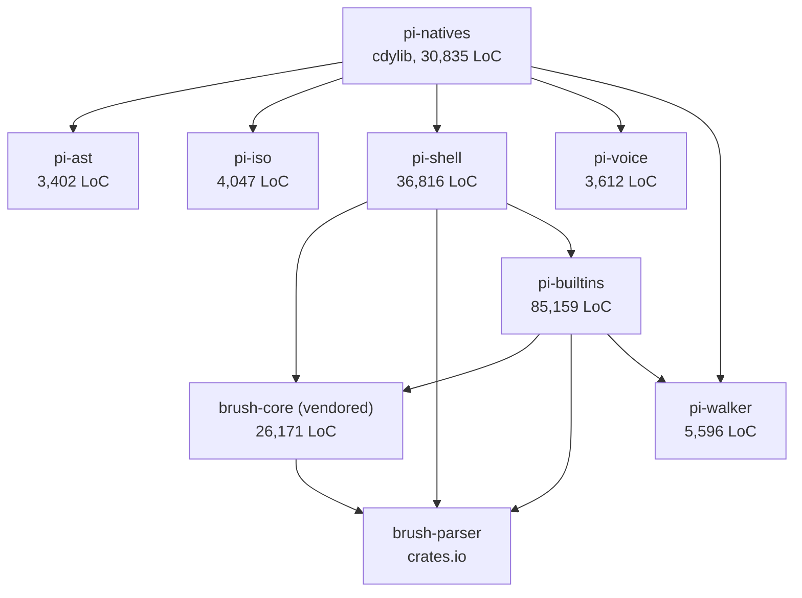
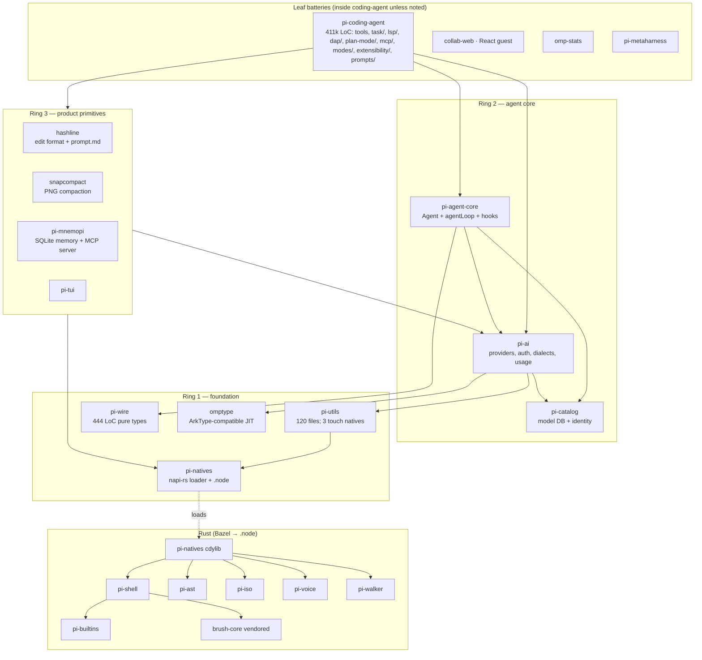

# OMP ("Oh My Pi") Deep-Dive: Code Architecture Report

> **Scope of this report** (per orchestrator split): this document covers the **code architecture** of the
> `oh-my-pi` repository at `.pi/migration-research/repos/oh-my-pi/` — crates ↔ packages relationships and the
> natives binding contract, Bazel build topology, package-by-package API/dependency/extractability analysis,
> the extension/plugin system implementation, divergence from pi-mono upstream, licensing, remote/headless
> code surfaces (RPC/SDK/collab/ACP/python), and context-engineering details that are only visible from code
> (prompt assembly paths, tool-registry construction, subagent prompt construction). Battery *behavior* and
> the docs-driven Context Engineering chapter are covered by the sibling report (`omp-batteries`).
>
> All paths are relative to the repo root unless absolute. Version under inspection: **17.2.12**.

## Table of Contents

1. [Executive Architecture Overview](#1-executive-architecture-overview)
2. [Repository Layout & Build Topology](#2-repository-layout--build-topology)
   - 2.1 Bun workspaces + Bazel: who builds what
   - 2.2 Bazel target matrix (the `native_addon` rule)
   - 2.3 Release profile enforcement (defs.bzl transition)
3. [The Natives Binding Contract (napi-rs pipeline)](#3-the-natives-binding-contract)
   - 3.1 The four layers
   - 3.2 `gen-enums.ts` and the generated export block
   - 3.3 Loader: release-version sentinel, eager/lazy entrypoints
   - 3.4 Binding-change checklist
4. [Crates Deep-Dive](#4-crates-deep-dive)
   - 4.1 Crate dependency graph
   - 4.2 pi-natives module registry
   - 4.3 pi-shell / pi-builtins / vendored brush-core
   - 4.4 pi-ast, pi-iso, pi-voice, pi-walker
5. [Package-by-Package Analysis](#5-package-by-package-analysis)
   - 5.0 Dependency & export matrix
   - 5.1 pi-wire — collab wire shapes (pure types)
   - 5.2 omptype — typing/keys engine
   - 5.3 pi-utils — foundation toolbox
   - 5.4 pi-natives — the Rust addon wrapper
   - 5.5 pi-catalog — model/provider catalog
   - 5.6 pi-ai — provider abstraction layer
   - 5.7 pi-agent-core — the agent loop
   - 5.8 pi-tui — terminal UI toolkit
   - 5.9 hashline — line-hash edit format
   - 5.10 snapcompact — bitmap compaction
   - 5.11 pi-mnemopi — local memory backend
   - 5.12 pi-coding-agent — the batteries monolith
   - 5.13 collab-web — web guest client
   - 5.14 omp-stats — usage dashboard
   - 5.15 pi-metaharness — eval orchestrator
   - 5.16 browser-relay — Chrome extension
   - 5.17 typescript-edit-benchmark
6. [The Agent Loop & Context Assembly (code path)](#6-the-agent-loop--context-assembly)
   - 6.1 `AgentContext` / `AgentLoopConfig`
   - 6.2 `prepareProviderCall`: the assembly pipeline
   - 6.3 Owned-dialect (in-band tool calling) rewrite
   - 6.4 `streamAssistantResponse`: per-request knob resolution
7. [Tool Registry Construction](#7-tool-registry-construction)
8. [Subagent Spawn Mechanics (in-process)](#8-subagent-spawn-mechanics)
   - 8.1 `structured-subagent.ts` policy resolution
   - 8.2 `executor.ts`: child session construction & prompt splicing
   - 8.3 Isolation (worktree) runner
9. [Extension / Plugin System Implementation](#9-extension--plugin-system-implementation)
   - 9.1 ExtensionAPI surface
   - 9.2 Runner & loader
   - 9.3 Hooks, custom tools, custom commands
   - 9.4 Plugin manager + marketplace
   - 9.5 Legacy pi-mono compat shims
10. [Remote / Headless Surfaces (code)](#10-remote--headless-surfaces)
    - 10.1 RPC mode (`src/modes/rpc/`)
    - 10.2 Collab (`src/collab/` + pi-wire + relay)
    - 10.3 ACP mode (`src/modes/acp/`)
    - 10.4 Public SDK (`src/sdk.ts`)
    - 10.5 `python/omp-rpc` and `python/robomp`
    - 10.6 Can an external React frontend drive OMP? (synthesis)
11. [Divergence from pi-mono Upstream](#11-divergence-from-pi-mono)
12. [Licensing](#12-licensing)
13. [Migration-Relevant Seams: Summary](#13-migration-relevant-seams-summary)

---


---

## 1. Executive Architecture Overview

OMP is a **Bun-first TypeScript monorepo with a Rust N-API addon at its core**, forked from badlogic's
`pi-mono` and heavily extended. The architecture in one paragraph:

A single Rust **cdylib** (`crates/pi-natives`, ~31k LoC own code + ~26k LoC vendored brush-core shell engine +
~85k LoC `pi-builtins` coreutils/jaq ports) is compiled via Bazel into per-platform `.node` addons and wrapped by
`packages/natives` (`@oh-my-pi/pi-natives`). Around that native core sit concentric TypeScript rings:
**pi-utils** (foundation toolbox, light natives coupling: 3 of 120 files) → **pi-wire** (zero-dep collab JSON
shapes) + **omptype** (zero-dep terminal keys/typing engine) → **pi-catalog** (model/provider database,
`models.json` + per-provider metadata) → **pi-ai** (~100k LoC: provider streaming, auth/OAuth, dialects,
usage) → **pi-agent-core** (~15k LoC: the provider-agnostic agent loop, compaction interfaces, telemetry) →
**pi-tui** (~26k LoC terminal UI) and the leaf batteries packages (**hashline**, **snapcompact**,
**pi-mnemopi**) → finally **pi-coding-agent** (~411k LoC), the `omp` CLI that contains effectively all
product surface: tools, task/subagents, plan mode, LSP/DAP, MCP, memory backends, skills, extensions,
RPC/ACP/collab modes, and the TUI front end. Two satellite TS packages (**collab-web**, **omp-stats**) are
React apps; **browser-relay** is a Chrome extension; **pi-metaharness** and **typescript-edit-benchmark** are
internal evaluation tooling.

Key structural facts for migration planning:

- **Bazel builds only Rust.** All TypeScript runs directly under Bun (with `with { type: "text" }` template
  embedding); there is no TS compile step in Bazel. `packages/coding-agent/bin/omp` → `src/cli.ts`.
- **One native addon, three JS entrypoints.** `pi-natives` exposes root (eager load), `/desktop`, `/clipboard`
  (lazy subpaths) from a single `.node` per platform; loader validates only a release-version sentinel, not the
  export set (`docs/natives-binding-contract.md`).
- **pi-coding-agent is the gravitational center.** Every battery lives inside it as `src/<battery>/`; the
  reusable primitives are deliberately hoisted into the lower rings (pi-ai / pi-agent-core / pi-utils), but the
  wiring (tool registry, subagent executor, extension runner, all modes) is monolithic.
- **The agent loop is cleanly layered.** `pi-agent-core` owns `Agent` + `agentLoop` over `AgentMessage`;
  conversion to provider wire format happens only at the call boundary via injected `convertToLlm` /
  `transformContext` / `transformProviderContext` hooks (`packages/agent/src/agent-loop.ts`).
- **Everything is MIT-licensed**, dual copyright Mario Zechner (pi-mono upstream) + Can Bölük (OMP).

---

## 2. Repository Layout & Build Topology

### 2.1 Bun workspaces + Bazel: who builds what

Root `package.json` declares Bun workspaces (`packages/*`, pinned `bun@1.3.14`); root `Cargo.toml` declares a
Rust workspace over `crates/pi-*` + `crates/vendor/*` (workspace version 17.2.12, edition 2024, `panic =
"unwind"` deliberately kept for N-API, and a crates-io patch redirecting `brush-core` to the vendored fork).
Bazel (`MODULE.bazel`, root `BUILD.bazel`, `bazel/defs.bzl`) **only produces the `.node` addons** — there are
no TS build targets. The TS side consumes prebuilt addons through
`packages/natives/scripts/` (`build:bindings`, `embed-native.ts`, `gen-npm-packages.ts` for per-platform npm
leaf packages) driven by root script `scripts/bazel-natives.ts` (`bun ../../scripts/bazel-natives.ts host
--dest native`).

### 2.2 Bazel target matrix

Root `BUILD.bazel` declares 8 `native_addon` targets:

| Target | Platform | Notes |
|---|---|---|
| `linux-x64-baseline` / `linux-x64-modern` | glibc x86_64 | baseline vs modern CPU features |
| `linux-arm64` | glibc aarch64 | |
| `linux-musl-x64` / `linux-musl-arm64` | musl | reuse plain linux output filenames |
| `darwin-x64-baseline` / `darwin-arm64` | macOS | |
| `win32-x64-baseline` | Windows | |

plus a `natives-linux-all` filegroup. Output filenames collide between gnu/musl, so outputs are symlinked
under per-rule-name directories.

### 2.3 Release profile enforcement

`bazel/defs.bzl` wraps the Rust build in a **transition that force-enables release-grade flags regardless of
`-c`**: `compilation_mode=opt`, thin LTO, `codegen-units=16`, `strip=symbols`. The intent (documented in
`docs/natives-*.md` and DEVELOPMENT.md) is that a developer can never accidentally ship or bench a debug
addon. The published npm package ships platform leaf packages (`packages/natives/scripts/gen-npm-packages.ts`)
so end users never run Bazel.

---

## 3. The Natives Binding Contract

Source of truth: `docs/natives-binding-contract.md` (read in full). The pipeline has four layers:

1. **`crates/pi-natives/src/*.rs` `#[napi]` items** — napi-rs annotations on functions/classes/enums. Modules
   are registered by hand in `crates/pi-natives/src/lib.rs` (`pub mod` list, §4.2).
2. **`bun run build:bindings`** (`packages/natives/scripts/build-bindings.ts`) — runs napi-rs codegen, then
   **`gen-enums.ts`**, which rewrites const enums into runtime JS objects and **regenerates the marked export
   block** inside `native/index.js` / `native/index.d.ts`.
3. **Generated artifacts** — `packages/natives/native/index.d.ts` + `native/index.js` (checked in; the export
   block is delimited by markers and must be regenerated, not hand-edited).
4. **Loader** — `native/index.js` loads the platform `.node` (from the platform leaf npm package or local
   build) and validates **only a release-version sentinel export**, not the full export set. Consequence:
   adding a binding without bumping versions can half-load silently — the contract mitigates this socially via
   a checklist rather than mechanically.

Package exports (`packages/natives/package.json`): `"."` → `native/index.js` (eager), `"./desktop"` →
`native/desktop.js`, `"./clipboard"` → `native/clipboard.js` (both lazy subpaths so headless/server consumers
never pay for desktop UI deps). Scripts: `build` (bazel host build → `native/`), `build:bindings`, `gen:native`
(embed), `gen:npm` (platform leaf packages), `bench/grep.ts`.

The documented **binding-change checklist** (7 steps): add/adjust `#[napi]` item → register module in
`crates/pi-natives/src/lib.rs` → `bun run build:bindings` → verify the marked block in `native/index.d.ts` and
`native/index.js` → update consumers → run package tests → bump versions per release flow.

### 3.1 What the contract means for migration

The napi-rs layer is **thin and mechanical**: every native capability (grep, PTY, file lock, token counting,
snapcompact PNG rendering, diff, AST boundaries, vectors, shell) is a free-standing function/class export. A
consumer that wants to replace the Rust core can shim `@oh-my-pi/pi-natives` with a same-shaped JS/native
module — the contract is only the generated export block plus the sentinel. The heavy Rust pieces that would
need real replacement work are enumerated in §4.

---

## 4. Crates Deep-Dive

### 4.1 Crate dependency graph (from each `Cargo.toml`)



`pi-natives` is the only `cdylib`; everything else is an `rlib` folded into it. Total first-party Rust:
**~161k LoC** (31k pi-natives + 37k pi-shell + 85k pi-builtins + 3.4k pi-ast + 4k pi-iso + 3.6k pi-voice +
5.6k pi-walker) plus 26k vendored brush-core. Note: pi-builtins' `Cargo.toml` *also* declares crates-io
`brush-core = "^0.5.0"` which the workspace `[patch.crates-io]` redirects to `crates/vendor/brush-core`.

### 4.2 pi-natives module registry

`crates/pi-natives/src/lib.rs` registers these modules (line numbers from source):
`appearance, ast, audio, block, clipboard, crash_handler, desktop, devicecheck, diff, fd, file_lock, glob,
glob_util, grep, highlight, html, iofs, keys, live, sixel, snapcompact, power, iso, prof, ps, pty, shell,
summary, task, text, tokens, vectors, workspace` (plus `create_custom_tokio_runtime` from napi-rs and a
documented patched-Rayon sequential fallback). Platform deps confirm scope: Linux uses `atspi`/`pipewire`/
`reis`/`x11rb` (desktop automation + screen capture), macOS uses `core-graphics`/`objc2-*`, Windows uses
`windows-sys`/`uiautomation`/`clipboard-win`; `enigo`+`xcap` on macOS/Windows. Heavy capability crates:
`grep-*` + `ignore` (ripgrep engine), `ast-grep-core`, `image`, `fontdue`, `icy_sixel`,
`html-to-markdown-rs`, `arboard`.

### 4.3 pi-shell / pi-builtins / vendored brush-core

- **`pi-shell` (36,816 LoC)**: embeds the brush shell as a **persistent in-process shell engine** for the
  `bash` tool — depends on `brush-core`, `brush-parser`, `pi-builtins`.
- **`pi-builtins` (85,159 LoC)**: ports of coreutils/jaq (`uutils`-style) as brush builtins; exposes a
  `host.rs` `Utility` trait. This is what makes `bash` sessions fast and cross-platform (58 CLI utilities per
  README).
- **`crates/vendor/brush-core` (26,171 LoC)**: fork of brush (bourne-shell-in-Rust) with OMP patches; only
  brush-core is vendored, `brush-parser` still comes from crates.io.

### 4.4 The small crates

- **pi-ast (3,402 LoC)** — ast-grep-core integration behind N-API (`ast_grep`/`ast_edit` tools, hashline's
  `enclosingBlockBoundaries`).
- **pi-iso (4,047 LoC)** — process/session isolation helpers.
- **pi-voice (3,612 LoC)** — audio capture/playback (voice input, `tts` tool).
- **pi-walker (5,596 LoC)** — fast filesystem walking (used by pi-builtins; backs `glob` semantics, mirrored
  in pure TS at `packages/utils/src/tab-spacing.ts` per its doc comments).

**Migration takeaway:** the Rust estate decomposes into (a) *hot-path utilities* easily swapped for TS/JS or
spawned binaries (grep, glob, diff, tokens), (b) *session/stateful engines* that are genuine assets
(pi-shell/brush, snapcompact renderer, PTY, token counting), and (c) *desktop/audio* surface that a headless
relay product can ignore entirely (desktop, clipboard, audio, voice, sixel, keys, appearance, power).

---

## 5. Package-by-Package Analysis

### 5.0 Dependency & export matrix

Runtime dependency hygiene is exceptional: **every package below pi-coding-agent has ≤1 external npm dep**.
Versions are uniformly `17.2.12` except collab-web (16.3.6), browser-relay (0.1.0), metaharness and
typescript-edit-benchmark (0.0.1, internal tooling).

| Package | LoC (src) | Internal deps | External runtime deps | Exports |
|---|---|---|---|---|
| pi-wire | 444 | — | — | `.`, `./*`, `./*.js` |
| omptype | 10.5k | — | — | `.`, `./*`, `./*.js` |
| pi-utils | 31k (120 files) | pi-natives | — | `.`, `./*`, `./*.js` |
| pi-natives | 0 TS src (`native/` generated) | — | — | `.`, `./desktop`, `./clipboard` |
| pi-catalog | 105k (incl. models.json, provider-models/) | omptype, pi-utils | @bufbuild/protobuf | 12 paths incl. `./models.json`, `./provider-models/*`, `./discovery/*`, `./wire/*` |
| pi-ai | 100k (282 files) | omptype, pi-catalog, pi-utils, pi-wire | @bufbuild/protobuf | 20 paths incl. `./providers/*`, `./dialect`, `./oauth`, `./registry`, `./usage/*`, `./error` |
| pi-agent-core | 15k (27 files) | pi-ai, pi-catalog, pi-natives, pi-utils, pi-wire, snapcompact | @opentelemetry/api | `.`, `./compaction`, `./compaction/*`, `./*` |
| pi-tui | 26k (37 files) | pi-natives, pi-utils | — | `.`, `./*`, `./components/*` |
| hashline | 7.3k (20 files) | pi-natives, pi-utils | — | `.`, `./grammar.lark`, `./prompt.md`, `./*` |
| snapcompact | 2k (2 files) | pi-ai, pi-natives, pi-utils, pi-wire | — | `.`, `./snapcompact`, `./*` |
| pi-mnemopi | — | pi-ai, pi-catalog, pi-natives, pi-utils | — | `.`, `./core`, `./core/beam`, `./beam`, `./diagnose`, `./mcp`, `./cli` |
| pi-coding-agent | **410,701** | everything above | 14 (OTel stack, mupdf, puppeteer-core, @babel/parser) | 122 paths (huge public SDK surface) |
| collab-web | React app | pi-utils, pi-wire | react, react-dom, lucide-react | none (bundled app) |
| omp-stats | — | pi-ai, pi-catalog, pi-utils | react, chart.js, tailwind | `.`, `./client`, … |
| pi-metaharness | — | hashline, agent-core, ai, catalog, coding-agent, natives, utils, ts-edit-benchmark | react, d3, diff, motion | none |
| browser-relay | Chrome ext | — | — | none |
| typescript-edit-benchmark | — | hashline, agent-core, ai, coding-agent, natives, tui, utils | @babel/*, prettier, regexp-tree | `./*` |

### 5.1 pi-wire — collab wire shapes (pure types)

444 LoC, zero dependencies, zero logic. Declares the JSON skeleton for collab live sessions:
`GuestFrame` (hello+proto+writeToken, prompt, ui-response, abort, agent-cmd chat/kill/revive,
fetch-transcript), `HostFrame` (welcome+state+agents+entryCount, snapshot-chunk{final}, entry, event, state,
bus, agents, ui-request/ui-request-end, transcript, bye, error), `COLLAB_PROTO` version, `BusChannel`
(`task:subagent:progress` / `task:subagent:lifecycle`), `SessionEntry` variants (message, compaction,
branch-summary, model-change, …), relay envelope constants (`ENVELOPE_HEADER_LENGTH`, `ROOM_ID_BYTES`,
`ROOM_KEY_BYTES`, `WRITE_TOKEN_BYTES`, `DEFAULT_RELAY_URL`), and `INTENT_FIELD`. Also exports the shared
message model (`TextContent`, `AssistantMessage`, `ToolResultMessage`, `WireUsage`, …) — i.e. pi-wire is
*also* the canonical message-schema package, which is why pi-ai and pi-agent-core depend on it.
**Extractability: trivial (copy the directory).** Contract-only: no encode/decode/encrypt/route logic.

### 5.2 omptype — ArkType-compatible runtime schema validation

10.5k LoC, zero deps. **A ground-up rewrite of ArkType with lazy JIT compilation**
(`src/compile.ts`, `src/interp.ts`, `src/ir.ts`, `src/keywords.ts`) plus interop shims (`ark.ts`, `typebox.ts`,
`zod.ts`, `from-json-schema.ts`, `json-schema.ts`, `infer.ts`). ArkType itself is only a devDependency
(for attest benchmarks). This is the schema layer used for all tool parameter validation across pi-ai and
pi-coding-agent (upstream pi-mono used TypeBox + `StringEnum`; OMP replaced it — see §11). The
`patches/@ark%2Fschema@0.56.2.patch` is leftover support for the dev-time attest harness.
**Extractability: trivial**, and valuable: a dependency-free schema validator with TypeBox/Zod interop is a
drop-in for any agent runtime's tool-argument validation.

### 5.3 pi-utils — foundation toolbox

31k LoC across 120 files. Re-exports ~25 modules from `src/index.ts`: `abortable, async, binary, color, dirs,
env, fetch-retry, file-lock, format, frontmatter, fs-error, glob, json, json-parse, loop-phase,
mermaid-ascii, mime, path, path-tree, peek-file, process-name, ptree, runtime-install, sanitize-text,
snowflake` (plus more matched by `./*`). Vendored subsystems under `src/vendor/`, `src/marked/`,
`src/turndown/`, `src/readability/`, `src/dom/`, `src/docx/`, `src/vterm/` (terminal emulation!), and
**`src/acp/` — a full vendored copy of the Agent Client Protocol (Zed) TypeScript schema**, consumed by
`coding-agent/src/modes/acp/`. Natives coupling: only **3 of 120 files** hard-import pi-natives
(`file-lock.ts` → `FileLock`, `procmgr.ts`/`ptree.ts` → `Process`); `sanitize-text.ts` and `tab-spacing.ts`
are pure-TS ports that merely *mirror* Rust behavior (doc-comment references only).
**Extractability: high** — shim those three imports or accept the natives dep.

### 5.4 pi-natives — the Rust addon wrapper

No hand-written `src/`; the package is `native/` (generated loader + d.ts), `scripts/` (build-bindings,
embed-native, gen-npm-packages), `bench/`, `test/`. See §3 for the contract. The npm-published form uses
per-platform optional leaf packages generated by `gen-npm-packages.ts`.

### 5.5 pi-catalog — model/provider catalog

105k LoC but **mostly data**: `models.json` (bundled model database), `provider-models/` per-provider
metadata, `wire/` per-provider wire descriptors (codex, coreweave, gemini-headers, github-copilot), plus
`discovery/` (provider discovery descriptors), `identity/` (model identity/classification/equivalence,
`FALLBACK_DIALECT`, `preferredDialect`), `compat/openai`, `model-cache`, `model-manager`, `variant-collapse`,
`effort` (thinking-level modeling). Code surface is modest; the value is the curated data + the
identity/dialect classification logic that pi-ai's provider layer consumes.
**Extractability: high**; the data files alone are a useful asset.

### 5.6 pi-ai — provider abstraction layer

~100k LoC, 282 files. This is the **largest reusable subsystem**. Layout:
- `providers/` — anthropic(+client), azure-openai-responses, cursor, gitlab-duo(+workflow),
  google(+gemini-cli, vertex), kimi, mock, ollama, openai-codex-responses, openai-completions,
  openai-responses, synthetic. All behind a uniform `streamSimple(model, context, options)` interface.
- `dialect/` — the **owned/in-band tool-calling dialect system**: `renderInbandToolPrompt`,
  `encodeInbandToolHistory`, `wrapInbandToolStream`, `renderToolExamples` — moves tool declarations into the
  system prompt as text and re-materializes model-emitted tool-call text into native `toolCall` content
  blocks (for models/providers without native tool calling).
- `auth/`, `auth-broker/`, `auth-gateway/`, `registry/`, `oauth` — multi-credential OAuth storage with
  round-robin + session affinity + backoff (a fork addition; see §11), credential brokering, and a gateway.
- `usage/`, `error/` (rate-limit classification), `utils/` (incl. `harmony-leak` detection/recovery for
  gpt-oss-style channel leaks, `block-symbols`).
- Root exports: `streamSimple`, `EventStream`, `Context`, `Model`, `Message` types, `toolWireSchema`,
  `validateToolArguments`, `stripSchemaDescriptions`, `TSchema` (omptype re-export).

**Extractability: the crown jewels.** One external dep (protobuf, for one provider family). It assumes
pi-utils (3 native-touched files) and pi-catalog; tokenizer natives come via pi-agent-core, not here
(`auth-storage.ts` references pi-natives only in a doc comment about `!command` config resolution).

### 5.7 pi-agent-core — the agent loop

15k LoC, 27 files, `src/index.ts` re-exports: `agent` (the `Agent` class), `agent-loop`,
`append-only-context`, `compaction`, `pause` (process-global pause gate), `proxy`, `replay-policy`,
`run-collector` (run-level telemetry + coverage), `telemetry` (OTel spans: chat/execute-tool/invoke-agent),
`thinking`, `tokenizer` (`countTokens` → pi-natives, the **only** natives import in the package), `types`,
`utils/yield`. The loop is detailed in §6. Depends on snapcompact for compaction support.
**Extractability: high.** This is the layer most directly comparable to prime-agent's RLM core.

### 5.8 pi-tui — terminal UI toolkit

26k LoC. Differential-rendering terminal library: `components/` (box, editor, input, markdown, scroll-view,
select-list, settings-list, tab-bar, text, truncated-text, cancellable-loader, loader, image, spacer),
plus `autocomplete`, `fuzzy`, `keybindings`, `keys`, `kitty-graphics`, `latex-*`, `mouse`, `deccara`
(DEC private-mode sequences), `desktop-notify`. Natives-backed (PTY/keys/image).
**Extractability: medium** — tightly tied to pi-natives key/image handling; irrelevant for a web-first relay
except as reference for terminal emulation.

### 5.9 hashline — line-hash edit format

7.3k LoC, zero external deps. A complete, self-contained **edit-format package**: `grammar.lark` (Lark
grammar for the patch language), `parser`, `apply`, `patcher`, `mismatch`/`recovery` (fuzzy re-anchor via
natives `diffLineRuns`), `syntax` (natives `enclosingBlockBoundaries` for AST-aware anchoring),
`diff-preview`, `format`, `normalize`, `prefixes`, `snapshots`, `stream`, `tokenizer`, `block`,
`input`, `fs` (pluggable FS/IO abstraction — works over disk, memory, or custom backends), `clipboard`,
and **`prompt.md`** (the model-facing spec of the format, exported as a package path `./prompt.md`).
Natives coupling = 2 functions, both easily replaced.
**Extractability: very high and self-contained** — an edit tool format with its own grammar, recovery, and
model prompt is a perfect "battery" to lift.

### 5.10 snapcompact — bitmap compaction

2 files, 2k LoC. TS orchestration around the Rust renderer: imports `renderSnapcompactPng` +
`snapcompactSupportedChars` from pi-natives (hard dependency — the renderer IS the feature) and keeps the
`is_wide` character tables in sync with `crates/pi-natives/src/snapcompact.rs` (comment-mandated).
Depends on pi-ai for the fallback summarization model call and pi-wire for message types.
**Extractability: the idea is portable, the implementation is Rust-bound.**

### 5.11 pi-mnemopi — local memory backend

Local SQLite memory engine (bun:sqlite). `core/` (memory, embeddings, llm-backends, beam search),
`dr/`, `migrations/`, `util/`; exports `./mcp` (an MCP server exposing the memory!) and `./cli`.
Natives used for embeddings/vectors. **Extractability: medium-high** as a standalone local-memory MCP server.

### 5.12 pi-coding-agent — the batteries monolith

410,701 LoC of TypeScript; 122 package export paths (an enormous de-facto SDK). All batteries live here as
top-level `src/` subdirectories: `task/` (subagents, 12.8k LoC), `lsp/` (lspmux + writethrough +
diagnostics-ledger), `dap/`, `plan-mode/`, `mcp/`, `hindsight/`, `mnemopi/`, `extensibility/`, `skills`
(under extensibility), `capability/` (discovery system: `defineCapability`, `registerProvider`,
`loadCapability`, `ruleCapability`), `registry/` (agent-registry + lifecycle), `async/` (AsyncJobManager),
`session/` (agent-session, session-manager, messages, artifacts), `modes/` (interactive/rpc/acp/print),
`collab/`, `eval/` (py/js/rb/jl kernels), `tools/` (50+ tool files), `prompts/` (~70 embedded .md templates
via `with { type: "text" }`), `advisor/`, `autolearn/`, `autoresearch/`, `commit/`, `cursor/`, `discovery/`,
`internal-urls/` (`memory://`, `agent://`, `plan://` virtual schemes), `web/`, `workspace-tree.ts`, plus
`sdk.ts` (the public `createAgentSession` API, §10.4) and `system-prompt.ts` (§6).
**This package is what a migration replaces piece by piece** — the lower rings are reusable as-is.

### 5.13 collab-web — web guest client

React 19 app (lucide-react), no exports field — bundled and served by the relay host (my.omp.sh) and reused
for HTML export (`coding-agent` has `bun run gen:tool-views` building
`src/export/html/tool-views.generated.js` **from collab-web sources** — i.e. session HTML export reuses the
collab guest's tool renderers). Structure: `components/`, `lib/`, `styles/`, `tool-render/`.
**This is the proof that an external React frontend can drive OMP** — over the pi-wire collab protocol (§10.6).

### 5.14 omp-stats — usage dashboard

Local observability dashboard (React + chart.js + tailwind): `aggregator`, `db`, `gain-aggregator`, `server`,
`client/`. Reads the local usage databases written via pi-ai's `usage/`. Standalone dev tool.

### 5.15 pi-metaharness — eval orchestrator

Internal (v0.0.1): unified benchmark runners + Harbor-compatible run storage, REST/SSE APIs, live web
dashboard (`adapters/`, `web/`). Depends on nearly everything incl. coding-agent (drives sessions
programmatically via the SDK). This is the in-repo analog of a test/eval control plane.

### 5.16 browser-relay — Chrome extension

Zero-dep Chrome extension; the relay server side lives in the CLI (`omp browser-relay`). Lets the `browser`
tool drive the user's existing Chrome tabs instead of a puppeteer instance.

### 5.17 typescript-edit-benchmark

Internal benchmark suite mutating TypeScript sources (@babel parser/traverse/generator, prettier,
regexp-tree) to evaluate edit formats (hashline vs others) — the data pipeline behind the hashline work.

---

## 11. Divergence from pi-mono

Source: `docs/porting-from-pi-mono.md` (the maintained merge guide; read in full) plus manifests.

**Sync discipline.** The fork tracks upstream by patch-range, not git merge: last sync point is pinned at
upstream commit `b21b42d032919de2f2e6920a76fa9a37c3920c0a` (2026-03-22); new syncs generate
`git format-patch <marker>..HEAD` from a pi-mono checkout and apply with a fixed checklist (define scope →
bring code → match import-extension conventions → replace scopes → Bun-ify → embed assets → port
package.json → align tooling → **remove old compatibility layers** → update docs → validate → consult the
regression-trap list → detect reworked files → audit → commit with a prescribed message format). The local
clone's own history is a flattened fork history (single squashed-looking recent history,
`can1357/oh-my-pi` origin); the upstream marker commit is explicitly noted as *not* present in the local
object database.

**Rename map.** `@mariozechner/pi-*` (and `@earendil-works/pi-*`) → `@oh-my-pi/pi-*` across
coding-agent/agent-core/tui/ai/utils/catalog/natives. Fork-added packages (wire, omptype, hashline,
snapcompact, mnemopi, collab-web, stats, metaharness, browser-relay, typescript-edit-benchmark) have no
upstream counterpart.

**Documented intentional divergences (§15 of the guide):**

| Area | Upstream (pi-mono) | OMP fork |
|---|---|---|
| Tool construction | `createTool(cwd, options?)` per tool | `createTools(session: ToolSession)` via central `BUILTIN_TOOLS` registry; factories may return `null` to disable a tool |
| Tool schemas | TypeBox `StringEnum` from pi-ai | **omptype** (`Type.Enum` via `pi.typebox` shim or `pi.arktype.enumerated`); pi-ai no longer exports StringEnum |
| Auth storage | `proper-lockfile` + `auth.json`, one credential/provider | `agent.db` (bun:sqlite), **multi-credential with round-robin + session affinity + backoff** |
| Extension loading | `jiti` TS loader | native Bun `import()`; manifest field `pkg.omp` preferred (`pkg.pi` fallback) |
| Resource/settings managers | `DefaultResourceLoader`, `DefaultPackageManager`, `SettingsManager` as architecture | **Capability-based discovery** (`defineCapability`, `registerProvider`, `loadCapability`) + `Settings` singleton + `EventBus`; the three legacy managers survive only as shims in `legacy-pi-coding-agent-shim.ts` |
| Clipboard tools | `clipboard.ts` + `clipboard-image.ts` tool files | `src/utils/clipboard.ts` backed by pi-natives |
| Model database | `models.generated.ts` | `models.json` (pi-catalog) |
| Footer | `footer-data-provider.ts` | `StatusLineComponent` |
| Tests | vitest + `vi.mock()` | `bun:test` + `expect()` |
| Runtime | Node-oriented, npm dist copies | Bun-first: Bun Shell `$`/`Bun.spawn`, `bun:sqlite`, `with { type: "text" }` prompt embeds, no dist copy steps |

**Fork-only features flagged "never overwrite" in a merge:** StatusLineComponent; multi-credential auth;
capability-based discovery; MCP/Exa/SSH integrations; **LSP writethrough** (format-on-save interception);
**bash interception** (`checkBashInterception`); fuzzy path suggestions in the read tool.

**Practical consequence for migration:** pi-mono upstream compatibility is a *maintained concern of the fork
itself* — the legacy-pi compat shims (`src/extensibility/legacy-pi-*-shim.ts`,
`plugins/legacy-pi-compat.ts`) mean pi-mono plugins mostly run unmodified on OMP, so OMP's API is a strict
superset. Anything built against pi-mono's agent-core/ai/tui APIs ports to OMP's rings with the rename map;
the reverse is not true (omptype, ToolSession, capability discovery, natives are fork-only).

---

## 12. Licensing

- Root `LICENSE`: **MIT**, dual copyright — `Copyright (c) 2025 Mario Zechner` (pi-mono upstream author) and
  `Copyright (c) 2025-2026 Can Bölük` (OMP fork author).
- All 17 packages declare `"license": "MIT"` in their package.json.
- Vendored third-party code: `crates/vendor/brush-core` (brush shell, MIT-licensed upstream), pi-utils
  `src/vendor/` + vendored ACP schema (Zed Industries, Apache/MIT), marked/turndown/readability (MIT),
  mupdf dep in coding-agent is **AGPL** (a notable copyleft island — it's the PDF rendering tool dependency;
  relevant if pi-relay redistributes binaries).

---

## 6. The Agent Loop & Context Assembly (code path)

All in `packages/agent/src/` (pi-agent-core). The loop is provider-agnostic and **hook-driven**: OMP's
context engineering lives in injected callbacks, not in the loop itself — which is exactly what makes the
loop reusable by a different runtime.

### 6.1 Core types (`types.ts`)

```ts
interface AgentContext {
    systemPrompt: string[];        // NOTE: array of blocks, joined later — splicing-friendly
    messages: AgentMessage[];      // richer than LLM Message: carries timestamps, custom roles, UI data
    tools?: AgentTool<any>[];
}
```

`AgentLoopConfig extends SimpleStreamOptions` (model, apiKey, reasoning, temperature, serviceTier, toolChoice,
…) and adds the **context-engineering seams**, all optional callbacks:

- `convertToLlm(messages: AgentMessage[]) => Message[]` — **required**. The only place AgentMessage → provider
  `Message` conversion happens. Custom/notification/UI-only messages are mapped or dropped here.
- `transformContext(messages, signal)` — pre-conversion transform at AgentMessage level (pruning, injection).
- `transformProviderContext(llmContext, model)` — post-conversion transform of the final
  `{systemPrompt, messages, tools}` triple.
- `appendOnlyContext: AppendOnlyContextManager` — alternative context builder for cache-stable append-only
  prompting (`src/append-only-context.ts`): `syncMessages(normalizedMessages)` then `build(context, …)`.
- Per-request resolvers: `getModel`, `getApiKey`, `getReasoning`, `getDisableReasoning`, `getServiceTier`,
  `getCwd` (re-read per LLM call so a mid-run `/move` reaches workspace-scoped provider discovery),
  `metadataResolver` (re-resolved *after* credential selection so `account_uuid` matches the credential
  actually used).
- Steering: `interruptMode: "immediate" | "wait"`, `sessionId` (provider session caching, e.g. Codex),
  `deadline`.

### 6.2 `prepareProviderCall` — the assembly pipeline (agent-loop.ts)

Executed **fresh before every LLM request** (no cached Context):

1. `model = config.getModel?.() ?? config.model`
2. `messages = config.transformContext?.(context.messages, signal) ?? context.messages`
3. `llmMessages = await config.convertToLlm(messages)`
4. `normalizeMessagesForProvider(llmMessages, model)` — provider-specific fixups
5. Build `llmContext = { systemPrompt: context.systemPrompt, messages: normalizedMessages,
   tools: normalizeTools(context.tools, { injectIntent: intentTracing, pruneDescriptions }) }`
   — `normalizeTools` can inject an `intent` field into every tool schema (`INTENT_FIELD` from pi-wire) and
   strip schema descriptions (`stripSchemaDescriptions`) when a dialect owns tool calling.
6. `llmContext = await config.transformProviderContext?.(llmContext, model)`
7. **Owned-dialect rewrite** (see 6.3).

The event stream for one `prompt()` run is fixed:
`agent_start → (turn_start → message_start → message_update* → message_end → tool_execution_* )* → agent_end`.

### 6.3 Owned-dialect (in-band tool calling) rewrite

When `config.dialect` (or `PI_DIALECT` env) selects an owned dialect and tools exist:

```ts
promptToolWireTools = llmContext.tools;
llmContext = { ...llmContext,
    systemPrompt: [...llmContext.systemPrompt, renderInbandToolPrompt(promptToolWireTools, ownedDialect)],
    messages: encodeInbandToolHistory(llmContext.messages, ownedDialect, promptToolWireTools),
    tools: undefined };              // no native tools on the wire at all
```

The response stream is then wrapped by `wrapInbandToolStream(...)`, which re-materializes in-band tool-call
text into native `toolCall` content blocks **and aborts the provider request if the model starts fabricating
a `<tool_response>`** (hallucinated tool results) — the abort is wired only into the provider signal so it
doesn't trip the loop's external-abort handling. `toolChoice` is forced `undefined` in dialect mode.

### 6.4 `streamAssistantResponse` — per-request resolution order

Effective values resolved at call time (in order): dynamic reasoning/disableReasoning getters → config
statics; `getServiceTier(model)` overrides static `serviceTier`; harmony-leak mitigation (for gpt-oss-family
models) installs an extra AbortController and, on retry, **temperature +0.05 per attempt**; API key resolved
per call via `resolveApiKeyOnce` with resolver seeding (`seedApiKeyResolver`) for session-sticky credentials;
metadata re-resolved post-credential. Telemetry: `startChatSpan` records the *entire* request payload
(maxTokens, temperature, systemPrompt, messages, tools) as span attributes — so OTel export doubles as a
full request-logging hook. Synthetic tool results (`createSyntheticToolResultMessage`,
`TERMINAL_TOOL_RESULT_ABORT_REASON`) close out orphaned tool calls on abort/steer so the transcript stays
structurally valid for the next request.

**Migration lens:** to re-host OMP-style context assembly on a different loop, you need exactly these five
hooks: `convertToLlm`, `transformContext`, `transformProviderContext`, `appendOnlyContext`, and the tool
normalizer. Everything OMP-specific (TTSR injection, plan-mode blocks, skill messages, compaction summaries)
is expressed *through* those hooks in pi-coding-agent, not in the loop.

---

## 7. Tool Registry Construction

`packages/coding-agent/src/tools/index.ts`:

- **`BUILTIN_TOOLS: Record<BuiltinToolName, ToolFactory>`** — 29 entries mapping tool name →
  `(session: ToolSession) => Tool | null | Promise<Tool|null>`. `createIf` factories (ask, debug, github,
  lsp, checkpoint, rewind, memory_*, retain/recall/reflect, learn, manage_skill) return `null` when their
  battery is disabled — **feature gating is factory-level, not config-filtering after construction**.
  Tool list: `read, security_scan, bash, edit, ast_grep, ast_edit, ask, debug, eval, github, glob, grep, lsp,
  inspect_image, browser, computer, checkpoint, rewind, task, hub, todo, web_search, write, memory_edit,
  retain, recall, reflect, learn, manage_skill`.
- **`HIDDEN_TOOLS`** — `yield` (subagent completion protocol), `goal` (goal mode): constructible but not
  listed for the root agent; `createTools` adds `yield` only when `session.requireYieldTool` (subagent
  sessions) and `goal` only when goal mode is active.
- **`createTools(session, toolNames?)`** — resolution order: `restrictToolNames` (subagent sandboxes) →
  explicit list → default all; goal-mode can append `goal`; eval backends resolved once
  (`resolveEvalBackends(session)` → python/js/ruby/julia availability) with preflight skipping.
- **`ToolSession`** (the God-context passed to every factory): cwd, additionalDirectories, hasUI, isDisposed,
  fetch override, getApiKey, `contextFiles`, `workspaceTree`, `skills`, `promptTemplates`, `rules`,
  `refreshSkills`, pre-discovered extension source paths, task depth/parent ids, hindsight/mnemopi session
  state, eval session id, MCP manager, local protocol options, telemetry — i.e. **everything a tool needs is
  dependency-injected through one interface**, and subagents receive a *derived* ToolSession (§8).
- Tool-call middleware (blocking/revisable `tool_call` events, `tool_result` rewriting) is implemented in the
  extension runner, not here — tools themselves are plain `AgentTool`s from pi-agent-core.

Per-tool parameter schemas are omptype/TypeBox objects compiled to provider JSON Schema at the pi-ai boundary
(`toolWireSchema`, `validateToolArguments`, `stripSchemaDescriptions`).

---

## 8. Subagent Spawn Mechanics (in-process)

Subagents are **in-process**: `src/task/executor.ts` header states "Runs each subagent on the main thread and
forwards AgentEvents for progress tracking." No worker threads, no subprocesses (the `runSubprocess` name is
historical); parallelism comes from `mapWithConcurrencyLimitAllSettled` + `Semaphore` (`src/task/parallel.ts`)
plus `AsyncJobManager` for detached/background runs.

### 8.1 Policy resolution (`src/task/structured-subagent.ts`)

`runStructuredSubagent(request: StructuredSubagentRequest)` normalizes both the `task` tool and eval-bridge
frontends into one pipeline. Preflight (`resolveEffectiveSubagentPolicy`) computes:

- **Agent definition**: discovered from bundled agents + `~/.omp/agent/agents/*.md` +
  `.omp/agents/*.md` (`src/task/discovery.ts`).
- **Recursion guards**: `task.maxRecursionDepth` (default 2) via `canSpawnAtDepth`; self-spawn ban via
  `blockedAgent` / `PI_BLOCKED_AGENT` env.
- **Schema precedence** (`resolveSchema`): caller `outputSchema` (presence, not truthiness) > agent frontmatter
  `output` > session `outputSchema` > none; mode `permissive|strict`.
- **Plan mode** (`createPlanModeAgent`): child system prompt becomes `planModeSubagentPrompt + "

" +
  agent.systemPrompt`, tools restricted to `read, grep, glob, web_search` (+`ast_grep` if the agent already
  had it), `spawns`/`prewalk` stripped; isolation/apply/merge controls are hard-rejected in plan mode.
- Isolation: `parseIsolationMode` → worktree/branch/patch modes (`src/task/worktree.ts`,
  `isolation-runner.ts`, `isolation-ownership.ts`); isolation implies non-resumable (worktree merged+cleaned).

### 8.2 Child session construction & prompt splicing (`executor.ts`)

Each child gets a **full `createAgentSession`** (the same public SDK entry as the root CLI) with
`buildSubagentSessionOptions(...)`:

- **System prompt**: the caller's default prompt array is spliced, not replaced —
  `[...defaultPrompt.slice(0, -1), subagentPrompt, defaultPrompt.at(-1)]` where `subagentPrompt` renders
  `prompts/system/subagent-system-prompt.md` with `{agent.systemPrompt, context, planReference,
  planReferencePath, worktree, outputSchema, ircPeers, ircSelfId}`. (The last default block — environment —
  stays last.)
- **User prompt**: `prompts/system/subagent-user-prompt.md` rendered with `{assignment}`.
- **Inheritance**: preloaded extension/custom-tool **paths** (re-bound to the child's own session scope),
  `workspaceTree` (skip re-scan), `rules`, context files, parent hindsight/mnemopi session state, parent's
  eval kernel (`shareEvalSession` for task children; eval-bridge children explicitly excluded), MCP manager,
  `parentAgentId`/`agentId`, `taskDepth+1`.
- **Tool filtering**: parent-owned bookkeeping tools are stripped — `todo` is removed unless `prewalk` is on
  (`isParentOwnedTool`); restricted children get `preloadedExtensionPaths: []`.
- **Budgets/guards**: `SOFT_REQUEST_BUDGET` per agent (scout/sonic 100, default 200; setting can only lower);
  crossing it injects a `[budget notice]` steering message; at 1.5× the run is force-stopped into a final
  `yield`; +5 grace requests then hard abort. `maxRuntimeMs` wall-clock; `TASK_ABORT_CLEANUP_GRACE_MS` 10s.
- **Lifecycle**: `AgentRegistry` registration + `installRegistryStatusSync`; sessions persist to JSONL and get
  a **reviver** (`SessionManager.open` + fresh `createAgentSession`) so parked/killed agents resume with full
  history — except isolated runs. `appendSessionInit` records systemPrompt, tools, agent, model, schema into
  the child transcript. Progress/lifecycle events go over the `EventBus` channels
  `task:subagent:progress|lifecycle` (the same `BusChannel`s collab mirrors to guests).
- **Yield protocol**: child ends by calling the hidden `yield` tool; `yield-assembly.ts` assembles the final
  report (`assembleYieldResult`); late yield is reminded via `subagent-yield-reminder.md`.

### 8.3 Isolation runner

`runIsolatedSubprocess` + `prepareIsolationContext` (worktree creation incl. nested-repo patch handling via
`NestedRepoPatch`), `mergeIsolatedChanges` (`merge: "patch" | "branch"`), `applyEligibleNestedPatches`,
`makeIsolationCommitMessage`. This is the code asset behind "parallel subagents that don't step on each
other's files" — self-contained in `src/task/{worktree,isolation-runner,isolation-ownership}.ts` (~1.5k LoC).

---

## 9. Extension / Plugin System Implementation

All under `packages/coding-agent/src/extensibility/` (~40 files). Four coexisting mechanisms share the event
bus and the `ExtensionAPI`:

### 9.1 ExtensionAPI surface (`extensions/types.ts`, 59k chars — the largest interface file in the repo)

An extension is a module whose default export is `ExtensionFactory: (pi: ExtensionAPI) => void | Extension`.
The API object injects **host module handles directly**: `pi.logger`, `pi.typebox`, `pi.arktype`, `pi.zod`
(schema builders so extensions never import their own validator), and `pi.pi` (the pi-coding-agent barrel).

Registration methods: `registerTool(ToolDefinition)` (with `hidden`, `defaultInactive`,
`loadMode: "essential"|"discoverable"`, `deferrable`, `approval: "read"|"write"|"exec"`, `strict`,
MCP-provenance fields, optional `onSession` lifecycle hook and custom TUI renderers),
`registerCommand` (slash commands), `registerShortcut`, `registerFlag`, `registerMessageRenderer`,
`registerProvider`/`unregisterProvider` (**extensions can add LLM providers at runtime**), `setWidget`,
autocomplete providers, `events` subscription.

Event surface (`pi.on(...)`, ~45 event kinds): full session lifecycle (`session_start`, `session_switch` /
`session_branch` / `session_tree` with blocking `session_before_*` veto variants, `session.compacting`,
`session_compact`, `session_shutdown`), agent loop (`before_agent_start` — can inject messages **and** extra
`systemPrompt` blocks; `agent_start/end`, `turn_start/end`, `message_start/update/end`), provider boundary
(`before_provider_request` (blocking, can rewrite), `after_provider_response`), tool middleware (`tool_call`
blocking/revisable, `tool_result` rewriting, `tool_execution_*`, approval requested/resolved), batteries
(`auto_compaction_*`, `auto_retry_*`, `ttsr_triggered`, `todo_reminder`, `goal_updated`,
`credential_disabled`, `mcp_notification`, `resources_discover`), user input (`input` (can transform),
`user_bash`, `user_python`), and `session_stop` (the "continue" hook — extension may request up to 8
continuations).

`ExtensionContext` (passed to handlers/executors) carries `ExtensionUIContext` (dialogs/selects/ask),
`ContextUsage`, model query (`createExtensionModelQuery` in `model-api.ts`), session manager access, and
`ExtensionActions` (sendMessage, appendEntry, getActiveTools/setActiveTools, setModel, thinking/service-tier
get/set) — with host-capability guards (`throwUnsupportedServiceTierAction` on hosts without the feature).

### 9.2 Runner & loader (`extensions/runner.ts` 51.5k chars, `extensions/loader.ts`)

`ExtensionRunner` executes handlers with **per-handler 30s timeout** (`EXTENSION_HANDLER_TIMEOUT_MS`,
test-overridable) and a dedicated larger budget for `session_shutdown`; combines multi-extension results
(e.g. `BeforeAgentStartCombinedResult` merges `messages[]` + `systemPrompt[]` from all handlers);
`ManagedTimers` scopes `setInterval`/`setTimeout` to extension unload. The runner also exposes
`compact-handler.ts` (extension-provided compaction) and `get-commands-handler.ts`. Loader discovers from
`.omp/extensions`, `~/.omp/agent/extensions`, `settings.json#extensions`, package `pkg.omp` (fallback
`pkg.pi`) manifest fields; errors collected into `LoadExtensionsResult` (non-fatal per-extension).

### 9.3 Hooks, custom tools, custom commands

- `hooks/` — a **separate, lighter hook system** (`hooks/types.ts`, `runner.ts`, `tool-wrapper.ts`) sharing
  most event types; hooks get `HookMessage`/`CustomMessagePayload` injection and can wrap tools.
- `custom-tools/` — loads standalone tool modules (`CustomTool` factories) with provenance
  (`SourceInfo{path, source: builtin|sdk|mcp|extension, scope: user|project|temporary, origin:
  package|top-level}`) mirroring upstream pi's contract so upstream extensions read `sourceInfo.source`
  unchanged.
- `custom-commands/` — bundled commands (`ci-green`, `review`) + user/project loaders.
- `skills.ts`, `slash-commands.ts` — skill/prompt-template discovery & invocation (`parseSkillInvocation`,
  `buildSkillPromptMessage`).

### 9.4 Plugin manager + marketplace

`plugins/` implements a full package manager: npm/git spec parsing (`parser.ts`, `git-url.ts`,
`bun-git-cache.ts`), install into a plugins dir with lockfile + node_modules (`manager.ts`, `installer.ts`),
project overrides, runtime config normalization, `doctor.ts` checks, and a marketplace
(`marketplace/{manager,registry,fetcher,cache,source-resolver}.ts`, `marketplace-auto-update.ts`).

### 9.5 Legacy pi-mono compat (the upstream-compat machine)

`legacy-pi-compat.ts` + `legacy-pi-ai-shim.ts` + `legacy-pi-coding-agent-shim.ts` + `legacy-pi-tui-shim.ts` +
`legacy-typebox.ts`: a **module-resolution interceptor** (Babel-parse of extension imports, `createRequire`
shim, `installLegacyPiSpecifierShim`) that rewrites `@mariozechner/pi-*` / `@earendil-works/pi-*` /
`typebox` specifiers to OMP equivalents at load time, plus virtual `omp-legacy-pi-bundled:<key>` modules for
`--compile`d binaries where Bun can't resolve host packages from the embedded filesystem. The
`DefaultResourceLoader`/`DefaultPackageManager`/`SettingsManager` legacy classes exist **only** as shims
over capability discovery + `Settings` + `EventBus`. Net effect: upstream pi-mono extensions are a supported
runtime target — a key extractability fact (OMP's host API is a superset of pi-mono's).

---

## 10. Remote / Headless Surfaces (code)

OMP has **four** distinct headless/control surfaces, plus a reference Python client and a reference bot:

### 10.1 RPC mode — `src/modes/rpc/` (4,467 LoC)

`omp --mode rpc`: JSONL on stdin/stdout. `rpc-types.ts` defines the full command union (~45 commands:
`negotiate_protocol`, `prompt`/`steer`/`follow_up`/`abort`/`abort_and_prompt`, `new_session`, `get_state`,
`set_fast_mode`, `get_available_commands`, `set_todos`, **`set_host_tools`** (client-injected tools the agent
can call back over stdio via `host-tools.ts` `RpcHostToolBridge`), **`set_host_uri_schemes`** (client-served
virtual files via `host-uris.ts`), `set_subagent_subscription`/`get_subagents`/`get_subagent_messages`
(`rpc-subagents.ts` — `RpcSubagentRegistry`, `readRpcSubagentTranscript`), model/thinking/queue-mode setters,
`compact`/`set_auto_compaction`, retry controls, `bash`/`abort_bash`, session ops (`get_session_stats`,
`export_html`, `switch_session`, `branch`, `get_branch_messages`, `handoff`, `set_session_name`), paged
`get_messages`/`get_messages_page` (`rpc-messages.ts`), `login`). Framing: `rpc-frame.ts`
(`RpcFrameEncoder`, 1 MiB v1 frame cap, reassembly cap), input claiming (`rpc-input.ts`), serial dispatch
(`RpcInputDispatcher`), orderly shutdown (`RpcShutdownCoordinator`), and pending extension UI requests
(`RpcPendingExtensionRequests`). Structure: `rpc-mode.ts` wires an `AgentSession` (created via the same
`createAgentSession` as interactive mode) to the dispatcher and forwards every `AgentSessionEvent` as a
notification frame. **The RPC process is the full agent — tools execute inside the omp process; the client
is a remote control.**

### 10.2 Collab — `src/collab/` (2,221 LoC) + pi-wire + relay

Hub topology: host is authoritative, guests never peer. `relay-client.ts` (`CollabSocket`): WebSocket to
`wss://…/r/<roomId>`, **AES-256-GCM sealed frames** (`crypto.ts`, key in the share link fragment), plaintext
envelope `[4B BE peerId][sealed payload]` so the relay routes without seeing content; reconnect with
exponential backoff (1s→30s), 256-frame pending-send buffer, 64KiB backpressure threshold; fatal close codes
(4001 room closed, 4004 no room, 4009 host conflict, 4029 full) never reconnect. `protocol.ts` defines
`CollabFrame` on top of pi-wire's `GuestFrame`/`HostFrame` (welcome→snapshot-chunk…final→live `entry`/`event`
/`state`/`bus`/`agents`/`ui-request`; guest→host prompt/abort/agent-cmd/fetch-transcript/ui-response).
`host.ts` (692 LoC) mirrors session entries + EventBus channels + agent registry snapshots;
`guest.ts` (764 LoC) maintains a **replica session** at `~/.omp/collab/<roomId>.jsonl`;
`replication-shrink.ts` prunes replica growth. The web guest is collab-web (React, §5.13).

### 10.3 ACP mode — `src/modes/acp/` (4,221 LoC)

Implements Zed's **Agent Client Protocol** over the vendored schema in `pi-utils/acp`:
`acp-agent.ts` (2,606 LoC) is a full ACP `Agent` — initialize/authenticate, new/load/fork/resume/close
session, `list_sessions`, session modes (`SetSessionModeRequest` maps to plan mode etc.), config options,
elicitation (extension dialogs → ACP), usage reporting, MCP server passthrough (`McpServer` configs from the
editor!). `acp-event-mapper.ts` (1,084 LoC) maps `AgentSessionEvent`s → ACP `SessionNotification`s;
`acp-client-bridge.ts` adapts editor client capabilities; `acp-permission-gate.ts` maps tool approvals;
`terminal-auth.ts` for OAuth-in-terminal. This is the most complete "embed OMP in an editor" path.

### 10.4 Public SDK — `src/sdk.ts` (~1,200 LoC) + `src/index.ts` barrel

`createAgentSession(options: CreateAgentSessionOptions)` is the single programmatic entry; the options
interface (~100 fields, read in full) is the *real* embedding API: cwd/additionalDirectories/agentDir,
spawns, authStorage/modelRegistry/getApiKey injection, model + `modelPattern` deferred resolution + retry
fallback roles/chains, thinkingLevel (+ceiling), service tier, **`systemPrompt` override as string | string[]
| `(defaultPrompt: string[]) => string[]`** (the splice seam used by subagents), `customSystemPrompt`,
`appendSystemPrompt`, `titleSystemPrompt`, `providerSessionId`/`providerPromptCacheKey` (provider-side cache
reuse across processes), deadline, `customTools`, inline `extensions`, discovery toggles, `planYolo`,
`prewalk`, plus session-level plumbing (sessionManager, artifactManager, eventBus, telemetry,
parentTaskPrefix/parentAgentId for subagents, `enableLsp`/`enableMCP`/`enableIrc`, `localProtocolOptions`).
Sibling discovery helpers: `discoverAuthStorage/Extensions/Skills/ContextFiles/PromptTemplates/
SlashCommands/CustomTSCommands/MCPServers`, `buildSystemPrompt`, `customToolToDefinition`,
`createAutoLearnCaptureRunner`. Returns `{ session, sessionManager, … }`; `AgentSession` exposes
prompt/steer/abort, event subscription, `setActiveToolsByName`, `getEnabledToolNames`, `dispose`, etc.
Both RPC mode and ACP mode and the TUI all construct sessions through this one function.

### 10.5 `python/omp-rpc` and `python/robomp`

- `python/omp-rpc` (pyproject: "Typed Python client for the omp coding-agent RPC protocol", ≥3.11, MIT):
  `client.py` `RpcClient` — spawns `omp --mode rpc` as a subprocess (process-group management for clean
  kills), frame decoder with chunk reassembly, typed error hierarchy (`RpcTimeoutError`,
  `RpcProcessExitError`, `RpcConcurrencyError`, `RpcCommandError`, `RpcProtocolError`), ~30 typed event
  listeners (`on_message_update`, `on_tool_execution_*`, `on_auto_compaction_*`, `on_ttsr_triggered`,
  `on_ui_request`, …), `install_headless_ui()` for auto-answering extension UI requests, and command methods
  mirroring §10.1 (`get_state`, `set_model`, …). `host_tools.py`/`host_uris.py` implement the client side of
  the host-tool/host-URI bridges. Paging is drained automatically.
- `python/robomp`: FastAPI + sqlite event queue + WorkerPool GitHub triage bot driving `omp --mode rpc` in
  per-issue git worktrees (`--continue` resumes persisted JSONL transcripts after restarts) — a production
  proof of the RPC surface as an automation substrate, with a two-container trust split (orchestrator holds
  HMAC, sidecar holds the PAT).

### 10.6 Can an external React frontend drive OMP? — synthesis

Yes, three ways, all exercised in-repo:

1. **Collab guest protocol (pi-wire + AES-GCM WebSocket relay)** — what collab-web does: snapshot-chunked
   transcript load, then live `entry`/`event`/`state`/`bus`/`agents` frames; guests send
   prompt/abort/agent-cmd; extension UI requests round-trip (`ui-request`/`ui-response`). Read-only view
   links supported (`readOnly` in welcome). *Best fit for a live multi-client React frontend.*
2. **RPC stdio** — what the TUI-alternative and python clients do; full control incl. host tools/URI schemes;
   single client, local subprocess. *Best fit for a backend-driven embedding (pi-relay daemon style).*
3. **ACP** — if the frontend speaks (or fronts) the Zed editor protocol; richest session-management semantics
   (fork/resume/modes/elicitation) but designed for editors.

Gaps to note: no plain HTTP/WebSocket server mode for the root session in-process (the relay only brokers
collab rooms; RPC is stdio-only), and collab guests share the host's session rather than owning one — a
pi-relay-style product would run `omp --mode rpc` per session server-side and bridge to its own websocket
protocol, exactly like robomp does for GitHub events.

---

## 13. Migration-Relevant Seams: Summary

The questions a pi-relay migration actually asks, answered from code:



**Cleanest lifts (drop-in, near-zero coupling):**
- `pi-wire` (444 LoC types), `omptype` (schema JIT with typebox/zod interop), `hashline` (edit format:
  grammar + parser + recovery + `prompt.md`; natives used for 2 replaceable functions).
- `python/omp-rpc` as the reference for how a polite stdio-RPC client behaves (framing, paging, UI requests).

**High-value, moderate coupling:**
- `pi-ai` (1 external dep): provider streaming + OAuth multi-credential + in-band tool dialects +
  harmony-leak recovery. Needs pi-catalog + pi-utils; assumes omptype schemas.
- `pi-agent-core` (1 external dep): the loop. Rehost by implementing five hooks (`convertToLlm`,
  `transformContext`, `transformProviderContext`, `appendOnlyContext`, tool normalization). Natives use is a
  single `countTokens` import.
- `pi-catalog`: mostly data (models.json, provider descriptors, dialect identity).
- `pi-mnemopi`: local SQLite memory with an MCP server export.

**Genuinely entangled (plan for surgery):**
- `pi-coding-agent` as a whole — 411k LoC with 122 export paths; batteries cross-reference heavily through
  `ToolSession`, capability discovery, and the `Settings` singleton. Lift batteries individually (each
  `src/<battery>/` directory is mostly self-contained but imports sibling infra: settings, capability,
  internal-urls, prompts).
- `snapcompact`'s renderer is Rust (`renderSnapcompactPng`); the TS is orchestration.
- `pi-shell`/`pi-builtins` (122k LoC Rust): the persistent in-process shell is the deepest moat; replacing
  it changes `bash` tool semantics.

**Rust dependency strategy:** of the ~30 napi modules, a headless server product needs only: grep, glob,
diff, tokens, file_lock, ps, pty (if executing code), snapcompact (if keeping bitmap compaction), text,
workspace — and can skip desktop/clipboard/audio/voice/sixel/keys/appearance/power entirely. The binding
contract (§3) is a mechanical export-block + version sentinel, so a shim package exporting the same symbols
(they are free functions/classes) is a viable strangler path.

**Protocol assets worth reusing verbatim:** pi-wire collab frames + envelope/crypto constants; the RPC
command union (`rpc-types.ts`) as a checklist for any headless protocol; ACP's session fork/resume/mode
semantics; host-tools / host-URI-schemes as the "client provides capabilities to the agent" pattern.

**Surprises found in code (not docs):**
- The system prompt is a **`string[]` of blocks** end-to-end — splicing (subagents insert before the last
  block) is a first-class mechanism, and `CreateAgentSessionOptions.systemPrompt` accepts a function over the
  default array.
- Tool gating is **factory-level** (`createIf` returning null), not list-filtering; hidden tools
  (`yield`/`goal`) exist outside the builtin registry.
- `pi-ai` contains an **owned-dialect** subsystem that runs tool calling entirely in-band (tools → system
  prompt text; streamed text re-materialized into toolCall blocks; provider abort on fabricated tool
  results) — a capability most agent frameworks lack, and fully decoupled via one config flag.
- Telemetry spans capture the **entire provider request** (system prompt + messages + tools) — the OTel
  exporter is a turnkey request logger.
- collab-web's tool renderers are compiled into the CLI for session HTML export (`gen:tool-views`), so the
  React tool-render layer already runs in two host environments.
- mupdf (AGPL) is the only copyleft dependency; everything else is MIT/BSD-style.
