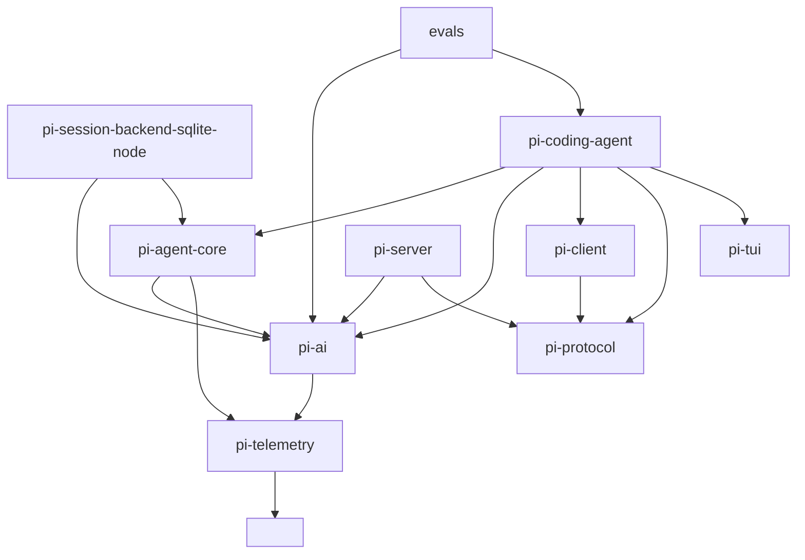
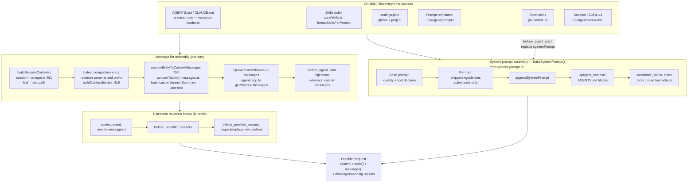
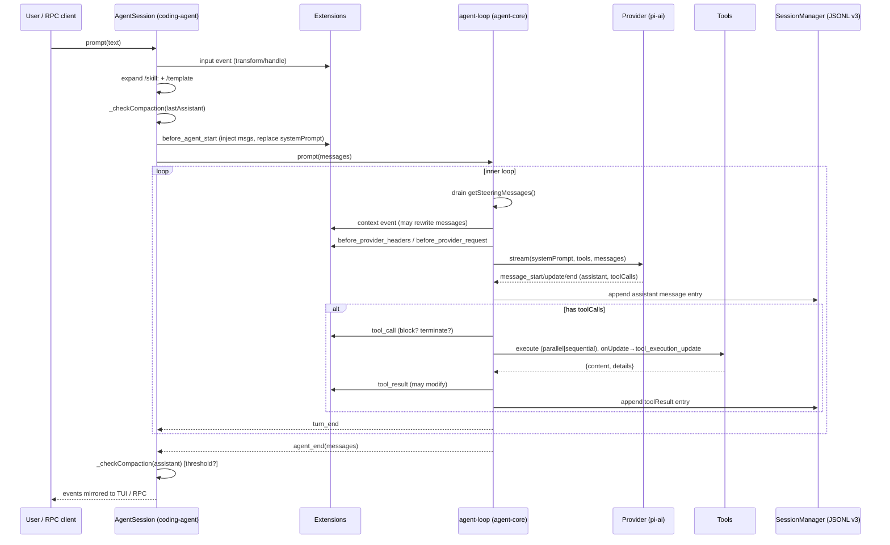
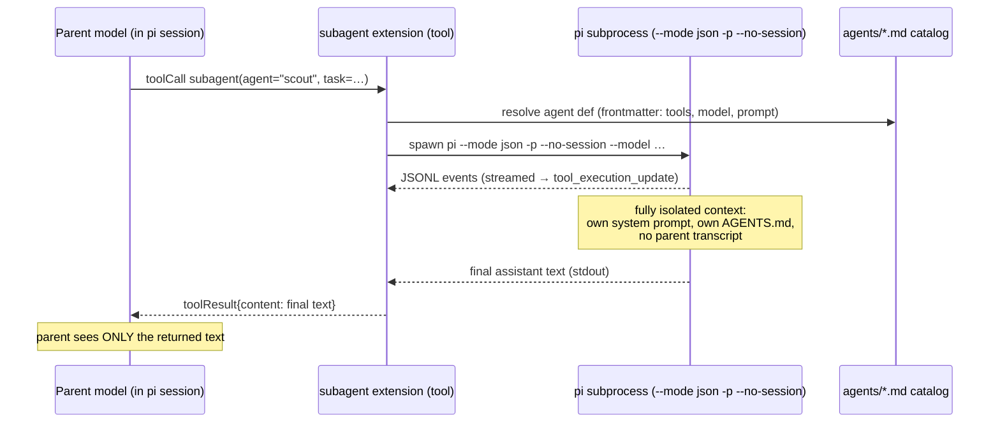
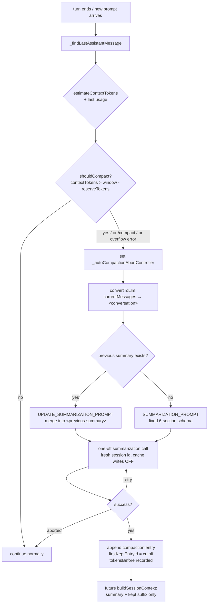

# pi-mono Deep-Dive: How the Original Pi Harness Achieves Modularity

**Repository under study:** `/home/schwinns/pi-relay/.pi/migration-research/repos/pi-mono/`
**Upstream:** pi-mono (Mario Zechner / badlogic; now maintained under the `earendil-works` org, packages `@earendil-works/pi-*`, site pi.dev)
**Commit studied:** `4181f66e6b3ccbef760c2966ecd8b596b926fec6` (2026-08-08)
**Purpose:** reference for restructuring the owner's product (React web UI + agent backend) the way pi-mono is structured, with prime-agent's RLM/IPython core swapped in and pi plugins used for missing features (e.g. MCP).

## Table of Contents

1. [Monorepo Overview & Dependency Graph](#1-monorepo-overview--dependency-graph)
2. [Package: `ai` — Unified Multi-Provider LLM API](#2-package-ai--unified-multi-provider-llm-api)
3. [Package: `agent` — Agent Loop, Harness & Session Abstractions](#3-package-agent--agent-loop-harness--session-abstractions)
4. [Package: `coding-agent` — The CLI Product](#4-package-coding-agent--the-cli-product)
5. [Package: `tui` — Terminal UI Library](#5-package-tui--terminal-ui-library)
6. [Packages: `protocol` / `server` / `client` / `session-backends` — The Client/Server Split](#6-packages-protocol--server--client--session-backends--the-clientserver-split)
7. [The Extension / Plugin System](#7-the-extension--plugin-system)
8. [Session Model: Storage, Branching, Resume, Compaction](#8-session-model-storage-branching-resume-compaction)
9. [How coding-agent Wires Everything (Config, AGENTS.md, Prompt Templates)](#9-how-coding-agent-wires-everything)
10. [Context Engineering & Data Flow](#10-context-engineering--data-flow)
11. [Extensibility Inventory: Every Documented Seam](#11-extensibility-inventory-every-documented-seam)
12. [Replacing the Agent Loop with an RLM/IPython Kernel](#12-replacing-the-agent-loop-with-an-rlmipython-kernel)
13. [Packages: `telemetry` and `evals`](#13-packages-telemetry-and-evals)
14. [License](#14-license)

---


---

## 1. Monorepo Overview & Dependency Graph

pi-mono is an **npm workspaces** monorepo (root `package.json`, build order scripted as `tui → telemetry → ai → agent → session-backends/sqlite-node → protocol → client → server → coding-agent`). All publishable packages share version `^0.84.1` and the npm scope `@earendil-works/pi-*`. The git remote is `https://github.com/badlogic/pi-mono` (Mario Zechner / badlogic); the LICENSE is MIT, copyright Mario Zechner 2025. Branding has moved to "pi.dev" but it is the same project.

**The 10 packages and their one-line roles** (descriptions from each `package.json`):

| Package (dir under `packages/`) | npm name | Role |
|---|---|---|
| `telemetry` | `@earendil-works/pi-telemetry` | Vendor-neutral telemetry contracts (spans/attributes), no exporter |
| `ai` | `@earendil-works/pi-ai` | Unified multi-provider LLM API: model catalog, auth, streaming, tools |
| `agent` | `@earendil-works/pi-agent-core` | Provider-agnostic agent loop, Agent class, harness + session/compaction/tools abstractions |
| `tui` | `@earendil-works/pi-tui` | Terminal UI library with differential rendering |
| `protocol` | `@earendil-works/pi-protocol` | Transport-neutral CBOR wire protocol for remote sessions (experimental) |
| `client` | `@earendil-works/pi-client` | Transport-neutral client for remote pi sessions over framed CBOR bytes |
| `server` | `@earendil-works/pi-server` | Experimental server package exposing agents over pluggable listeners |
| `session-backends/sqlite-node` | `@earendil-works/pi-session-backend-sqlite-node` | SQLite (`node:sqlite`) session backend for agent-core sessions |
| `coding-agent` | `@earendil-works/pi-coding-agent` | The shipping CLI product ("pi"): read/bash/edit/write tools, session mgmt, extensions, TUI, RPC mode |
| `evals` | (private) | vitest-evals-based behavioral evals that drive a real `AgentSession` |

**Internal dependency graph** (from each `package.json` `dependencies`; all `^0.84.1`):



Key observations for a migration:

- **Clean layered stack**: telemetry ← ai ← agent ← coding-agent. Lower layers never import upward. The TUI, protocol, client, server packages are strictly lateral add-ons.
- **coding-agent does NOT depend on pi-server** — the server package is a standalone experiment; coding-agent only carries an *unwired* experimental CLI wrapper (`src/cli/experimental/`) plus `src/server/create-harness.ts` and `src/client/remote-session.ts` that use pi-client/pi-protocol directly.
- **The React-frontend-relevant packages (protocol/client/server) have zero heavy deps**: protocol depends only on typebox; client only on protocol. They are transport-neutral by design (client has no Node imports).
- External deps are minimal and sane: ai pins the official provider SDKs (`@anthropic-ai/sdk` 0.91.1, `openai` 6.40.0, `@google/genai` 1.52.0, `@aws-sdk/client-bedrock-runtime`), typebox for schemas, partial-json for streaming tool args. coding-agent adds chalk, jiti (extension loader), undici, proper-lockfile, minimatch, etc.


---

## 2. Package: `ai` — Unified Multi-Provider LLM API

Location: `packages/ai/` (174 source files, ~22.7k LOC). README is 1,678 lines and is the canonical reference.

### What it provides

1. **Provider abstraction over 30+ providers** (`src/providers/*.ts`: anthropic, amazon-bedrock, azure-openai-responses, baseten, cerebras, cloudflare-*, deepseek, faux (test provider), fireworks, github-copilot, google, google-vertex, groq, huggingface, kimi-coding, minimax(-cn), mistral, moonshotai(-cn), nvidia, ollama, openai(+responses), openrouter, …).
2. **Built-in model catalog** — `getBuiltinModel/getBuiltinModels/getBuiltinProviders` from `@earendil-works/pi-ai/providers/all`; generated `models.generated.ts` + `image-models.generated.ts`; dynamic providers can `models.refresh()` at runtime; user catalog at `~/.pi/agent/models.json`.
3. **Auth resolution** — explicit `apiKey` wins; else `models.getAuth()` resolves from a `CredentialStore`; supports `ApiKeyAuth` and OAuth (`auth/oauth/*`, incl. anthropic OAuth; `@earendil-works/pi-ai/oauth` and `./bun-oauth` subpath exports).
4. **Streaming** — `ProviderStreams` interface (`stream`, `streamSimple`, optional `fetchDeferred?`/`cancelDeferred?`), `StreamOptions`, `SimpleStreamOptions` (reasoning / deferred / thinkingBudgets), `Transport = "sse"|"websocket"|"websocket-cached"|"auto"`. Partial-JSON streaming for tool-call arguments (`partial-json` dep).
5. **Tools** — typebox (`typebox` 1.3.7) `TSchema` parameter schemas re-exported from the index (`Static`, `TSchema`, `Type`); tool calls stream partial JSON and are validated incrementally.
6. **Images** — `images-models.ts`, `images-api-registry.ts`, `ProviderImages`.

### Key extension seams (file:line)

- **`createProvider()`** — `src/models.ts:762`. The documented way to add a custom provider: you give an `id`, `name`, optional `baseUrl`, `headers`, `auth: ProviderAuth`, `getModels()`, optional `refreshModels(ctx)`, `filterModels()`. Examples in README for ollama, proxies, gateways, llamacpp. Registered via `models.setProvider()`.
- **`Provider<TApi>` interface** — `src/models.ts:97`; **`Models`/`MutableModels`/`createModels`** — `src/models.ts:156` / `:735`. Helpers `hasApi`, `calculateCost`, `clampThinkingLevel`, `modelsAreEqual`.
- **`KnownApi`/`KnownProvider`** — `src/types.ts:17`/`:35`; `ApiOptionsMap` — `src/types.ts:239`.
- **Migration note**: old `registerApiProvider` API → now `createProvider` + `models.setProvider()` (README migration table).
- **Context publication**: `context.publish({persist?, update?})` — generation-checked publication so a stale async refresh can't clobber newer state.
- **Subpath exports** (package.json `exports`): `.`, `./compat`, `./providers/*`, `./api/*`, `./oauth`, `./bedrock-provider`, `./bun-oauth`. `compat` carries legacy API aliases (`legacy-api-aliases.ts`) so old code keeps working.

### Utilities relevant to context engineering

`src/utils/` includes `overflow` (context-window overflow detection used for auto-compaction triggers), `retry` (retry policy helpers), `event-stream`, `json-parse`, `diagnostics`, `validation`, `uuid`. **`estimateContextTokens`** (imported by coding-agent from pi-ai) estimates token counts of message lists without a tokenizer call; **`shouldCompact(contextTokens, contextWindow, settings)`** is the pure decision function for auto-compaction.

### Why it matters for migration

pi-ai is the single choke-point for "which model talks how". The owner's product can keep pi-ai wholesale (it has no opinions about agents, sessions, or UI), and the RLM core only needs to emit/consume pi-ai's `Message[]`/stream events to stay compatible with every provider pi supports — or be replaced provider-by-provider later. Custom providers are a first-class, documented seam (`createProvider`), which is also how one would route pi through an in-house gateway.


---

## 3. Package: `agent` — Agent Loop, Harness & Session Abstractions

Location: `packages/agent/` (49 files, ~12.4k LOC), npm name `@earendil-works/pi-agent-core`. Exports: `.`, `./node` (Node env helpers), `./session/testing` (storage conformance suite).

### 3.1 The two layers

The package is deliberately split into a **low-level agent loop** and a **higher-level harness layer** (`src/harness/`):

| Layer | Files | Purpose |
|---|---|---|
| Loop | `agent.ts` (592 lines), `agent-loop.ts` (796), `types.ts` (443) | The classic LLM ⇄ tool-call loop, event-driven |
| Harness | `harness/agent-harness.ts` (508), `harness/types.ts` (315), `harness/events.ts`, `messages.ts`, `prompt-templates.ts`, `reducer.ts`, `result.ts`, `skills.ts`, `system-prompt.ts`, `telemetry.ts` | Durable sessions: lanes, operations, records, recovery |
| Session | `harness/session/{jsonl/*, memory.ts, search.ts, session.ts, state.ts, types.ts, errors.ts}` + `session/testing/conformance.ts` | `SessionStorage` contract + JSONL v4 implementation + in-memory impl |
| Compaction | `harness/compaction/{compaction.ts, branch-summarization.ts, utils.ts}` | Summarization built on the loop |
| Tools | `harness/tools/{bash, edit, edit-diff, read, write, image, file-mutation-queue, tool-context}.ts` | Reference tool implementations used by coding-agent |

### 3.2 The low-level loop (`agent-loop.ts`)

`runLoop()` (`src/agent-loop.ts:155`) is the heart — a textbook two-loop structure:

- **Inner loop** (`while (hasMoreToolCalls || pendingMessages.length > 0)`): inject queued steering messages (`config.getSteeringMessages?.()`), stream one assistant response (`streamAssistantResponse`, `:281`), fail all tool calls if `stopReason === "length"` (truncated args are never executed — `failToolCallsFromTruncatedMessage`, `:381`), otherwise execute tool calls (`executeToolCallsParallel` `:489` / `executeToolCallsSequential` `:433`), push tool results, emit `turn_end`, run `prepareNextTurn?` (can swap model/thinking/context per turn), check `shouldStopAfterTurn?`, poll steering again.
- **Outer loop**: when the inner loop would stop, drain `getFollowUpMessages?.()`; if any, continue; else emit `agent_end`.

Events (emitted through an `EventStream<AgentEvent, AgentMessage[]>`): `agent_start, turn_start, message_start/update/end, tool_execution_start/update/end, turn_end, agent_end` — exactly the sequence documented in the README and mirrored 1:1 by the RPC wire mode.

**`AgentLoopConfig`** (`src/types.ts:149`, extends `SimpleStreamOptions`) hooks: `convertToLlm` (**required**, must not throw — the transcript→provider-message projection), `transformContext?`, `getApiKey?`, `sessionId?`, `beforeToolCall?` (can block/terminate), `afterToolCall?`, `shouldStopAfterTurn?`, `prepareNextTurn?`, `getSteeringMessages?`, `getFollowUpMessages?`, `thinkingBudgets?`, `toolExecution: "parallel"|"sequential"`.

**`AgentTool`** (`src/types.ts:386`): `{name, label, description, parameters: TSchema, executionMode?, execute(toolCallId, params, signal, onUpdate) → {content, details, terminate?}}`. Errors are **thrown**, converted to `isError:true` tool results reported to the LLM; `terminate:true` stops the batch (`shouldTerminateToolBatch`, `agent-loop.ts:582`).

**`Agent` class** (`agent.ts`, 592 lines) wraps the loop with state (`AgentState`: systemPrompt, model, thinkingLevel, tools, messages, isStreaming, streamingMessage?, pendingToolCalls, errorMessage?), queueing (`steer`/`followUp` queue modes), `prompt()`, `continue()`, `abort()`, and the event subscription surface that coding-agent's `AgentSession` builds on.

### 3.3 The harness layer (`src/harness/`)

`AgentHarness` (`harness/agent-harness.ts:508`) is the durable, multi-lane session API. **It is largely a stub at this commit** — most methods throw `HarnessNotImplemented` with typed errors (`LaneBusy`, `MissingIdentities`, `NoActiveRun`, `NothingToResume`, `UnknownSkill`, `UnknownTemplate`, …). The real spec is **`docs/harness-v2.md` (4,612 lines)**, "Durable AgentHarness design":

- **Session = tree + lanes + lane records + global facts.** Lanes are named positions in the conversation tree, one in-flight operation each, running in parallel — this is pi-mono's closest analogue to prime-agent's subagent tree.
- **Record catalog** (harness-v2.md L215–520): every state change is a durable record. LaneRecord types (`harness/session/types.ts`): `operation_started`, `abort_requested`, `operation_finished`, `step_attempt`, `tool_started`, `queue_enqueued`, `queue_cancelled`, `write_deferred`, `usage`. OPERATION_KINDS = `run|compaction|navigation` (`session/jsonl/codec.ts`).
- **Hooks (§11, L1697+)**: awaited interception points, harness-global registration with per-event `lane`; transformations compose (`messages` append, `systemPrompt` replaces); durable hook outputs are committed into records; `before_tool` **fails closed**.
- **Recovery**: `findOpenOperations` (recovery uses `limit: 2`; ≥2 open operations on a lane = corruption), restore + entry-plan reduction, per-action write specs (retry, context overflow mid-assistant-step, steering while a tool runs, abort, auto-compaction at checkpoint).
- **Storage contracts**: Memory / JSONL / SQLite all implement one `SessionStorage` interface (`harness/session/types.ts`): lane CRUD, `appendEntry`/`appendRecord`, `findEntries`/`findRecords`, `findOpenOperations`, `getLog`, global facts (name/label/stats). JSONL impl has `JsonlV4Header{version:4}`; coding-agent's on-disk sessions are **v3** (the compat policy: only coding-agent v3 JSONL needs backward compat).
- Entry types (`harness/session/types.ts`): `MessageEntry`, `ModelChangeEntry`, `ThinkingLevelEntry`, `ActiveToolsEntry`, `CompactionEntry`, `BranchSummaryEntry`, `CustomEntry`.

### 3.4 Takeaways for migration

- The **agent loop is small, self-contained, and event-driven** — 800 lines with hooks at every decision point. Swapping the *mechanism* of "what happens per turn" (e.g. RLM/IPython instead of tool-call batches) means implementing `StreamFn` differently or replacing `runLoop` internals while keeping the event stream contract — every downstream consumer (coding-agent UI, RPC mode, protocol progress events) only sees `AgentEvent`s.
- The **harness layer is where pi is heading** (durable, resumable, lane-parallel) but is **not finished**. Don't adopt `AgentHarness` as-is; treat harness-v2.md as design documentation. The shipping product (coding-agent) still runs on the low-level `Agent` + its own `SessionManager`.
- `SessionStorage` is the single seam for persistence: one interface, three implementations, plus a conformance test suite (`session/testing/conformance.ts`) — a model for how to keep old sessions working across storage changes.


---

## 4. Package: `coding-agent` — The CLI Product

Location: `packages/coding-agent/`, npm `@earendil-works/pi-coding-agent`, binary `pi`. This is the shipping product that composes everything else.

### 4.1 Layout

```
src/
  cli.ts / main.ts           # entry: mode resolution (interactive | print | json | rpc), auth commands, config
  config.ts                  # paths: getAgentDir() = ~/.pi/agent (or $PI_CODING_AGENT_DIR), CONFIG_DIR_NAME=".pi"
  sdk.ts                     # programmatic API surface (createAgentSession*)
  core/
    agent-session.ts (3,342 lines)   # the orchestrator: prompt flow, queues, compaction, extensions, bash, retry
    session-manager.ts (1,714)       # JSONL v3 session files, tree ops, buildSessionContext()
    system-prompt.ts (162)           # buildSystemPrompt()
    skills.ts (487)                  # skill discovery + prompt index (progressive disclosure)
    resource-loader.ts (1,096)       # AGENTS.md/CLAUDE.md discovery, settings, prompt templates, themes, extensions wiring
    prompt-templates.ts (285)        # /template expansion ($1, $@, ${@:N:L}, defaults)
    messages.ts                      # convertToLlm() — session messages → provider messages
    compaction/compaction.ts         # SUMMARIZATION_PROMPT, auto-compaction, branch summarization
    extensions/                      # loader.ts (jiti), types.ts (1,727 lines — the whole extension API)
    tools/                           # read, bash, edit, write (+ grep, find, ls variants), truncate, file-mutation-queue
    model-registry.ts / model-resolver.ts / model-runtime.ts
    settings-manager.ts              # ~/.pi/agent/settings.json + .pi/settings.json merge
    event-bus.ts
  modes/
    interactive/ (TUI) | print-mode.ts | json-event.ts | rpc/ (rpc-mode.ts, rpc-client.ts, rpc-types.ts)
  cli/experimental/          # `pi server --listen unix://…` / `pi client --connect …` — defined, NOT wired
  server/create-harness.ts   # builds an AgentHarness (agent-core) with coding tools for the future server
  client/remote-session.ts   # RemoteSession state machine over PiClient (unbound/ready/busy/disposed)
  extensions/llama           # a bundled extension
docs/                        # extensions.md (2,988 lines!), rpc.md (1,578), sdk.md (1,205), session-format.md (438),
                             # compaction.md (401), skills.md, settings.md, packages.md, prompt-templates.md, usage.md
examples/extensions/         # 80+ example extensions (subagent/, plan-mode/, gondolin/, sandbox/, with-deps/,
                             # custom-provider-anthropic/, custom-provider-gitlab-duo/, handoff.ts, todo.ts, …)
```

### 4.2 Run modes (`src/main.ts:118`, `resolveAppMode` :121)

- **interactive** — full pi-tui app (default when stdin+stdout are TTYs).
- **print** — `-p/--print`, or non-TTY: one-shot, text or `--mode json` (JSONL event stream on stdout).
- **rpc** — `--mode rpc`: persistent JSONL-over-stdin/stdout protocol (see §6.4). This is the **production wire surface** today.

### 4.3 Default tools (`src/core/tools/`)

`read`, `bash`, `edit`, `write` are the defaults selected into the system prompt; `grep`, `find`, `ls` exist as variants. Each tool exports a `*SystemPromptContribution = {snippet, guidelines}` that `buildSystemPrompt()` splices in only when the tool is active (e.g. read's snippet is `"Read file contents"` + guideline "Use read to examine files instead of cat or sed."; edit's guidelines teach exact-match multi-edit semantics). Each tool also defines **pluggable operations interfaces** — `BashOperations`, `ReadOperations`, `WriteOperations` — so extensions can delegate file/exec to remote systems (the `ssh.ts` example extension uses this). Tool results are truncated (`truncate.ts`) and large outputs spilled to files (`fullOutputPath` in details).

`bash.ts:171-183` injects `PI_SESSION_ID`, `PI_SESSION_FILE`, `PI_PROVIDER`, `PI_MODEL`, `PI_REASONING_LEVEL` into the tool's environment (deleting stale values first) — so scripts run by the agent can introspect their own session.

### 4.4 The `AgentSession` orchestrator (`core/agent-session.ts`)

`AgentSession` is the integration hub. Responsibilities:

- **Prompt pipeline** (`prompt()`, :1116): extension commands (registered via `pi.registerCommand`) intercept first even during streaming → `input` extension event (can handle or transform text/images) → skill-command expansion (`/skill:name`) → prompt-template expansion → if streaming, queue as steer/followUp → model+auth validation → pending-bash flush → `_checkCompaction(lastAssistant)` → build user message → **`before_agent_start`** extension event (can inject custom messages and **replace the system prompt**) → start the agent loop.
- **Queues**: steering (mid-run injection) and follow-up (post-run continuation) with modes `"all" | "one-at-a-time"`; the agent loop drains both before `agent_end` (:1101-1104).
- **Compaction orchestration** (:1962 `_checkCompaction`): estimates tokens (`estimateContextTokens`), decides (`shouldCompact`), runs a one-off summarization call with cache-writes disabled, writes a `compaction` entry, wires retry + abort (`_autoCompactionAbortController`).
- **Extension runtime**: `_extensionRunner.emit*` calls for all lifecycle events; `getContextUsage()` (:3174) merges real usage with estimates; `setActiveToolsByName()` rebuilds the system prompt via `_rebuildSystemPrompt(toolNames)`.
- **Bash command passthrough**: user `!cmd` runs bash outside the model; `!!cmd` runs with `excludeFromContext` so the output is shown but never enters LLM context.

### 4.5 SDK (`src/sdk.ts`)

The package is also a library: `createAgentSessionServices`, `createAgentSessionFromServices`, `ModelRuntime`, `SessionManager`, `SettingsManager` are exported (the evals package consumes exactly these — `packages/evals/src/pi-harness.ts`). `sdk.md` (1,205 lines) documents embedding pi in your own app — **this is the documented path the owner's backend would use today**.

### 4.6 RPC mode (`--mode rpc`, `modes/rpc/rpc-types.ts`, docs/rpc.md 1,578 lines)

- JSONL over stdin/stdout, strict LF framing (Node `readline` is non-compliant due to U+2028/U+2029 — use raw line splitting).
- ~35 commands: `prompt` (with `streamingBehavior: "steer"|"followUp"`), `steer`, `follow_up`, `abort`, `new_session`, `get_state`, `get_messages`, `set_model`/`cycle_model`/`get_available_models`, thinking-level set/cycle/list, `set_steering_mode`, `set_follow_up_mode`, `compact`, `set_auto_compaction`, `set_auto_retry`/`abort_retry`, `bash`/`abort_bash`, `get_session_stats`, `export_html`, `switch_session`, `fork`, `clone`, `get_fork_messages`, `get_entries`, `get_tree`, `get_last_assistant_text`, `set_session_name`, `get_commands`.
- Events mirror the agent loop: `agent_start/end/settled, turn_start/end, message_start/end/update, bash_execution_update, tool_execution_start/update/end, queue_update, compaction_start/end, auto_retry_*, summarization_retry_*, extension_error`.
- **Extension UI bridge**: when an extension calls `ctx.ui.select/confirm/input/editor/notify/setStatus/setWidget/setTitle/set_editor_text`, the RPC host emits `extension_ui_request` envelopes and awaits `extension_ui_response` — so a remote frontend can render extension UI without any terminal.

### 4.7 Design philosophy (README/usage.md, worth internalizing)

- "**No MCP.** Build CLI tools with READMEs (see Skills), or build an extension that adds MCP support" (README:498, with a link to Mario's blog post "what-if-you-dont-need-mcp"). usage.md:303: no built-in sub-agents, permission popups, plan mode, to-dos, or background bash — "build or install those workflows as extensions or packages". The example suite proves each: `subagent/`, `plan-mode/`, `permission-gate.ts`, `todo.ts`.
- Everything project-specific is a file in `.pi/` or `~/.pi/agent/`: settings, extensions, skills, prompts, themes, sessions, npm/git packages.


---

## 5. Package: `tui` — Terminal UI Library

Location: `packages/tui/`, npm `@earendil-works/pi-tui`. Deps: `marked` (markdown), `get-east-asian-width` only — no React, no ink.

**What it is:** a minimal terminal UI framework with **differential rendering** and **synchronized output** (CSI 2026) for flicker-free interactive CLIs.

- **Interchangeable renderers** behind one `TUI` interface: `TuiMainScreen` (renders into the main terminal buffer, preserves scrollback — this is what pi uses by default) and `TuiAltScreen` (fixed-height viewport in the alternate buffer with application-owned scrolling; restores main buffer + prints final document on exit — pi's experimental `tuiMode: "fullscreen"`).
- **Component model**: `Component` interface with a `render()` method returning lines; built-ins: Text, TruncatedText, Input, Editor, Markdown, Loader, SelectList, SettingsList, Spacer, Image, Box, Container, VStack, HStack, ScrollView. Theme interfaces per component.
- **Input**: raw-mode key parsing with `matchesKey(data, 'ctrl+c')` helpers, bracketed paste (markers for >10-line pastes), IME/hardware cursor support, autocomplete (file paths, slash commands).
- **Inline images** via Kitty/iTerm2 graphics protocols; **overlays** for modals (used heavily by pi's `/tree`, model picker, extension UIs).
- App-owned scrolling: mouse, trackpad, keyboard.

**Migration relevance:** pi's TUI is deliberately a leaf dependency — coding-agent's interactive mode is the only consumer. A web frontend replaces this entire package; nothing below it (agent loop, sessions, extensions) knows the TUI exists. The only TUI-coupled surface is the **extension UI API** (`ctx.ui.*`), which RPC mode already reifies into protocol messages — that is the contract a React frontend must implement to keep extensions working.

---

## 6. Packages: `protocol` / `server` / `client` / `session-backends` — The Client/Server Split

These four packages are pi's **experimental** remote-session stack. Status matters: `pi-protocol`, `pi-client`, `pi-server` are all marked experimental; coding-agent ships its own production wire (RPC mode, §4.6) and only carries *unwired* experimental glue for the new stack (`src/cli/experimental/` commands exist but `runServer`/`runClient` have no implementations; `transport-address.ts` accepts only `unix://`).

### 6.1 `pi-protocol` (`packages/protocol/`, dep: typebox only)

- **Framing**: 4-byte big-endian length prefix + one definite-length CBOR item. `PROTOCOL_VERSION = 1`; first client message is always `hello`.
- **Envelope model**: request/response pairs + server-event envelopes. Validated `encodeClientMessage()`; incremental decoders with `maxFrameLength` (1 MB in examples).
- **Schemas** (`src/schemas.ts`, 450 lines): `ThinkingLevel`, `SessionPhase`, `ModelRef`, `ModelMetadata`, content schemas (Text/Thinking/Image/ToolCall), `Usage`. **`TranscriptItem`** union: `UserTranscriptItem`; `AssistantTranscriptItem` (status streaming/complete/error/aborted; stopReason stop/length/toolUse/error/aborted); `ToolTranscriptItem` (running/complete; toolCallId, toolName, input, content, details, usage).
- **Commands**: `list`, `create{cwd?,name?,model?,thinkingLevel?}`, `attach`, `detach`, `prompt`, `steer`, `abort`, `set_model`, `set_thinking`.
- **State philosophy (important)**: **snapshots are authoritative; progress events are transient UI hints, never reduced into state.** `SessionMetadata` (list) carries only `id`+`createdAt`; live state (phase, model, thinking, attachment, lock) exists only in the acquired `SessionSnapshot`. Error codes: version, busy, session_locked, not_found, invalid_request, not_implemented, internal_error.

### 6.2 `pi-server` (`packages/server/`, deps: ai, protocol)

- `PiServer` composes pluggable `PiServerListener` transports; **auth happens at the listener level, before protocol bytes**. Only a **Unix-socket transport ships** (`src/transports/unix/`); WebSocket is mentioned as a future possibility.
- `PiServerService` interface: `listSessions`, `listModels`, `createSession`, `openSession` — **the host app supplies the service**; there is no standalone server CLI. `PiSessionRuntime{snapshot(), …}`; event stream `snapshot | progress(TranscriptProgress) | error`.
- Concurrency rule: **conflicting operations reject rather than queue** (`session_locked`/`busy`).

### 6.3 `pi-client` (`packages/client/`, dep: protocol; **no Node imports**)

- `PiClient` runs over a **`ByteTransport` interface** (`onData/onClose/onError` handlers) — WebSocket, WebTransport, unix socket, in-process pair all fit. This is why it can run in a browser.
- One connection multiplexes multiple session attachments; requests are ID-correlated. **No auto-reconnect** (`reconnect()` is manual).
- `acquireSession()` returns a `SessionLease`: `{mode:"exclusive"}` (lifecycle/mutation coordinator) vs `{mode:"shared"}` (observer).
- coding-agent's `src/client/remote-session.ts` shows the intended client-side pattern: a `RemoteSession` state machine (`unbound/ready/busy{op}/disposed`) with transcript reducer helpers (`createTranscriptState`, `applyTranscriptProgress`, `applyTranscriptSnapshot`, `selectTranscript`).

### 6.4 Can a custom React frontend drive pi today?

**Yes — but via RPC mode, not the experimental server.** Two viable paths:

1. **Production path (today)**: spawn `pi --mode rpc` as a subprocess (or run it under your backend as a sidecar per session), speak JSONL over stdio. The React frontend ↔ your backend ↔ pi-RPC. Full command/event surface (§4.6), extension UI bridged as JSON envelopes. This is exactly what pi's own subagent example does (`spawn pi --mode json`), and what the SDK does in-process.
2. **Future path (when server lands)**: implement `PiServerService` over the harness, put a WebSocket `PiServerListener` in front, and run `pi-client` *in the browser* (it is Node-free by design). The protocol's snapshot-authoritative model is friendly to React: reduce `SessionSnapshot` into component state; treat `progress` events as ephemeral streaming hints.

The **session-backends/sqlite-node** package (`packages/session-backends/sqlite-node/`) is the durable-storage piece of the future server story: a `node:sqlite`-backed implementation of agent-core's `SessionStorage` (lazily-shared single connection, migrations, materialized views, optional FTS search via a separate query-only projection). Not used by coding-agent's default JSONL sessions.


---

## 7. The Extension / Plugin System

The extension system is pi-mono's **centerpiece seam** — the mechanism that keeps the core small by pushing features out. Docs: `packages/coding-agent/docs/extensions.md` (2,988 lines); API types: `packages/coding-agent/src/core/extensions/types.ts` (1,727 lines); loader: `extensions/loader.ts`.

### 7.1 Loading & discovery

- Extensions are **TypeScript files loaded by jiti** (`loader.ts`) with module aliasing — no build step; hot-reload via `/reload`; `pi -e ./path.ts` (or `-e npm:@scope/pkg`) for quick tests.
- Discovery paths: `~/.pi/agent/extensions/` (global), `.pi/extensions/` (project, gated by **project trust**), plus **Pi Packages** (npm/git bundles declaring resources in `package.json` under the `pi` key, or conventional `extensions/`, `skills/`, `prompts/`, `themes/` dirs — `docs/packages.md`).
- Install/manage: `pi install npm:@foo/bar@1.0.0 | git:github.com/user/repo@v1 | https://… | ./path`; `pi remove/list/update --extensions`; user installs → `~/.pi/agent/npm/` resp. `~/.pi/agent/git/<host>/<path>`; project installs → `.pi/npm`, `.pi/git`. Git refs are pinned and reconciled (reset+clean+`npm install`).

### 7.2 The event surface (25 `ExtensionEvent` types)

Lifecycle order (from `docs/extensions.md`):

- **Startup**: `project_trust → session_start → resources_discover`.
- **Per prompt**: extension commands first → **`input`** (intercept / transform text+images / handle entirely) → skill+template expansion → **`before_agent_start`** (inject custom messages, **replace system prompt**) → `agent_start` → `message_start/update/end` → per turn: `turn_start` → **`context`** (may rewrite the exact message list sent to the provider) → `before_provider_headers` → **`before_provider_request`** (inspect/replace the raw provider payload) → `after_provider_response` → tool loop: `tool_execution_start` → **`tool_call`** (block with reason, or `terminate` the run) → `tool_execution_update` → **`tool_result`** (modify content/details/isError/usage) → `tool_execution_end`.
- **Session ops**: `session_before_compact` / `session_compact`, `session_before_tree` / `session_tree`, `session_before_switch` / `session_before_fork` (each pair = before/after with veto at "before").

Result types give precise, typed leverage: `ContextEventResult{messages?}`, `ToolCallEventResult{block, reason, terminate}`, `ToolResultEventResult{content, details, isError, usage}`, `MessageEndEventResult{message}`, `BeforeAgentStartEventResult{message, systemPrompt}`.

### 7.3 The `ExtensionContext` (what an extension can reach)

`{ui, mode, hasUI, cwd, sessionManager (readonly), modelRegistry, model, scopedModels, thinkingLevel, isIdle(), isProjectTrusted(), signal, abort(), hasPendingMessages(), shutdown(), getContextUsage(), compact(), getSystemPrompt()}` — `ExtensionCommandContext` extends it for slash commands.

The **`ExtensionAPI`** (`types.ts:1198`) surface:

- `on()` overloads for every event above.
- **`registerTool(...)`** — add first-class tools (with renderers for TUI/RPC).
- **`registerProvider(...)` / `unregisterProvider`** — full custom LLM providers from an extension: `ProviderConfig{name, baseUrl, apiKey (supports `$ENV_VAR`, `${ENV_VAR}`, `!command` interpolation), api, streamSimple (must call `options.onPayload`/`onResponse`), headers, authHeader, models}`.
- `registerCommand`, `sendMessage`, `appendEntry` (session-persistent custom entries), shared `events: EventBus` for extension-to-extension messaging.

### 7.4 Extension UI

`ctx.ui` provides `select / confirm / input / editor / notify / setStatus / setWidget / setTitle / set_editor_text` (+ custom components and overlays in the TUI). In RPC mode every call becomes an `extension_ui_request` → frontend renders → `extension_ui_response`. **This is the portability contract for extensions in a web UI.**

### 7.5 The examples are the feature catalog (`examples/extensions/`, 80+ entries)

Notable for the owner's feature gaps:

- **`subagent/`** — full subagent system *as an extension*: agent definitions are `~/.pi/agent/agents/*.md` (+ project `.pi/agents/` behind trust+scope flags) with frontmatter `{name, description, tools, model}`; each subagent runs as a **separate `pi --mode json -p --no-session` subprocess** with isolated context; parallel streaming, usage tracking, Ctrl+C propagation; workflow presets in `prompts/` (scout→planner→worker etc.). Security model: project agents are repo-controlled prompts, user-scope only by default.
- **`plan-mode/`, `todo.ts`, `permission-gate.ts`, `confirm-destructive.ts`, `protected-paths.ts`** — the "missing features" from usage.md:303, each as an extension.
- **`custom-provider-anthropic/`, `custom-provider-gitlab-duo/`** — registerProvider in action; **`kimi-deferred-tools.ts`** — provider-specific deferred tool calling.
- **`sandbox/`, `gondolin/`** (with-deps examples), **`ssh.ts`** — remote execution via the tools' pluggable operations interfaces.
- **`custom-compaction.ts`, `summarize.ts`, `trigger-compact.ts`** — replacing steering of compaction.
- **`handoff.ts`, `qna.ts`, `questionnaire.ts`, `structured-output.ts`, `dynamic-tools.ts`, `input-transform(-streaming).ts`, `claude-rules.ts`, `project-trust.ts`, `git-checkpoint.ts`, `auto-commit-on-exit.ts`**, games (`snake.ts`, `space-invaders.ts`, `doom-overlay/`) proving the UI surface.

### 7.6 MCP

There is **no built-in MCP** — deliberately (README:498). The sanctioned routes are: (a) wrap MCP servers in CLI tools with READMEs and expose via skills; (b) **write an extension that bridges MCP** — `registerTool` + the tool-result image plumbing (`src/utils/tool-result-images.ts` explicitly mentions "extensions, MCP bridges") make this straightforward. For the owner's migration: an "MCP bridge" extension is a small, well-bounded plugin that registers each MCP server's tools as pi tools — all hooks needed exist.


---

## 8. Session Model: Storage, Branching, Resume, Compaction

Docs: `docs/session-format.md` (438 lines), `docs/compaction.md` (401). Code: `core/session-manager.ts` (1,714 lines), `core/compaction/compaction.ts`.

### 8.1 On-disk format (v3 JSONL)

- Location: `~/.pi/agent/sessions/--<path-encoded-cwd>--/<timestamp>_<uuid>.jsonl` (`getDefaultSessionDirPath`, session-manager.ts:474 — cwd is `--`-wrapped with `/`→`-`).
- First line: `SessionHeader{type:"session", version:3, id, timestamp, cwd, parentSession?}`. `CURRENT_SESSION_VERSION = 3` (session-manager.ts:30). v1 = linear legacy, v2 = tree, v3 renamed `hookMessage`→`custom`; old versions **auto-migrate on load** (entry `version` bumps at :237/:263).
- **Tree, not a log**: every entry has `id`/`parentId` (8-char hex). The "current conversation" is the path from the current leaf to the root — branches are first-class (`/tree` navigation, `/fork`, double-Esc actions).
- Entry types (`SessionEntry` union): `message`, `custom_message`, `thinking_level_change`, `model_change`, `compaction`, `branch_summary`, `custom` (extension data, excluded from LLM context), `label`, `session_info`.
- `AgentMessage` union (the message payloads): `UserMessage | AssistantMessage | ToolResultMessage | BashExecutionMessage | CustomMessage | BranchSummaryMessage | CompactionSummaryMessage`.
- Deletion via `/resume` Ctrl+D uses the `trash` CLI (recoverable). Files are append-only JSONL parsed line-by-line with malformed lines skipped (`parseEntryLine`).

### 8.2 Session → model-context materialization

`buildSessionContext()` (session-manager.ts:461) → `buildContextEntries()` (:418): walk leaf→root path; find the **latest compaction entry**; emit `[compaction entry] + [kept entries from firstKeptEntryId…compactionIdx) + [entries after compaction]`; `sessionEntryToContextMessages()` (:374) maps entries to messages (`custom_message` → `CustomMessage`; `branch_summary` → `BranchSummaryMessage`; `compaction` → `CompactionSummaryMessage`; labels/session_info/custom excluded). Then `convertToLlm()` (`core/messages.ts`) projects to provider messages: `bashExecution` → user text (skipped when `excludeFromContext`, set by `!!`); `custom` → user content; `branchSummary` → wrapped in `BRANCH_SUMMARY_PREFIX/SUFFIX`; SDK wraps this as `convertToLlmWithBlockImages` (blockImages defense-in-depth) and installs it as the loop's `transformContext` (`sdk.ts:350`).

### 8.3 Compaction (two mechanisms, one summary format)

1. **Auto-compaction** (`_checkCompaction`, agent-session.ts:1962): triggers on context-threshold (settings `compaction.enabled/reserveTokens=16384/keepRecentTokens=20000`) or `/compact`. Runs `SUMMARIZATION_PROMPT` (compaction.ts:467) demanding exact sections — Goal / Constraints & Preferences / Progress (Done, In Progress, Blocked) / Key Decisions / Next Steps / Critical Context — over `convertToLlm(currentMessages)`. `UPDATE_SUMMARIZATION_PROMPT` merges new messages into `<previous-summary>`; `TURN_PREFIX_SUMMARIZATION_PROMPT` (:795) handles oversized turn prefixes. Uses a **fresh routing session ID** and **disables prompt-cache writes** for these one-off calls.
2. **Branch summarization**: `/tree` navigation summarizes the branch being left (settings `branchSummary.reserveTokens=16384`), stored as `branch_summary` entries, re-injected as wrapped user text when the path re-enters that branch.
3. Cumulative file-operation tracking is maintained across compactions so the model keeps an accurate "files read/written" ledger.

### 8.4 The parallel harness format (future)

agent-core's `harness/session/` defines JSONL **v4** (header `version:4`) with the lane-record model (§3.3) and a storage-conformance suite; sqlite-node implements the same `SessionStorage` over `node:sqlite`. Compatibility policy (harness-v2.md): only coding-agent v3 JSONL needs to keep loading — no conditional back-compat paths, migrations are one-shot. **This matches the owner's AGENTS.md policy exactly.**

---

## 9. How coding-agent Wires Everything (Config, AGENTS.md, Prompt Templates)

### 9.1 Config surface

- `getAgentDir()` (`src/config.ts:515`) = `$PI_CODING_AGENT_DIR` or `~/.pi/agent` (`CONFIG_DIR_NAME=".pi"`). Inside: `settings.json`, `auth.json`, `models.json`, `trust.json`, `sessions/`, `extensions/`, `skills/` (via `.agents/skills` too), `prompts/`, `themes/`, `npm/`, `git/`, `agents/` (subagent extension).
- **Settings** (`docs/settings.md`): global `~/.pi/agent/settings.json` + project `.pi/settings.json`, project overrides global. Covers model/thinking defaults, `enabledModels` cycling patterns, `compaction.*`, `branchSummary.*`, `retry.*` (agent-level `maxRetries=3`, exponential 2s/4s/8s; provider-level off by default), `httpProxy`, UI knobs, `defaultProjectTrust` (ask/always/never), telemetry toggles.
- **Project trust** (`trust.json`, `/trust`, `--approve`): project-local settings/resources/extensions/skills only load after trust; non-interactive modes never prompt and fall back to `defaultProjectTrust`.
- Env: `PI_CODING_AGENT=true`, `AI_AGENT=pi` set at startup (`cli.ts`); `PI_SKIP_VERSION_CHECK`, `PI_OFFLINE`; per-bash-call `PI_SESSION_ID/PI_SESSION_FILE/PI_PROVIDER/PI_MODEL/PI_REASONING_LEVEL`.

### 9.2 System prompt assembly (`core/system-prompt.ts`, full source read)

`buildSystemPrompt({customPrompt?, selectedTools = [read,bash,edit,write], toolSnippets?, promptGuidelines?, appendSystemPrompt?, cwd, contextFiles?, skills?})`:

1. Base prompt (identity, tool-use doctrine).
2. Per-tool **snippets + guidelines** for active tools only.
3. `appendSystemPrompt` appended verbatim.
4. `<project_context>` wrapper containing `<project_instructions path="…">` blocks — the **AGENTS.md files**.
5. **Skills index** — only if the read tool is available (skills are loaded via the read tool).

With `customPrompt`, the base prompt is replaced entirely but project context + skills still append. Extensions can further replace the whole system prompt via `before_agent_start`.

### 9.3 AGENTS.md discovery (`core/resource-loader.ts`)

Candidates, in order: `AGENTS.override.md`, `AGENTS.md`, `AGENTS.MD`, `CLAUDE.md`, `CLAUDE.MD`. `loadProjectContextFiles` walks **ancestor directories** from cwd upward (so monorepo roots apply); `findShadowedContextFile` prevents double-applying the main repo's file inside linked git worktrees.

### 9.4 Skills — progressive disclosure (`core/skills.ts`, docs/skills.md)

- `Skill{name, description, filePath, baseDir, sourceInfo, disableModelInvocation}`; frontmatter validated per the **Agent Skills spec** (name: lowercase `a-z0-9-`, length caps; description required).
- Discovery: `~/.pi/agent` skills, project `.agents/skills`, package-bundled skills; `--skills` flags; `disable-model-invocation` frontmatter for command-only skills.
- **Only an index enters the system prompt** (`formatSkillsForPrompt`): the instruction *"Use the read tool to load a skill's file when the task matches its description"* + `<available_skills><skill><name/><description/><location/></skill></available_skills>` (XML-escaped). The full SKILL.md body is loaded **on demand by the model via the read tool**; relative paths in skills resolve against the skill's directory.
- `/skill:name args` expands a skill explicitly as a prompt command (`_expandSkillCommand`).

### 9.5 Prompt templates (`core/prompt-templates.ts`, docs/prompt-templates.md)

Markdown snippets invoked as `/name args`: global `~/.pi/agent/prompts/*.md`, project `.pi/prompts/*.md`, package `prompts/`, settings `prompts` array, `--prompt-template` (repeatable). Argument substitution: `$1…`, `$@`/`$ARGUMENTS`, `${1:-default}`, `${@:N}`, `${@:N:L}`. Frontmatter `description` + `argument-hint` drive autocomplete. Non-recursive discovery. Extension slash-commands (`registerCommand`) take precedence in the same `/` namespace.

### 9.6 Auth & models

`auth.json` + OAuth flows (`/login provider`), `models.json` user catalog merged over the built-in catalog; `ModelRuntime` resolves keys (explicit → credential store → env); `model-registry`/`model-resolver` handle provider pattern cycling (`enabledModels: ["claude-*", …]`), `--models` CLI, Ctrl+P picker.


---

## 10. Context Engineering & Data Flow

This chapter is the requested centerpiece: exactly what enters the model's context, when, and through which code path — with file citations.

### 10.1 The full context-assembly pipeline (per model call)



**Ordering & variables, precisely:**

| Context component | Source of truth | When assembled | Cache behavior |
|---|---|---|---|
| System prompt | `buildSystemPrompt()` (system-prompt.ts), cached in `_baseSystemPrompt`; rebuilt by `_rebuildSystemPrompt(toolNames)` on tool-set changes | Session start + tool-set change | Extensions may swap per-run via `before_agent_start` |
| Tool declarations | Active tools' `TSchema` parameters + `description` (tool objects), plus extension `registerTool` tools | Per request | Tool list is stable within a run |
| Transcript | `buildSessionContext` → `convertToLlm` (compaction-aware) | Per turn | Provider-side prompt caching is exploited by keeping the prefix byte-stable; compaction calls *disable cache writes* |
| Dynamic injections | steering/follow-up queues, `before_agent_start` custom messages, `_pendingNextTurnMessages` | Between turns | Appended after the stable prefix |
| Runtime mutations | `context` event (message rewrite), `before_provider_headers`, `before_provider_request` (payload replace) | Per request | Extensions own the consequences |

**Token budgets & triggers:** `estimateContextTokens(messages)` (pi-ai) estimates without a tokenizer; `shouldCompact(contextTokens, contextWindow, settings)` (pi-ai `utils/overflow`) decides; thresholds from `compaction.reserveTokens` (16384) / `compaction.keepRecentTokens` (20000). Overflow mid-stream (provider `length`/`overflow` error) triggers the overflow recovery path (agent-session.ts:2191 removes the overflowed response and compacts). `getContextUsage()` merges measured usage with estimates for the UI/extensions.

### 10.2 Call-kind matrix

| Call kind | Code path | System prompt | Transcript source | Notes |
|---|---|---|---|---|
| **Root turn** (user prompt) | `AgentSession.prompt()` :1116 → agent-loop `runLoop` | full assembly (§10.1) | `buildSessionContext` of current leaf | steer/follow-up queues drained by loop |
| **Continuation** (`agent.continue()`, e.g. after queued messages at `agent_end`) | agent-loop outer loop | same | same + new queued messages | no new user message needed |
| **Compaction call** | compaction.ts (`SUMMARIZATION_PROMPT`) | the summarization prompt itself (fixed section schema) | `convertToLlm(currentMessages)` inside `<conversation>` wrapper, optional `<previous-summary>` | **fresh routing session id; prompt-cache writes disabled**; result stored as `compaction` entry |
| **Branch summarization** (`/tree` navigation) | compaction/branch-summarization.ts | branch summary prompt | branch path messages | stored as `branch_summary`; re-injected wrapped when path re-enters |
| **Retry after transient error** | agent-level retry (settings `retry.*`) | same | identical context re-sent | exponential backoff 2s/4s/8s, `maxRetries=3` |
| **Subagent turn** (example extension) | separate `pi --mode json -p --no-session` subprocess | the subagent's own assembled prompt (its own AGENTS.md/skills/extensions environment!) | **none inherited** — task text from parent tool call only | full isolation; parent receives final stdout as tool result |
| **"Wakeup"/side questions** | **does not exist in pi-mono** — no daemon push into context; the only async injections are user steer/follow-up messages | — | — | prime-agent's heartbeat/wakeup model has no upstream analogue |

### 10.3 Progressive disclosure inventory (what's in context by default vs loaded on demand)

| Resource | In context by default | Loaded on demand via | Mechanism |
|---|---|---|---|
| Tool **schemas** (name/description/parameters) | ✅ all active tools | — | provider tool declarations each request |
| Tool **usage guidelines** | ✅ one-line snippet + bullets per active tool | — | `*SystemPromptContribution` spliced into system prompt |
| **Skills** | ✅ index only: name + description + file location | model calls **read tool** on SKILL.md | `formatSkillsForPrompt` (skills.ts) |
| **AGENTS.md** | ✅ full text of all ancestor files | — | `<project_context>` block |
| **Prompt templates** | ✅ name+description in `/` autocomplete (UI only, not model context) | user types `/name` → expanded into the prompt text | prompt-templates.ts |
| **MCP tools** | n/a (no built-in MCP) | extension `registerTool` after MCP discovery handshake | extension-owned |
| **Subagent role catalog** (subagent ext) | ✅ agent names+descriptions in the subagent tool description | spawning the subprocess | frontmatter of `agents/*.md` |
| Tool results | ✅ (truncated) | large output spilled to `fullOutputPath`; model re-reads via tools | truncate.ts |
| Session history | ✅ (compaction-windowed) | `/tree`, `get_entries`, branch summaries | session-manager.ts |
| Images in results | ✅ if `display` allows | `blockImages` defense strips them where unsafe | sdk.ts convertToLlmWithBlockImages |

**The pattern to copy:** indexes (names+descriptions+locations) in the stable system prompt; bodies pulled via the already-existing read tool; truncation + spill-to-disk for large tool outputs. No special "context server" needed.

### 10.4 Inter-agent visibility

pi-mono upstream has **no in-process multi-agent roster**: no shared family tree, no `agent_message`, no observation previews. The mechanisms that exist:

- **Subagent extension**: the parent sees only what the subagent's final stdout returns as a tool result; liveness is subprocess liveness; "previews" are streamed `tool_execution_update` events rendered in the parent's UI. Handoff format = the subagent's final text (scout.md even prescribes a structured output contract: `## Files Retrieved`, `## Key Code`…).
- **Harness-v2 lanes** (design only): lanes are the intended in-process analogue — each lane is a position in the tree with its own operation records; visibility between lanes = reading the shared session log (`getLog`) and lane records.
- **RPC/RPC-client and pi-client leases**: multiple clients can attach to one session (`{mode:"shared"}` observer vs `"exclusive"`) — multi-*consumer*, not multi-agent.

For the owner's product: prime-agent's roster/previews/wakeups are a **net-new layer** with no upstream equivalent; the closest upstream seam to hang it on is the harness lane model or simply prime-agent's own daemon.

### 10.5 Notification timeline (async event → model-visible message)

| Async event | Path into context |
|---|---|
| User types mid-run | editor → `steer` queue → `getSteeringMessages()` polled at each inner-loop iteration → `message_start/end` emitted → pushed into `context.messages` **before the next assistant stream** (agent-loop.ts:172-195) |
| User types after run ends | `followUp` queue → drained by outer loop → same injection path |
| Tool progress | `onUpdate` → `tool_execution_update` event → **UI only**, never enters model context |
| Compaction finished | `compaction` entry appended → subsequent `buildSessionContext` calls see summary instead of prefix |
| Extension wants to say something | `pi.sendMessage()` / `before_agent_start` messages → custom message entries → user-role content next turn |
| Extension UI request in RPC mode | request envelope → frontend → response → **extension code only**, not model context |
| **Wakeups/heartbeats** | **absent upstream** (prime-agent-specific) |

### 10.6 Continual learning / persistent memory

pi-mono has **no built-in memory/prompt-notes/refine system** (prime-agent's continual harness is fork-specific). Upstream's persistence primitives that play the same roles:

- **Skills** = curated procedural memory (files, indexed, loaded on demand).
- **AGENTS.md** = human-written project memory (always in context).
- **`pi.appendEntry` custom entries** = extension-managed session-persistent state (survives reload, excluded from LLM context unless the extension injects it via `before_agent_start`/`context`).
- **Compaction summaries** = automatic episodic memory with a fixed schema.
- **Prompt templates** = user-curated canned intents.
- **Pi packages** = distribution/versioning for all of the above.

A prime-agent-style "memory tool + re-injection" maps cleanly onto: extension `appendEntry` for durability + `before_agent_start` (or the `context` event) for re-injection + skills for learned procedures.

### 10.7 Sequence diagrams

**(b) Full turn, user prompt → provider → tools → events:**



**(c) Subagent lifecycle (upstream reality = extension + subprocess):**



**(d) Compaction trigger flowchart:**



---

## 11. Extensibility Inventory: Every Documented Seam

| # | Seam | Where | Kind | Effort | Notes |
|---|---|---|---|---|---|
| 1 | Custom LLM provider | `createProvider()` + `models.setProvider()` (ai/models.ts:762) | library API | low | id/name/baseUrl/headers/auth/getModels/refreshModels/filterModels |
| 2 | Provider from an extension | `pi.registerProvider(ProviderConfig)` (extensions/types.ts) | extension | low | `$ENV`/`!cmd` apiKey interpolation; must call `onPayload`/`onResponse` |
| 3 | New tool | `pi.registerTool` (extension) or `AgentTool` objects passed to Agent | extension / library | low | typebox params; TUI/RPC renderers attachable |
| 4 | Replace tool backend (SSH, sandbox) | `BashOperations`/`ReadOperations`/`WriteOperations` (core/tools/*) | library/extension | low | used by ssh.ts, sandbox/, gondolin/ examples |
| 5 | Intercept/transform user input | `input` event | extension | trivial | handle / transform text+images |
| 6 | Inject context per run | `before_agent_start` (custom messages, systemPrompt replacement) | extension | trivial | |
| 7 | Rewrite outgoing messages | `context` event | extension | low | full message-list veto/rewrite per request |
| 8 | Rewrite provider payload | `before_provider_headers`, `before_provider_request` | extension | low | inspect/replace raw request; `after_provider_response` for reads |
| 9 | Gate tool calls | `tool_call` (block+reason, terminate) / `tool_result` (modify) | extension | trivial | permission-gate.ts, protected-paths.ts |
| 10 | Custom slash commands | `pi.registerCommand` | extension | trivial | same `/` namespace as templates |
| 11 | Prompt templates | `prompts/*.md` files, `--prompt-template` | config | trivial | `$1`, `$@`, defaults, slicing |
| 12 | Skills | `SKILL.md` per Agent Skills spec; `~/.pi/agent`, `.agents/skills`, packages | config | trivial | progressive disclosure via read tool |
| 13 | Project instructions | `AGENTS.md`/`CLAUDE.md` ancestor files | config | trivial | auto-walked, worktree-shadow aware |
| 14 | Session-persistent extension state | `pi.appendEntry` custom entries | extension | low | excluded from LLM context by default |
| 15 | Replace compaction | `session_before_compact`/`session_compact` events; custom-compaction.ts | extension | medium | full control of summarization |
| 16 | Session ops policy | `session_before_switch/fork/tree` veto pairs | extension | low | |
| 17 | Subagents | subagent/ example (subprocess per agent) | extension | medium | isolated context; catalog via agents/*.md |
| 18 | Extension UI | `ctx.ui.*` (select/confirm/input/editor/notify/setStatus/setWidget/setTitle/set_editor_text, custom components) | extension | low-medium | bridged over RPC as JSON envelopes |
| 19 | Themes | `themes/*.json` (+`--theme`), custom themes dir | config | trivial | |
| 20 | Model catalog | `~/.pi/agent/models.json`, dynamic `models.refresh()` | config/API | low | merges over built-in catalog |
| 21 | Auth | `auth.json`, OAuth flows, CredentialStore, env keys | config/API | low | per-provider |
| 22 | Storage backend | `SessionStorage` interface (agent-core harness/session/types.ts) | library | medium | Memory / JSONL v4 / SQLite impls + conformance suite |
| 23 | Remote transport | `ByteTransport` (pi-client), `PiServerListener` (pi-server) | library | medium | unix ships; WebSocket envisioned; auth at listener |
| 24 | Agent loop mechanics | `AgentLoopConfig` hooks (convertToLlm, transformContext, beforeToolCall, afterToolCall, prepareNextTurn, shouldStopAfterTurn, getSteeringMessages, getFollowUpMessages) | library | low-medium | every decision point is hooked |
| 25 | Telemetry | `TelemetryContext` passed explicitly; NOOP default; InMemory reference | library | low | OTel/Sentry adapter = one class |
| 26 | Distribution of all the above | Pi Packages (npm/git, `pi` key in package.json) | packaging | low | `pi install/update`, pinned refs, trust-gated |
| 27 | The whole product | `sdk.ts` (`createAgentSession*`) embedding; or `--mode rpc` sidecar | library/protocol | medium | how evals and the owner's backend embed pi |

**Seams that do NOT exist upstream:** MCP client, in-process subagents/roster, wakeups/heartbeats, memory/prompt-note stores, WebSocket server transport, permission popups, plan mode, background bash, to-dos. Each is either philosophically rejected (MCP → extensions/CLI tools) or left to extensions (examples provided).

---

## 12. Replacing the Agent Loop with an RLM/IPython Kernel

The question: how hard is it to swap pi's classic *tool-call loop* for prime-agent's *RLM/IPython* core (the model writes Python into a persistent kernel instead of emitting tool calls)?

### 12.1 Where the loop assumption lives (and doesn't)

| Component | Assumes tool-call loop? | Evidence |
|---|---|---|
| pi-ai | **No** | pure message/stream abstraction; tools are just content blocks; a provider call is `stream(context, options)` |
| agent-core `Agent`/`runLoop` | **Yes, but thin** | the loop is 800 lines; turn structure = stream → collect `toolCall` content blocks → execute → append results. Everything else (events, queues, hooks) is mechanism-agnostic |
| AgentEvent stream | **Mostly no** | `message_*`, `turn_*`, `agent_*` are generic; only `tool_execution_*` events are tool-specific — an RLM core can emit them per code-cell execution (one "ipython" tool call) or the UI can learn a new event |
| coding-agent AgentSession | **Partially** | queueing, compaction, extensions, sessions are loop-agnostic; the RPC event surface names tool executions explicitly (but extensions already register custom renderers) |
| protocol `TranscriptItem` | **Yes (shape)** | `ToolTranscriptItem{toolName, input, content}` — an "ipython" tool fits this shape exactly (input=code, content=result), as prime-agent already does with its `ipython(code=…)` tool |
| Session JSONL / compaction | **No** | messages are role/content unions; compaction summarizes text |
| Extensions | **No** | hooks see generic messages; `tool_call` hooks see name+params — "ipython" is just another tool name |

### 12.2 The actual swap strategies (easiest → deepest)

1. **RLM-as-a-tool (zero surgery, what prime-agent already effectively does)**: register a single `ipython` AgentTool whose `execute()` runs code in a persistent kernel. pi's loop keeps managing turns; the model can do everything through one tool. Fits every existing surface (RPC events, transcript items, compaction, sessions). Effort: days.
2. **RLM-as-loop (replace `runLoop` internals)**: implement a custom `StreamFn`-driving loop where the assistant message's code blocks are auto-executed per turn without a formal tool-call round-trip, still emitting the same `AgentEvent`s. All consumers (TUI/RPC/compaction) keep working. The hook points already exist (`convertToLlm`, `transformContext`, `shouldStopAfterTurn`). Effort: 1–2 weeks, mostly prompt-design + event mapping.
3. **RLM-as-harness (deepest)**: replace `Agent` with prime-agent's kernel-orchestrator, keep pi-ai (providers/auth/catalog), pi sessions (or prime's), and re-expose pi's extension API shims so extensions keep loading. You'd reimplement AgentSession's glue (queues, compaction triggers) against the RLM core. Effort: weeks; main risk is extension-API fidelity (25 events) and RPC parity.

### 12.3 What makes this easy in pi-mono (vs other harnesses)

- The **event stream is the only contract** between loop and UI/wire. Keep emitting `AgentEvent`-shaped updates and the entire product surface follows.
- **Tools are data** (name + typebox schema + execute fn) — an IPython tool needs no special casing anywhere.
- **Compaction and sessions never inspect tool semantics** — they move text around.
- **The provider layer doesn't know what an agent is** — any per-turn mechanism works.
- Extension hooks (`tool_call`, `tool_result`, `context`) would transparently govern RLM code execution too (a `permission-gate` extension would gate ipython cells with no changes).

### 12.4 What makes it non-trivial

- **Prompt-cache economics**: pi's stability comes from a byte-stable prefix; an RLM loop that mutates prior messages (e.g. rewriting code cells) would thrash the cache — must keep the append-only discipline.
- **Tool-call batching semantics** (`parallel` default, `terminate`) have no meaning in a kernel world; UIs render them as parallel tool cards — decide the visual model for cell execution early.
- **`stopReason:"length"` truncated-args handling** assumes JSON tool args; code execution needs its own truncation recovery.
- Extensions that parse specific tool names (`truncated-tool.ts`, `kimi-deferred-tools.ts`) would need awareness of the ipython tool.

**Bottom line:** pi-mono is an unusually hospitable host for an RLM/IPython core — start at strategy 1 (RLM-as-tool), graduate to 2 (custom loop behind the same event stream). The hard parts (providers, sessions, compaction, extensions, wire) never need to know.

---

## 13. Packages: `telemetry` and `evals`

### telemetry (`packages/telemetry/`, zero deps)

Vendor-neutral **contracts only**: `TelemetryContext.startSpan(options, callback)` / `TelemetrySpan` (spans, attributes, events, statuses, parent/child trees), a shared `NOOP_TELEMETRY_CONTEXT`, an `InMemoryTelemetryContext` reference implementation, serializable typed schema utilities (`TelemetrySpanDefinition`, `TypedSpanStarter`). **No exporter, no global state, no backend dependency** — adapters for OTel/Sentry/logs are one class each, and contexts are passed explicitly through pi-ai/pi-agent call sites (never ambient). Conformance test helper included.

### evals (`packages/evals/`, private)

Behavioral, model-backed checks on the real product: adapts a genuine `AgentSession` (via coding-agent's exported `createAgentSessionServices`/`ModelRuntime`/`SessionManager`) to **vitest-evals**, running in isolated temp project+agent dirs, attaching native session JSONL as artifacts (`.eval/runs.jsonl` index + `sessions/`). Driven by `npm run eval -- --provider X --model Y` (or `PI_PROVIDER`/`PI_MODEL`); auth comes from pi's normal ModelRuntime. `createPiCodingAgentHarness({noTools, transformSystemPrompt, model})` binds a harness per `describeEval` suite; inputs can include `{type:"reload"}` steps to test extension reload paths. This package is the proof that pi's SDK surface is sufficient to drive the whole agent headlessly — exactly what the owner's backend needs.

---

## 14. License

**MIT License**, copyright (c) 2025 Mario Zechner (root `LICENSE`). No per-package license variations observed. All code, docs, and examples are freely reusable, modifiable, and redistributable (with notice) — including commercially. The npm scope `@earendil-works/*` reflects the current maintenance org; the repo remote remains `github.com/badlogic/pi-mono`.

---

## Appendix A: Directory-size profile

| Package | src files | approx LOC | Notes |
|---|---|---|---|
| ai | 174 | 22,667 | 30+ provider files dominate |
| agent | 49 | 12,442 | loop 796 + harness ~2,500 + session/compaction/tools |
| coding-agent | — | large (agent-session 3,342; extensions/types 1,727; session-manager 1,714; rpc-types, resource-loader 1,096) | the product |
| protocol | — | schemas.ts 450 + framing | typebox only |
| client | 8 | small | Node-free |
| server | small | experimental | unix transport only |
| tui | — | medium | marked + east-asian-width deps |
| telemetry | small | contracts only | zero deps |
| evals | small | vitest-evals adapter | private |
| session-backends/sqlite-node | small | node:sqlite | optional FTS |

## Appendix B: Documentation map (all inside the repo)

- `packages/ai/README.md` (1,678 lines) — provider/auth/models reference
- `packages/agent/README.md` (513) — loop events, hooks, tool contract
- `packages/agent/docs/harness-v2.md` (4,612) — durable harness design (lanes, records, hooks, recovery)
- `packages/coding-agent/docs/extensions.md` (2,988) — full extension API
- `packages/coding-agent/docs/rpc.md` (1,578) — RPC protocol
- `packages/coding-agent/docs/sdk.md` (1,205) — embedding
- `packages/coding-agent/docs/session-format.md` (438) — JSONL v3
- `packages/coding-agent/docs/compaction.md` (401), `skills.md`, `settings.md`, `packages.md`, `prompt-templates.md`, `usage.md`
- `packages/coding-agent/examples/extensions/` (80+ examples) — the living catalog of what the seam system can express
