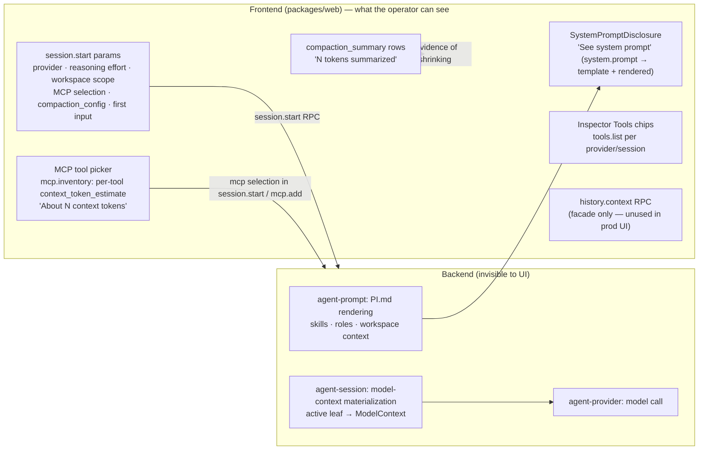
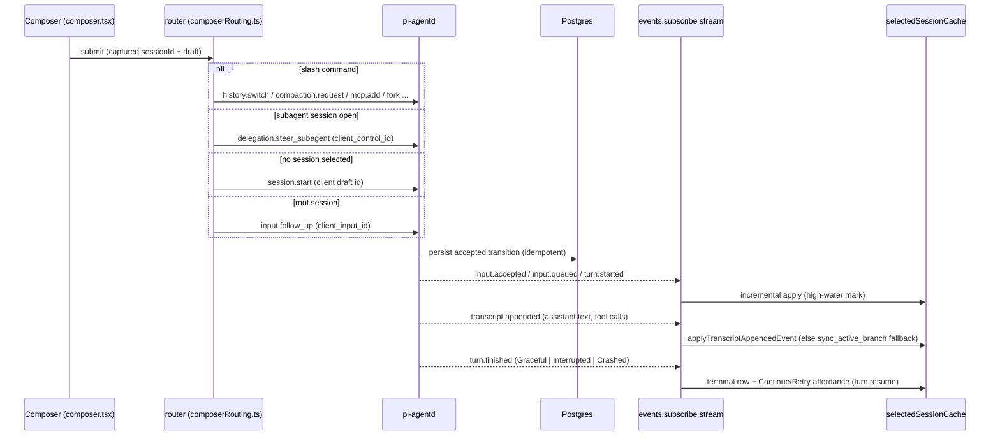
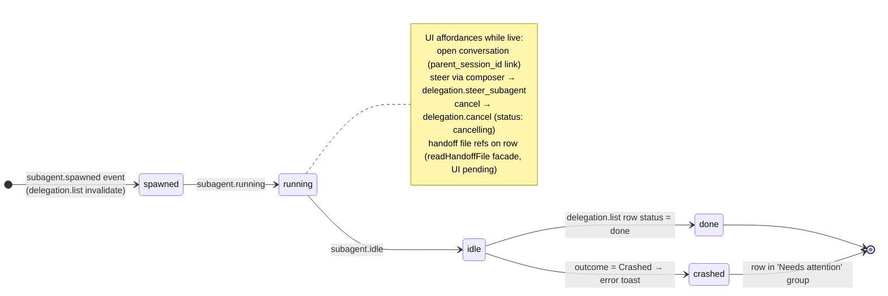
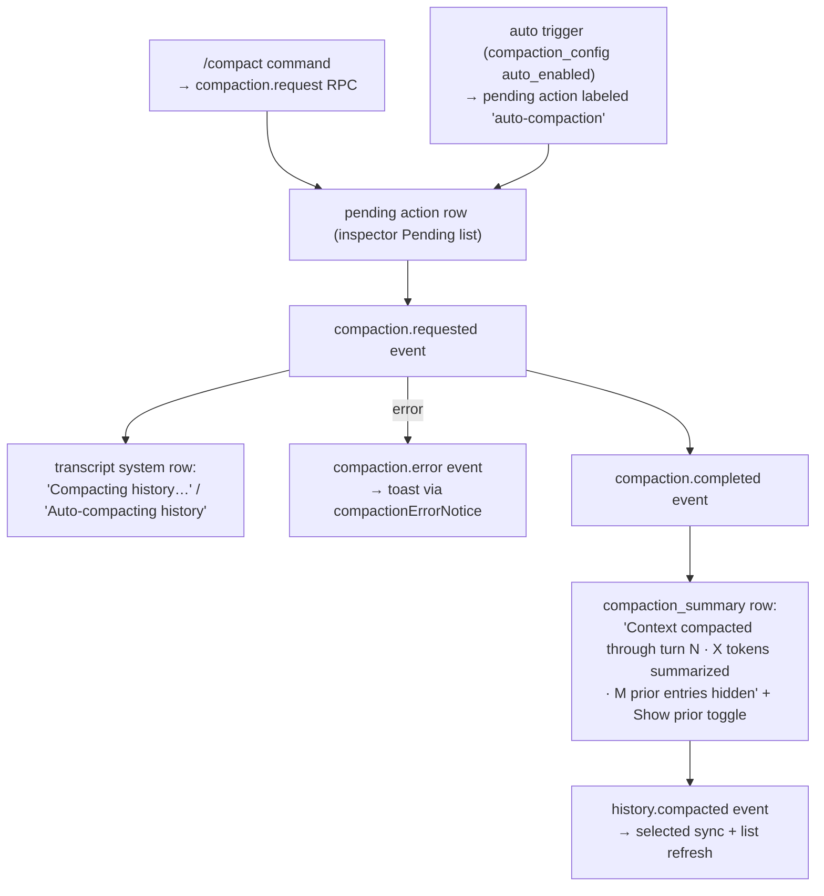

# pi-relay Frontend Contract — Migration Research Report

> Scope: the pi-relay frontend (`packages/web` React app + `packages/electron` shell), read-only research.
> Goal: define the exact backend contract a prime-agent-core-based replacement must satisfy while keeping the frontend as-is.

## Table of Contents

1. [Architecture Overview](#1-architecture-overview)
2. [Transport & RPC Semantics](#2-transport--rpc-semantics)
3. [Complete WebSocket RPC Surface](#3-complete-websocket-rpc-surface)
4. [Event Surface & Real-Time Behavior](#4-event-surface--real-time-behavior)
5. [Feature Inventory](#5-feature-inventory)
6. [Electron Shell](#6-electron-shell)
7. [Context Engineering & Data Flow (Frontend Angle)](#7-context-engineering--data-flow-frontend-angle)
8. [t3-code-research.md Summary](#8-t3-code-researchmd-summary)
9. [Backend Contract by Domain](#9-backend-contract-by-domain)

---

## 1. Architecture Overview

### 1.1 Components

| Component | Path | Role |
| --- | --- | --- |
| Web app | `packages/web` | React 19 + Vite 7 SPA. The entire frontend logic. Deployed as a **static site** (Cloudflare Pages, `https://pi-relay.pages.dev`); build = `tsc -b && vite build && node scripts/check-built-csp.mjs` (`packages/web/package.json`). |
| Electron shell | `packages/electron` | Thin remote-URL desktop wrapper (macOS only); see §6. No code sharing with the web app beyond the deployed URL. |
| Backend daemon | `rust/crates/agent-daemon` (`pi-agentd`) | WebSocket RPC server the web app connects to directly. Postgres is the durable store. |
| Runtime hosts | `rust/crates/agent-runtime` (`pi-runtime`) | Per-host workers owning workspaces, local tools, MCP; the daemon proxies some RPCs to them (§2.4, §9). |

The web app has **no build-time or deploy-time knowledge of any backend**: the daemon URL is chosen at runtime, per browser tab, through user-managed "control profiles" (§5.1). The static host never proxies the WebSocket (`rust/docs/architecture.md` — "Deployment topology").

```text
Cloudflare Pages (static SPA) ──loads──▶ Browser tab
                                           │  user picks a control profile (name + WS URL)
                                           ▼
                              WSS (or loopback WS) direct to pi-agentd
                                           │
                          Postgres (sessions, transcript, queue, events)
                                           │
                          pi-runtime hosts (workspaces, tools, MCP) via framed-JSON conduit
```

### 1.2 Web app structure (`packages/web/src`)

- **Entry/routing**: `main.tsx` mounts profile-gated app; `serverProfiles.ts` (localStorage profile list), `serverApp.tsx` (one connected app per profile), `appRouting.ts` + `workspaceRoute.ts` (URL grammar, §5.2).
- **RPC layer**: `rpc.ts` (`RpcClient`, request/response over one WebSocket with typed errors), `agentApi.ts` (typed facade over every RPC method), `types.ts` (all wire DTOs).
- **State**: TanStack Query (`@tanstack/react-query`) for server state; `queryKeys.ts` enumerates the whole cache shape; `selectedSessionCache.ts` + `selectedSessionCache/turns.ts` maintain the selected session's snapshot/transcript/turn projection with event-sourced incremental updates; `sessionQueryCache.ts`, `sessionListRequestCoordinator.ts` coordinate list refetches.
- **UI**: `App.tsx` (5,488 lines — top-level orchestration, event subscription, all mutations), `chatPane.tsx` + `transcript.tsx` + `turnView.ts` (turn-oriented transcript), `composer.tsx` + `composerRouting.ts` + `slash.ts` (input + queue), `inspector.tsx` + `runBoard.tsx` + `delegationBoard.ts` (right rail: agents/files), `filesTab.tsx` + `filePane.tsx` + `fileView.tsx` + `fileBrowser.ts` + `gitStatus.ts` + `gitComparison.tsx` + `unifiedDiff.ts` (workspace browsing), `entityDialogs.tsx` + `newSessionSetup.tsx` + `mcpToolPicker.tsx` + `mcpAddDialog.tsx` + `mcpOAuthDialog.tsx` + `mcpSelection.ts` (configuration dialogs), `connectionRecovery.tsx` + `uiResume.ts` + `delegationListRetryController.ts` + `providerConfigurationController.ts` (resilience), `exportDialog.tsx` + `exportTranscript.ts` (export), `components/ui/*` (shadcn-style primitives), `mermaidBlock.tsx` (diagram rendering in assistant messages).
- **Docs**: `packages/web/docs/web-ui.md` (product/behavior contract) and `packages/web/docs/ui-improvement-plan.md` (113 KB forward-looking redesign plan — §5.2 notes where current routing already matches it).
- **PWA**: `public/manifest.webmanifest` (standalone, "π-relay") + `public/service-worker.js` (app-shell cache `pi-relay-shell-v1`; explicitly **excludes** `/api` and `/rpc` paths and all non-GET/WebSocket traffic — there is no offline data mode).

### 1.3 Deployment envelope (CSP)

`packages/web/public/_headers` sets:

```
Content-Security-Policy: default-src 'self'; script-src 'self'; style-src 'self' 'unsafe-inline';
  font-src 'self'; img-src 'self' data:;
  connect-src 'self' wss: ws://127.0.0.1:* ws://localhost:* ws://[::1]:*;
  object-src 'none'; base-uri 'none'; frame-ancestors 'none'; form-action 'self'
```

**Contract consequence**: the backend must be reachable either over `wss:` from any host (TLS-terminated remote daemon, e.g. Tailscale Serve in front of loopback `pi-agentd`) or over plain `ws:` on loopback only. No plain `ws://` remote hosts are allowed by the shipped CSP. `scripts/check-built-csp.mjs` fails the build if the shipped `_headers` CSP doesn't cover the built asset graph.

## 2. Transport & RPC Semantics

Source of truth: `packages/web/src/rpc.ts` (client), `rust/docs/websocket-rpc.md` (protocol doc), `rust/crates/agent-daemon/src/types.rs` (`RpcMethod::parse` — server-side method enum).

### 2.1 Connection

- One **WebSocket per connected profile per tab**; the URL comes verbatim from the profile (no path normalization beyond what the user entered). The daemon validates the browser `Origin` header before upgrade (one canonical origin) and accepts frames up to **8 MiB** (`rust/docs/websocket-rpc.md`).
- Wire format: JSON text frames. Request `{id, method, params}` → response `{id, result}` or `{id, error: {code, message, data}}`. Server→client event frames arrive as `{event: ...}` envelopes (see §4).
- The client assigns monotonically increasing numeric ids; **ids are the only correlation** — there is no batching, no JSON-RPC version field, no server→client requests other than event frames.

### 2.2 Error taxonomy (`packages/web/src/rpc.ts`)

The client distinguishes two failure classes, and the distinction drives UI behavior everywhere:

- **`RpcRequestError`** — a definite, server-returned `{code, message, data}`. The operation definitively did not happen (or definitively failed). Rendered as-is; several codes are matched by the UI (`session_not_found` → `isSessionNotFoundError`, `history_changed` → `isHistoryChangedError`, MCP add conflicts → `isMcpAddRefreshConflict`).
- **`RpcTransportError`** — the socket dropped/timeout fired **after** `ws.send` succeeded, so the request *may* have been applied. Callers reconcile by re-reading state; the canonical case is the uncertain-start flow: after `session.start` raises `RpcTransportError`, the UI polls `session.get` by client-generated draft session id for up to 45 s (`UNCERTAIN_START_RECONCILE_MS`, poll every 1.5 s — `App.tsx`) until the session appears (server idempotency via client-supplied ids makes this safe).

Per-request timeouts plus socket-wide liveness (`lastFrameAt`) feed reconnect logic; reconnect rejects all pending requests (so they surface as transport errors) and flips connection status to `closed`/`connecting`.

### 2.3 Idempotency keys

Every client-initiated mutation carries a client-generated id so transport-uncertain retries are safe:

- `session.start`: client generates the **session id** itself (draft id) — replay returns the same session.
- `input.follow_up` / steer / queue mutations: `client_input_id`, unique per session; replay returns the already-accepted input (`inputs` ledger, `rust/docs/websocket-rpc.md`).
- Other mutations (`session.rename`, `session.configure`, `history.switch`, `compaction.request`, `delegation.*`, `mcp.*`) carry `client_control_id`.

The UI generates these ids and treats `RpcRequestError` with an idempotency-replay marker as success-with-existing-state.

### 2.4 Control plane vs runtime plane

Sessions and projects carry a `runtime_id` (`packages/web/src/types.ts`). Some RPCs are answered by the control-plane daemon from Postgres; others (workspace browsing, MCP management, parts of `session.start` materialization) are proxied by the daemon to the session's runtime host over a framed-JSON conduit (`agent-runtime-protocol`). The **frontend does not distinguish** the two planes except that `runtime.list` drives runtime-online indicators and new-session placement; MCP RPCs take an explicit `runtimeId` argument. One deployment-level requirement leaks through: the daemon's `RuntimeCommand::timeout` for `MaterializeSession` is 300 s, so `WORKSPACE_OPERATION_REQUEST_TIMEOUT_MS` must exceed it or long materializations surface as errors (`rust/docs/websocket-rpc.md`).

### 2.5 Polling fallbacks

The UI is event-driven but keeps minimal polling as a safety net: session lists refetch every **2 s** (`SESSION_LIST_REFETCH_MS`), `runtime.list` every **10 s** (`App.tsx:702`), foreground reconcile throttled to 2 s after 5 s backgrounded (`FOREGROUND_*` constants), uncertain-start poll 1.5 s. All polling is TanStack Query `refetchInterval` — replacing push with pull is *not* acceptable to the UI's freshness expectations, but transient event-stream gaps are tolerated because of these polls.

## 3. Complete WebSocket RPC Surface

The daemon exposes **54 RPC methods** (`rust/crates/agent-daemon/src/types.rs`, `RpcMethod::parse`). The web UI calls **51** of them through the typed facade in `packages/web/src/agentApi.ts` (interface `AgentApi`, ~60 methods incl. connection lifecycle). The three server methods the UI never calls: `delegation.status`, `harness.model.complete`, `harness.model.fail` (the latter two are agent-loop/tool-facing, not UI-facing).

Legend: *Plane* = answered from control-plane Postgres state (**CP**) or proxied to the session's runtime host (**RT**), per `rust/docs/websocket-rpc.md`.

### 3.1 Projects & runtimes

| Method | Facade signature (agentApi.ts) | Plane | UI usage |
| --- | --- | --- | --- |
| `project.list` | `listProjects(): Promise<Project[]>` | CP | Sidebar project list; refetched on reconnect and on project mutations. |
| `project.create` | `createProject(params: CreateProjectParams): Promise<Project>` | CP | New-project dialog (`entityDialogs.tsx`). Params include name, workspace scope, runtime placement. |
| `project.update` | `updateProject(params): Promise<Project>` | CP | Edit-project dialog. |
| `project.delete` | `deleteProject(projectId): Promise<DeleteProjectResult>` | CP | Delete-project dialog (guarded). |
| `runtime.list` | `listRuntimes(): Promise<Runtime[]>` | CP | Polled every **10 s** (`App.tsx:702`); drives runtime online indicators and new-session workspace/runtime placement (`Runtime` type in `types.ts`). |

### 3.2 Sessions

| Method | Facade signature | Plane | UI usage |
| --- | --- | --- | --- |
| `session.start` | `startSession(params: StartSessionParams): Promise<StartSessionResult>` | CP+RT | Composer submit on empty selection. Client **generates the session id** (idempotent draft id); params include `provider` (kind/model/reasoning_effort), workspace scope, MCP selection, initial input, `compaction_config`. Uncertain-start reconcile polls `session.get` ≤45 s (`App.tsx`). |
| `session.list` | `listSessions(limit?, projectId?): Promise<SessionSummary[]>` | CP | Sidebar session lists; 2 s refetch interval; coordinated by `sessionListRequestCoordinator.ts`. |
| `session.get` | `getSession(sessionId, options?: GetSessionOptions): Promise<SessionSnapshot>` | CP | Loads the selected session snapshot (pending actions, queue, workspaces, activity, `active_leaf_id`, `server_time_ms`). Options select `entries_scope` (`active_branch` used for the selected session: `SELECTED_SESSION_DISPLAY_SCOPE` in `App.tsx`). |
| `session.sync_active_branch` | `syncActiveBranch(sessionId, baseLeafId): Promise<ActiveBranchSyncResponse>` | CP | Cheap incremental catch-up for the selected session when events indicate changes (`sessionEvents.ts` refresh plan). |
| `session.rename` | `renameSession(sessionId, title)` | CP | Rename dialog. |
| `session.configure` | `configureSession(params: ConfigureSessionParams)` | CP | Model/reasoning-effort changes from the chat header; MCP add flow. |
| `session.delete` | `deleteSession(sessionId)` | CP | Delete dialog; idle-only per protocol doc. |

### 3.3 Inputs & queue

| Method | Facade signature | Plane | UI usage |
| --- | --- | --- | --- |
| `input.follow_up` | `queueFollowUp(params: QueueFollowUpParams): Promise<FollowUpResult>` | CP | Every non-slash composer submission to an existing root session; `client_input_id` idempotency. Works for idle (accepted) and busy (queued) sessions; `priority` steer vs follow_up. |
| `input.interrupt` | `interrupt(sessionId)` | CP | Interrupt button while running. |
| `input.promote_queued` | `promoteQueuedInput(sessionId, inputId)` | CP | Queue row "promote to steer" action (`composer.tsx` `QueuedInputPane`). |
| `input.update_queued` | `updateQueuedInput(sessionId, inputId, content, expectedQueueRevision?)` | CP | Edit a queued message; optimistic-concurrency via `expectedQueueRevision`. |
| `input.cancel_queued` | `cancelQueuedInput(sessionId, inputId, expectedQueueRevision?)` | CP | Remove a queued message. |
| `input.reorder_queued_follow_ups` | `reorderQueuedFollowUps(sessionId, inputIds, expectedQueueRevision?)` | CP | Drag-to-reorder follow-ups (`reorderQueuedInputsBefore`); steers stay pinned on top server-side. |

### 3.4 Transcript & history

| Method | Facade signature | Plane | UI usage |
| --- | --- | --- | --- |
| `transcript.index` | `getTranscriptIndex(sessionId, options?)` → `TranscriptTreeIndex` | CP | Loads the transcript tree skeleton (ids/parents/types) for branch awareness. |
| `transcript.entries` | `getTranscriptEntries(sessionId, entryIds[])` → bodies | CP | Fetches entry bodies for ids from the index. |
| `transcript.turns` | `getTranscriptTurns(sessionId, options?)` → `TranscriptTurnsResult` | CP | Turn-card projection; pages older turns (`TRANSCRIPT_TURN_PAGE_SIZE = 50`, `loadOlderTranscriptTurns`). |
| `transcript.turn_detail` | `getTranscriptTurnDetail(sessionId, request)` | CP | Lazy full entry bodies when a collapsed turn card is expanded (`expandTurn`/`collapseTurn`). |
| `history.targets` | `getHistoryTargets(sessionId, { beforeSequence? })` paged | CP | Switch/fork dialog target list (`App.tsx:3529`, pagination at `:3735`). |
| `history.tree` | `getHistoryTree(sessionId)` | CP | Branch tree for the history dialog. |
| `history.context` | `getHistoryContext(sessionId, leafId?)` → `TranscriptItem[]` | CP | Preview of the model-context materialization for a candidate leaf (history dialog). |
| `history.switch` | `switchHistory(params)` | CP | Switch active branch / edit-and-resubmit from a historical message; idle-only. |
| `history.fork` | `forkHistory(params)` | CP | `/fork` slash command — duplicate session at current state. |
| `turn.resume` | `resumeTurn(params)` | CP | "Continue"/"Retry" buttons on interrupted/crashed terminal turns (`transcript.tsx` turn_finished node); idle-only. |

### 3.5 Events

| Method | Facade signature | UI usage |
| --- | --- | --- |
| `events.subscribe` | `subscribeEvents(sessionId, afterEventId \| null): Promise<EventFrame[]>` | Per-session subscription; replay from `last_event_id` high-water mark after reconnect; initial subscription attaches at current head (`null`). Returns buffered replay frames. |
| `events.unsubscribe` | `unsubscribeEvents(sessionId)` | On deselect/delete. |

Event frames themselves arrive unsolicited after subscription — see §4.

### 3.6 Delegation (subagents)

| Method | Facade signature | UI usage |
| --- | --- | --- |
| `delegation.list` | `listDelegations(parentSessionId, limit?)` → `DelegationListResult` (has `has_more`) | Run board ("Agents" tab); default page 10, expanded 100 (`runBoard.tsx`); retry controller `delegationListRetryController.ts`. |
| `delegation.start_full` | `startFullDelegation(params)` | **Exposed in the facade but never called by production UI** (tests only) — delegation creation is model-driven via daemon tools. |
| `delegation.start_readonly_fanout` | `startReadonlyDelegationFanout(params)` | Same — facade-only. |
| `delegation.cancel` | `cancelDelegation(parentSessionId, delegationId)` | Cancel button on run-board rows. |
| `delegation.steer_subagent` | `steerSubagent({parentSessionId, subagentSessionId, message, clientControlId})` | Composer submission while viewing a subagent session (`composerRouting.ts` routes on `snapshot.parent_session_id`). |
| `delegation.read_handoff_file` | `readHandoffFile(params)` | Run board handoff viewer (per-subagent `task_prompt.md` / `final_message.md` / `transcript.md` artifacts under `.pi-handoff/`). |

### 3.7 MCP

| Method | Facade signature | Plane | UI usage |
| --- | --- | --- | --- |
| `mcp.inventory` | `getMcpInventory(provider, runtimeId, sessionId?)` → `McpInventory` | RT | Tool picker in new-session setup and `/mcp` add dialog; per-provider cache keys (`queryKeys.mcpInventory`); includes per-tool `context_token_estimate`, per-server `revision`/`health`, and `selected_servers` (session-locked tools). |
| `mcp.add` | `addMcpTools(params: AddMcpToolsParams)` | RT | `/mcp` on an idle session; conflict error code handled (`isMcpAddRefreshConflict` → refetch inventory). |
| `mcp.status` | `getMcpStatus(runtimeId)` → `McpStatus` | RT | Auth status per server (auth_kind, auth_state) for the picker and OAuth dialog. |
| `mcp.login` | `loginMcp(server, runtimeId)` → `McpLoginResult` | RT | Starts OAuth; returns authorization URL opened in a new window (Electron pushes it to the OS browser). |
| `mcp.complete` | `completeMcpLogin(server, loginId, callbackUrl, runtimeId)` | RT | OAuth callback paste/redirect completion (`mcpOAuthDialog.tsx`). |
| `mcp.cancel` | `cancelMcpLogin(server, loginId, runtimeId)` | RT | Abort an in-flight login. |
| `mcp.logout` | `logoutMcp(server, runtimeId)` | RT | Remove authorization. |

All MCP methods are scoped by `runtimeId` — servers live on the runtime host, and the daemon proxies (`rust/docs/websocket-rpc.md`).

### 3.8 Introspection

| Method | Facade signature | UI usage |
| --- | --- | --- |
| `system.prompt` | `getSystemPrompt(sessionId)` → `SystemPromptResponse { template, rendered }` | "See system prompt" disclosure at the top of the transcript (`systemPromptDisclosure.tsx`, rendered via `AssistantMarkdown`); cached under `queryKeys.systemPrompt(sessionId)`, invalidated on reconnect and after MCP tool additions (via `mcpPromptGeneration` key bump). |
| `tools.list` | `listTools(provider, sessionId?)` → `ToolListing[]` | Inspector "Tools" section (`inspector.tsx`) — name + description chips per provider/session. |

### 3.9 Compaction

| Method | Facade signature | UI usage |
| --- | --- | --- |
| `compaction.request` | `requestCompaction(sessionId)` → `{ action_row_id \| null }` | `/compact` slash command; idle/running sessions enqueue a pending compaction action. |

### 3.10 Workspace

| Method | Facade signature | Plane | UI usage |
| --- | --- | --- | --- |
| `workspace.list_dir` | `listWorkspaceDir({sessionId, path, afterName?})` → `WorkspaceDirListing` (paged via `next_after_name`) | RT | Files tab tree (`filesTab.tsx` + `fileBrowser.ts` paging/merge). |
| `workspace.read_file` | `readWorkspaceFile({sessionId, path, ...})` → `WorkspaceFilePrefix` (bytes prefix + `totalSize` + `mtimeMs`) | RT | File pane contents view; `workspaceFileCache.ts` pins/caches (8 GiB budget constant `FILE_CACHE_BUDGET_BYTES` — effectively unbounded client-side prefix cache). |
| `workspace.watch` | `watchWorkspace({sessionId, directories[], files[]})` | RT | Interest registration: visible dirs + selected file, debounced 100 ms, cleared on disconnect/unmount (`App.tsx:4601-4632`). Drives `workspace.fs_changed` events. |
| `workspace.git_status` | `gitStatus({sessionId, against})` → per-root statuses + optional branch `comparison` (base/tip refs, PR link, merge-base) | RT | Files tab git toolbar ("Working tree" / "Branch changes"), deleted-files list, status letters on tree rows (`gitStatus.ts`). |
| `workspace.git_diff` | `gitDiff({sessionId, path, against})` → unified diff + `binary`/`truncated`/`status`/`comparison` | RT | File pane "Working tree diff" / "Branch diff" views (`filePane.tsx`, `unifiedDiff.ts`). |

## 4. Event Surface & Real-Time Behavior

### 4.1 Event frame shape and subscription lifecycle

- Events are server→client frames `{event, session_id, event_id, data, ...}` (`EventFrame` in `packages/web/src/types.ts`). `event_id` is a per-session monotonic sequence used as the client's **high-water mark**.
- Subscription is per session: `events.subscribe(session_id, after_event_id | null)` returns buffered replay frames, then live frames flow unsolicited. `after_event_id = null` attaches at the current head (state then loads from snapshots); reconnect replays from the last seen `event_id` (`App.tsx` subscription effect ~2830–3020, with per-session replay buffers and tombstones for deleted sessions).
- `events.unsubscribe(session_id)` on deselect/delete.
- There is **no server-side event filter**: every session the UI subscribes to streams all its events; the sidebar subscribes only to the *selected* session, relying on `session.list` polling (2 s) for other rows. Delegation changes have no dedicated event — subagent lifecycle events and the typed daemon-completion observation trigger `delegation.list` invalidation, with the 2 s poll as backstop (`App.tsx:2770-2778` comment).

### 4.2 The 34-event catalog (`packages/web/src/sessionEvents.ts`)

Grouped by the client's refresh plan (`refreshPlanForEvent`): **list-refresh** events update sidebar rows, **selected-refresh** events trigger `session.sync_active_branch` catch-up for the open session, and four **side-channel** events are applied incrementally without a refetch. **Unknown future events default to `syncSelected: true`** — the client fails safe toward refetching.

| Event | List refresh | Selected sync | Notes |
| --- | :-: | :-: | --- |
| `session.created` | ✓ | | New session appears in lists. |
| `session.configured` | ✓ | ✓ | Model/MCP/config changed. |
| `session.idle` | ✓ | ✓ | Activity → idle; drives working-indicator stop + files refresh (running→idle transition resets workspace queries, `filesTab.tsx`). |
| `session.recovered` | ✓ | ✓ | Daemon recovered a session after restart. |
| `session.work_cancelled` | ✓ | ✓ | Interrupt completed. |
| `mcp.tools_added` | ✓ | ✓ | Also invalidates `["tools"]` + that session's `mcp-inventory` and bumps the system-prompt disclosure key (`App.tsx:2781-2792`). |
| `subagent.spawned` | ✓ | ✓ | Run board + `delegation.list` invalidation. |
| `subagent.running` | ✓ | ✓ | " |
| `subagent.idle` | ✓ | ✓ | If `data.outcome === "Crashed"` → error toast (`subagentFailureNotice`). |
| `input.accepted` | ✓ | | Idle input accepted (turn starting). |
| `input.queued` | ✓ | | Queue projection applied incrementally to the selected cache (`queueProjectionFromEvent`). |
| `input.consumed` | ✓ | | Queued input became live. |
| `input.promoted` / `input.updated` / `input.cancelled` / `input.reordered` | ✓ | | Queue projections applied incrementally. |
| `input.ignored` | ✓ | | Input rejected by the daemon. |
| `action.requested` | ✓ | | New pending action (compaction etc.). |
| `model.requested` / `model.completed` | ✓ | | Activity timing. |
| `model.error` | ✓ | ✓ | Error toast via `modelErrorNotice(event.data)` for the selected session. |
| `tool.requested` / `tool.started` / `tool.completed` | ✓ | | Live tool-group rendering reads these via pending actions. |
| `tool.error` | ✓ | ✓ | |
| `compaction.requested` | ✓ | ✓ | "Compacting history…" system row (`transcript.tsx` `compaction_in_progress`; "Auto-compacting" when `trigger === "auto"` — also rendered as "auto-compaction" in the inspector pending list, `inspector.tsx`). |
| `compaction.completed` | ✓ | ✓ | Compaction summary row appears (`compaction_summary`: "Context compacted through turn N · X tokens summarized · M prior entries hidden" with Show/Hide prior toggle). |
| `compaction.error` | ✓ | ✓ | Error toast via `compactionErrorNotice(event.data)`. |
| `turn.finished` | ✓ | | `data.outcome === "Crashed"` → "turn crashed" toast; terminal outcomes render Continue/Retry (`turn.resume`) affordances. |
| `transcript.appended` | | *incremental* | `applyTranscriptAppendedEvent` splices the new entry into the selected cache (tree + bodies + turn cards); returns `refresh` when the entry can't be applied locally → falls back to active-branch sync. |
| `turn.started` | | *incremental* | Side-channel: advances high-water mark only if the referenced entry is already loaded (`isTranscriptSideChannelEvent`). |
| `assistant.message` | | *incremental* | Same side-channel treatment. |
| `workspace.fs_changed` | | *special* | **Ephemeral**: never advances the high-water mark (`App.tsx:2678+`); invalidates `["workspace-dir", sessionId, path]` queries, git status/diff, and bumps `filesTreeEpoch`. |

### 4.3 Notifications

Toasts use `sonner` (`toast.error`, `App.tsx:670`). Sources: `model.error` / `compaction.error` / crashed `subagent.idle` / crashed `turn.finished` events for the selected session, plus local mutation failures (`shouldReportActionError`). There is **no general notification center and no OS-level notification** — the timeline is transcript rows + toasts + list-row activity icons.

### 4.4 Reconnect & foreground reconciliation

- Connection status machine in `rpc.ts` drives a `ConnectionRecoveryBanner` ("Disconnected" / "Retry connection", `connectionRecovery.tsx`) and disables remote mutations via blocked-reasons ("Waiting for connection" threaded through buttons — `remoteActionBlockedReason`, `firstDisabledReason`).
- On reconnect ("open"): invalidates `queryKeys.projects`, `queryKeys.systemPromptRoot`, `["delegations"]`, and all session lists; clears subscription bookkeeping; resubscribes with replay from per-session high-water marks (`App.tsx` status handler).
- `visibilitychange`/`focus`/`pageshow` listeners trigger a throttled (2 s) foreground reconcile after ≥5 s hidden (`App.tsx` ~2625, `FOREGROUND_RECONNECT_AFTER_MS`). This is the same path the Electron README describes as "soft-reconcile on foreground".
- Composer drafts survive reconnects (`composerDrafts.ts`); `/export` and `/help` work while disconnected (`composerTextNeedsConnection`), everything else is blocked with the connection reason.

## 5. Feature Inventory

Everything the frontend can do, grouped by feature area, with the RPCs/events each depends on. (Product-level narrative: `packages/web/docs/web-ui.md`.)

### 5.1 Control profiles & connection management

- **Named control profiles** (`serverProfiles.ts`): `{id, name, url}` list in localStorage (`piRelayServerProfiles:v1`); active profile per **tab** (`piRelayActiveServerProfile:v1`, tab storage); per-profile UI state under `piRelayServerState:v1:<id>`. A default "Local" profile (`id: "local"`) is seeded from a default URL when none exist. Profile URLs are immutable — editing means add/delete.
- **Per-tab isolation**: each tab mounts exactly one profile-keyed connected app (`serverApp.tsx`); multiple tabs can point at different daemons simultaneously.
- Connection banner + retry (`connectionRecovery.tsx`), blocked-reason propagation to every mutating control.

### 5.2 Routing & deep links

URL grammar (`workspaceRoute.ts`, `appRouting.ts`), all under `/server/<profileId>`:

- `/server/<profileId>/w/project/<projectId>/run/<rootSessionId>/conversation/<sessionId>` — project-scoped conversation; `/w/host/run/<rootId>/conversation/<sessionId>` for host (unscoped) sessions.
- **Execution routes** (parsed, UI placeholder "Execution details are intentionally deferred."): `/execution/<overview|activity|handoffs>?conversation=agent:<id>&focus=delegation:<id>|agent:<id>&handoff=<ref>` — types `RouteConversation`, `ExecutionFocus`, `HandoffReference`.
- Malformed URLs become owned "unavailable" states rendered in-app (never throw); project/session mismatches produce explicit route notices (`projectMismatchUnavailable`, `routeRootUnavailable`).
- UI resume state (`uiResume.ts`, `piRelayUiResume:v1`): last session per project, selected subagent per root session, center mode (chat/files) per root session, last file per session; `forgetDeletedSessions` garbage-collects.
- Keyboard: `[` / `]` cycle root sessions within the current filter (`App.tsx:4570-4595`).

### 5.3 Projects & sidebar

- Project list + session lists per project (`project.list`, `session.list`), host (unscoped) bucket, runtime online dots (`runtime.list` 10 s poll).
- Project CRUD dialogs (`entityDialogs.tsx` `ProjectDialog`), session rename/delete dialogs.
- Session rows show activity icon (idle/queued/running + delegation-aware status via `sessionStatusWithDelegations` in `sessionList.ts`), archived styling, title fallback.

### 5.4 Sessions & composer

- **New session**: empty selection → `NewSessionSetup` (workspace scope picker per project workspaces, MCP tool picker, "Host context only" when neither applies). Composer submission calls `session.start` with the full configuration (provider from the header model picker, workspace scope, MCP selection, `newSessionCompactionConfig()` = `{auto_enabled: true, max_consecutive_failures: 3}`).
- **Model picker** (`sessionDefaults.ts`): static `MODEL_OPTIONS` list — `openai:gpt-5.6-sol/terra/luna`, `claude:claude-opus-5`, `claude:claude-opus-4-8`, `claude:claude-fable-5` (marked "Explicit opt-in: not ZDR") — each with default reasoning effort; per-provider effort lists (OpenAI adds `max` for gpt-5.6; Claude lacks `none`/`minimal`). Mid-session model/effort changes go through `session.configure` (`providerConfigurationController.ts`).
- **Slash commands** (`slash.ts`): `/help`, `/fork`, `/switch`, `/mcp`, `/compact`, `/export` — parsed client-side; autocomplete popup filters on `/…` prefix. Unknown commands error locally.
- **Queue UI** (`composer.tsx` `QueuedInputPane`): queued follow-ups listed above the composer with promote-to-steer, inline edit, cancel, and drag-reorder; backed by the `input.*_queued*` RPC family with `expectedQueueRevision` optimistic concurrency.
- **Steering a subagent**: when the open conversation is a subagent session (`snapshot.parent_session_id` set), composer submissions route to `delegation.steer_subagent` instead of `input.follow_up` (`composerRouting.ts`). A parent-link button in the chat header jumps to the parent conversation (`statusPanels.tsx` `LogHeader`).
- **Composer routing invariants**: submissions capture the target session immutably at key/click time; if the captured snapshot is unavailable (selection changed) the draft is restored and an error reported (`IntermediateUiStateError`).
- Drafts per session (`composerDrafts.ts`).

### 5.5 Transcript

- **Turn-oriented**: `transcript.turns` pages turn cards (50/page, "load older"); completed turns render collapsed (user messages + final assistant text); expanding a card lazy-fetches `transcript.turn_detail` (`expandTurn`). `selectedSessionCache/turns.ts` maintains cards incrementally from events.
- **Live turn**: streaming assistant text via `transcript.appended` incremental application; tool calls grouped into `ToolRunGroup`s (collapsed/recent-3/all modes, status pills, pretty names, input summaries, edit-tool diffs via `editToolPreview` — `transcript.tsx:1555+`).
- **System rows**: interrupted/crashed turn endings with Continue/Retry (`turn.resume`); daemon tool observations (`daemon_tool_observation` → "Daemon observed …· delegation <id> · status <s>"); compaction in-progress and summary rows (§4.2); working indicator with elapsed clock anchored to `server_time_ms` (`runningTurnClockAnchor`).
- **Markdown**: `react-markdown` + GFM + raw HTML + highlight.js; mermaid fenced blocks rendered via `mermaid` (`mermaidBlock.tsx`); per-assistant-message copy button.
- **Scroll management**: sticky-bottom, turn-jump controls, per-session scroll memory, "load older" anchoring (`transcript.tsx` first ~250 lines).
- **System prompt disclosure**: "See system prompt" at the top of the transcript → `system.prompt` RPC (§7.1).

### 5.6 History (branch/switch/fork)

- `/switch` opens a dialog fed by paged `history.targets` + `history.tree` + `history.context` preview; switching calls `history.switch` (idle-only). Editing a historical message = switch + resubmit.
- `/fork` duplicates the session at its current state (`history.fork`).
- Branch awareness in transcript: `entries_scope` (`active_branch` for the selected session display; `full_tree` available), `active_leaf_id`, and the tree index drive which entries render; compaction creates a typed transcript root, not a session boundary.

### 5.7 Delegation / subagents (run board)

- Right-rail "Agents" tab (`inspector.tsx` → `runBoard.tsx`): delegation list for the selected root session (`delegation.list`, default 10 rows, "show all" → 100 + `has_more` paging), grouped client-side into **Needs attention / Active / Recent** preserving server order (`delegationBoard.ts` `orderDelegations`).
- Statuses: `running`, `cancelling` (shown as running), `done`, `done_with_failures`, `failed`, `cancelled`, plus per-subagent statuses with a defensive `unknown` fallback for future shapes (`agentStatusIconKey`).
- Row actions: cancel (`delegation.cancel`), open subagent conversation, read handoff artifacts (`delegation.read_handoff_file` — `task_prompt.md`, `final_message.md`, `transcript.md` per subagent under `.pi-handoff/delegation_…`).
- `delegation.start_full` / `delegation.start_readonly_fanout` exist in the facade but are **not wired to any production UI** — the model starts delegations through daemon tools; the UI is an observer/supervisor.

### 5.8 MCP

- New-session tool picker (`mcpToolPicker.tsx`): tri-state server/tool checkboxes, per-tool **context-token estimates** (`context_token_estimate`, aggregated via `mcpSelectionTotals` → "About N context tokens"), server health badges, OAuth login/logout buttons, locked (session-pinned) tools.
- `/mcp` on an idle session: `mcpAddDialog.tsx` — inventory scoped to the session, locked = already-selected servers, submit via `mcp.add`; conflict → refetch + retry prompt.
- Selection reconciliation on inventory revision changes (`reconcileMcpSelection`), provider-change reset (`mcpSelectionForProviderChange`), and send-time validation that inventory+auth are loaded and every selected OAuth server is `ready` (`mcpSelectionPayloadForProvider`).
- OAuth dialog (`mcpOAuthDialog.tsx`): `mcp.login` → open URL externally → `mcp.complete` (callback URL paste) or `mcp.cancel`; `mcp.logout` to deauthorize. All scoped by `runtime_id`.

### 5.9 Workspace files & git

- Files tab (`filesTab.tsx`): lazy tree (`@headless-tree`) over paged `workspace.list_dir`; git status toolbar (Working tree vs Branch changes) over `workspace.git_status`; deleted-files disclosure; per-row status letters (`gitStatus.ts` `statusLetter`); branch comparison pills with PR links (`gitComparison.tsx`).
- File pane (`filePane.tsx` + `fileView.tsx`): prefix read (`workspace.read_file`) with byte/total/mtime meta; three view modes — Contents, Working tree diff, Branch diff (`workspace.git_diff` → `unifiedDiff.ts` rendering, binary/truncated flags); file-replacement mode can park the chat pane (`useParkedScrollPreservation`).
- **Refresh triggers**: running→idle transition resets all workspace queries for the session; `workspace.fs_changed` events invalidate interest-scoped dirs; `workspace.watch` registers visible dirs + selected file (debounced, cleared on disconnect).
- Client-side file cache (`workspaceFileCache.ts`, pin/unpin, 8 GiB budget).

### 5.10 Inspector extras

- Pending actions list (incl. "auto-compaction" labeling), Tools section (`tools.list` chips), Slash section (static command list), workspace context rows (dir, kind, branch, remote, source path) — `inspector.tsx`.

### 5.11 Export

- `/export` (works offline): `exportDialog.tsx` + `exportTranscript.ts` build user/assistant blocks from the **active branch only**, skipping `replayed_after_compaction` user inputs; default selection = final-answer phases; downloads a Markdown file (`downloadMarkdown`).

### 5.12 Non-features (explicitly absent)

- No token/cost usage display anywhere (only "N tokens summarized" on compaction rows).
- No settings/preferences backend sync — all UI state is browser-local (localStorage keys enumerated in §5.1/§5.2).
- No OS notifications, no sounds, no mobile app (responsive compact layout only).
- No auth UI — profile URLs may embed daemon auth implicitly (e.g. Tailscale identity), but the web app has no login flow of its own.

## 6. Electron Shell

`packages/electron` is a **thin remote-URL shell** — it contains no frontend bundle, no backend, database, workspace, or session code (`packages/electron/README.md`). Total source: `src/main.mjs` (~150 lines) + `src/policy.mjs` (~45 lines) + `src/policy.test.mjs`.

### 6.1 What the shell does

- **Loads a remote web app.** Default URL `https://pi-relay.pages.dev`, overridable with `PI_RELAY_WEB_URL` (must be a credential-free `http(s)` URL — `parseAppUrl`, `src/policy.mjs`). Packaging wraps the URL only; it does **not** bundle `packages/web/dist`, so frontend deploys are picked up on next launch with no reinstall.
- **Single instance** (`app.requestSingleInstanceLock`); second instance focuses the existing window.
- **Navigation policy** (`navigationPolicy`, `src/policy.mjs`): same-origin `http(s)` navigations allowed in-window; other `http(s)` URLs (including OAuth links opened via `window.open`) are pushed to the OS browser via `shell.openExternal` and denied in-app; all non-HTTP(S) schemes and credentialed URLs are denied. Handlers: `setWindowOpenHandler`, `will-navigate`, `will-redirect`.
- **Resilience**: `did-fail-load` (except `ERR_ABORTED` -3) schedules a `loadURL` retry after 500 ms; `render-process-gone` reloads; `powerMonitor.on("resume")` invalidates the compositor so display sleep cannot leave a blank window.
- **Security prefs**: `nodeIntegration: false`, `contextIsolation: true`, `sandbox: true`. No preload script, no IPC — the shell adds **zero** capabilities to the web app.
- **macOS-only packaging** (`electron-builder --mac`, DMG + ZIP targets, appId `dev.pi-relay.desktop`, icon from `packages/web/public/icons/icon-512.png`), distributed via a rolling `electron-latest` GitHub Release built by `.github/workflows/electron-macos-artifact.yml`. Unsigned/unnotarized; no auto-updater yet (ZIP retained for a future update flow).

### 6.2 Migration implications

- The desktop app is **backend-agnostic**: it never talks to `pi-agentd` directly. Replacing the backend requires **no Electron changes** as long as the web app keeps working; the shell's only contract with the frontend is "serve the SPA at the configured origin."
- OAuth for MCP servers relies on the shell's window-open handler routing external links to the OS browser; the backend's OAuth flow must therefore keep working from a system browser (loopback redirect or manual code paste), independent of Electron.
- The "soft-reconcile on foreground" behavior mentioned in the README is implemented **inside the web app** (`visibilitychange`/`focus`/`pageshow` listeners in `packages/web/src/App.tsx`), not by the shell — the shell only invalidates the compositor on resume.

## 7. Context Engineering & Data Flow (Frontend Angle)

This chapter catalogs, from the UI's perspective, everything the frontend exposes about **what goes into model calls**, how context-relevant catalogs are disclosed progressively, how inter-agent work is surfaced, and how notifications flow. A backend migration must preserve this observability — the UI is the operator's only window into context engineering. (Backend-internal assembly — `agent-prompt` rendering, `agent-session` materialization — is out of scope here.)

### 7.1 Model-call context assembly — what the UI knows and displays

The UI never sees the assembled message array or provider request payloads. Its window into context assembly is exactly four surfaces:

1. **System prompt viewer** — `system.prompt` RPC → `SystemPromptResponse { template, rendered }` (`packages/web/src/types.ts`; facade `getSystemPrompt`, `agentApi.ts`). Surfaced as a "See system prompt" disclosure at the **top of the transcript** (`systemPromptDisclosure.tsx`, mounted as `transcriptStartContent` in `App.tsx:4987`): lazy-loaded on expand, rendered as Markdown (`AssistantMarkdown`), cached per session (`queryKeys.systemPrompt(sessionId)`), and invalidated on (a) reconnect (`queryKeys.systemPromptRoot` invalidation in the status handler, `App.tsx:2841`) and (b) `mcp.tools_added` events / successful `mcp.add` (the `mcpPromptGeneration` key bump remounts the disclosure, `App.tsx:2787`, `3156`). Empty state: "No persisted system prompt is available." **Contract:** the backend must persist/render the *exact* system prompt text per session (template + rendered form) and keep it fresh when tools/MCP change.
2. **Session-start parameters** — the composer + new-session setup assemble everything the model call will be seeded with: `provider {kind, model, reasoning_effort}` (from the static `MODEL_OPTIONS` + per-provider effort lists, `sessionDefaults.ts`), workspace scope (`WorkspaceScopeEntry[]` picker), MCP tool selection (`mcpSelectionPayload` — explicit server→tool lists, validated against inventory + OAuth readiness at send time), `compaction_config = {auto_enabled: true, max_consecutive_failures: 3}` (`newSessionCompactionConfig()`), and the initial input blocks. Mid-session changes go through `session.configure`.
3. **History context preview RPC** — `history.context(session_id, leaf_id?) → TranscriptItem[]` exists in the facade ("what would the model see from this leaf") but has **zero production call sites** (facade/tests only). The switch dialog currently uses `history.targets` + `history.switch` without a context preview. A migration must still implement it: it is part of the wire surface and tested.
4. **Context-size signals** — the *only* numeric context feedback anywhere in the UI: per-tool `context_token_estimate` in MCP inventory (§7.2) and "N tokens summarized" on compaction rows (`transcript.tsx:1270`, `formatCompactionTokens`). No token usage, no cost, no per-call context window meter.

### 7.2 Progressive disclosure surfaces

The UI's consistent pattern: **catalogs arrive as summaries with stable ids/revisions; detail is fetched lazily by id.**

| Surface | Summary channel | Detail channel | Files |
| --- | --- | --- | --- |
| Tool catalog | `tools.list(provider, sessionId?)` → `ToolListing[]` (name, kind, description) | none (names + descriptions only) | `inspector.tsx` "Tools" chips; `App.tsx:1017` |
| MCP inventory | `mcp.inventory(provider, runtimeId, sessionId?)` → servers with `revision`, `health`, `selected_servers`, tools with `raw_name`, description, **`context_token_estimate`** | same call (full inventory); picker aggregates "About N context tokens" (`mcpSelectionTotals`) | `mcpToolPicker.tsx`, `mcpSelection.ts` |
| MCP auth | `mcp.status(runtimeId)` → per-server `auth_kind`/`auth_state` | OAuth flow RPCs on demand | `mcpOAuthDialog.tsx` |
| Subagent roles | **no catalog RPC/UI** — roles appear only as labels on run-board rows (`DelegationSubagent.role`, `runBoard.tsx:72-87`) | — | role catalog lives on the runtime host (`$XDG_CONFIG_HOME/pi-relay/runtime/subagent-roles`) and is consumed by the *model* via delegation tools, never by the UI |
| Delegation detail | `delegation.list` → rows with status/progress/**file references** (`task_prompt_file`, `final_message_file`, `transcript_file`) — the daemon "intentionally does not inline raw task prompts, final-message prose, or transcript bodies" (`types.ts:181-187` doc comment) | `delegation.read_handoff_file` — **facade-defined but not yet called by production UI** (execution routes render a placeholder) | `runBoard.tsx`, `delegationBoard.ts`, `workspaceRoute.ts` `HandoffReference` |
| Transcript | `transcript.turns` → collapsed turn cards (user msgs + final assistant text, 50/page) | `transcript.turn_detail` on expand; `transcript.index` + `transcript.entries` for tree/bodies | `transcript.tsx`, `selectedSessionCache/turns.ts` |
| Compacted history | `compaction_summary` row: "Context compacted through turn N · X tokens summarized · M prior entries hidden" | "Show prior" toggle reveals hidden entries client-side | `transcript.tsx:1266-1295` |
| Tool runs | `ToolRunGroup` collapsed → recent-3 → all modes; status pills; edit-tool inline diffs | per-item expand | `transcript.tsx:1936-2130` |
| Workspace files | `workspace.list_dir` paged (`next_after_name`) | `workspace.read_file` **prefix** read (`bytes` + `totalSize` + `mtimeMs`) | `filesTab.tsx`, `filePane.tsx` |
| Skills | **none — zero skills UI exists in the web frontend** (grep: no `skill` references outside tests) | — | — |

### 7.3 Inter-agent visibility

Everything the UI knows about subagents arrives through three channels:

- **`delegation.list(parent_session_id, limit?)`** — paged (`has_more`), default 10 rows, "show all" → 100 (`runBoard.tsx` constants). Rows carry `kind` (`full` | `readonly_fanout`), `status`, `label`, `workflow`, `progress {expected, spawned, terminal, running, failed}`, `handoff_dir`, and `subagents[]` (id, status, activity, role, title, type, `steerable`, outcome, handoff file refs). Client-side grouping into Needs attention / Active / Recent (`delegationBoard.ts` `orderDelegations`, `delegationNeedsAttention`).
- **`subagent.spawned` / `subagent.running` / `subagent.idle` events** — refresh run board (via `delegation.list` invalidation, `App.tsx:2770-2778`), sidebar status, and error toasts on `outcome === "Crashed"`. There is **no dedicated `delegation.*` event**; the 2 s session-list poll is the backstop.
- **Transcript rows** — `daemon_tool_observation` items render as system rows ("Daemon observed … · delegation <id> · status <s>", `transcript.tsx:1297-1330`): these are the daemon-authored, delegation-ID-scoped **wakeup observations** that resume a parked parent (`rust/docs/architecture.md` goal 6). Subagent sessions are ordinary sessions with `parent_session_id` set; the chat header shows an "open parent conversation" link (`statusPanels.tsx`), and composer input to an open subagent session routes to `delegation.steer_subagent` (`composerRouting.ts`).

Notably absent: no `delegation.status` polling (method exists server-side, never called), no live subagent-to-subagent traffic view, no handoff browser yet.

### 7.4 Notification timeline (daemon → UI)

Single pipeline: daemon publishes per-session event frames → `events.subscribe` (replay + live) → `App.tsx` `handleSessionEvent` (~2678–2820) → three sinks:

1. **Selected-session cache** — incremental application (`applyTranscriptAppendedEvent`, `queueProjectionFromEvent`, `applyEventHighWater`, `mergeSessionActivityEvent` in `selectedSessionCache.ts`); falls back to `session.sync_active_branch` when an event can't be applied locally.
2. **React Query invalidation** — sidebar lists (`sessionListRequestCoordinator.ts`), `delegation.list`, tools/MCP inventory, workspace queries (`workspace.fs_changed` → interest-scoped invalidation, ephemeral — never advances the high-water mark).
3. **Toasts** (`sonner`) — `model.error` (`modelErrorNotice`), `compaction.error` (`compactionErrorNotice`), crashed subagent/turn outcomes, and local mutation failures.

The **durable notification record is the transcript itself**: queue events, compaction rows, daemon observations, and turn endings are all transcript/system rows; toasts are transient and there is no notification center or OS-level notification.

### 7.5 Continual-learning persistence paths (frontend angle)

**The web frontend has no continual-learning surface.** Verified by direct search: no skills UI, no memory UI, no harness UI; the server-side `harness.model.complete` / `harness.model.fail` RPCs exist (`agent-daemon/src/types.rs`) but the frontend never calls them — they serve the agent loop, not the UI. Subagent role catalogs and runtime skills live on the runtime host's XDG config root and reach the *model* through the system prompt and tools, never the UI (the UI only sees the rendered system prompt, §7.1).

All frontend persistence is **browser-local UI state**, none of it model-relevant:

| Key | Storage | Contents |
| --- | --- | --- |
| `piRelayServerProfiles:v1` | localStorage | control profile list |
| `piRelayActiveServerProfile:v1` | sessionStorage (per tab) | active profile id |
| `piRelayServerState:v1:<id>` | localStorage | per-profile UI state |
| `piRelayUiResume:v1` | localStorage | last session per project, selected subagent, center mode, last file (`uiResume.ts`) |
| `piRelayTranscriptScroll:v1` | localStorage | **legacy** — actively removed (`removeLegacyTranscriptScroll`) |

Composer drafts are in-memory. **Migration consequence:** nothing continual-learning-related to port in the frontend; but the replacement backend must keep serving `system.prompt` faithfully, because that is the only place learned context (skills, roles, instructions) becomes visible to the operator.

### 7.6 Diagrams

#### Context assembly — the UI's vantage point



#### Turn lifecycle — composer to transcript



#### Subagent lifecycle as seen by the UI



#### Compaction flow as rendered by the UI



## 8. t3-code-research.md Summary

Source: `/home/schwinns/pi-relay/.pi/t3-code-research.md` (21.5 KB). This pre-existing research evaluates **T3 Code** (Theo's open-source "agent harness control surface", MIT, v0.0.31 alpha — https://github.com/pingdotgg/t3code) as a candidate to fork for a prime-agent UI. It is *context*, not a pi-relay design doc.

Key points of the document:

1. **What T3 Code is**: a GUI frontend that controls existing AI coding-agent CLIs (Codex, Claude Code, Cursor, Grok, OpenCode) via per-driver transports (JSON-RPC app-server, Claude Agent SDK, ACP, OpenCode HTTP SDK). Bring-your-own-key; the app never proxies/meters API calls.
2. **Architecture**: pnpm monorepo, Effect everywhere. `apps/server` is the execution boundary (spawns/controls CLI child processes, event-sourced orchestration engine with SQLite persistence, checkpointing as hidden Git refs per turn, terminals, VCS, filesystem). Clients (`apps/web` React+Vite, `apps/desktop` Electron, `apps/mobile` Expo) share `packages/client-runtime` and talk to the server over **Effect RPC over WebSocket** (`/ws`), with streaming subscription methods replacing a broadcast push bus. A connection supervisor owns all retry/backoff.
3. **Extensibility point**: the `ProviderDriver`/`ProviderAdapterShape` SPI. Adding a backend = write a driver + adapter (startSession/sendTurn/interruptTurn/respondToRequest/readThread/rollbackThread/streamEvents) and register it — no orchestration/contract/client changes. The OpenCode driver is the closest analog because it can attach to an already-running server via `serverUrl`.
4. **Feasibility verdict for prime-agent**: fundamental **impedance mismatch** — T3's server wants to *spawn and own* agent CLI processes and run its own event-sourced orchestration + Git checkpointing, while prime-agent is a daemon that owns its own sessions, orchestration, subagents, skills, and messaging. Three options assessed:
   - **A — new provider driver** (recommended forking path; medium-high effort): main work is event-stream translation and resolving the duplicate-orchestration conflict; requires writing Effect code.
   - **B — frontend-only fork** (worst): would require reimplementing the entire server RPC surface in Effect.
   - **C — new purpose-built frontend** (high effort, cleanest architecture).
5. **Relevance to this migration**: the pi-relay frontend already *is* the "Option C" outcome — a purpose-built control surface with no Effect dependency, talking to a daemon over a versioned WebSocket RPC protocol. The t3 research's transferable lessons are (a) the value of a single runtime boundary expressed only at the connection layer, (b) streaming subscriptions vs. broadcast events (pi-relay instead uses a single broadcast `events.subscribe` with server-side per-session replay — see §4), and (c) per-turn checkpointing as a differentiator pi-relay handles instead via `workspace.git_diff`/`workspace.git_status` against HEAD or branch merge-base (no hidden-ref checkpoint store).

## 9. Backend Contract by Domain

The numbered contract a replacement backend (prime-agent-core-based) must satisfy for the **unmodified** frontend. Each item cites the RPCs/events involved, the semantics the UI depends on, and the Rust crate that serves it today (crate map: `rust/docs/architecture.md`; dispatch: `rust/crates/agent-daemon/src/types.rs`).

### 9.1 Connection & protocol

1. **WebSocket endpoint** reachable per profile URL; validate browser `Origin` before upgrade; 8 MiB max frame; WSS for remote, loopback WS allowed by CSP (`public/_headers`). — *Today: `agent-daemon` (`browser_websocket.rs`, `auth.rs`, `codec.rs`).*
2. **JSON request/response framing** `{id, method, params}` → `{id, result|error{code,message,data}}`, interleaved with unsolicited event frames on the same socket. — *`agent-daemon` codec.*
3. **Error semantics**: definite failures as structured error responses (UI matches codes: `session_not_found`, `history_changed`, MCP refresh conflict); never silently drop a request — transport uncertainty is reconciled client-side. — *`agent-daemon` rpc_views/types.*
4. **Idempotency**: `session.start` accepts client-generated session ids; all input/queue mutations accept `client_input_id`; control mutations accept `client_control_id`; replays return prior state, never duplicate effects. — *`agent-store` inputs ledger + `agent-daemon`.*

### 9.2 Sessions, projects, runtimes (control plane)

5. `project.list/create/update/delete` with workspace scope and `runtime_id` placement. — *`agent-store` + `agent-daemon` (runtime_hosts.rs).*
6. `runtime.list` (online status, host info) — polled at 10 s; must be cheap. — *`agent-daemon` runtime registry.*
7. `session.start` with provider config, workspace scope (incl. materialization progress reporting — `WorkspaceMaterializeProgress`), MCP selection, compaction config; ≥300 s materialization headroom (`WORKSPACE_OPERATION_REQUEST_TIMEOUT_MS` above the daemon's 300 s runtime-command timeout). — *`agent-daemon` (`session_start.rs`) + `agent-runtime` (workspaces) + `agent-session`.*
8. `session.list` (limit + project filter; 2 s polling must stay cheap), `session.get` (snapshot: activity, pending_actions, queue, workspaces, active_leaf_id, server_time_ms, parent_session_id, provider, metadata), `session.sync_active_branch(base_leaf_id)` incremental catch-up, `session.rename`, `session.configure` (provider/MCP mid-session), `session.delete` (idle-only). — *`agent-store` projections + `agent-daemon`.*
9. Derived **activity** (`idle|queued|running`) computed server-side and carried on summaries/snapshots. — *`agent-store`.*

### 9.3 Transcript & history

10. Durable **transcript forest** (branch-aware): `transcript.index` (tree skeleton), `transcript.entries` (bodies by id), `transcript.turns` (paged turn cards), `transcript.turn_detail` (lazy bodies per turn); `entries_scope` = `active_branch | full_tree`. — *`agent-session` + `agent-store`.*
11. **Turn model**: `turn.started`/`turn.finished` with outcomes (`Graceful|Interrupted|Crashed`); `turn.resume` (idle-only) for Interrupted/Crashed. — *`agent-core` FSM + `agent-daemon`.*
12. **History operations**: `history.targets` (paged), `history.tree`, `history.context` (materialization preview — unused by prod UI but part of the tested surface), `history.switch` (idle-only), `history.fork`; emit `history.switched`. — *`agent-session` (history.rs in daemon) + `agent-store`.*
13. **Monotonic revisions**: `session_revision`, `queue_revision`, `transcript_revision` on snapshots; `expectedQueueRevision` optimistic concurrency honored with conflict errors. — *`agent-store`.*

### 9.4 Inputs & queue

14. `input.follow_up` (idle-accept or busy-queue; steer priority; mid-turn steer insertion semantics per `rust/docs/architecture.md`), `input.interrupt`, and queue management `input.promote_queued / update_queued / cancel_queued / reorder_queued_follow_ups` (steers pinned on top, not reorderable). Emit `input.accepted/queued/consumed/promoted/updated/cancelled/reordered/ignored`. — *`agent-store` queue ledger + `agent-daemon` dispatch.*

### 9.5 Events

15. `events.subscribe(session_id, after_event_id|null)` with server-side **replay buffer** from `after_event_id`, live streaming thereafter, and `events.unsubscribe`. Per-session monotonic `event_id`. The 34-event catalog of §4.2 must be emitted with compatible `data` payloads (the UI reads specific fields: `data.outcome`, `data.trigger`, `project_id`, entry ids). Unknown-event fail-safe is client-side, so additive new events are safe. — *`agent-store` event log + `agent-daemon` publishing.*
16. `workspace.fs_changed` delivered on the same per-session stream, scoped to `workspace.watch` interest. — *`agent-runtime` (notify) → `agent-daemon`.*

### 9.6 Delegation

17. `delegation.list(parent_session_id, limit)` paged with `has_more`, rows shaped as `Delegation` (kind/status/label/workflow/progress/handoff_dir/subagents[] with role/title/type/steerable/outcome + handoff file refs). — *`agent-daemon` (`delegation_snapshot.rs`, `subagents.rs`).*
18. `delegation.cancel`, `delegation.steer_subagent` (routes a user message into a running subagent session). — *`agent-daemon` (`delegation_runner.rs`).*
19. `delegation.start_full` / `delegation.start_readonly_fanout` / `delegation.status` / `delegation.read_handoff_file`: implemented and tested though the UI barely uses them (starts/status uncalled; handoff reads pending the execution-routes UI). A compatible backend should keep them — the facade and tests exercise them, and the deferred execution UI will need handoff reads + `HandoffReference` routes. Handoff artifacts live under `.pi-handoff/delegation_…` with per-subagent `task_prompt.md`/`final_message.md`/`transcript.md` (+ `cancelled/*.transcript.md`). — *`agent-daemon` (`handoff.rs`, `delegation_tools.rs`) + `agent-runtime` (role catalogs).*
20. `subagent.spawned/running/idle` events with `data.outcome`; daemon-authored `daemon_tool_observation` transcript items as parent-wakeup notifications. — *`agent-daemon`.*

### 9.7 MCP

21. `mcp.inventory(provider, runtime_id, session_id?)` → per-server `revision`, `health`, `selected_servers`, per-tool `raw_name`/description/`context_token_estimate`; inventory is **provider-scoped** and revision-checked by the client. — *`agent-mcp` on the runtime host; `agent-mcp-types` DTOs; daemon proxies.*
22. `mcp.add` to an idle session (with conflict error on stale inventory); emits `mcp.tools_added` (UI then invalidates tools/inventory and refreshes the system prompt). — *`agent-mcp` + `agent-session`.*
23. OAuth lifecycle `mcp.status/login/complete/cancel/logout` scoped by `runtime_id`; login URL must be openable in a system browser (Electron shells it out). — *`agent-mcp` (rmcp-backed OAuth) + `agent-daemon` proxy (`mcp_auth.rs`).*

### 9.8 Introspection & compaction

24. `system.prompt(session_id)` → `{template, rendered}`; must reflect tool/MCP changes (UI invalidates on `mcp.tools_added`). — *`agent-prompt` (PI.md rendering) via `agent-daemon`.*
25. `tools.list(provider, session_id?)` → name/kind/description per tool. — *`agent-tools` registry (+ MCP-derived tools) via daemon/runtime.*
26. `compaction.request` → pending action (auto trigger labeled via `payload.trigger === "auto"`); lifecycle events `compaction.requested/completed/error`; `compaction_summary` transcript items with `last_turn_id` + `tokens_before`; provider-native compaction semantics (`rust/docs/architecture.md` feature audit). — *`agent-session` + `agent-provider` + `agent-daemon` (`runtime/compaction.rs`).*

### 9.9 Workspace

27. `workspace.list_dir` (paged, `next_after_name`), `workspace.read_file` (prefix bytes + totalSize + mtimeMs), `workspace.watch` (interest set; empty set clears), `workspace.git_status` (per-root statuses + branch comparison with PR metadata), `workspace.git_diff` (unified, binary/truncated flags, against = `working_tree|branch`). All proxied to the session's runtime host. — *`agent-runtime` (`workspace_browse.rs` on the daemon side) + `agent-runtime-protocol`.*

### 9.10 Non-contracts (what a replacement may drop)

- `harness.model.complete` / `harness.model.fail` — server-side, never called by the web UI (agent-loop surface).
- Any server-side rendering, auth, or session of the SPA itself — the static host is independent; the backend never serves the frontend.
- OS notifications / usage metering / cost accounting — no UI exists.
