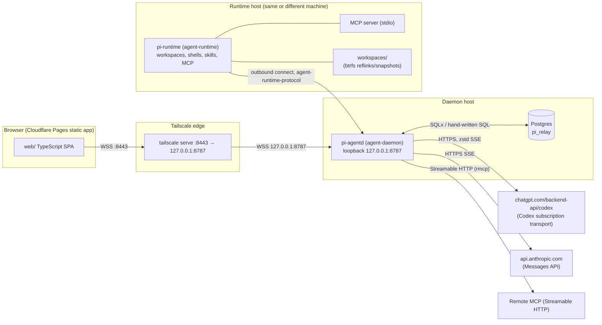
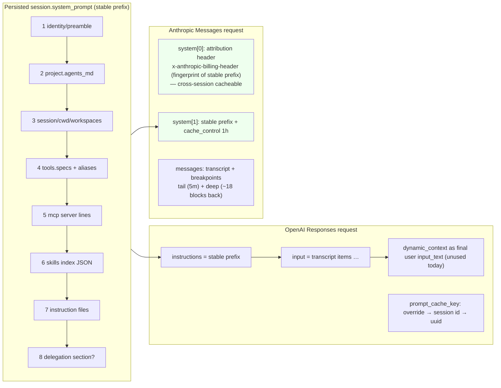
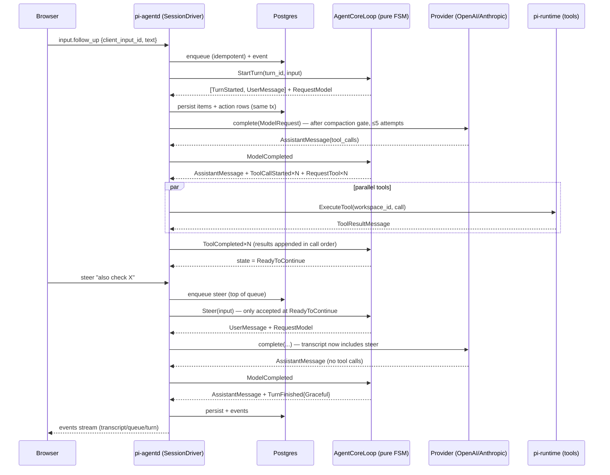
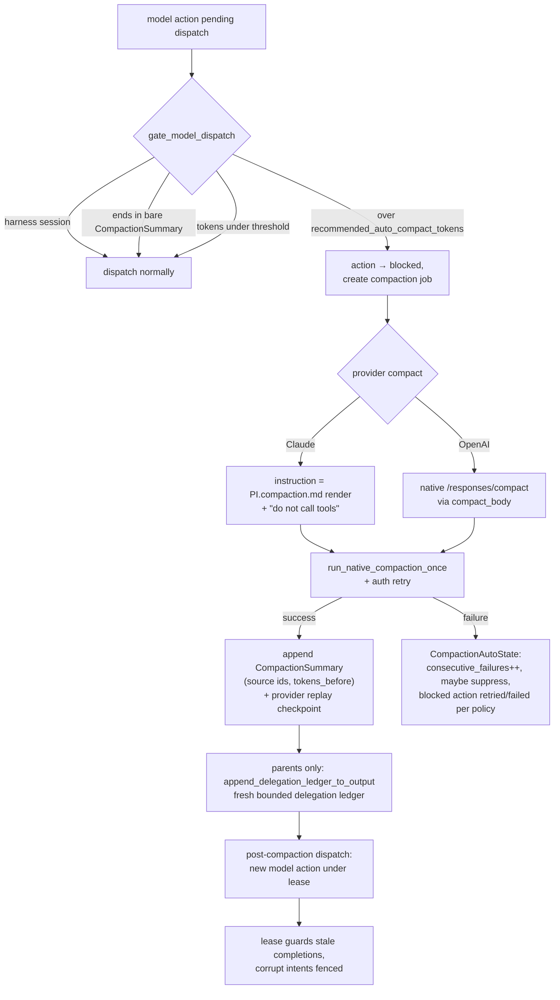

# pi-relay Rust backend — deep-dive research report

**Purpose:** authoritative inventory of the pi-relay Rust backend (`/home/schwinns/pi-relay/rust/`, 12 crates, ~40k LOC + ~20k LOC tests) to support the planned migration onto a prime-agent (RLM/IPython) core + pi/OMP modules.

**Method:** read-only static analysis. Every claim cites a concrete file path. Docs under `rust/docs/` were read in full first (they are unusually detailed and current — dated through 2026-08), then crate sources were read to verify and fill gaps. No builds, daemons, or migrations were run; the live deployment on this host was not touched.

**Scope:** all 12 crates under `rust/crates/`, `rust/docs/`, `rust/migrations/`, `WORKLOG.md`, `README.md`, the repo-root `PI.md`/`PI.compaction.md` prompt templates, and a brief look at the `web/` frontend where it intersects the RPC contract.

## Table of contents

1. [Executive summary](#1-executive-summary)
2. [System topology & deployment](#2-system-topology--deployment)
3. [Crate-by-crate inventory](#3-crate-by-crate-inventory)
4. [Persistence: Postgres schema & migrations](#4-persistence-postgres-schema--migrations)
5. [The WebSocket RPC contract](#5-the-websocket-rpc-contract)
6. [Frontend (web/) touchpoints](#6-frontend-web-touchpoints)
7. [Cross-cutting answers (the ten questions)](#7-cross-cutting-answers-the-ten-questions)
8. [Context Engineering & Data Flow](#8-context-engineering--data-flow)
   - 8.1 [The model-call matrix](#81-the-model-call-matrix)
   - 8.2 [System-prompt assembly (PI.md templating)](#82-system-prompt-assembly-pimd-templating)
   - 8.3 [Provider request shaping & prompt-cache strategy](#83-provider-request-shaping--prompt-cache-strategy)
   - 8.4 [Transcript materialization per provider](#84-transcript-materialization-per-provider)
   - 8.5 [Progressive disclosure](#85-progressive-disclosure)
   - 8.6 [Inter-agent visibility](#86-inter-agent-visibility)
   - 8.7 [Notification timeline per async event](#87-notification-timeline-per-async-event)
   - 8.8 [Token accounting & proactive compaction](#88-token-accounting--proactive-compaction)
   - 8.9 [Continual-learning state](#89-continual-learning-state)
   - 8.10 [Mermaid diagrams](#810-mermaid-diagrams)
9. [Half-finished, legacy & risk items](#9-half-finished-legacy--risk-items)
10. [Migration seams & recommendations](#10-migration-seams--recommendations)
11. [Appendix: file index](#11-appendix-file-index)

---

## 1. Executive summary

pi-relay is a **single-operator, browser-based agent console**: a static web app on Cloudflare Pages talks over WSS (through Tailscale Serve) to a Rust daemon `pi-agentd` (loopback :8787), which persists everything in Postgres and drives model turns against exactly two providers — ChatGPT/Codex subscription transport ("OpenAI") and Claude (OAuth or API key). A separate host worker `pi-runtime` owns workspaces, shells, skills, and MCP server processes, and connects *to* the daemon (not vice versa) over a framed protocol defined in `agent-runtime-protocol`.

The architecture is deliberately conservative and is best understood as four layers:

1. **Durable core (Postgres is the only source of truth).** Sessions, an append-only transcript *forest* per session (branching history, not a linear log), a priority input queue (`steer` / `follow_up`), an `actions` table of model/tool/compaction work records with attempt fencing, an `events` table for websocket replay, `delegations`, and content-addressed MCP manifests. Every meaningful state transition is a SQL transaction; the in-memory `AgentCoreLoop` FSM is rebuilt from the DB after any crash. (`rust/crates/agent-store/src/postgres/schema.rs`)
2. **Pure session semantics (`agent-vocab` + `agent-core` + `agent-session`).** A pure, I/O-free finite-state machine (`AgentCoreLoop`) consumes inputs from a mailbox and emits actions through outboxes; `AgentSession` adds the transcript forest, active root-to-leaf branch, and `ModelContext` materialization. These crates contain **no I/O, no provider code, no SQL** — they are the cleanest seam in the codebase and the most reusable piece for a migration.
3. **The daemon (`agent-daemon`, ~10k LOC + ~10k LOC of delegation-runner tests).** Owns the websocket/RPC surface, per-session `SessionDriver` locks, dispatch of model/tool/compaction actions, boot recovery, delegation orchestration (spawn, barrier, handoff artifacts, parent wakeup), prompt assembly, skills/roles, MCP session manifests, token accounting with proactive auto-compaction, and sidecar model calls (session titles).
4. **The provider + runtime edges.** `agent-provider` adapts two wire protocols with obsessive attention to byte-stability and prompt-cache reuse; `agent-runtime` + `agent-runtime-protocol` put all host-side effects (filesystem, shells, skill files, MCP processes) on a separately deployable worker.

**Delegation** is the flagship feature and the deepest coupling point: parents launch one `full` writer *or* a read-only fan-out (≤8) via model tools; children are ordinary sessions with `parent_session_id`/`delegation_id` columns, a role SKILL.md baked into a derived system prompt, and a fresh-context task message; completion is a DB-barrier (terminal-status CAS) that renders `.pi-handoff/` markdown artifacts and enqueues exactly one parent wakeup as a daemon-authored `DaemonToolObservation` transcript item rendered to providers as a plain user message. Nested delegation is forbidden.

**MCP** landed recently (docs dated 2026-07) with a control-plane-only design: selection at `session.start` / idle-only `mcp.add`, content-addressed manifests persisted transactionally, exact per-provider declarations replayed on every request, no model-facing discovery. OAuth for remote HTTP servers is mid-implementation (Stages 1–4 of a longer checklist; pinned `rmcp`).

**What is *not* here** (matters for a prime-agent migration): no memory store, no prompt notes, no self-authored skills, no cross-agent messaging/observation beyond the parent↔child delegation channel, no streaming of assistant deltas to the browser (events are coarse lifecycle markers), no multi-user auth (Tailscale is the boundary; the daemon validates exactly one canonical browser Origin). The "continual learning" surface is limited to operator-authored files (skills, roles, AGENTS.md) read at prompt-render time.

**Migration shape (preview of §10):** the natural seam is to keep Postgres schema + `agent-store` SQL (or port the schema), keep the transcript-forest/session semantics, and replace the daemon's dispatch/prompt/provider layers with prime-agent's RLM/IPython loop, replaying pi-relay's wire behaviors (provider request shapes, cache breakpoints, wakeup observation formats) where they are load-bearing for the existing deployment's data.

## 2. System topology & deployment

Sources: `rust/README.md`, `rust/docs/architecture.md`, `rust/docs/runtime.md`, `rust/crates/agent-daemon/src/main.rs`, `rust/crates/agent-daemon/src/browser_websocket.rs`, `rust/crates/agent-runtime/src/main.rs`.

Key topology facts:

- **Single daemon, single Postgres.** `pi-agentd` binds loopback only; Tailscale Serve terminates TLS and forwards to it. The daemon validates **exactly one canonical browser Origin** before the websocket upgrade (`agent-daemon/src/browser_websocket.rs`); frames are capped at 8 MiB. Tailnet ACLs/SSH are the entire auth boundary — there is no application-layer user model.
- **Runtime connects outbound.** `pi-runtime` dials the daemon and registers under a `runtime_id`; the daemon routes filesystem/shell/skill/MCP work to it over `agent-runtime-protocol` (`rust/crates/agent-runtime-protocol/src/lib.rs`, 717 lines, single file). Runtimes are independently restartable; a `runtimes` table tracks `last_seen_at` (`agent-store/src/postgres/schema.rs`).
- **Workspaces live on the runtime host.** `workspace_root` (default under the runtime's data dir) holds per-session workspace directories; git workspaces are private clones, local-folder workspaces are private copies, btrfs reflinks/snapshots provide cheap copy-on-write forks for read-only subagents (`agent-runtime/src/workspaces/`).
- **Provider egress from the daemon only.** All model traffic leaves from `pi-agentd`: OpenAI via the private ChatGPT/Codex backend (`store: false`, streaming SSE, zstd request compression), Anthropic via the standard Messages API with Claude Code client headers (`agent-provider/src/openai.rs`, `agent-provider/src/anthropic.rs`). Credentials are read at model-call time (never cached in the DB): `CODEX_ACCESS_TOKEN`/`~/.codex/auth.json` (with `tokens.account_id`) and `CLAUDE_CODE_OAUTH_TOKEN`/`~/.claude/.credentials.json`, falling back to `ANTHROPIC_API_KEY` (`agent-daemon/src/auth.rs`).
- **Browser ↔ daemon contract is one websocket RPC** (`rust/docs/websocket-rpc.md`, ~2,700 lines) plus an ordered `events` stream with replay via `events.subscribe(after_event_id)`; sessions are durable rows with no open/close/resume RPC — an idle session is implicitly resumable.

## 3. Crate-by-crate inventory

All crates live under `rust/crates/`. Line counts are `wc -l` of `src/**/*.rs` (approximate, tests included). Workspace root: `rust/Cargo.toml` (`[workspace]`, resolver 2, Rust edition 2024). Every crate sets `#![forbid(unsafe_code)]`.

### 3.1 `agent-vocab` (~1.9k lines, 7 files) — shared wire/durable vocabulary

Files: `lib.rs` (exports), `types.rs` (~620), `config.rs` (~430), `provider_replay.rs` (~190), `turn.rs`, `provider.rs`, `time.rs`.

- Newtype ids: `TurnId(u64)`, `ActionId(u64)` (per-session monotonic counters, not UUIDs; `ActionId::first()`/`take_next()`), `ToolCallId(String)`. Session/delegation/project ids are UUID strings, not newtyped.
- `TranscriptItem` (serde-tagged enum) is the single durable item vocabulary: `TurnStarted{turn_id}`, `UserMessage`, `AssistantMessage`, `ToolCallStarted{turn_id, tool_call}`, `ToolResult`, `TurnFinished{turn_id, outcome}`, `CompactionSummary`, `DaemonToolObservation`. One storage row = one item (`agent-session/src/transcript_store.rs`).
- `TurnOutcome`: `Graceful | Interrupted | Crashed`. `UserMessage` supports text + base64 image parts; `AssistantMessage` carries text + `tool_calls: Vec<ToolCall>` + `usage`.
- `CompactionSummary { source_session_id, source_leaf_id, summary, tokens_before: Option<u64>, last_turn_id, turn_started_at_ms }` — embeds provenance of the compaction.
- `DaemonToolObservation { tool_call_id, tool_name, args_json, result_json, status, summary: Option<String> }` with `render_text()` producing the sole model-visible form (a fenced JSON block with an optional `# Summary:` header). Providers render it as one plain **user-role** message; the transcript stays "daemon-honest" (no synthetic tool call/result pair is manufactured). This rendering was deliberately simplified on 2026-07-26 (WORKLOG); old provider-native compaction checkpoints still embed the legacy synthetic pair as opaque ciphertext until the session's next compaction.
- `ProviderReplayItem { provider, item }` — provider-native payload sidecar attached to transcript entries so exact OpenAI items / Anthropic blocks can be replayed verbatim (reasoning items, encrypted content).
- `ProviderKind { OpenAi, Claude }` (serde `openai`/`claude`; `as_str()` used in registry keys), `ProviderConfig { kind, model, reasoning_effort, max_tokens (Anthropic-only), prompt_cache: Option<PromptCacheConfig{key}> }`, `ReasoningEffort { Low|Medium|High|XHigh? }` (serde lower-case; see provider-adapters for exact set).

### 3.2 `agent-core` (~1.9k lines, 6 files) — pure session state machine

Files: `lib.rs`, `loop.rs` (~700), `state.rs` (~800), `mailbox.rs` (~390), `action.rs`, `event.rs`.

- `AgentCoreLoop` (`loop.rs`) holds: `Mailbox`, `AgentState`, `last_turn_id`, `next_action_id`, plus `action_outbox` / `transcript_item_outbox` VecDeques. No I/O, no async, no clock — fully deterministic and unit-tested. Constructors: `new()`, `resume_at(last_turn_id, next_action_id)` (callers own durable history; the core never buffers transcript), `resume_running_model(turn_id, action_id)` for crash-recovery with an in-flight model request.
- `AgentState` (`state.rs`): `Idle → RunningModel{turn_id, action_id} → RunningTools{turn_id, tools: Vec<RunningTool>, next_result_index} → ReadyToContinue{turn_id} → … → Idle`. `TurnFinished{Graceful}` is emitted only when an assistant message has **no** tool calls; otherwise `ToolCallStarted` items + `RequestTool` actions fan out per call (parallel tools), and results are applied in completion order but appended to the transcript in original call order via `next_result_index`.
- `AgentEvent` (`event.rs`): `StartTurn`, `Steer`, `StartDaemonObservationTurn`, `DaemonObservation`, `ModelCompleted`, `ModelFailed`, `ToolCompleted`, `ContinueModel`, `Interrupt`.
- Mid-turn semantics (`mailbox.rs` + `state.rs`): a **steer** or daemon observation is only applied at `ReadyToContinue` (after a tool batch completes, before the continuation model call) — it appends an input item and replaces the continuation with a fresh `RequestModel`. At `Idle`, steer beats follow-up when starting a new turn; a daemon observation alone starts a `StartDaemonObservationTurn`. `Interrupt` is only honored while Running*/ReadyToContinue. Notifications (model/tool completions) always preempt queued user work. The mailbox is explicitly **volatile**: "if the process dies, session recovery is driven from persisted transcript items instead."
- `AgentAction` (`action.rs`): `RequestModel{action_id, turn_id}`, `RequestTool{action_id, turn_id, tool_call}` — the only effects the core can request. Everything else (persistence, dispatch, retries) lives in the daemon.

### 3.3 `agent-session` (~3.5k lines, 8 files) — session shell over the core + transcript forest

Files: `lib.rs`, `session.rs` (~800), `transcript_store.rs` (~1.1k), `model_context.rs` (~700), `storage.rs`, `outstanding_actions.rs`, `action.rs`, `event.rs`, `input.rs`.

- `AgentSession` wraps `AgentCoreLoop` and owns "the point at which the session's history can be safely restored or resumed after consulting external model/tool work" (`session.rs` doc comment). Owns `TranscriptStore` + `OutstandingActions` + action/event outboxes; translates `SessionInput` → `AgentInput` and core outputs → `SessionAction`/`SessionEvent`.
- `TranscriptStore` (`transcript_store.rs`): append-only **forest**. `TranscriptStorageNode { id (uuid), parent_id, timestamp_ms, item, provider_replay }`; indexes by id, by parent, leaf set, insertion order, and one `active_leaf_id`. Model context is materialized by walking parents from the active leaf to a root. History switching = `set_active_leaf_to_boundary` (target must be a turn boundary; `NotTurnBoundary` otherwise). Forks duplicate the *entire* forest (WORKLOG 2026-08-05: `/fork` duplicates, `/switch` moves).
- `ModelContext` (`model_context.rs`): derived view = `Vec<TranscriptItem>` + per-item `provider_replay: Vec<Vec<ProviderReplayItem>>` along the active path. `from_transcript_items`/`from_entries`; open-turn repair: `close_open_turn`/`close_open_turn_to_boundary` synthesize crashed `ToolResult`s for open tool calls + `TurnFinished{Crashed}` so a crashed tail can be replayed to providers consistently. There is an interrupted-boundary variant for user-initiated interrupts.
- `HistoryOperationError { Busy, Store(..) }`: history edits are refused while the durable leaf is mid-turn with no active core turn to interrupt.

### 3.4 `agent-store` (~14k lines across `lib.rs` + `postgres/`) — Postgres persistence

Files: `lib.rs` (~1.3k of record/enum types + re-exports), `postgres/` (`mod.rs` ~9.5k, `schema.rs` ~1.1k, plus query modules). SQLx with hand-written SQL; one `PgPool`. 133 public async methods on `PostgresAgentStore` (enumerated in §4.3).

- Responsibilities: sessions/config CRUD with revision counters (`VersionedSessionConfig`, optimistic `SessionConfigChanged`), transcript append + forest reads (`transcript_entries_*`, `history_tree`, `switch_active_leaf`, `create_fork` with source row lock), queued inputs with `client_input_id` idempotency and subagent-control scoping, actions lifecycle (`Pending → Running → Completed/Stale/Blocked`), events (`insert_events`, `events_after` replay), compaction jobs (`create_compaction_action`, `block_model_action_for_compaction`, post-compaction dispatch leases/fences), and the entire delegation write-path (idempotent create, running-full unique conflict, read-only capacity, barrier `finish_delegation`, teardown).
- Notable error/value types (all in `lib.rs`): `FullDelegationConflict`, `ReadonlyCapacityExceeded`, `DelegationLaunchKeyConflict`, `ExpectedActiveLeafMismatch`, `SourceMutationConflict`, `PostCompactionDispatchClaimError`, `SubagentControlRecord` with `SubagentControlPhase { PendingInterrupt | InterruptApplied | Ready }`.
- `migrate` exists (schema bootstrap) but **no old-session migration is wired into daemon startup** (WORKLOG 2026-05-26) — migrations are manual one-shot SQL under `rust/migrations/` (§4.4).
- `POST_COMPACTION_DISPATCH_LEASE_DURATION` (const in `lib.rs`) backs the post-compaction dispatch lease; corrupt intents are fenced via `fail_corrupt_post_compaction_model_action`.

### 3.5 `agent-provider` (~4.6k lines, 8 files) — provider abstraction + adapters

Files: `lib.rs` (~560), `openai.rs` (~1.6k), `anthropic.rs` (~1.5k), `transcript.rs` (~250), `token_estimator.rs`, `provider_metadata.rs`, `types.rs`, `retry.rs`.

- `ModelProvider` trait (`lib.rs`): `complete(ModelRequest) -> stream/response`, `compact(..)` (provider-native compaction), `model_metadata(..)` (context window, `recommended_auto_compact_tokens`, capabilities), `count_tokens(..)` (Claude remote `count_tokens`; OpenAI local estimation). Implementations: `OpenAiProvider`, `AnthropicProvider`.
- `ModelRequest { model, prompt: PromptSections, transcript_cache_prefix_len: Option<usize>, transcript: Vec<ModelTranscriptEntry>, tool_profile, tools, max_tokens, reasoning_effort, prompt_cache_key, session-id }`. `PromptSections { stable_prefix, dynamic_context }` — the daemon today always sends `PromptSections::stable(persisted system_prompt)` (see §8).
- `ProviderError` variants include `Timeout`, `Transient`, `Provider`, `Status`, `Incomplete`, `NativeCompaction` — the daemon maps these into retry (5 attempts) or surfacing.
- `normalize_transcript_for_provider` (`transcript.rs`): per-entry `limit_tool_output` on `ToolResult` output and canonical tool-call name rewriting per replay provider. Provider-replay: OpenAI assistant/compaction entries replay raw Responses items; Anthropic replays raw content blocks; fallbacks re-render from the item vocabulary when replay payloads are missing.
- `token_estimator.rs`: bytes/4 heuristic; used for OpenAI estimates and output bounding; Claude uses the remote `count_tokens` endpoint for exact preflight.

### 3.6 `agent-tools` (~3.3k lines, `src/*.rs` + `src/tools/*.rs`) — tool surface

Files: `registry.rs` (~1.1k), `lib.rs`, `context.rs`, `error.rs`, `display.rs`, `output.rs`, `call_description.rs`, `file_mutation.rs`, `tools/` (`shell.rs`, `apply_patch.rs`, `text_editor.rs`, `web.rs`).

- `AgentTool` trait: `definition() -> ToolDefinition` + async `execute(call, ctx)`. `ToolExecution`: `LocalJson | LocalFreeformText`. `ProviderTool { canonical_name, prompt_alias, name, description, input_schema, declaration, execution }` where `declaration` is the exact provider-shaped JSON.
- `ToolRegistry::with_builtin_tools()` registers `FirstPartyToolExtension` (id `pi.first_party_tools`). Registration patterns (`registry.rs`):
  - `register_runtime_tool` — declaration-only, **intercepted by the daemon before execution**: `LoadSkill`, `delegate_writing_task`, `delegate_readonly_tasks`, `inspect_delegation`, `cancel_delegation`, `steer_subagent`, `interrupt_subagent` (canonical names; prompt aliases `skill_loader`, `delegation`).
  - `register_uniform` — declaration + executor for both providers: `WebSearch`, `WebFetch`.
  - `register_bash` — `Bash` (alias `shell`), with `with_bash_call_description` requiring a `call_description` arg (admission key `CALL_DESCRIPTION_KEY`; `admit_new_tool_calls` in `call_description.rs` validates new calls from model output).
  - `register_edit` — per-provider edit tool: Claude gets `str_replace_based_edit_tool` (text-editor), OpenAI gets `apply_patch` freeform with a Lark grammar (`APPLY_PATCH_LARK_GRAMMAR`); both canonical `Edit` with prompt alias `edit` (PI.md instructs the models accordingly).
- Output bounding (`output.rs`): `DEFAULT_MAX_TOOL_OUTPUT_TOKENS = 10_000`, chars≈4/token, head 3/5 + tail 2/5 truncation with `[tool output truncated: N characters omitted]`. Applied three times over: inside tools (`shell.rs`, `web.rs`, `text_editor.rs`, `apply_patch.rs` honor per-call `max_output_tokens`), in the daemon after runtime execution (`runtime/tool.rs:231`), and again per entry in provider transcript normalization (`agent-provider/src/transcript.rs:24`). TODO in source: make the 10k cap configurable per session/provider.
- `FileMutationLocks` (`file_mutation.rs`): pi-mono-style per-file async mutation guards shared across tool calls (commit 6052307).

### 3.7 `agent-prompt` (~570 lines, 1 file) — prompt assembly

- minijinja rendering of the repo-root templates `PI.md` and `PI.compaction.md` (`render_prompt`, `load_pi_md`, `render_pi_compaction_prompt`). `PromptProfile` selects sections (e.g. subagent profile omits delegation docs via `capabilities.can_delegate`).
- Types: `ToolSpec { name, description, input_schema, canonical_name, prompt_alias }`; `Skill { workspace, name, description, file_path }` (global vs workspace-prefixed constructors; `exposed_name()` = `workspace/name` for workspace skills); `mcp_servers_markdown` renders `- server: \`tool\`, …` lines. Tests assert the MCP prompt section deliberately **omits** input schemas, catalog fingerprints, health, and connection epochs (progressive disclosure).
- The skills index is emitted as an `available_skills` JSON block in the system prompt (name, description, repo/workspace-prefixed path); bodies are loaded on demand by the model via `LoadSkill`.

### 3.8 `agent-mcp-types` (~1.3k lines) — MCP wire/selection types

- Shared by daemon and runtime: `McpInventory`/`McpInventoryServer`/`McpInventoryTool`, `McpSessionSelection`/`McpServerSelection`, `McpSessionManifest`/`McpManifestTool` + `McpSessionSnapshot`, `McpToolView`, OAuth types (`McpAuthKind/Status/Failure`, `McpOAuthLoginStart`, `McpLogoutResult`, `OAuthCredentialStoreError`), `McpManagerError`, `McpCallError/Output`, `McpHealth`.
- `canonical_json`/`fingerprint_json` — canonical JSON fingerprinting used for server-config fingerprints, manifest fingerprints, and provider-toolset fingerprints; `build_inventory_catalog`, `select_manifest`, `declaration_token_estimate`, `DiscoveredTool`, `MAX_TOOLS` cap. Tool-name ordering is strict UTF-16 code-unit order (`strictly_utf16_ordered`) to match frontend collation.

### 3.9 `agent-mcp` (~4.7k lines, 12 files) — MCP client/manager (runs on the runtime host)

Files: `lib.rs`, `manager.rs` (~1.2k), `client.rs`, `config.rs`, `http_transport.rs`, `oauth_callback.rs`, `oauth_credentials.rs`, `oauth_discovery.rs`, `oauth_http.rs`, `oauth_login.rs`, `oauth_runtime.rs`, `result.rs`.

- `McpManager` (`manager.rs`): started from `mcp.toml` on the runtime host (`McpConfig::from_path`); `disabled()` when the file is absent. Owns per-server `ServerState { config, client }`, an inventory revision counter, refresh loops (`refresh_inventory`/`refresh_selection`/`refresh_routes`), and health. Bounds: `MAX_SELECTED_SERVERS = 64`, error messages capped at 16 KiB, prompt summary ≤16 KiB, provider toolset ≤1 MiB.
- Selection is authoritative: `select` validates a `McpSessionSelection` against the live inventory (exact route match, contract fingerprint), yielding a `McpSessionManifest` with a `manifest_fingerprint`. `snapshot_from_manifest` rebuilds a runtime-validated snapshot from the persisted manifest at session-load time; calls re-resolve the tool by exposed name and re-validate the contract fingerprint per call.
- Config (`config.rs`): stdio + streamable-HTTP transports, per-server `tool_enabled` filters, `McpHttpAuthConfig` (static headers / OAuth). OAuth: discovery, dynamic registration, PKCE login with a loopback callback bound on the runtime host (browser-reachable because the runtime is the user's machine), credential store at `<workspace_root>/mcp-oauth-credentials.json`, plus a paste-box callback fallback (`McpCompleteLogin`).
- Client built on `rmcp` (`client.rs`, `http_transport.rs`); call results normalized in `result.rs`.

### 3.10 `agent-runtime-protocol` (~720 lines, 1 file) — daemon↔runtime wire protocol

- Length-prefixed JSON frames (`u32` length + serde JSON; `read_frame`/`write_frame`; frames >8 MiB exercised in tests). Heartbeat: 10 s interval / 30 s timeout (`HEARTBEAT_INTERVAL_SECS`/`HEARTBEAT_TIMEOUT_SECS`).
- `RuntimeToControl`: `Hello{runtime_id, name}`, `Heartbeat`, `Progress{command_id, WorkspaceMaterializeProgress{workspace_dir, phase, index, total}}` (ephemeral materialization status), `BrowseFsChanged{workspace_id, directories, files}` (interest-filtered fs notifications), `Result{command_id, Result<RuntimeCommandResult, RuntimeCommandError>}`.
- `ControlToRuntime`: `Command{command_id, RuntimeCommand}` / `Cancel{command_id}`.
- `RuntimeCommand` (each with an explicit `timeout()` — `MaterializeSession` gets 300 s, everything else 120 s): workspace lifecycle (`ValidateProject`, `MaterializeSession`, `EnsureSession`, `ForkSession`, `DestroySession`, `ReconcileProject`, `RemoveProject`), tool execution (`ExecuteTool{workspace_id, provider, tool_call}`), control-plane file I/O (`WriteWorkspaceFile`, `ReadWorkspaceFile`), the browse surface (`BrowseListDir`, `BrowseReadFile`, `BrowseWatch`, `BrowseGitStatus`, `BrowseGitDiff` with `GitAgainst::{WorkingTree,Branch}`), context loading (`ReadRuntimeContext{workspace_id, workspace_dirs, project_key}`), and the entire MCP surface (`McpInventory`, `McpSelect`, `ExecuteMcpTool`, `McpToolViews`, `McpAuthStatuses`, `McpBeginLogin`, `McpCompleteLogin`, `McpCancelLogin`, `McpLogout`). **MCP is runtime-hosted**: servers run beside tool execution; the daemon never speaks MCP directly.
- Result vocabulary includes `RuntimeContext { instructions: Vec<RawInstructionFile>, skills: Vec<RawSkillFile> }` with `SkillKind::{Skill,SubagentRole}` and `SkillOrigin::{HomeGlobal, RuntimeWorkflow, HomeProject, WorkspaceProject, RuntimeRole}`, plus `InstructionScope::{Global,Project,Workspace}` controlling prompt heading levels. `RawSkillFile.path` is an absolute runtime-host path; `LoadSkill` returns that path plus full contents.
- Errors: `RuntimeCommandError { code, message, data }` with stable machine slugs (`mcp_inventory_changed`, `mcp_selection_invalid`, `mcp_unavailable`, `mcp_oauth_*`, `runtime_error`).

### 3.11 `agent-runtime` (~4.7k lines) — `pi-runtime` host worker

Files: `main.rs` (~1.4k), `workspaces/` (`mod.rs` ~700, `config.rs`, `fs.rs`, `git.rs` ~500, `git_browse.rs`, `instantiate.rs`, `local.rs`, `sanitize.rs`, `selection.rs`, `watch.rs`).

- Config: `${XDG_CONFIG_HOME:-~/.config}/pi-relay/runtime/config.toml` — `runtime_id`, `name`, `control_addr` (daemon `runtime_bind`, default `127.0.0.1:8786`), `workspace_root`. Connects **outbound** to the daemon and serves commands over one TCP connection.
- `Runtime { workspaces: WorkspaceManager, tools: Arc<ToolRegistry>, file_locks: Arc<FileMutationLocks>, running: AbortHandle map, mcp: Arc<McpManager> }`. Starts `McpManager` from `pi-relay/runtime/mcp.toml` (credential store under `workspace_root/mcp-oauth-credentials.json`) or `McpManager::disabled()`.
- `WorkspaceManager` (`workspaces/mod.rs`): per-key mutex families for project base trees, base slot refresh, and cwd mutation guards; session root = `<workspace_root>/<workspace_id>/cwd`. `safe_workspace_path` rejects absolute/parent-escaping paths. `.pi-handoff` is a daemon-owned child of the cwd root; read-only forks remove it after taking their snapshot.
- Workspace kinds (`rust/docs/modules/workspaces.md`): **git** workspaces are private clones on session branches (base slot refreshed from remote, session subvolume reflink-copied via btrfs `instantiate.rs`; publish = branch + push); **local** folders are mounted read-only as reference. Branch override and per-session workspace subset selection (WORKLOG 2026-05-27). `DestroySession`/`ReconcileProject`/`RemoveProject` manage lifecycle; browse watchers (`watch.rs`) push `BrowseFsChanged` filtered by interest sets.
- Tool execution uses the same `ToolRegistry::with_builtin_tools()` as the daemon, so declaration and execution share one definition source.

### 3.12 `agent-daemon` (~14k lines across ~30 files) — `pi-agentd`, the control plane

Key files: `main.rs` (~2.2k, RPC dispatch + boot), `runtime/mod.rs` (~1.4k, `SessionDriver`), `runtime/model.rs`, `runtime/tool.rs`, `runtime/compaction.rs`, `runtime/dispatch.rs`, `delegation_tools.rs` (~2.1k), `delegation_runner.rs` (~490), `delegation_snapshot.rs` (~410), `delegation_context.rs` (~550), `subagents.rs` (~710), `handoff.rs` (~430), `session_titles.rs` (~440), `provider_runtime/` (`mod.rs`, `requests.rs`, `prompt.rs`, `transcript.rs`, `compaction.rs` ~900, `context_accounting.rs`, `skills.rs`, `mcp.rs`, `sidecar.rs`, `web_tools.rs`, `providers.rs`, `auth.rs`), `runtime_hosts.rs` (~1.4k), `session_start.rs`, `mcp_add.rs`, `mcp_auth.rs`, `browser_websocket.rs`, `codec.rs`, `events.rs`, `state.rs`, `types.rs`, `config.rs`.

- **Config** (`config.rs`): `${XDG_CONFIG_HOME:-~/.config}/pi-relay/agentd/config.toml` (TOML, `deny_unknown_fields`): `database_url`, `bind` (default `127.0.0.1:8787`), `runtime_bind` (default `127.0.0.1:8786`), `allowed_origins` (env override `PI_RELAY_ALLOWED_ORIGINS`), `default_parent_model` (default `openai / gpt-5.6-sol`, effort High). Daemon accepts **no CLI args**.
- **RPC**: 54 methods (`types.rs` `RpcMethod` enum; full table in §5.1). Single websocket per browser with strict Origin validation (`browser_websocket.rs`), 8 MiB frame cap.
- **SessionDriver** (`runtime/mod.rs`): per-session async mutex serializing all session mutation; owns recovery (`recover_if_needed`), input application (`apply_session_input`), dispatch, and `drive_until_blocked` loops; detached `spawn_drive_until_blocked`/`spawn_try_drive_until_blocked` helpers in `main.rs`.
- **Model dispatch** (`runtime/model.rs`): title sidecar scheduled FIRST at the same transcript checkpoint (after the user message, before assistant output persists); `MODEL_PROVIDER_MAX_ATTEMPTS = 5`; completions guarded by `action_can_complete(session_id, row_id, attempt_id, post_compaction_dispatch_lease)` so stale attempts can't complete.
- **Harness mode**: `metadata.harness = true` sessions never dispatch an internal provider runner; an external driver completes/fails model actions via `harness.model.complete` / `harness.model.fail` (`main.rs` `harness_model_complete`), which claim the pending/post-compaction action and feed `ModelCompleted` through the normal driver path. This is the seam an external agent loop (e.g. a prime-agent harness) can drive end-to-end.
- **Events** (`events.rs` + store): durable `events` table as a transient reconnect buffer; `events.subscribe(after_event_id)` replays then streams; buffers cleared after commit on source mutations (`clear_event_buffer_after_commit`).
- **Boot recovery** (`main.rs` + `runtime/mod.rs` + `delegation_runner.rs`): crash sweep recovers subagent tails to turn boundaries, reconciles `cancelling` delegations (`reconcile_cancelling_delegations_on_boot`), re-renders post-CAS-crash handoff gaps, sweeps sessions with active queued inputs, and re-drives stuck queues when a runtime Hello registers (WORKLOG 2026-07-29 fix).
- **Auth** (`provider_runtime/auth.rs`): Codex `CODEX_ACCESS_TOKEN`/`~/.codex/auth.json` (single inner 401 refresh retry); Claude `CLAUDE_CODE_OAUTH_TOKEN`/`~/.claude/.credentials.json` preferred, `ANTHROPIC_API_KEY`/`primaryApiKey` fallback; reloaded at model-call time.

### 3.13 Docs & templates

- `rust/README.md` (537 lines) — build/run, config, auth, ops runbooks.
- `rust/docs/`: `architecture.md`, `design-decisions.md`, `runtime.md`, `websocket-rpc.md` (~100k chars; the authoritative RPC+schema reference), `provider-api-support.md` (evidence-tagged provider capability matrix), `modules/` (8 module docs: sessions, delegation, workspaces, tools, skills, mcp, providers, events), `plans/` (`README.md`, `mcp-client.md` ~34k incl. session-selection/OAuth design, `tool-surface.md`, `transcript-ui.md`).
- `rust/WORKLOG.md` (116 KB, dated 2026-05 → 2026-08) — chronological decision log; source of truth for "why" and for breaking changes.
- `rust/migrations/` — one-time cutover SQL (§4.4).
- Repo root: `PI.md` (system-prompt template) and `PI.compaction.md` (compaction-instructions template) — both rendered by `agent-prompt` at session authoring time.
- `infra/` — Tailscale Serve / deployment configuration (not audited in depth for this report).

## 4. Postgres schema

Source of truth: `crates/agent-store/src/postgres/schema.rs` (the daemon bootstraps/migrates with embedded SQL; there is no external migration runner). The schema section of `rust/docs/websocket-rpc.md` is slightly stale (it omits `sessions.runtime_id`, `sessions.workspace_id`, `sessions.last_user_message_timestamp_ms` and the `runtimes` table) — trust `schema.rs`.

### 4.1 Tables

| Table | Purpose | Notable columns / constraints |
|---|---|---|
| `projects` | Managed project grouping (name, workspace set) | referenced by sessions |
| `runtimes` | Registered runtime hosts | `id`, `name`, `last_seen_at` (heartbeat-driven; backs `runtime.list`) |
| `sessions` | One row per session (root or subagent) | `id` uuid PK; `project_id` FK nullable; `runtime_id`, `workspace_id` (runtime-side session root key); `workspaces` jsonb (selected subset); `system_prompt` text (persisted render); `provider`/`model`/`reasoning_effort`/`max_tokens` config; `mcp_manifest` + `mcp_manifest_fingerprint`; `metadata` jsonb (harness flag, subagent markers, fork provenance, compaction policy, fault injection); `active_leaf_id`; `revision` counters; `last_user_message_timestamp_ms`; `parent_id`-style delegation linkage via `delegations` |
| `daemon_config` | Daemon-wide singleton config | default parent model |
| `transcript_entries` | Append-only transcript forest | `id`, `session_id`, `parent_id` (forest edge), `timestamp_ms`, `item` jsonb (`TranscriptItem`), `provider_replay` jsonb; the active path is derived from `sessions.active_leaf_id` |
| `queued_inputs` | Durable input queue (steer/follow-up/subagent-control/delegation observations) | `client_input_id` unique per session (idempotency); `kind`/`status` (`queued`/`consuming`/`consumed`); steer priority ordering; subagent-control rows keyed `subagent-control:{delegation-scope}:{client_control_id}` |
| `actions` | Model/tool/compaction action ledger | `row_id`, `session_id`, `action_id` (core counter), `attempt_id`, `kind`, `status` (`pending`/`running`/`completed`/`stale`/`blocked`), `context_leaf_id`, post-compaction dispatch columns (`post_compaction_dispatch_context_leaf_id`, `post_compaction_dispatch_lease`, fence), `result` jsonb |
| `events` | Durable event log (transient reconnect buffer) | monotonic `event_id`, `session_id`, `kind`, `payload`; replay via `events_after` |
| `delegations` | Delegation registry | `id`, `parent_session_id`, `kind` (`full`/`readonly`), `status` (`running`/`cancelling`/`done`/`done_with_failures`/`cancelled`/`failed`), `launch_key` (idempotency), `label`/`workflow`, slot accounting; **partial unique index `delegations_parent_running_full_uq`** enforces one running/cancelling full delegation per parent; read-only capacity = 8 reserved slots |

### 4.2 Consistency mechanisms worth knowing

- **Peek-then-consume queue claims**: queued inputs stay `queued` while external work is unfinished; they flip to `consumed` only in the same transaction that materializes the next transcript turn — daemon death cannot lose accepted input (WORKLOG 2026-05-26 redesign).
- **Action lifecycle CAS**: completions require `action_can_complete(session_id, row_id, attempt_id, lease)`; boot recovery marks unfinished actions `stale` (provider/tool futures cannot survive process death) and repairs open transcript tails as crashed turns on first touch.
- **Post-compaction dispatch lease**: compaction blocks the pending model action (`blocked`), runs a compaction job, then re-dispatches under a lease (`POST_COMPACTION_DISPATCH_LEASE_DURATION`) with corrupt-intent fencing.
- **Optimistic config concurrency**: `VersionedSessionConfig` revision checks (`session_changed` errors) on `session.configure`, `mcp.add`, delegation launch, etc.
- **Delegation barrier**: `finish_delegation` CAS (`running → done | done_with_failures`) is the single flight; handoff artifacts render only after the CAS wins; exactly one terminal parent wakeup per delegation.

### 4.3 Store API surface

`PostgresAgentStore` exposes 133 public async methods (full list in Appendix). Clusters: session CRUD/recovery (`create_session`, `load_stored_session`, `recover_session`, `session_snapshot`), transcript forest (`transcript_entries_*`, `history_tree`, `switch_active_leaf`, `sync_active_branch`, `create_fork`, `model_context_for_leaf`), queue (`enqueue_user_input`, `take_next_queued_input`, `take_next_queued_steer_input`, `promote/update/cancel/reorder_queued_*`, `reset_abandoned_consuming_inputs`), actions (`start_session_outputs`, `persist_outputs`, `pending_actions_for_dispatch`, `claim_pending_model_action`, `mark_action_*`, `action_can_complete`), events (`insert_events`, `events_after`, `last_event_id`), compaction (`create_compaction_action`, `block_model_action_for_compaction`, `complete/fail_compaction_action`, `claim_post_compaction_model_action`, `renew_post_compaction_dispatch_lease`, `next_post_compaction_dispatch_lease_delay`), delegation (`create_delegation_idempotent`, `claim_delegation_launch`, `delegation_progress`, `delegation_subagents_all_terminal`, `finish_delegation`, `sweep_running_delegations`, `list_*`, teardown trio), subagent controls (`enqueue_scoped_subagent_steer`, `enqueue_scoped_subagent_interrupt`, `get_scoped_subagent_control`, `mark_subagent_control_ready`, `next_pending_subagent_control`, `apply_subagent_control_interrupt_at_boundary`), MCP (`add_session_mcp`), runtimes (`register_runtime`, `runtime_heartbeat`, `list_runtimes`), harness (`load_harness_model_action`).

### 4.4 Migrations

`rust/migrations/README.md` documents the migration discipline: **one-time cutover scripts** run manually against a stopped daemon, then deleted in a follow-up commit (matches AGENTS.md: no conditional backward-compat paths; migrate old sessions once). No migration runs automatically at daemon startup.

The only present script, `single-delegation-wakeup.sql` (WORKLOG 2026-07-26 "Native-only cutover" / "One Wakeup Per Delegation (Breaking)"), cancels leftover `queued`/`consuming` **partial parent wakeups** (`client_input_id ~ '^delegation-steer:[^:]+:[^:]+:[^:]+$'`) and bumps revisions, with a strict runbook: `pg_dump` → stop daemon → record pre-state → run SQL → verify zero matching rows → deploy new binaries → verify each delegation produces a single terminal wakeup. Ordering matters because the old daemon would keep writing the old wakeup shape.

## 5. WebSocket RPC contract

Authoritative reference: `rust/docs/websocket-rpc.md` (~2,700 lines). Transport: one browser websocket per client to `pi-agentd` (`bind`, default `127.0.0.1:8787`, fronted by Tailscale Serve on :8443), JSON request/response with `id`, strict Origin allow-list, 8 MiB frame cap. Errors are `{ code, message }` with stable slugs (e.g. `session_busy`, `session_changed`, `stale_action`, `delegation_not_running`, `mcp_inventory_changed`, …).

### 5.1 Method inventory (54; `agent-daemon/src/types.rs::RpcMethod`)

| Group | Methods |
|---|---|
| Sessions | `session.start`, `session.list`, `session.get`, `session.rename`, `session.configure`, `session.sync_active_branch`, `session.delete` |
| Projects | `project.list`, `project.create`, `project.update`, `project.delete` |
| Runtimes | `runtime.list` |
| Prompt | `system.prompt` (inspect the rendered prompt for a prospective/existing config) |
| Events | `events.subscribe` (`after_event_id` replay), `events.unsubscribe` |
| Inputs | `input.follow_up` (steer flag inline), `input.promote_queued`, `input.update_queued`, `input.cancel_queued`, `input.reorder_queued_follow_ups`, `input.interrupt` |
| Transcript | `transcript.index`, `transcript.entries`, `transcript.turns` (turn cards), `transcript.turn_detail` |
| History | `history.targets`, `history.tree`, `history.context`, `history.switch`, `history.fork` |
| Turns | `turn.resume` |
| MCP | `mcp.add` (additive, revision-checked), `mcp.inventory`, `mcp.status`, `mcp.login`, `mcp.complete`, `mcp.cancel`, `mcp.logout` |
| Tools | `tools.list` (per-session effective tool surface incl. MCP views) |
| Compaction | `compaction.request` (manual) |
| Delegation | `delegation.start_full`, `delegation.start_readonly_fanout`, `delegation.status`, `delegation.cancel`, `delegation.steer_subagent`, `delegation.list`, `delegation.read_handoff_file` |
| Harness | `harness.model.complete`, `harness.model.fail` |
| Workspace browse | `workspace.list_dir`, `workspace.read_file`, `workspace.watch`, `workspace.git_status`, `workspace.git_diff` |

### 5.2 Semantics that matter for a migration

- **No open/close/resume RPC**: sessions are durable rows; an idle session is implicitly resumable on first touch (recovery runs before driving).
- **Idempotency**: `input.follow_up` requires `client_input_id` (unique per session); delegation launches accept a `launch_key`/`client_launch_id`; subagent controls accept `client_control_id` — all return replay markers (`replayed: true`) instead of double-applying.
- **Revision-checked mutations**: config/MCP/delegation mutations take `session_revision` and fail with `session_changed` on drift.
- **Events as the only push channel**: transcript/queue/delegation/MCP/materialization progress all flow through the durable `events` stream; the browser rebuilds state by replay + live tail. Missing/null `after_event_id` handling treats the table as a transient buffer (WORKLOG: stale error-notice handling moved out of the web UI).
- **Delegation RPC = browser mirror of the model's delegation tools**: `delegation.start_full` / `start_readonly_fanout` / `status` / `cancel` / `steer_subagent` share the same `*_core` functions in `delegation_tools.rs` as the tool-call path (`run_delegation_tool`), so model-initiated and human-initiated delegation converge on identical semantics.
- **Workspace browse RPCs proxy the runtime**: `workspace.*` forwards `Browse*` commands to the session's runtime host; fs-change notifications arrive as events derived from `BrowseFsChanged` runtime pushes.
- **Harness RPCs are unauthenticated loopback-only by deployment** (Tailscale ACLs are the boundary): any local process that can reach the daemon can drive a harness session.

### 5.3 Doc drift notes

- `websocket-rpc.md`'s schema appendix omits `runtimes`, `sessions.runtime_id`, `sessions.workspace_id`, and `last_user_message_timestamp_ms` (all present in `schema.rs`).
- `max_tokens` is now Anthropic-only (WORKLOG 2026-07-27); older README/examples showed it on OpenAI configs.

## 6. Frontend touchpoints (`packages/web`, `@pi-relay/web`)

React 19 + Vite SPA (static, Cloudflare Pages), shadcn/Radix + Tailwind 4, `@tanstack/react-query`, mermaid. Only `packages/web` (and a minimal `packages/electron` shell) are real source; the other `packages/*` dirs (`agent-core`, `ai`, `coding-agent`, `orchestrator`, `tui`, `app`, `tool-kit`, `extensions`) are **vendored prebuilt pi-mono artifacts** (`dist/` + `node_modules/` only) — presumably consumed during earlier prototyping; they are not part of the Rust backend.

Key modules (`packages/web/src/`):

- `rpc.ts` / `agentApi.ts` — websocket client + typed RPC wrappers over the §5 surface; `sessionEvents.ts` — event-stream application to query caches; `connectionRecovery.tsx` — replay-after-reconnect via `events.subscribe(after_event_id)`.
- Session UI: `transcript.tsx`/`turnView.ts` (turn cards from `transcript.turns`/`turn_detail`), `chatPane.tsx`, `composer.tsx` + `composerRouting.ts` + `slash.ts` (`/switch`, `/fork`, …), `historyPickerCompact.tsx` + `historyTargets.ts` (history tree UI), `inspector.tsx` (entry-level JSON inspector), `systemPromptDisclosure.tsx` (renders the persisted system prompt).
- Delegation UI: `delegationBoard.ts`, `delegationTriage.tsx`, `delegationListRetryController.ts`, `displayParent.ts`, `runBoard.tsx` — built on `delegation.list`/`status` + events; handoff files read via `delegation.read_handoff_file`.
- MCP UI: `mcpToolPicker.tsx` (`mcp.inventory` + first-party toolsets, name-collision/token-budget checks), `mcpAddDialog.tsx`, `mcpOAuthDialog.tsx` (login/complete/cancel/logout flows incl. paste-box callback), `mcpSelection.ts`.
- Files/git UI: `fileBrowser.ts`, `filePane.tsx`, `filesTab.tsx`, `fileView.tsx`, `workspaceFileCache.ts`, `gitStatus.ts`, `gitComparison.tsx`, `unifiedDiff.ts` — the `workspace.*` browse surface; `workspaceMaterializeProgress.ts` renders materialization phases from events.
- Misc: `serverProfiles.ts`/`serverApp.tsx` (multi-daemon profiles), `selectedSession*` (cache/store/fetch-state), `providerConfigurationController.ts` (provider/model/effort UI; OpenAI `max_tokens` removed client-side too), `exportTranscript.ts`/`exportDialog.tsx`, `perf.ts`, extensive colocated `*.test.ts(x)` vitest coverage.
- Docs: `packages/web/docs/web-ui.md` (642 lines), `ui-improvement-plan.md`.

The frontend is intentionally a **thin projection**: all state transitions happen daemon-side; the UI applies events to caches and re-fetches canonical projections. This is the property that makes a core-swap migration tractable without rewriting the UI first.

## 7. Cross-cutting answers (the ten questions)

### Q1. Session model — what is a session, a turn, an input, an action?

- **Session** = durable Postgres row (`sessions`) + derived in-memory `AgentSession` (`agent-session/src/session.rs`). There is no lifecycle RPC: a session exists from `session.start` until `session.delete`; idle sessions are implicitly resumable. Two session flavors: **root** sessions (user-created, optionally project-scoped) and **subagent** sessions (created by delegation; `metadata.subagent = true`, `hidden` from session lists, `parent_id` via `delegations`).
- **Turn** = `TurnStarted … TurnFinished{outcome}` bracket in the transcript forest, driven by the `agent-core` FSM. A turn spans one user/daemon input, zero or more assistant messages, and parallel tool batches with continuation calls (`ReadyToContinue → ContinueModel`). Steers and daemon observations splice additional inputs into an open turn at the `ReadyToContinue` boundary only (`agent-core/src/mailbox.rs`, `state.rs::on_steer`).
- **Input** = durable `queued_inputs` row with a client-supplied idempotency key. Kinds: follow-up, steer (priority-ordered at queue top), subagent-control (steer/interrupt scoped to a delegation), daemon observation (delegation wakeups). Consumption is committed atomically with the transcript transition that used the input.
- **Action** = durable `actions` row mirroring a core `AgentAction` (`RequestModel`/`RequestTool`) or a compaction job. `Pending → Running → Completed/Stale/Blocked`; completions are CAS-guarded by `(row_id, attempt_id, lease)`.
- **Recovery**: on boot and on first touch, unfinished actions → `stale`; open transcript tails are repaired into crashed turns (`ModelContext::close_open_turn*`); consuming inputs reset to `queued` (`reset_abandoned_consuming_inputs`); post-compaction dispatches are re-leased; runtime-online triggers a re-drive sweep (WORKLOG 2026-07-29).
- **History** = transcript forest with one active leaf per session. `history.switch` moves the leaf (turn-boundary only, source must be idle); `history.fork` duplicates the *entire* forest + a workspace snapshot into a new session (WORKLOG 2026-08-05 breaking simplification: fork takes no target; switch-then-work in the child).

### Q2. Delegation — lifecycle, isolation, completion semantics

Flagship feature; deepest coupling in the system. Full detail in §8.4 and `rust/docs/modules/delegation.md`.

- **Admission** (`delegation_tools.rs::start_full_core`/`start_readonly_fanout_core`, store `create_delegation_idempotent`): parent-scoped; one running/cancelling **full** delegation per parent (partial unique index); **read-only** fan-outs (1–8 children per call) reserve slots against a parent-wide cap of 8; `launch_key` makes retries idempotent (`DelegationLaunchKeyConflict` returns the existing delegation). Subagents cannot delegate (their tool profile omits all delegation tools; contract text states it).
- **Children are ordinary sessions** with a specialized prompt: PI.md rendered with the subagent profile + `subagent_contract_text` + `# Subagent role` (name/description/SKILL.md body) + preloaded global skills (`subagents.rs::child_system_prompt`); provider chosen explicit → role frontmatter → parent default; role frontmatter can override model/effort/max_tokens.
- **Workspace isolation**: full-writer children share the parent's workspace **in place**; read-only children get a disposable **btrfs point-in-time snapshot** of the parent cwd (daemon triggers `snapshot_session`; `.pi-handoff` removed from snapshots). Read-only isolation does not extend to MCP/remote side effects (stated in the tool description).
- **Steering**: `steer_subagent` (message + optional `interrupt`) and `interrupt_subagent` are durable subagent-control rows in the child's queue (`subagent-control:{scope}:{client_control_id}`), replay-safe, driven inline or by detached drive (`delegation_tools.rs::steer_subagent_core`).
- **Completion barrier** (`delegation_runner.rs`): children terminating never wake the parent directly. A barrier path (live hook `try_delegation_barrier` + boot crash sweep) recovers tails, checks all-terminal, CASes the delegation to `done`/`done_with_failures`, renders handoff artifacts, then enqueues **exactly one** parent wakeup: a `DaemonToolObservation` carrying the full `inspect_delegation` snapshot (`delegation_snapshot.rs::completion_wakeup_observation`). Since 2026-07-26 the parent cannot be pushed mid-flight decision points — mid-flight steering is human-initiated; `inspect_delegation`/`steer_subagent` require an already-awake parent (WORKLOG, "One Wakeup Per Delegation (Breaking)").
- **Handoff artifacts** (`handoff.rs`): at barrier time the daemon writes `<parent.cwd>/.pi-handoff/<delegation_id>/task_prompt.md`, per-child `<i>-<slug>/final_message.md` + `transcript.md` (full Ui-body transcript from Postgres), via runtime `WriteWorkspaceFile`. Idempotent; re-rendered on boot for post-CAS crash gaps; `delegation.read_handoff_file` serves them with status-based read rules.
- **Cancellation**: `delegation.cancel` → `cancelling`; children interrupted without reactivation; handoff gets cancelled-transcript files; boot reconciles `cancelling` rows.
- **Compaction interplay**: parent compaction summaries get a freshly rendered **delegation ledger** appended (`delegation_context.rs::compaction_delegation_ledger`, top-level parents only, ≤8 subagents per delegation, 120-char outcomes, file references only — never inlined transcripts), because older steer rows may have been summarized away.

### Q3. Workspaces — what runs where, and how isolation works

- Runtime host (`pi-runtime`) owns all filesystem effects: managed workspace bases, per-session subvolumes/copies, tool execution, skills/roles files, MCP servers, browse watchers.
- Git workspaces: private clones of project repos on session branches; base slots refreshed from the remote; session copies via btrfs reflinks (`workspaces/instantiate.rs`) with a non-btrfs copy fallback path; publish = branch push (PI.md instructs models to branch+push). Per-session subset selection and branch overrides (WORKLOG 2026-05-27).
- Local folders: read-only reference mounts into the session cwd.
- `cwd` is the session root; `.pi-handoff/` lives at the cwd root (daemon-owned, stripped from read-only snapshots).
- Session cwd = "the place for host/session-specific artifacts" per PI.md; models are told git workspaces are private clones.
- Fork snapshots the workspace (`snapshot_session`) so the child gets a point-in-time copy; fork refuses non-idle sources and non-turn-boundary leaves (WORKLOG 2026-08-05).

### Q4. MCP — control plane vs data plane, state of the implementation

- **Data plane is entirely runtime-hosted** (`agent-mcp` runs inside `pi-runtime`; servers spawned/connected next to tool execution). The daemon is control plane only: it brokers inventory/selection/calls over `agent-runtime-protocol` (`McpInventory`, `McpSelect`, `ExecuteMcpTool`, `McpToolViews`, auth commands) and persists the authored manifest on the session row.
- **Session manifest** (`McpSessionManifest` + fingerprint) is authored at `session.start` / `mcp.add` against the live inventory (`agent-daemon/src/provider_runtime/mcp.rs::author_session_mcp_and_prompt`), validated for name collisions against first-party toolsets and token budget, persisted, and re-validated (fingerprint check) at every load and every call. Inventory revisions protect the picker (`mcp_inventory_changed`).
- **Prompt surface is minimal by design**: the system prompt lists only `- server: \`tool\`` lines (no schemas/fingerprints/health — asserted by `agent-prompt` tests); schemas arrive lazily in the tool declarations of selected tools. Token estimate guardrails via `declaration_token_estimate`.
- **OAuth** (`agent-mcp/src/oauth_*.rs`): discovery, dynamic client registration, PKCE, loopback callback on the runtime host, paste-box fallback through `mcp.complete`, credential store `workspace_root/mcp-oauth-credentials.json`, `mcp.logout`. Per WORKLOG/plan notes this is the newest subsystem; the plan doc (`docs/plans/mcp-client.md`) is the design reference.
- **`mcp.add` marks runtime `mcp.toml` dirty** per the plan: today session selection changes require the operator to add the server to `mcp.toml` out-of-band; the picker only selects among already-configured servers. (Plan marks a control-plane-owned store as future work.)
- Non-goals (plan doc): cross-runtime credential/connection sharing; daemon-side MCP hosting.

### Q5. Prompt assembly — where prompts come from and how they flow

- Templates: repo-root `PI.md` + `PI.compaction.md`, rendered by `agent-prompt` (minijinja). Variables: `project.agents_md`, `session.cwd/has_project/workspaces_markdown`, `tools.specs` (+ aliases edit/shell), `mcp.servers_markdown`, `capabilities.can_delegate`, instruction files (`RawInstructionFile` with scope-based headings) and the skills index JSON.
- **The rendered system prompt is persisted on the session row at authoring time** (`session.start`, `mcp.add` → `author_session_mcp_and_prompt` re-renders and re-persists it; `provider_runtime/mcp.rs:42`). Every normal model call reuses the persisted string verbatim as `PromptSections::stable` (`provider_runtime/prompt.rs::assemble_agent_prompt`); `dynamic_context` is plumbed through the provider layer but unused by the daemon today.
- Subagent prompts are assembled fresh per child (§Q2) with the same renderer + contract + role + preloads.
- Compaction prompts: Claude gets `render_pi_compaction_prompt` (PI.compaction.md rendered with an empty context) + "do not call tools"; OpenAI uses provider-native `/responses/compact` semantics. Compaction policy: summary <6,000 tokens, bullets, actionable state only, never reconstruct delegation state (the daemon appends the ledger itself).
- Title sidecar prompts: `TITLE_GENERATION_PROMPT` / `TITLE_REFRESH_PROMPT` (`session_titles.rs`) with an exact `{"title": …}` JSON contract.

### Q6. Provider layer — adapters, caching, retry, token accounting

- Two providers only: **OpenAI** = ChatGPT/Codex *subscription* transport (`base_url` hardcoded to `https://chatgpt.com/backend-api/codex/responses`; there is no API-key transport — WORKLOG "Subscription-Only OpenAI Transport"), and **Anthropic** Messages API (OAuth preferred, API key fallback).
- OpenAI request shape (`agent-provider/src/openai.rs::responses_body_with_metadata`): `instructions` = stable prefix; `input` = replayed/raw items + transcript, with `dynamic_context` appended as a final `input_text` user message; `store:false`, `stream:true`, `include:["reasoning.encrypted_content"]`, `service_tier:"priority"`, `prompt_cache_key` (explicit key → session id matching Codex CLI `thread_id` semantics → fresh UUID), no `max_output_tokens` (rejected by the backend; WORKLOG 2026-07-27).
- Anthropic (`anthropic.rs`): `system[0]` = attribution header block (`x-anthropic-billing-header: cc_version=…; cc_entrypoint=cli;`) with a fingerprint of the **stable prefix** (enables cross-session cache reuse), `system[1]` = stable prefix + 1h `cache_control`; transcript cache breakpoints = latest cacheable block (5m TTL) + a deep marker ~18 blocks back; `thinking` is **hardcoded adaptive** (never toggled per request — changing it invalidates message-content cache); effort via `output_config.effort`; `max_tokens` required and clamped to model ceiling.
- Retry: dispatch-level `MODEL_PROVIDER_MAX_ATTEMPTS = 5` with backoff; Codex 401 does a single inner token-refresh retry; auth reloaded per call.
- Token accounting (`provider_runtime/context_accounting.rs`): Claude preflights with the remote `count_tokens` endpoint using the exact local tool surface (web wrappers included as client JSON tools); OpenAI uses usage-anchored local estimation (`estimate_codex_model_input_tokens_from_usage_anchor`). Gate threshold comes from discovered model metadata `recommended_auto_compact_tokens`.
- Model metadata is discovered live (authenticated capability discovery; WORKLOG 2026-07-04): context window, compaction threshold, supported efforts, etc.

### Q7. Daemon/RPC design — the control-plane shape

- Single-binary control plane (`pi-agentd`): browser WSS + runtime TCP listener + Postgres pool + provider egress. No other network surface.
- Per-session serialization via `SessionDriver` mutex; detached drive tasks with task-local re-entrancy guards for the delegation barrier; all durable transitions go through `agent-store` transactions with events inserted in the same commit.
- Events are the only push channel and double as the reconnect buffer; the browser keeps no authoritative state.
- Origin allow-list + loopback bind + Tailscale ACLs are the whole auth model (single-user by design, per AGENTS.md).
- Harness RPCs let an external loop drive sessions (used for tests and, prospectively, an external agent runtime) — the cleanest existing seam for a prime-agent core takeover (§10).

### Q8. Tool system — declaration/execution split and bounding

- One definition source (`agent-tools` registry) feeds three consumers: provider declarations (per-provider wire shape), daemon interception (LoadSkill + delegation tools), runtime execution (Bash/Edit/WebSearch/WebFetch). Provider-name ↔ canonical-name mapping via aliases; replay rewrites historical calls to the canonical name of the replaying provider.
- Admission: `admit_new_tool_calls` validates new tool calls from model output (incl. Bash `call_description` requirement for canonical Bash calls).
- Output bounding at three layers (§3.6): per-tool `max_output_tokens`, daemon post-execution `limit_tool_output`, and per-entry normalization at prompt build. Head/tail truncation keeps both ends.
- Web tools: declared as client JSON tools for Anthropic token counting even when the provider also has a native web tool; `web_search`/`web_fetch` honor domain filters (`nonempty_domains`).

### Q9. What pi-relay does that the stock pi (pi-mono/OMP) stack does not

Based on the vendored pi-mono packages (`packages/agent-core|ai|…`, dist-only) and the docs' explicit design decisions:

1. **Durable transcript forest** with branch switching/forking as first-class Postgres data (pi-mono keeps a linear in-memory/session-file transcript).
2. **Server-mediated multi-session control plane**: browser UI, durable input queues with idempotency keys, event replay — pi-mono is a local CLI/TUI process model.
3. **Delegation as infrastructure**: admission control, workspace snapshots, DB barrier, single wakeup, handoff artifacts, compaction ledgers. Stock pi subagents are in-process spawns without durable admission/barrier semantics.
4. **Runtime/tool hosting split** (daemon vs `pi-runtime` hosts) with btrfs workspace management and a browse/watch/git surface for the UI.
5. **Provider-fidelity engineering**: provider-replay sidecars, subscription-transport parity with Codex CLI (headers, `thread_id` cache cohort, `service_tier`), Anthropic billing-attribution header + dual cache breakpoints, remote token-count preflight gating proactive compaction, provider-native compaction with a post-compaction dispatch lease protocol.
6. **MCP as a curated per-session manifest** with fingerprint validation, rather than pi-mono's "all configured servers always attached".
7. **Title sidecar + harness mode + fault-injection metadata** — operational surfaces pi-mono lacks.

Conversely, what the stock pi stack has and pi-relay lacks: extensions system (pi-mono `extensions` package), TUI, in-process tool extensibility, session-file portability, multiple provider families (Google, etc.), and any form of continual-learning/memory store (see §9).

### Q10. Half-finished, legacy, and known-risk items

See §9 (dedicated section) — sourced from WORKLOG, plan docs, and source TODOs.

## 8. Context Engineering & Data Flow

This chapter traces exactly what enters the model's context for every call type, how dynamic state is disclosed progressively, and how agents observe and notify each other. File citations throughout; the per-call-type summary is §8.1, diagrams §8.2/§8.6/§8.7/§8.8.

### 8.1 Model-call context assembly, per call type

All model calls go through `provider_runtime/requests.rs::build_model_request` (or its sidecar/compaction siblings) → `ModelRequest` (`agent-provider/src/lib.rs`) → the provider adapter. The **stable prefix is always the session's persisted system prompt** (`sessions.system_prompt`, rendered once at authoring time); per-call variance comes from the transcript suffix, tool list, and cache hints.

| Call type | Entry point | System prompt | Tools declared | Transcript | Cache behavior | Notes |
|---|---|---|---|---|---|---|
| **Normal turn** | `run_model` (`requests.rs`) | persisted PI.md render (stable prefix) | first-party profile tools + MCP snapshot provider tools (`build_model_request`) | active leaf → root walk, normalized (`provider_runtime/transcript.rs` → `agent-provider/src/transcript.rs`) | `transcript_cache_prefix_len: None`; Anthropic tail+deep breakpoints; `prompt_cache_key` = provider override → session id → fresh UUID | gated by proactive compaction check first (`runtime/compaction.rs::gate_model_dispatch`) |
| **Subagent (child) turn** | same `run_model` on the child session | child-specific render: PI.md(subagent profile) + contract + role + preloaded skills (`subagents.rs::child_system_prompt`), persisted on the child row | subagent profile first-party tools (**no delegation tools**) + child's MCP snapshot | child's own transcript | same as normal | child provider from role frontmatter → explicit → parent (`select_subagent_provider`) |
| **Proactive/manual compaction** | `run_compaction` → `run_native_compaction_once` (`provider_runtime/compaction.rs`) | Claude: rendered `PI.compaction.md` + "do not call tools" as the compaction instruction; OpenAI: provider-native compact body (streaming fields stripped) | none (tools suppressed for compaction) | full active path up to gate point | compaction result appended as `CompactionSummary` + replay items; post-compaction re-dispatch under lease | policy from `config.metadata "/compaction/config"`; failures tracked in `CompactionAutoState` (consecutive failures, suppression, recompaction count) |
| **Delegation wakeup continuation** | barrier enqueues `DaemonToolObservation` input → normal turn machinery (`delegation_runner.rs` → `agent-core` `StartDaemonObservationTurn`) | parent's persisted prompt | parent's normal tool set | parent transcript + one `DaemonToolObservation` item (rendered as a plain user-role message containing the inspect_delegation JSON) | identical to a normal turn | exactly one wakeup per delegation at terminal status |
| **Side questions / title sidecar** | `session_titles.rs` sidecar scheduled at the same transcript checkpoint as the turn's first model call | `TITLE_GENERATION_PROMPT` / `TITLE_REFRESH_PROMPT` (exact JSON contract, 3–8 words ≤64 chars) | none | transcript snapshot **plus** an appended instruction user message | `transcript_cache_prefix_len = transcript.len()` so the title suffix is never an Anthropic cache breakpoint; `ReasoningEffort::Low` | refresh only on durable topic shift; subagent sessions set `auto_title_disabled` |

There is **no separate "side question" channel** for the user beyond steer/follow-up inputs, and no equivalent of prime-agent's `agent_observe` previews — observation between agents is delegated entirely to the delegation tool surface (§8.9).

### 8.2 System prompt anatomy, ordering, and cache layout

Prompt sources, in render order (`PI.md` top→bottom; `agent-prompt` + `provider_runtime/prompt.rs`):

1. Identity/behavior preamble (fixed template text).
2. `project.agents_md` — the project's AGENTS.md inlined when the session belongs to a project.
3. Session block: `session.cwd`, `session.has_project`, `session.workspaces_markdown` (git workspaces = private clones, branch+push to publish; local folders read-only).
4. `tools.specs` — name + description + input schema per first-party tool, with `tools.aliases.edit`/`shell` call-outs (canonical `Bash` calls must include `call_description`).
5. `mcp.servers_markdown` — `- server: \`tool\`, …` lines only (no schemas/fingerprints/health — enforced by `agent-prompt` tests).
6. Skills index — `available_skills` JSON block (name, description, path with `workspace/` prefixing for workspace skills).
7. Instruction files — `RawInstructionFile`s under scope-derived headings (global / `### Project: …` / `#### <workspace>`).
8. Subagent-delegation section — gated by `capabilities.can_delegate` (absent from the subagent profile).
9. (Subagent sessions only, appended by `subagents.rs`) `subagent_contract_text` + `# Subagent role` + `# Preloaded skill:` blocks.

Cache layout per provider (`agent-provider/src/openai.rs`, `anthropic.rs`):

Anthropic specifics: `thinking` is **hardcoded adaptive** (`anthropic.rs` — per-request toggles would invalidate message-content cache); effort rides in `output_config.effort` (does not affect messages-level caching, hence safe per request). There is deliberately **no tool-level cache_control** because Anthropic hashes tools→system→messages cumulatively; the breakpoints are placed on transcript blocks instead (`add_transcript_cache_breakpoints`). OpenAI specifics: `store:false`, `stream:true`, `include:["reasoning.encrypted_content"]`, `service_tier:"priority"`; compact body = same shape minus streaming fields.

### 8.3 Transcript materialization for providers

`TranscriptStore` (forest) → `ModelContext` (active path: `Vec<TranscriptItem>` + parallel `provider_replay` vectors) → `provider_runtime/transcript.rs` (maps to `ModelTranscriptEntry`) → `agent-provider/src/transcript.rs::normalize_transcript_for_provider` (per-entry `limit_tool_output`; canonical tool-name rewrite per replay provider) → adapter render:

- **OpenAI**: assistant/compaction entries replay **raw Responses items** from the replay sidecar (preserving reasoning items and `encrypted_content`); everything else re-renders; `DaemonToolObservation` → single `message`/`input_text` user item; `CompactionSummary` → replayed provider checkpoint when present, else a synthesized summary message.
- **Anthropic**: `UserMessage` → user content; `CompactionSummary` → optional replayed assistant block + a user text block (`compaction_summary_text`); `AssistantMessage` → replayed blocks or re-rendered text/tool_use; `DaemonToolObservation` → single user-role text block; tool results as `tool_result` blocks with per-entry truncation already applied.
- **Open-turn repair** (`agent-session/src/model_context.rs::close_open_turn*`): crashed tails are closed with synthesized crashed `ToolResult`s + `TurnFinished{Crashed}` so both providers see a consistent, closed conversation before replay.
- **Daemon honesty** (WORKLOG 2026-07-26): daemon-authored observations render as plain user messages built by `DaemonToolObservation::render_text()` — no synthetic `inspect_delegation` call/result pair is fabricated; the tool does not need to exist in the registry for old transcripts to stay renderable.

### 8.4 Tool declarations and progressive disclosure

- **First-party declarations** come from `ToolRegistry` (`provider_tools_for_session` selects by provider + prompt profile). Subagent profiles drop the six delegation tools and `LoadSkill` stays; the edit tool is provider-shaped (`apply_patch` freeform w/ Lark grammar for OpenAI, `str_replace_based_edit_tool` for Claude) but canonicalized as `Edit` in transcripts.
- **MCP declarations** are per-session: only tools in the session manifest are declared (`build_model_request` merges `mcp_snapshot.provider_tools`); the manifest itself was selected against the live inventory with name-collision checks against first-party toolsets (`mcp.rs::first_party_toolsets`).
- Progressive disclosure layers, cheapest → most expensive:
  1. System prompt index lines: MCP `- server: \`tool\`` lines; skills index JSON (name+description+path only); delegation docs section text.
  2. Tool declarations (name+description+schema) for the session's selected tools only.
  3. On-demand bodies: `LoadSkill` returns the full SKILL.md (`provider_runtime/skills.rs::load_skill_result`, exact `exposed_name()` match, error text teaches correct usage); `inspect_delegation` returns the snapshot JSON; `delegation.read_handoff_file` / workspace browse RPCs fetch file bodies.
  4. Handoff artifacts on disk (`.pi-handoff/<delegation_id>/…`) — full transcripts never enter model context; only paths do.
- **Role catalogs**: subagent roles live on the runtime host (`pi-relay/runtime/subagent-roles/*/SKILL.md` + `$HOME/.agents` global + project overlays); the *catalog of role names* is disclosed via tool descriptions ("Exact unprefixed runtime-global role name from the packaged subagent roles catalog") rather than inlined — the model must know names from the roles directory listing surfaced in the prompt's skills/roles index.

### 8.5 Token budgets, gating, and truncation

- **Gate before dispatch** (`runtime/compaction.rs::SessionDriver::gate_model_dispatch`): eligibility check (`check_compaction_eligible`; skipped when the transcript already ends in a bare `CompactionSummary`, and for harness sessions) → limit from discovered model metadata `recommended_auto_compact_tokens` → `context_accounting.rs::model_input_tokens_for_gate` (Claude: remote `count_tokens` preflight with the exact local tool surface incl. web wrappers as client JSON tools; OpenAI: usage-anchored local estimation) → if over: pending action → `blocked`, compaction job spawned.
- **Tool output**: 10k-token default budget (40k chars), head 3/5 + tail 2/5 with an omission marker (`agent-tools/src/output.rs`); per-call `max_output_tokens` honored by shell/web/edit/patch; daemon re-bounds after execution (`runtime/tool.rs:231`); provider normalization bounds again per entry. (Source TODO: make the 10k cap configurable.)
- **Compaction summary budget**: <6,000 tokens, bullets, actionable state only (`PI.compaction.md`); subagent compactions summarize only the subagent's own role/task/history; delegation state is never reconstructed by the model — the daemon appends a fresh ledger (parents only).
- **MCP budgets**: prompt summary ≤16 KiB, provider toolset ≤1 MiB, ≤64 selected servers, `MAX_TOOLS` cap, `declaration_token_estimate` used at selection time (`agent-mcp/src/manager.rs`, `agent-mcp-types`).
- **Delegation observation bounds**: ≤8 subagents per delegation in ledgers, 120-char outcomes (`delegation_context.rs`); wakeup snapshot inlines no transcripts (file references only).
- **Token estimates**: bytes/4 heuristic (`agent-provider/src/token_estimator.rs`) wherever a real tokenizer/endpoint is unavailable.

### 8.6 Turn sequence (normal turn with steer)

Crash at any point: boot/first-touch recovery marks unfinished actions stale and repairs the open tail as a crashed turn; queued inputs survive because consumption commits with the transcript transition.

### 8.7 Subagent lifecycle

```mermaid
stateDiagram-v2
    [*] --> Launching: delegate_writing_task /<br/>delegate_readonly_tasks (tool or RPC)
    Launching --> Failed: admission conflict<br/>(full-running / capacity / launch_key replay→existing)
    Launching --> Running: create_delegation_idempotent OK<br/>children sessions created (prompt+workspace)
    Running --> Running: steer_subagent / interrupt_subagent<br/>(durable subagent-control rows)
    Running --> Cancelling: delegation.cancel (parent or UI)
    Cancelling --> Cancelled: children interrupted w/o reactivation;<br/>cancelled transcripts rendered
    Running --> Barrier: all children terminal<br/>(Graceful→done, else failed)
    Cancelling --> Barrier: sweep on boot reconciles
    Barrier --> Done: finish_delegation CAS won<br/>handoff rendered → ONE parent wakeup
    Barrier --> DoneWithFailures: ≥1 child Interrupted/Crashed
    Done --> [*]
    DoneWithFailures --> [*]
    Cancelled --> [*]
    Failed --> [*]
    note right of Barrier
      Single-flight via DB CAS (not driver mutex);
      children never wake parent individually;
      boot crash-sweep re-renders handoff gaps
    end note
```

Child prompt = PI.md(subagent profile) + contract ("parent can inspect/steer/interrupt/merge; no nested delegations; final message is the durable handoff") + `# Subagent role` + preloaded skills. Full writer edits parent workspace in place; read-only children get disposable btrfs snapshots. Compaction inside a child summarizes only its own task/history; the parent's post-compaction ledger re-states delegation state.

### 8.8 Compaction flow

Manual compaction (`compaction.request`) shares the same machinery. Compaction policy is read from session `metadata "/compaction/config"` (Missing/Valid/Invalid) merged over `StoredCompactionPolicy::default` (`provider_runtime/compaction.rs::resolve_compaction_config_with_policy`).

### 8.9 Inter-agent visibility (pi-relay's roster/snapshot equivalents)

pi-relay has no prime-agent-style roster or `agent_observe` preview API. Inter-agent visibility is:

- **Parent → children**: `inspect_delegation` (tool or `delegation.status` RPC) returns the snapshot: per-child `progress_view { expected, spawned, terminal, running, failed }`, status, 120-char outcomes, and `inspectable_handoff_artifacts` file references (refreshed while Running/Done/DoneWithFailures; empty for Cancelling/Cancelled/Failed). Bodies via `delegation.read_handoff_file`. Steer formats: `steer_subagent { subagent_id, message, interrupt?, client_control_id? }`; `interrupt_subagent { subagent_id, client_control_id? }`.
- **Children → parent**: none while running (by design). The child's **final assistant message is the durable handoff**; it lands in `final_message.md` and (bounded) in the wakeup snapshot.
- **Parent roster**: `delegation.list` (default limit 3, max 100) + `delegation.status`; the compaction ledger re-lists active delegations after every compaction.
- **Browser → everything**: the UI sees all sessions incl. hidden subagents via `session.list` variants and events; humans are the mid-flight steering channel (WORKLOG 2026-07-26 tradeoff).
- **Events** carry delegation lifecycle to any subscriber (`delegation.*` event kinds), which is how the UI triage board updates without polling.

### 8.10 Notification timeline per async event

| Async event | Durable record | Who is notified | How | Timing guarantees |
|---|---|---|---|---|
| Delegation terminal | `delegations` status CAS + handoff files | parent session | one `DaemonToolObservation` queued input (`client_input_id` derived) → `StartDaemonObservationTurn` when parent idle / at ReadyToContinue | exactly once per delegation; survives daemon crash (boot sweep re-checks) |
| Subagent steer accepted | `queued_inputs` subagent-control row | child session | inline drive if interrupt-or-idle, else detached `spawn_drive_until_blocked`; replay nudges for duplicate keys | accepted-before-drive; drive failure recorded on the control row |
| Runtime reconnect | `runtimes.last_seen_at` heartbeat | sessions with queued/consuming inputs on that runtime | re-drive sweep (same helper as boot) | fixes the "stuck queued forever" race (WORKLOG 2026-07-29) |
| Workspace materialization progress | runtime `Progress` frames | browser | daemon events (`session.materialize_progress`-style kinds) | ephemeral; Result frame still completes the waiter |
| Browse fs changes | runtime `BrowseFsChanged` pushes | browser watchers | daemon events filtered by interest set | interest cleared ⇒ watcher dropped |
| Compaction completed/failed | actions + CompactionSummary entry | browser + (parent ledger on next summary) | events stream | blocked action re-dispatched under lease after success |
| MCP inventory change | inventory revision bump | picker UI | `mcp_inventory_changed` error on stale selection; `mcp.status` poll for auth | selection must be re-authored |

### 8.11 Continual learning / memory

There is **none** as a subsystem: no memory store, no prompt notes, no cross-session learning, no skill authoring from the product itself. The durable residue that plays an analogous role: (a) the transcript forest itself (switchable/forkable), (b) `.pi-handoff/` artifacts, (c) human-maintained skills/roles/AGENTS.md files on the runtime host, (d) session metadata JSON. Any prime-agent-style continual-harness layer would be net-new, with the events stream and handoff writer as the natural attachment points.

## 9. Half-finished, legacy, and known-risk items

Sourced from `rust/WORKLOG.md`, `rust/docs/plans/*`, and source TODOs.

1. **No startup migrations** — schema evolution + data cutovers are manual one-shot SQL (`rust/migrations/`, run against a stopped daemon). Risk: operator must know to run them; the runbook discipline is documented in `migrations/README.md` only.
2. **MCP server authoring gap** — the session picker can only select among servers already present in the runtime's `mcp.toml`; adding a server is an operator action on the runtime host (the plan's "temporary `mcp.add` marks config dirty" note). A control-plane-owned server store is explicitly future work (`docs/plans/mcp-client.md`).
3. **MCP OAuth is the newest, least-battletested subsystem** (discovery/registration/PKCE/loopback callback/paste-box/credential store). Several error slugs collapse to `mcp_oauth_login_failed`.
4. **Stale `metadata.fork.source_leaf_id`** — pre-existing rows may carry it; "nothing reads it any more" (WORKLOG 2026-08-05). Benign but present.
5. **Legacy wakeup residue** — pre-2026-07-26 sessions may contain old-style delegation wakeups; provider compaction checkpoints still embed the legacy synthetic `inspect_delegation` pair as opaque ciphertext until the session's next compaction (bounded, self-healing).
6. **`limit_tool_output` 10k cap hardcoded** — source TODO to make it configurable per session/provider (`agent-tools/src/output.rs`).
7. **`max_tokens` accepted-but-ignored for OpenAI in role frontmatter** — deliberately not a hard error to avoid breaking existing roles; docs note is the whole fix (WORKLOG 2026-07-27).
8. **`dynamic_context` is plumbed but unused** — `PromptSections.dynamic_context` reaches both adapters (appended as a final uncached user message / input_text), but the daemon always sends `PromptSections::stable(...)`. Either dead surface or a reserved extension point.
9. **`websocket-rpc.md` schema appendix drift** (§5.3) — the doc is otherwise authoritative; schema.rs is truth.
10. **Single-point auth model** — loopback + Tailscale ACLs only; harness RPCs (`harness.model.complete/fail`) are as privileged as the browser. Fine for the single-user deployment (AGENTS.md), but any multi-tenant future is a redesign.
11. **OpenAI = Codex subscription only** — `base_url` hardcoded to the ChatGPT backend; no API-key transport. Any model not on that endpoint (or any non-OpenAI/Anthropic provider) requires a new adapter.
12. **Vendored pi-mono packages are dist-only** (`packages/agent-core`, `ai`, `tui`, …) — no source, unclear consumption path today; likely prototyping residue. Confirm before relying on or deleting.
13. **Recovery is turn-boundary-based** — mid-turn crash loses in-flight tool work by design (marked crashed); long-running tools have no checkpointing beyond the durable result row.
14. **Delegated capacity is static** — 8 read-only slots parent-wide, one full writer; no backpressure signals to the model beyond admission errors in tool results.

## 10. Migration seams (for the prime-agent/RLM-core plan)

Ordered by leverage, with the coupling each seam must preserve or deliberately break.

1. **`harness.model.complete/fail` driving mode (cleanest takeover seam).** Set `metadata.harness = true` on a session and the daemon performs no internal provider dispatch; an external process claims pending model actions (`load_harness_model_action`, claim CAS incl. post-compaction leases) and feeds completions through the normal driver (`main.rs::harness_model_complete`). A prime-agent core can drive existing sessions end-to-end through this without touching the FSM, queue, or events machinery. Coupling: the harness must supply `AssistantMessage` in pi-relay vocabulary and respect `attempt_id`/lease fencing.
2. **Provider abstraction (`agent-provider`).** `ModelProvider` (complete/compact/model_metadata/count_tokens) + `ModelRequest`/`PromptSections` is a tight, well-bounded interface; an IPython-core runner could reuse the adapters as-is (they encode hard-won subscription-transport parity: Codex headers, `thread_id` cache cohort, Anthropic attribution header, dual breakpoints) or be replaced behind the same trait. Coupling: `ProviderReplayItem` sidecar fidelity; token-accounting gate inputs.
3. **Session semantics library (`agent-core` + `agent-session` + `agent-vocab`).** Pure, deterministic, I/O-free; can be embedded as the FSM under a new orchestrator, or replaced — but any replacement must reproduce: steer-at-ReadyToContinue, daemon-observation turns, parallel-tool result ordering, crash-tail repair, and the transcript forest with provider replay. These are observable in stored data, so old sessions constrain the replacement (AGENTS.md: migrate once, no compat paths).
4. **Postgres schema + `agent-store` write paths.** The schema is the real product surface (browser, runtime, barrier, recovery all hang off it). A migration that keeps Postgres as the durable core can swap everything above `agent-store`; conversely replacing the store means reimplementing 133 methods' worth of invariants (peek-then-consume, action CAS, delegation admission/barrier, compaction leases).
5. **Delegation subsystem (biggest coupling surface).** Spans store (admission, barrier CAS), daemon (`delegation_tools`, `delegation_runner`, `delegation_snapshot`, `delegation_context`, `subagents`, `handoff`), runtime protocol (`WriteWorkspaceFile`, `ForkSession`/snapshots), prompt (contract text, ledger), and tools (6 intercepted tools). Prime-agent's own subagent model maps onto this as: admission→spawn policy, barrier→child terminality sweep, wakeup→`agent_message`-style notification, handoff→files. The single-wakeup + file-reference design is worth preserving verbatim.
6. **Runtime protocol + `pi-runtime`.** Entirely reusable as the execution/filesystem/MCP sidecar for any core: it already speaks in `ToolCall`/`ToolResultMessage` vocab, hosts MCP, manages btrfs workspaces, and streams browse/materialization notifications. The command surface is stable and versioned by construction (exhaustive serde enums).
7. **Prompt assembly (`agent-prompt` + PI.md).** The persisted-prompt-at-authoring-time choice is a deliberate cache strategy (cross-session Anthropic prefix reuse). Any core that re-renders prompts per call must re-derive the cache-breakpoint strategy or accept cache loss. The progressive-disclosure contract (index lines → declarations → LoadSkill bodies → handoff files) is encoded partly in prompt text and partly in tool behavior — both must move together.
8. **WebSocket RPC layer.** The browser is a thin projection over RPC + events; a new core can keep the browser unchanged by serving the same 54 methods (or the used subset) and event kinds. `websocket-rpc.md` is the contract; note its schema appendix drift.
9. **Events stream as the interop bus.** Every async notification (including a future continual-learning layer, heartbeats, or agent-to-agent messages) can ride the existing durable events table + subscribe replay without protocol changes.
10. **Config/auth files.** `pi-relay/agentd/config.toml`, runtime `config.toml`/`mcp.toml`, `~/.codex/auth.json`, `~/.claude/.credentials.json` — a new core should reuse these locations to avoid re-provisioning secrets.

**Suggested strangler order** (lowest blast radius first): (a) drive sessions via harness RPCs from the new core; (b) take over model dispatch inside the daemon behind `ModelProvider`; (c) replace SessionDriver/orchestration while keeping agent-store + runtime + browser; (d) only then consider replacing the store/schema with a migrated layout (one-shot migration scripts per AGENTS.md).

## 11. Appendix — file index

### 11.1 Crate map (paths relative to `rust/crates/`)

| Crate | Key files |
|---|---|
| `agent-vocab` | `src/lib.rs`, `types.rs`, `config.rs`, `provider_replay.rs`, `provider.rs`, `turn.rs`, `time.rs` |
| `agent-core` | `src/loop.rs`, `state.rs`, `mailbox.rs`, `action.rs`, `event.rs` |
| `agent-session` | `src/session.rs`, `transcript_store.rs`, `model_context.rs`, `storage.rs`, `outstanding_actions.rs` |
| `agent-store` | `src/lib.rs`, `src/postgres/{mod.rs, schema.rs, …}` |
| `agent-provider` | `src/lib.rs`, `openai.rs`, `anthropic.rs`, `transcript.rs`, `token_estimator.rs`, `provider_metadata.rs`, `retry.rs` |
| `agent-tools` | `src/registry.rs`, `output.rs`, `call_description.rs`, `file_mutation.rs`, `tools/{shell,apply_patch,text_editor,web}.rs` |
| `agent-prompt` | `src/lib.rs` |
| `agent-mcp-types` | `src/lib.rs` |
| `agent-mcp` | `src/manager.rs`, `client.rs`, `config.rs`, `http_transport.rs`, `oauth_*.rs`, `result.rs` |
| `agent-runtime-protocol` | `src/lib.rs` |
| `agent-runtime` | `src/main.rs`, `src/workspaces/{mod,config,fs,git,git_browse,instantiate,local,sanitize,selection,watch}.rs` |
| `agent-daemon` | `src/main.rs`, `types.rs`, `config.rs`, `state.rs`, `codec.rs`, `events.rs`, `browser_websocket.rs`, `session_start.rs`, `mcp_add.rs`, `mcp_auth.rs`, `delegation_tools.rs`, `delegation_runner.rs`, `delegation_snapshot.rs`, `delegation_context.rs`, `subagents.rs`, `handoff.rs`, `session_titles.rs`, `runtime_hosts.rs`, `runtime/{mod,model,tool,compaction,dispatch}.rs`, `provider_runtime/{mod,requests,prompt,transcript,compaction,context_accounting,skills,mcp,sidecar,web_tools,providers,auth}.rs` |

### 11.2 Docs map

| Path | Content |
|---|---|
| `rust/README.md` | build/run/config/auth/ops |
| `rust/WORKLOG.md` | chronological decision log (2026-05 → 2026-08) |
| `rust/docs/architecture.md`, `design-decisions.md`, `runtime.md` | system design |
| `rust/docs/websocket-rpc.md` | full RPC + events + (slightly stale) schema reference |
| `rust/docs/provider-api-support.md` | evidence-tagged provider capability matrix |
| `rust/docs/modules/*.md` | sessions, delegation, workspaces, tools, skills, mcp, providers, events |
| `rust/docs/plans/{README,mcp-client,tool-surface,transcript-ui}.md` | design plans |
| `rust/migrations/{README.md,single-delegation-wakeup.sql}` | one-time cutover |
| `PI.md`, `PI.compaction.md` (repo root) | prompt templates |
| `packages/web/docs/web-ui.md` | frontend reference |

### 11.3 Method

Read-only static analysis: `rg`/`find` + full or sliced reads of every doc and every crate's source (largest files read in full: `delegation_tools.rs`, `runtime/mod.rs`, both `compaction.rs`, `subagents.rs`, `handoff.rs`, `delegation_runner.rs`, `delegation_snapshot.rs`, `delegation_context.rs`, `skills.rs`, `session_titles.rs`, provider adapters, `agent-core`, `agent-session`, runtime protocol, runtime main/workspaces, store schema + API surface). No builds, daemons, or migrations were run; the live deployment was not touched. All file citations are relative to `/home/schwinns/pi-relay/` unless absolute.
