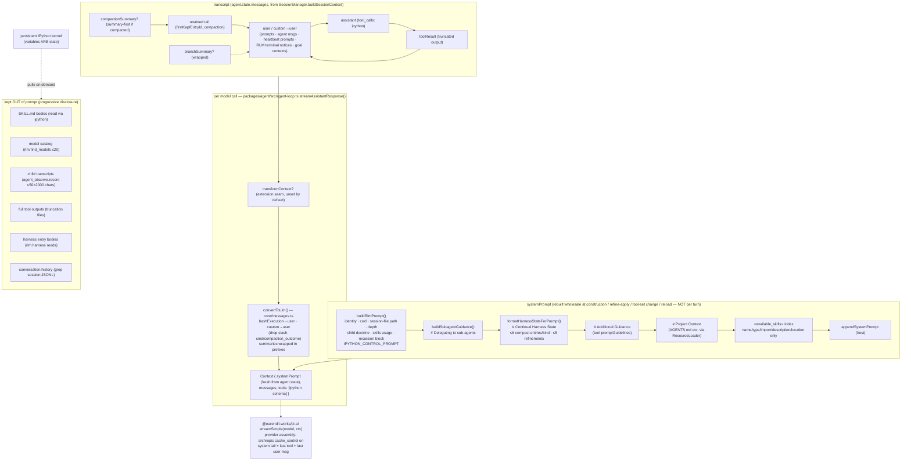
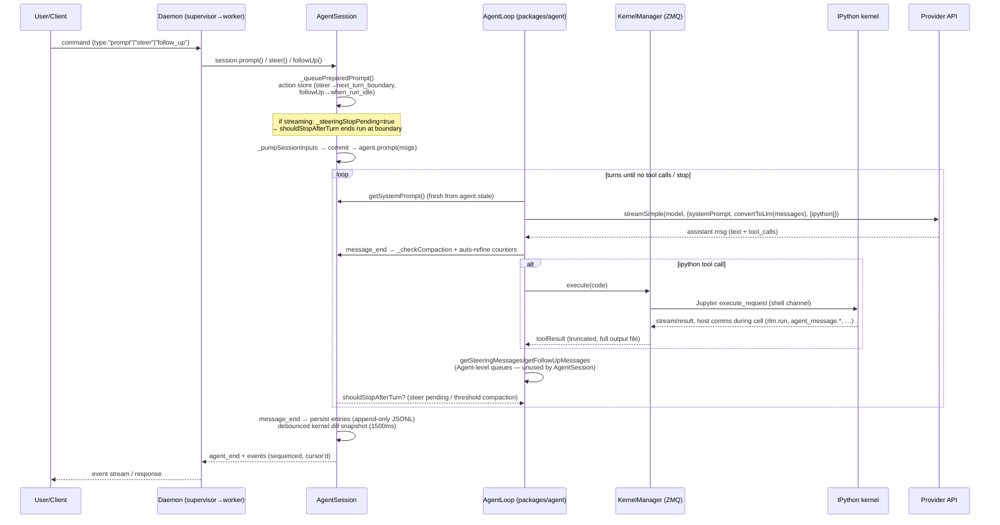
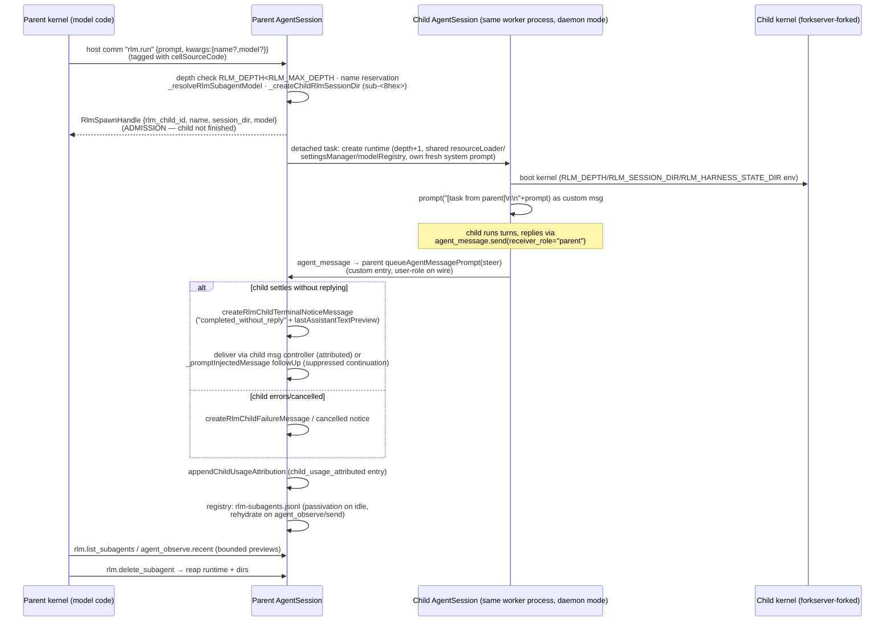
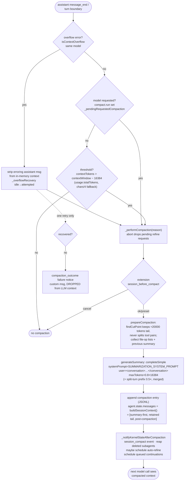

# prime-agent Deep-Dive Research Report

> **Status**: IN PROGRESS — sections are being appended incrementally. Sections marked ✅ are complete and code-verified; ⏳ are pending.
>
> **Purpose**: enable pi-relay's owner to adopt prime-agent's CORE (IPython-kernel-as-sole-tool + RLM subagent delegation) behind a React web frontend, replacing the Rust harness.
>
> **Sources** (all read directly for this report):
> - Source repo clone: `/home/schwinns/pi-relay/.pi/migration-research/repos/prime-agent/` (version 0.7.1; shallow clone, 1 commit)
> - Installed npm bundle: `/home/schwinns/.npm-global/lib/node_modules/prime-agent/` (version 0.7.0-beta.458.1.0e0d233 — the actually-running code)
> - Existing arch doc: `/home/schwinns/pi-relay/.pi/prime-agent-architecture.md` (validated/corrected in §10)

## Table of Contents

1. [Relationship to pi-mono](#1-relationship-to-pi-mono) ✅
2. [RLM Runtime (kernel, host bridge, rlm())](#2-rlm-runtime) ✅
3. [Daemon architecture & full RPC surface](#3-daemon-architecture--full-rpc-surface) ⏳
4. [Session persistence & file layout](#4-session-persistence--file-layout) ⏳
5. [Continual harness (refinement system)](#5-continual-harness) ✅
6. [Extensions (ex-"hooks") & skills systems](#6-extensions--skills-systems) ✅
7. [Provider/model handling (packages/ai)](#7-providermodel-handling) ⏳
8. **[Context Engineering & Data Flow (KEY CHAPTER)](#8-context-engineering--data-flow-key-chapter)** ⏳ (major subsections below)
9. [Embeddability analysis (KEY)](#9-embeddability-analysis-key) ⏳
10. [Validation & corrections to existing arch doc](#10-validation--corrections-to-existing-arch-doc) ⏳
11. [Missing features & gaps](#11-missing-features--gaps) ⏳
12. [prime-agent-runtime (Python) & prime-agent.sh / install.sh](#12-prime-agent-runtime-python--prime-agentsh--installsh) ⏳

---

## 1. Relationship to pi-mono ✅

**prime-agent is a hard fork of [pi-mono](https://github.com/badlogic/pi-mono)** (Mario Zechner's "pi" agent monorepo), not a wrapper. Evidence:

- `repos/prime-agent/CHANGELOG.md` 0.0.1 (2026-05-18): *"Initial Prime Agent release, forked from pi-mono"*.
- The fork **retains pi-mono's workspace layout and package names**: `packages/agent` (`@earendil-works/pi-agent-core`), `packages/ai` (`@earendil-works/pi-ai`), `packages/coding-agent` (`@earendil-works/pi-coding-agent`), `packages/tui` (`@earendil-works/pi-tui`) — all at version 0.7.1 in the clone. Imports throughout the codebase are `@earendil-works/pi-*`, e.g. `packages/coding-agent/src/core/sdk.ts` imports `Agent` from `@earendil-works/pi-agent-core`.
- The **published npm package is `prime-agent`** (`0.7.0-beta.458.1.0e0d233` in `~/.npm-global/lib/node_modules/prime-agent/package.json`) with `piConfig: { name: "prime-agent", configDir: ".prime/agent" }` and file:-tarball deps on the three pi packages plus `@agentclientprotocol/sdk ^1.3.0`. Its bin is `dist/bundle/cli.js` — a fully bundled single-file CLI.
- Git history is shallow-cloned (1 commit), so fork lineage beyond the CHANGELOG is not recoverable from the clone.
- Structural divergence from upstream pi-mono (from CHANGELOG + source):
  - **RLM layer added on top of pi-coding-agent**: `src/core/kernel/` (Jupyter kernel manager), `src/core/rlm-runtime.ts`, `src/core/agent-messages.ts`, `src/core/agent-observe.ts`, `src/core/refinement/` (continual harness), `src/core/autonomous.ts`, daemon modes under `src/modes/daemon/`, and the `prime-agent-runtime` Python package. None of these exist in upstream pi-mono.
  - **Tool surface inverted**: upstream pi's `read`/`write`/`edit`/`bash`/`ls` tool suite was replaced by a single `ipython` tool (CHANGELOG 0.0.x: *"Removed legacy `read`, `write` tools"*; `src/core/tools/` still contains `bash.ts`, `edit.ts` but the default session enables only `ipython` — see `sdk.ts` `tools?: string[]` docs: *"pi enables the default built-in tool (ipython)"*).
  - **pi.dev telemetry removed** (CHANGELOG 0.0.x).
  - CHANGELOG 0.7.0 breaking changes: agent messages are **always steering delivery**; the `mode` argument was removed from `agent_message.send`/CLI/RPC/connection APIs.
  - ACP (Agent Client Protocol) mode added: `src/modes/acp/`, using `@agentclientprotocol/sdk`.

**Practical upshot for pi-relay**: the layers that matter (daemon, RLM, kernel, harness) live in `packages/coding-agent` and are Prime-Intellect-authored; the LLM abstraction (`pi-ai`) and agent loop (`pi-agent-core`) are thin, upstream-shaped libraries that prime-agent configures but rarely modifies in spirit.

## 2. RLM Runtime ✅

The RLM ("Recursive Language Model") runtime is the core differentiator: the model's *only* built-in tool is an `ipython` tool connected to a persistent per-session Jupyter kernel, and all higher capabilities (subagents, messaging, harness CRUD, goals, compaction, heartbeats) are **Python functions pre-imported into that kernel** that call back into the TypeScript host over a typed bridge.

### 2.1 Kernel layer — `packages/coding-agent/src/core/kernel/`

| File | Lines | Role |
|---|---|---|
| `index.ts` | 1529 | `KernelManager` — speaks the Jupyter wire protocol over ZMQ; owns execution, comms, interrupts, restart, dispose |
| `bootstrap.ts` | 929 | Kernel provisioning/venv bootstrap (`PRIME_AGENT_KERNEL_PYTHON`, `~/.prime/agent/kernel-venv`) |
| `fork-server.ts` / `fork-server-script.ts` | 363/148 | Pre-forked kernel server for fast subagent kernel startup |
| `state-snapshot.ts` | 297 | Namespace persistence: dill payload + JSON manifest per session |
| `boot-gate.ts` | 50 | `withKernelBootPermit` serialization |
| `bootstrap-cli.ts` | 13 | CLI entry |

**Host bridge** (`kernel/index.ts`): the kernel-side `rlm.host_request` shim opens a Jupyter **comm** with target name `HOST_COMM_TARGET = "host.request"`. Each request payload is `{ type: string, ...params }`; the host looks up `options.hostHandlers[type]` (`HostRequestHandler = (payload) => Promise<Record<string, unknown>>`), tags the request with `cellSourceCode` (`activeExecution?.code ?? lastCellCode`, so detached `asyncio.create_task` calls attribute to the scheduling cell), and replies on the same comm with `{ status: "ok", ...result }` or `{ status: "error", error }`. Unknown types throw `host request type "X" is not available in this session`. In-flight host requests are tracked and awaited (with timeout) during kernel dispose so late replies aren't lost.

### 2.2 The `ipython` tool — `src/core/tools/ipython.ts` (708 lines)

- **Schema**: a single parameter — `Type.Object({ code: Type.String(...) })`. The description tells the model to use the *target project's own environment* for project imports/tests instead of installing into the kernel.
- **Bootstrap code** (`RLM_BOOTSTRAP_BASE_CODE` + `buildRlmBootstrapCode(pythonSkills)`): sets `NO_COLOR`, disables colors, applies `nest_asyncio`, imports the `rlm` module (`rlm = _prime_agent_rlm_module.rlm`); if `prime-agent-runtime` is missing, installs a `_PrimeAgentMissingRlm` stub whose every method raises a RuntimeError advising removal of `~/.prime/agent/kernel-venv`. Then for each Python-backed skill `importName`: `importlib.import_module`, wrap modules exposing `run()` into `_PrimeAgentCallableSkillModule` (callable module preserving `__signature__`/`__doc__`); import failures become `_PrimeAgentUnavailableSkill` stubs so one broken skill can't kill the kernel.
- **`%%bash` cells**: parsed by `ipython-cell-code.ts`; a configured `commandPrefix`/`shellPath` rewrites the cell to `%%script <shell>`.
- **Interrupt semantics**: Ctrl+C during a running cell prompts wait-vs-kill; killing emits a `<ipython_kernel_reset>` notice into the transcript so the model knows state was lost.
- **Result extras**: `IpythonToolDetails` carries stdout/stderr/result, error traceback, file-edit `diffs`, media `attachments` (attach-image skill), and `sentAgentMessages` (messages dispatched by the cell).

### 2.3 `rlm()` delegation — `src/core/rlm-runtime.ts` + `AgentSession._startRlmChildRun`

Host-bridge handlers registered in `AgentSession._createKernelHostHandlers()` (agent-session.ts, ~line 311700):

```
rlm.run, rlm.find_models, rlm.list_subagents, rlm.delete_subagent, model.info
goal.get/create/complete            (if includeGoals)
compact.run, compact.status         (if includeCompactSkill)
refine.run, refine.status           (if auto-refine allowed for session)
rlm_heartbeat.list/create/update/delete
agent_message.list_agents, agent_message.send   (if agent-message skill is model-visible)
agent_observe.list, agent_observe.get, agent_observe.recent
<mcp manager handlers>
```

**`rlm.run` admission** (`_startRlmChildRun`, agent-session.ts):
1. Validates kwargs — only `name` and `model` are supported; anything else throws `Unsupported rlm.run kwargs`.
2. Enforces recursion depth (`RLM_DEPTH >= RLM_MAX_DEPTH` → error) and session-name availability within the family (`assertDirectAgentMessageTarget`, pending-name reservation set).
3. Resolves the model (default = inherit; `rlm.find_models` exposes a *bounded* catalog search — default 8, max 20 results, scored exact/prefix/partial — deliberately **without** putting the model catalog in the system prompt).
4. Creates a child session dir under the parent's artifacts dir, builds `CreateRlmSubagentRuntimeOptions`, and spawns a **detached async task**. The kernel-visible `rlm.run()` call **resolves immediately at admission** with `RlmSpawnHandle = { rlm_child_id, name, session_dir, model }` — the child result never comes back as the `rlm()` return value.
5. The child is prompted with a `custom` agent-message whose content is `"[task from parent]

" + prompt` (`details.id = "spawn:<childId>"`, `fromRelationship: "parent"`).
6. Parent subscribes to child events → re-emits `rlm_child_update` (status, `activity: waiting|writing|executing`, `answerPreview` = compacted last assistant text, `toolUseCount`, `tokenCount`, `recap`, `repliedSinceTask`). Child token usage is attributed onto the parent's assistant entries (`appendChildUsageAttribution`, origin `spawn_task|agent_message|direct_user`).

**Subagent runtime hosts**: `_createRlmSubagentRuntime` delegates to a `SubagentRuntimeHost` when one is installed (daemon mode → separate worker process; see §3), else `_createInlineRlmSubagentRuntime` builds the child **in-process**: new `SessionManager` (child session file with `parentSession` + `rlmDepth` in its header), new `Agent` sharing the parent's `convertToLlm`/`transformContext`/`streamFn`/`getApiKey`, new `AgentSession` sharing `settingsManager`, `resourceLoader`, `modelRegistry`, `agentDir`. The child inherits `activeToolNames`, `customTools`, `includeGoals`, `includeCompactSkill`, `scopedModels`; `rlmDepth+1`; `rlmParentAgent` = parent session name. Child session names: explicit `name` (≤64 chars) or `subagent-<prompt-slug>-<id8>`.

**Terminal notification** (see §8.4): if the child's initial task ends with no reply to parent (`_parentReplyCount` unchanged), the parent is woken with an `rlm_child_terminal_notice` (`completed_without_reply` + last-assistant-text preview); child error → `rlm_child_failure`; cancellation → `cancelled` notice with reason. Delivery prefers the child's own `agentMessageController.sendAgentMessage` (so the notice arrives attributed *from* the child), falling back to `_promptInjectedMessage(..., streamingBehavior: "followUp")`.

### 2.4 Kernel state persistence

`state-snapshot.ts`: on dispose/compaction the kernel's user namespace is serialized with **dill** plus a JSON manifest (per-session artifact dir); on session resume, names are revived best-effort and `onRestore` fires so the session can inject an `ipython_state_restored` custom message telling the model what came back (custom type `IPYTHON_STATE_RESTORED_CUSTOM_TYPE` in `messages.ts`). The compaction summary prompt itself reminds the model the kernel survives (`KERNEL_PERSIST_SUMMARY_NOTE`, §8.1.4).

---

## 3. Daemon Architecture ✅

prime-agent's daemon is a **supervisor + per-root-tree workers** design over Unix-domain sockets, all `node:net` — there is **no HTTP or WebSocket server anywhere** in the codebase (`createServer` imports are `node:net` only; `daemon-supervisor.ts:662`, `daemon-mode.ts:586`, `kernel/fork-server.ts:130`).

### 3.1 Process topology & sockets

```text
clients (TUI interactive, --mode json/print, --mode rpc, ACP, daemon CLI)
   │  JSONL frames over Unix socket
   ▼
daemon supervisor  (socket: <tmpdir>/prime-agent-<uid>/daemon.sock, Windows: \\.\pipe\prime-agent-daemon)
   ├── catalog subprocess        (saved-session scan/resolve/rename/delete/archive; role env PRIME_AGENT_INTERNAL_DAEMON_CATALOG)
   ├── worker <id12>.sock        (one per root session tree; role env PRIME_AGENT_INTERNAL_DAEMON_WORKER)
   └── …
```

- **Socket dir**: `defaultDaemonSocketDir()` = `os.tmpdir()/prime-agent-<uid>` (`daemon-socket.ts`); dir mode `0700` with uid check, socket mode `0600`. Socket acquisition is a `proper-lockfile` lock on the socket path (stale after 5s, 600 retries at 25ms) + inode/dev identity checks (`DaemonSocketIdentity`) so a stale file is only unlinked after a 1s grace window and identity verification. `daemon-supervisor-ownership.ts` additionally serializes concurrent supervisor startups (`acquireDaemonSupervisorOwnership`, startup fence).
- **Workers**: spawned via `createCliSubprocessLaunchSpec` (`cli/subprocess-launch.ts`) as detached process groups with env `PRIME_AGENT_INTERNAL_DAEMON_WORKER=1`, auth token (`PRIME_AGENT_INTERNAL_DAEMON_WORKER_TOKEN`), active-session id, supervisor socket path, recovery-journal path, orphan-process-journal path, lease owner id, and a **startup gate on fd 3** — the worker blocks reading `start\n` (`DAEMON_WORKER_STARTUP_GATE_COMMIT`) before proceeding, letting the supervisor abort a spawn cleanly. Each worker listens on its own socket `worker-<key>-<id12>.sock` in the same tmp dir. Worker↔supervisor framing adds a `DaemonWorkerFrameHeader` (`kind: "command"|"outbound"`, requestId, commandType, plus `payloadEncoding: "jsonl"|"assistant-delta"` for the compact assistant-stream reconstruction path).
- **Worker descriptor**: JSON at `~/.prime/agent/daemon-workers/<descriptorKey(socketPath)>/<workerId>.json` (version 1: workerId, pid, processStartId, socketPath, recoveryJournalPath, orphanProcessJournalPath, authenticationToken, rootActiveSessionId, rootSessionId, sessionFile, lifecycle starting|ready|recovering|failed, createCommand, consecutiveFailures, stopRequestedAt/archiveOnStop durable-intent fields). Written atomically (temp + rename). Recovery journal: `<workerId>.recovery.jsonl` (`WorkerRecoveryJournal`), orphan journal: `<workerId>.orphans.jsonl` (records kernel/subprocess pids so a crashed worker's children can be reaped by pid+start-time identity check — `orphan-process-journal.ts`).
- **What a worker hosts** (`daemon-mode.ts`, 6793 lines — the largest mode file): one root `AgentSessionRuntime` + `AgentSession`, the root kernel, the cron/heartbeat scheduler for that tree, and **all RLM descendants** — in daemon mode `createSubagentRuntimeHost` creates child runtimes *in the same worker process* (`daemon-mode.ts:2210/2303`), with **passivation**: idle children are serialized to the subagent registry (`rlm-subagents.jsonl`) and rehydrated on demand (`findPassiveRlmSubagent`/`hydratePassiveRlmSubagent`); the supervisor can request `worker_passivate_idle_children` (capped at `CHILD_PASSIVATION_PER_WORKER_CAP = 2` per sweep).

### 3.2 Wire protocol (daemon-protocol.ts)

- Name `prime-agent.daemon`, protocol version 7, schema revision **14** (`DAEMON_SCHEMA_ID = "protocol-7-schema-14-816309b1cd50"`; rev 14 = client telemetry opt-out on attach/reattach). Command envelopes require protocol ≥7 (`DAEMON_COMMAND_ENVELOPE_MIN_PROTOCOL_VERSION`).
- Frames: strict LF-delimited JSONL (`attachJsonlLineReader`/`serializeJsonLine` in `modes/rpc/jsonl.ts`). Commands `{type:"command", id, protocol, clientId?, command}`; responses `{id, type:"response", command, success, data|error}`; events `{type:"event", id, protocol, activeSessionId?, sequence?, cursor? {generation, sequence}, emittedAt, event}`.
- **Capabilities** (client): `attach_snapshot`, `event_sequence`, `extension_ui`, `slim_attach`, `chunked_snapshot`, `client_owned_sessions`. Server adds: `delete_rlm_subagent`, `heartbeat_catalog`, `heartbeat_management`, `model_catalog`, `side_question_transcript`, `transient_bash`, `session_input_admission`, `prompt_admission_cancellation`.
- **Command surface** (`DAEMON_COMMAND_TYPES`, daemon-supervisor.ts, ~90 types): session lifecycle (`create`, `attach`, `reattach`, `detach`, `kill`, `rename`, `new_session`, `switch_session`, `fork`, `navigate_tree`, `import_jsonl`, `export_html`, `export_jsonl`), prompting (`prompt`, `prompt_and_wait`, `cancel_prompt_admission`, `steer`, `follow_up`, `restore_next_turn`, `restore_actions`, `append_custom_message`, `resume_queue`, queue ops `get_queue`/`clear_queue`/`abort_and_clear_queue`), inter-agent (`send_message`, `agent_messages_status/pause/resume/clear`), execution (`abort`, `execute_bash`, `execute_bash_and_wait`, `abort_bash`, `start_side_question`, `abort_side_question`, `cancel_rlm_child`, `delete_rlm_subagent`), waiting (`wait_for_idle`, `wait_for_headless_completion`), reads (`list`, `list_saved_sessions`, `get_session_header`, `get_state`, `get_connection_state`, `get_messages`, `get_session_stats`, `get_context_tree`, `get_commands`, `get_resource_snapshot`, `get_model_catalog`, `get_available_models`, `get_session_context`, `get_session_tree`, `get_user_messages_for_forking`, `get_last_assistant_text`, `get_system_prompt`, `get_tool_definition`), scheduling (`cron_list`, `cron_add`, `cron_cancel`, `heartbeats_list`, `heartbeat_manage`, `heartbeat_get`, `heartbeat_set`, `heartbeat_update`), settings (`set_model`, `cycle_model`, `set_scoped_models`, `set_thinking_level`, `cycle_thinking_level`, `set_service_tier`, `set_transport`, `set_steering_mode`, `set_follow_up_mode`, `set_auto_compaction`, `set_auto_retry`), maintenance (`compact`, `refine`, `abort_compaction`, `abort_branch_summary`, `abort_retry`, `reload`, `set_session_name`, `set_session_entry_label`, `extension_ui_response`, `get_rlm_max_depth_status`, `set_rlm_max_depth`, `rename_saved_session`, `delete_saved_session`), and daemon ops (`complete_owned_session`, `promote_owned_session`, `ack_result`, `prepare_update_restart`, `retry_worker`, `restart`, `shutdown`).
- The header comment is explicit about intent: *"Local daemon JSONL protocol… not the final remote gateway protocol. The protocol primitives below are intentionally JSON-serializable so a future gateway can wrap or proxy this local transport without leaking transport details back into InteractiveMode."*

### 3.3 Crash recovery & update restart

- **Worker recovery**: retry delays `[250ms, 1s, 5s]` (`WORKER_RETRY_DELAYS_MS`); deferred re-check 5s; owned-worker disconnect grace 30s. The `WorkerRecoveryJournal` (per-worker JSONL) plus the durable `stopRequestedAt` intent let a replacement supervisor distinguish "should recover" from "deliberately stopped".
- **Supervisor replacement**: if the supervisor dies, a worker (or new client launch) acquires the supervisor ownership lease and adopts live workers via their descriptors (matching pid/processStartId, `daemon-runtime-identity.ts` — build identity gates adoption so a new binary doesn't adopt incompatible workers).
- **Coordinated self-update**: `prepare_update_restart` drains mutations (`MutationDrainLatch`, 80s drain, 100s prepare deadline, rolls back the fence on timeout), workers checkpoint, supervisor validates + persists a manifest at `~/.prime/agent/daemon-update-restarts/<sha256(socketPath)>.json` (legacy single-file path also read), commits, and stops workers; the new supervisor adopts per the manifest. Update commands: `UPDATE_RESTART_DRAIN_COMMANDS`.
- **Command idempotency**: `CommandRecoveryJournal` + `createCommandIdempotencyKey` (supervisor-side) so a client that retries after a crash doesn't double-apply mutations; `ack_result`/`salvageDaemonCommandId` let clients acknowledge or recover results.
- **Client-side reconnect**: `DaemonAgentConnection` keeps `lastEventCursor {generation, sequence}` and sends `resumeCursor` on reattach; the supervisor replays missed events (`DaemonReplayStatus: complete|partial|unavailable`) and/or streams a fresh snapshot (`snapshotPurpose: attach|replacement|catchup`; chunked snapshots at `SNAPSHOT_TARGET_CHUNK_BYTES`, with a `SnapshotTranscriptCache` per session and duplicate-validation so a client never applies a stale snapshot over a newer one).
- **Idle eviction**: workers can be evicted when idle (`canEvictWorker` + `WorkerEvictionSnapshot` in session-action-store.ts); sweep interval 1–5 min (`idleEvictionSweepIntervalMs`), 5s drain.

### 3.4 Where sessions are created

Clients never own sessions directly in daemon mode: `create` allocates a worker (or reuses by identity), the worker opens/creates the session file under lease, and the supervisor records routing. Non-daemon modes (print/json/rpc/acp/standalone interactive) create a client-owned worker under the same machinery. `REMOVED_COMMAND_NAMES` (`cli/command-registry.ts:159`) shows the old `daemon install/manage/remove/uninstall/app` service-management verbs were deleted — daemon lifecycle is now implicit (spawn-on-demand).

---

## 4. Session Persistence ✅

### 4.1 File layout (all under `getAgentDir()` = `~/.prime/agent/`, overridable via `PRIME_AGENT_CODING_AGENT_DIR`/`PI_CODING_AGENT_DIR`)

```text
~/.prime/agent/
├── settings.json                      # SettingsManager (models, mcpServers, heartbeat config, refine policy…)
├── auth.json                          # AuthStorage: api keys + OAuth tokens (locked reads/writes)
├── models.json                        # ModelRegistry cache/overrides (models.generated.ts is the built-in catalog)
├── sessions/<uuidv7>.jsonl            # one file per session; FLAT (no date dirs), uuidv7 ≈ time-ordered
├── session-artifacts/<sessionId>/
│   ├── harness/harness_state.json     # session-local continual-harness store
│   ├── kernel-state.dill + kernel-state.json   # dill namespace snapshot + manifest
│   ├── rlm-subagents.jsonl            # subagent registry (passivated children)
│   ├── scheduled-jobs.json            # per-session heartbeats (SESSION_SCHEDULED_JOBS_FILENAME)
│   ├── session-artifacts/             # nested artifact dir for children
│   └── sub-<8-hex>/                   # per-RLM-child RLM session dirs (recursively same shape)
├── session-leases/<sha256(path)>.lock # proper-lockfile lease dirs (owner token/pid/processStartId)
├── daemon-workers/<key>/<workerId>.json|.recovery.jsonl|.orphans.jsonl
├── daemon-update-restarts/<sha256(socketPath)>.json
├── logs/ (agent.jsonl, agent-traces.log, client-errors.log, <socket>.<hash8>.log)   # 5 MiB single-generation rotation
├── harness/harness_state.json + refinements.jsonl   # GLOBAL continual harness
├── kernel-venv/                       # uv-managed shared python env
├── themes/  cron-jobs.json  supervisor owners under /tmp/prime-agent-<uid>/
```

### 4.2 Session file format (session-manager.ts, `CURRENT_SESSION_VERSION = 3`)

- **Header**: `{type:"session", version:3, id (uuidv7), timestamp, cwd, parentSession?, rlmDepth?, git? {repoUrl, commit, branch}}`. v1 linear → migrated; v2 added tree ids; v3 renamed `hookMessage`→`custom`.
- **Entries**: append-only JSONL, each `{type, id (uuidv7), parentId, timestamp}`:
  - Context-bearing: `message` (AgentMessage), `custom_message` (CustomMessage w/ customType+details), `branch_summary`, `compaction` (summary + `firstKeptEntryId` + tokensBefore + details + customInstructions).
  - State-only: `model_change`, `thinking_level_change`, `service_tier_change`, `session_info` (name), `label` (bookmarks), `custom` (extension/heartbeat/refinement state — explicitly *not* in LLM context), `child_usage_attributed` (targetId + childUsage + aggregateUsage + origin spawn_task|agent_message|direct_user), `session_state` (`active|archived|crash`), `agent_status` (idle summary + taskState needs_input|completed + basedOnMessageCount), `git_state`.
- **Tree/branching**: `parentId` chain; `branch(leafId)` walks the chain; forks share one file. `buildSessionContext` reconstructs the transcript from any leaf (§8.1.3).
- **Perf guards**: session list search caps text at 64 KiB/session, skips lines >1 MiB, previews capped at 256 chars; files >128 MiB stream-load with 4 MiB async yields.
- **Leases**: `session-lease.ts` — enabled via `PRIME_AGENT_INTERNAL_SESSION_LEASES` env (daemon sets it); lease dir per canonical session path (sha256 key), owner `{token, pid, processStartId}`; concurrent open → `SessionAlreadyActiveError("session_already_active")` carrying the owning activeSessionId; stale leases reclaimed when the pid/start-id no longer matches.
- **Crash semantics**: worker death leaves the JSONL intact (append-only + atomic temp+rename for side files); `session_state` records lifecycle; `crash` is read-only back-compat. The `conversation log` path in the system prompt points at this file so the model can grep its own history — *including across compactions*.

---

## 5. Continual Harness ✅

The "continual harness" is prime-agent's persistent memory layer: four kinds of editable entries — **prompt notes, memories, skills, subagent specs** — stored on disk, summarized into every system prompt, and mutated either by the model directly (kernel CRUD) or by a background **refine** planner.

### 5.1 Storage & formats — `src/core/refinement/refinement.ts`

- Directory: `harness/` under the session's local state dir, and a global equivalent (`getGlobalHarnessStateDir()`); merged per prompt-build by `mergeHarnessStates()` (`AgentSession._loadMergedHarnessState`, agent-session.ts ~269655): `mergeHarnessStates(loadHarnessState(globalDir, "global"), loadHarnessState(localDir, "local"))`.
- `HarnessEntry`: `{ id, kind: "prompt"|"memory"|"skill"|"subagent", title, content, path, scope: "local"|"global", reference?, arguments?, metadata?, source?, timestamps, version }`. Skills/subagents additionally carry a Python `reference` + `arguments` contract (REPL-callable entries).
- Refinement audit log: `refinements.jsonl`; history merged across global file + session `custom` entries (`getRefinementHistory`, `_loadRefinementHistory`).

### 5.2 Prompt injection — `formatHarnessStateForPrompt()` (refinement.ts line 429)

Every `_rebuildSystemPrompt` re-merges state and emits a `# Continual Harness State` section containing **compact summaries only** (per-kind count and ≤6 entries/kind, ≤5 recent refinements, content clipped to 180 chars — constants `REFINE_*`/`HARNESS_*` at top of refinement.ts), with routing hints ("compact summaries, not full descriptions"), when-to-refine guidance conditioned on `hasIpython`/`hasBash`/`hasRefineSkill`, and the local-vs-global policy. This exact section is visible in this very session's system prompt, confirming the code path end-to-end.

### 5.3 Mutation paths

1. **Direct kernel CRUD** — `rlm.harness.create_memory/update_memory/delete_memory/create_skill/...` (implemented Python-side in `prime-agent-runtime`, §12; calls the host bridge). Takes effect on the **next system-prompt rebuild** (rebuild triggers in §8.1.1) — not mid-turn.
2. **`refine` planner** — `AgentSession.refine({instructions?, rollbackId?, global?})`: a **background planning phase** (does not block turn entry; `_waitForRefineIdle` waits only for in-flight applies) produces a strict-JSON edit proposal from a model; the **apply phase** (`applyRefinementProposal` → `saveHarnessState`) is serialized and blocks turn entry briefly. On apply: global scope appends to `refinements.jsonl`; the session records `appendCustomEntry("prime-agent.refinement", result)`; the system prompt is rebuilt immediately; `refine_*` events emitted. Aborts cancel pending requested refines (`_checkCompaction` abort branch). Refine runs can be scheduled automatically after compaction (`_scheduleAutoRefineAfterCompaction`) and an auto-refine review hook exists (CHANGELOG PR #201).
3. **Rollback**: `refine({rollbackId})` restores `baselineState` snapshots captured per proposal.

**Key architectural note**: the base system prompt is explicitly *not* editable via refine ("The base system prompt is intentionally not editable through this path", agent-session.ts `refine()` docstring). Continual learning is additive metadata, not self-modifying instructions.

## 6. Extensions (ex-"hooks") & Skills Systems ✅

### 6.1 The `./hooks` export is stale — hooks are extensions now

`package.json` maps `"./hooks"` → `dist/core/hooks/index.js`, but **`dist/core/hooks/` does not exist** in the installed bundle and `src/core/hooks/` does not exist in the repo at HEAD (verified via `find`/`git ls-tree`/`grep` on both trees). The functionality was absorbed into the **extensions system**: `src/core/extensions/` (types with `ExtensionFactory`, `ExtensionAPI`, `ExtensionContext`, `ToolDefinition`; `ExtensionRunner`) with lifecycle/hook events — `session_start`, `session_shutdown`, `session_before_compact` (can cancel compaction or supply its own summary), `session_compact`, `input` (transform/handle user submissions), `resources_discover` (contribute skill/prompt/theme paths), plus slash commands and custom tools. Extension-contributed resources flow through `ResourceLoader.extendResources()` → `_rebuildSystemPrompt()` (agent-session.ts ~297384). The existing arch doc should not describe a live hooks export (§10).

### 6.2 Skills — `src/core/skills.ts` (633 lines)

Two kinds, following the [Agent Skills](https://agentskills.io) layout (`SKILL.md` + optional assets):

- **Markdown skills**: prompt-only. The system prompt receives an `<available_skills>` index — per skill just `name`, `type`, `description`, `location` (absolute path) — from `formatSkillsForPrompt()`. The model loads the full `SKILL.md` on demand by reading the file (progressive disclosure). Skills flagged `disableModelInvocation` are excluded from the index.
- **Python-backed skills**: a `SKILL.md` plus a Python module; frontmatter `python_import: <module>` gets the module **pre-imported into the persistent kernel** by `buildRlmBootstrapCode` (§2.2), and the `<skill>` index entry includes `<python_import>`. The model calls documented module functions directly in ipython cells (e.g. `await websearch.search(...)`) or, when the module exposes `run()`, calls the module itself (bootstrap wraps it callable). Built-ins include `websearch`, `rlm-heartbeat`, `agent-message`, `agent-observe`, `compact`, `goal`, `edit`, `attach-image`, plus CLI mirrors (`<skill> --help` via `%%bash`).
- **Loading**: `LoadSkillsOptions { cwd, agentDir, skillPaths, includeDefaults }` — discovery merges default built-ins, user/agent-dir skills, project skills, and explicit paths (precedence documented in `docs/skills.md`); extensions can contribute additional skill paths via `resources_discover`. MCP-disabled built-ins are filtered via `extraBuiltinSkillOverrides` (sdk.ts).
- **Skill commands**: user-typed `/skill-name` invocations are expanded before prompting (`_expandSkillCommand` in agent-session.ts) — the SKILL.md body becomes the prompt text.

### 6.3 MCP — `src/core/mcp/`

An `McpManager` exists (`mcp-manager.ts`, created even on the bare SDK path in `sdk.ts`): it gates MCP skills on auth, registers user-configured MCP servers from settings (`settingsManager.getMcpServers()`), and contributes **kernel host handlers** (`this._mcpManager.hostHandlers()`) so MCP tools are invoked from Python rather than as first-class LLM tools. User MCP providers are re-registered on OAuth reset and `/reload` (`mcpManager.refresh()`).

---

## 7. Provider Handling (packages/ai + model registry) ✅

### 7.1 Package shape

`@earendil-works/pi-ai` (packages/ai) is a small provider-abstraction layer:
- `stream.ts` — the only entry points: `stream/complete` and `streamSimple/completeSimple`, dispatching on `model.api` through `api-registry.ts` (`getApiProvider`). Providers self-register via `providers/register-builtins.ts` (side-effect import).
- **Providers** (packages/ai/src/providers/): `anthropic` (1279 lines), `openai-responses` + `openai-responses-shared` + `azure-openai-responses`, `openai-completions` (1163), `openai-codex-responses` (1332), `google` + `google-shared` + `google-vertex`, `amazon-bedrock` (984), `mistral`, `cloudflare` (AI Gateway), `github-copilot-headers`, `faux` (testing). Model catalog: `models.generated.ts` (~20k lines, generated).
- `env-api-keys.ts` — env-var key resolution per provider (`getEnvApiKey`); this is exactly the list `prime-agent.sh --no-env` unsets.
- **OAuth** lives at `packages/ai/src/utils/oauth/` (oauth.ts re-exports; flows for Anthropic, GitHub Copilot, OpenAI Codex, and generic MCP OAuth; `mcp/oauth.ts` for MCP servers). Token persistence/refresh is host-side in `core/auth-storage.ts` (1135 lines, locked JSON at `auth.json`); `core/auth-guidance.ts` renders model-visible login guidance when auth fails; `core/prime-inference-auth.ts` (736 lines) + `prime-inference-models.ts`/`prime-inference-model-selection.ts` implement **Prime Inference as a first-class provider** (API base, model listing, auth bootstrap).
- `mcp.ts` re-exports the MCP client utilities (remote HTTP MCP servers; see §6/§8.2 for the kernel exposure).

### 7.2 Request assembly & caching

- `providers/simple-options.ts buildBaseOptions`: `maxTokens` defaults to `min(model.maxTokens, 32000)`; `thinking` budgets `minimal:1024 / low:2048 / medium:8192 / high:16384` with `xhigh|max` clamped to `high` for token-budget providers (`clampReasoning`); thinking adjusts maxTokens upward (`adjustMaxTokensForThinking`, min output 1024).
- **Anthropic cache breakpoints** (`providers/anthropic.ts`): `cache_control: {type:"ephemeral"}` is stamped on (a) the system prompt tail block, (b) the last tool declaration, and (c) the last user message ("cache conversation history", convertMessages). Retention: `cacheRetention: "short"` (5m) by default, `"long"` (1h TTL) when `supportsLongCacheRetention` and either the option or `PI_CACHE_RETENTION=long`; `"none"` disables. Cache pricing handled via `cache-pricing.ts`. Notably the anthropic provider contains a "stealth mode" that renames tools to Claude Code's canonical names (for OAuth-compat serving) — irrelevant for pi-relay except as evidence of provider-quirk plumbing living in the provider layer.
- **Overflow detection** (`utils/overflow.ts isContextOverflow(message, contextWindow?)`): regex battery over ~20 provider-specific overflow strings (Anthropic "prompt is too long", OpenAI "exceeds the context window", Google "input token count…exceeds", xAI/Groq/OpenRouter/Cerebras/Mistral/Kimi/llama.cpp/LM Studio/Copilot/MiniMax/z.ai/Ollama…) **plus silent-overflow heuristics** (usage.input > contextWindow for z.ai; stopReason "length" + output=0 + filled context for Xiaomi MiMo) and **non-overflow exclusions** (Bedrock throttling prefixes, generic rate-limit/429 patterns). This feeds compaction trigger #1 (§8.1.4).
- Retry/streaming failure utilities: `utils/stream-failure.ts`, `utils/event-stream.ts`, per-provider `maxRetries`/`maxRetryDelayMs` in stream options; session-level retry bookkeeping is `_handleRetryableError` in agent-session.ts.

### 7.3 Model resolution (coding-agent side)

- `core/model-registry.ts` (1605 lines): merged view of built-in catalog + user `models.json` (custom providers/models, `cacheControlFormat: "anthropic"` hint for compat providers).
- `core/model-resolver.ts`: parses `provider/model[:thinking]` patterns; when a saved/exact model can't be found it **falls back** (`buildFallbackModel`, `findPreferredDefaultModel`) with an explicit warning (`"Falling back to: <provider>/<id>"`, `"Could not restore model … Using …"`). `set_scoped_models` cycles within a user-defined shortlist. There is **no automatic cross-provider failover mid-run** — fallback happens at resolution/restore time; runtime failover is retry-then-error.
- Service tiers (`priority`/`default`) are gated by model capability (`supportsFastMode`), inherited by RLM children with automatic downgrade (§8.3).

### 7.4 What a "model" is on the wire

`Context = { systemPrompt?: string, messages: Message[], tools?: Tool[] }` (`packages/ai/src/types.ts`); provider converts `Message[]` (`transform-messages.ts` + per-provider converters). Tool declarations come straight from `context.tools` JSON schemas (TypeBox-generated in coding-agent's `tools/`). Since prime-agent's default runtime exposes exactly one tool (`ipython` with a single `code` string), the provider request is: **system prompt (§8.1.2) + user/assistant/toolResult transcript (§8.1.1) + one tool schema**.

### 8.6 Diagrams

#### 8.6.1 Context assembly (box diagram)



#### 8.6.2 Full turn sequence (user prompt → response)



#### 8.6.3 Subagent lifecycle sequence



#### 8.6.4 Compaction trigger flowchart



---

## 8. Context Engineering & Data Flow (KEY CHAPTER) ✅

This chapter traces exactly what prime-agent sends to the model on every call type, where each piece comes from, and how information moves between agents. All paths are repo-relative to `repos/prime-agent/packages/coding-agent/src/` unless noted.

### 8.1 Model-call context assembly

#### 8.1.1 The single LLM call site — `packages/agent/src/agent-loop.ts`

Every model call in the system (root turns, subagent turns, retries) goes through `streamAssistantResponse()` in `packages/agent/src/agent-loop.ts`. Assembly per call:

```ts
let messages = context.messages;                                   // live AgentMessage[] transcript
if (config.transformContext) messages = await config.transformContext(messages, signal); // optional pre-map (extensions)
const llmMessages = await config.convertToLlm(messages);           // AgentMessage[] -> provider Message[]
const llmContext: Context = {
  systemPrompt: config.getSystemPrompt?.() ?? context.systemPrompt, // read fresh per call from agent state
  messages: llmMessages,
  tools: context.tools,                                            // active tool list (normally just `ipython`)
};
streamFunction(config.model, llmContext, { ...config, apiKey: resolvedApiKey, signal });
```

- `convertToLlm` for prime-agent sessions is **`src/core/messages.ts`'s `convertToLlm`** (installed in `sdk.ts createAgentSession` and inherited verbatim by RLM children: `_createInlineRlmSubagentRuntime` passes `convertToLlm: this.agent.convertToLlm`). Mapping (messages.ts):
  | AgentMessage role | LLM wire role | Transform |
  |---|---|---|
  | `user` / `assistant` / `toolResult` | same | pass-through |
  | `bashExecution` | `user` | `"Ran \`cmd\`
````output````"`; skipped entirely when `excludeFromContext` (`!!` prefix) |
  | `custom` | `user` | content (string or text/image blocks) verbatim — **except** `session_slash_command`, `session_slash_command_result`, `compaction_outcome`, which are **dropped** |
  | `branchSummary` | `user` | wrapped in `BRANCH_SUMMARY_PREFIX/SUFFIX` ("The following is a summary of a branch…") |
  | `compactionSummary` | `user` | wrapped in `COMPACTION_SUMMARY_PREFIX/SUFFIX` ("The conversation history before this point was compacted…") |
- **Everything dynamic that wakes or steers an agent is a `user`-role message on the wire**: agent-to-agent messages, heartbeat prompts, goal continuation contexts, RLM child terminal notices, branch/compaction summaries. There is no system-role side-channel; the provider sees interleaved `user`/`assistant`/`toolResult` only.
- `transformContext` is unset by default (extension seam). `getSystemPrompt` returns `agent.state.systemPrompt` per call, so a rebuilt prompt (see below) takes effect on the **next** call without loop changes.
- Retry: `streamSimple` + `AgentSession._handleRetryableError` (exponential backoff; context-overflow errors are *not* retried — they route to compaction; auth failures mark provider auth stale and append login guidance).

#### 8.1.2 System prompt construction — `core/system-prompt.ts` + `core/prompts/rlm.ts`

`buildSystemPrompt(options)` (system-prompt.ts) assembles, **in this exact order** (default path, no customPrompt):

1. **`buildRlmPrompt()`** (`prompts/rlm.ts`) — the "trained prefix". Contains, in order:
   - Identity preamble ("You are a general purpose agent that uses code to solve tasks…", iterate, stop when done).
   - `Working directory: <cwd>`, `Conversation log: <session file path>`, `Recursive agent depth: <n>`, pre-installed Python package list (`DEFAULT_RLM_EXTRA_IMPORT_LABELS` from `kernel/bootstrap.ts`: requests, httpx, yaml, tomli, dotenv, pandas, numpy, scipy, bs4, lxml, pydantic, tyro), `uv pip install` guidance.
   - **Child doctrine** (only when `depth > 0`): "You are a child agent spawned by `<parent>`. Task prompts are labeled `[task from parent]`." + explicit-reply instruction (`agent_message.send(..., receiver_role="parent")`) — `buildChildAgentDoctrine()`.
   - Installed-skills paragraph (pre-imported names, `help()`/`inspect.signature` usage, CLI mirrors, `edit` skill preference).
   - Family-reach restrictions ("Agent messaging is restricted to your parent, siblings, and direct children…") when `agent_message`/`agent_observe` are installed.
   - **Recursion block** (when `allowRecursion && hasIpython`): `rlm()` semantics (returns at admission with `rlm_child_id`, never the answer), naming, `find_models`, reply contract, `list_subagents`, observation, fan-in via files, end-your-turn guidance, `delete_subagent`.
   - **`IPYTHON_CONTROL_PROMPT`** — the persistent-kernel doctrine (%%bash first-line rule, throwaway subshells vs persistent kernel state, don't install into the kernel, named-variable discipline, `rlm.harness` CRUD surface, terminology, RLM-native call contract).
   - Refine nudge when the `refine` skill is installed ("Treat continual harness refinement as a small, evidence-backed update…").
2. **`buildSubagentGuidance()`** (`prompts/rlm.ts`) — `# Delegating to sub-agents` (when/why: admission semantics, explicit replies, fan-in, `refine.run()` for reusable patterns). Appended immediately after the trained prefix, *before* the harness menu — the comment notes this mirrors Claude Code's Agent-tool ordering.
3. **`formatHarnessStateForPrompt(harnessState, …)`** (`refinement/refinement.ts:429`) — `# Continual Harness State` (§5.2): per-kind counts, ≤6 compact entries/kind (title + 180-char clipped content + path/reference hints), ≤5 recent refinements, local/global policy, when-to-refine guidance conditioned on `hasIpython`/`hasBash`/`hasRefineSkill`. Subagent-spec menu lives here (so the model sees *why* delegate, then *which* specs exist).
4. **`# Additional Guidance`** — deduped bullets from tool-contributed `promptGuidelines` (system-prompt.ts `formatPromptGuidelines`).
5. **`# Project Context`** — AGENTS.md and other context files discovered by the ResourceLoader (`## <absolute path>` headings).
6. **`<available_skills>` index** — `formatSkillsForPrompt()` (`core/skills.ts`): per-skill `<name>/<type>/<python_import>/<description>/<location>` metadata only (see §8.2). Only included when the session has file access (`ipython` or `bash` tool).
7. **`appendSystemPrompt`** — host/user-appended text last.

Notes:
- A `customPrompt` (ResourceLoader system-prompt override) **replaces** the trained prefix; project context, skills index, date/cwd line, child doctrine, and harness state are still appended (system-prompt.ts customPrompt branch). The custom path is the only one that uses per-tool `toolSnippets`.
- Date and cwd in the default path live inside `buildRlmPrompt`'s "Working directory" lines; the custom path appends `Current date: …` / `Current working directory: …` explicitly.
- **Cache-breakpoint analysis**: there are no explicit cache-control markers inserted by prime-agent; the prompt is a single string. Prompt-prefix caching therefore depends on provider behavior (see §7). The prompt is *rebuilt wholesale* (not incrementally) at: session construction, `setRlmHeartbeatController`, RLM max-depth change, `setActiveToolsByName`, refine apply, extension `resources_discover`, `setRlmMaxDepth` (all call sites of `_rebuildSystemPrompt`, agent-session.ts). **Mid-session harness CRUD does not change the prompt until one of these triggers fires** — in practice refine-apply and /reload are the common ones.
- Harness state is re-read from disk (`_loadMergedHarnessState()`) at each rebuild, merging global + session-local.

#### 8.1.3 Transcript materialization — `SessionManager.buildSessionContext()` (`core/session-manager.ts`)

The in-memory transcript (`agent.state.messages`) is produced from the append-only JSONL session file by `buildSessionContext(entries, leafId, byId)`:

1. Walk `parentId` chain from the current **leaf** to root (sessions are trees — branching/rewind supported), reverse to chronological.
2. Fold settings entries: latest `thinking_level_change`, `service_tier_change`, `model_change` (model also inferred from the last assistant message). These drive restored session state, not the message list.
3. Messages: `message` entries pass through verbatim; `custom_message` entries → `CustomMessage` (`role: "custom"`); `branch_summary` entries → `BranchSummaryMessage`.
4. **Compaction-aware assembly**: if the path contains a `compaction` entry, output is `[compactionSummaryMessage, ...retainedMessages(from firstKeptEntryId up to the compaction), ...postCompactionMessages]` — i.e. **summary-first**, then the retained tail, then everything after. `retainedMessageCount` records the presentation boundary for UIs.
5. Non-context entries (`custom`, `child_usage_attributed`, `label`, `session_info`, `session_state`, `agent_status`, `git_state`) never enter the transcript.

This same function rebuilds context after compaction (`_performCompaction` sets `agent.state.messages = sessionManager.buildSessionContext().messages`) and on session resume.

#### 8.1.4 Compaction — `core/compaction/compaction.ts` + trigger logic in agent-session.ts

**Triggers** (`_checkCompaction`, agent-session.ts ~283776; run after each assistant message end and at turn boundaries):
1. **Overflow**: the provider returned a context-overflow error (`isContextOverflow(message, contextWindow)`), same model as current. The erroring assistant message is **stripped from in-memory context** (kept in the session file), one compact-and-retry is attempted (`_overflowRecovery: idle → attempted → reported`), then a `compaction_outcome` failure notice.
2. **Model-requested**: the `compact` skill's `compact.run` host request sets `_pendingRequestedCompaction`; consumed at the next turn boundary (works even with auto-compaction disabled).
3. **Threshold**: `shouldCompact(contextTokens, contextWindow, settings)` = `contextTokens > contextWindow - reserveTokens` where `contextTokens` = last assistant usage `totalTokens` (fallback `input+output+cacheRead+cacheWrite`; post-compaction messages estimated with the chars/4 heuristic `estimateContextTokens`). Defaults (`DEFAULT_COMPACTION_SETTINGS`): `reserveTokens: 16384`, `keepRecentTokens: 20000`, `enabled: true`. Threshold compaction can queue an **autonomous continuation** so long-running unattended work resumes after the compact.

**Summarization call** (`generateSummary`, compaction.ts):
- Content: `convertToLlm(messagesToSummarize)` serialized to plain text, wrapped `<conversation>…</conversation>`; previous summary included as `<previous-summary>` when updating (incremental merge via `UPDATE_SUMMARIZATION_PROMPT`); then `SUMMARIZATION_PROMPT` (fixed section schema: Goal / Constraints & Preferences / Progress[Done|In Progress|Blocked] / Key Decisions / Next Steps / Critical Context — preserve exact paths, function names, errors) + `KERNEL_PERSIST_SUMMARY_NOTE` ("the IPython kernel keeps running after this summary — record names worth remembering"). Optional user instructions from `/compact <instructions>` are injected in `<user-instructions>`.
- Call shape: `completeSimple(model, { systemPrompt: SUMMARIZATION_SYSTEM_PROMPT, messages: [single user message] })`, `maxTokens = floor(0.8 * reserveTokens)` (≈13107 default). Split-turn compactions additionally summarize the dangling turn prefix in parallel (0.5× reserve budget) and merge: `history + "

---

**Turn Context (split turn):**

" + prefix`.
- Cut point: `findCutPoint(pathEntries, settings)` walks back from the tail to keep ≈`keepRecentTokens` (chars/4 estimate) at a safe boundary (never splits tool-call/result pairs); `prepareCompaction` collects `messagesToSummarize`, `firstKeptEntryId`, previous summary, and accumulated file operations (read/modified lists folded across compactions via `CompactionDetails`, appended to the summary).
- Extension interception: `session_before_compact` may cancel or supply a pre-built `CompactionResult` (`fromExtension`).
- After apply: compaction entry appended to the session file; context rebuilt via `buildSessionContext` (§8.1.3); `session_compact` event; `_notifyKernelStateAfterCompaction()` tells the kernel side; deleted-subagent runtimes reaped; `_scheduleAutoRefineAfterCompaction` may trigger a refinement pass; `_schedulePostCompactionContinue` re-runs queued continuations.

#### 8.1.5 Wakeup / continuation contexts (model calls that aren't user turns)

- **Goal continuations** (`core/goals.ts`): `_getGoalContinuationMessages` emits `createGoalContextMessage(goal, kind)` → a `custom` message whose text is `<goal_context>…</goal_context>`; kinds: `continuation` (objective + budget accounting + completion-audit instructions), `budget_limit`, `objective_updated`. On the wire these are `user` messages. Goals persist via `thread_goal_state` custom entries; token budget accounting runs at `_shouldStopAfterTurn` (`_accountGoalUsageForAssistantMessage`); `MAX_THREAD_GOAL_OBJECTIVE_CHARS = 4000`.
- **Autonomous continuations** (`core/autonomous.ts`): when `autonomous.enabled` and the turn ends without terminal evidence, `nextAutonomousContinuation` returns a plain `UserMessage` with `continuationPrompt` (default: "No human input is available in autonomous mode. Continue working until the host evaluator, verifier, or configured autonomous limits stop the run…"). Limits: `maxContinuations 3`, `maxTurns 12`, `maxTokens 80000`, `timeoutMs 30min`. Quality **gates**: shell commands re-run against git worktree snapshots; on failure the continuation becomes `buildGateFailureContinuation(...)` (command + bounded output, `MAX_GATE_OUTPUT_CHARS = 6000`). Continuations are suppressed for autonomous-suppressed messages (e.g. injected terminal notices).
- **Side questions** (`core/side-question.ts`): *not* part of the main transcript. A throwaway `Agent` is constructed with `structuredClone(parent.state.messages)`, the parent's current `systemPrompt`, `tools: []`, `thinkingLevel: "off"`, forced `transport: "sse"`, `shouldStopAfterTurn: () => true` (single turn). The question arrives as `<side_question>
<instruction>

<question>
</side_question>`; follow-up side questions replay earlier side turns as synthetic user/assistant pairs after a fresh clone of the (meanwhile advanced) main conversation. Nothing persists to the session.
- **Heartbeat wakeups**: cron firing injects `createHeartbeatPromptMessage(job)` (`messages.ts`) — `customType: "heartbeat_prompt"`, content = the job's prompt, `details: { jobId, schedule, status, runCount, nextRunAt, lastRunAt }` → `user` role on the wire.
- **Kernel-state restore notice**: on resume, restored kernel names are announced via an `ipython_state_restored` custom message (→ `user`).

#### 8.1.6 Per-call injected dynamic blocks

- `transformContext` extension seam (unused by default) — the only pre-call mutation hook.
- `_appendBeforeAgentStartMessages` / `_applyPreparedSystemPrompt` (agent-session.ts commit path): extension `session_before_agent_start`-style preparations can prepend messages and **replace the system prompt for that run** (`_refreshExtensionSystemPrompt` keeps the extension prompt in sync with later base rebuilds).
- Steering prefix messages (`_takePendingNextTurnMessages`): session-scheduled context records spliced in before the steered message at commit time.
- Bash `!` command outputs become `bashExecution` messages → folded into the next call as `user` text (§8.1.1); `!!` excludes them.

### 8.2 Progressive disclosure (what is deliberately kept OUT of the prompt)

prime-agent's central context-engineering strategy: **the system prompt carries indexes and doctrines; payloads stay in files / tools / the kernel** and are pulled on demand.

| Capability | In prompt (always) | On demand (pulled) | Mechanism |
|---|---|---|---|
| Skills | `<available_skills>` index: name, type, python_import, description, location (`skills.ts formatSkillsForPrompt`) | Full `SKILL.md` + assets | model reads the file via ipython/bash |
| Python skills | import names + usage doctrine in `buildRlmPrompt` | Module source, signatures | pre-imported module; `help()`, `inspect.signature()` |
| Tool specs | — (nothing in the prompt body) | Full JSON schema | provider tool declarations (`context.tools`; normally just `ipython`'s single `code` param, `tools/ipython.ts`) |
| MCP servers/tools | nothing | host handlers + skills | `McpManager.hostHandlers()` (kernel bridge), docs/mcp-integrations.md |
| Model catalog | nothing | bounded search results | `rlm.find_models(query, limit≤20)` host handler — comment in rlm-runtime.ts: *"Search a bounded authenticated model catalog without adding it to the system prompt"* |
| Subagent specs | harness-state menu: title + 180-char clipped content (≤6/kind) | Full spec content at spawn | harness files read by the spawn path |
| Memories/prompt notes | same compact summaries | full content via `rlm.harness.*` reads | harness dir on disk |
| Family roster | nothing | `agent_message.list_agents()` roster JSON | host handler → worker catalog |
| Child transcripts | nothing | bounded previews | `agent_observe.recent`: default 8 messages (clamp 1–50) × 800 chars (clamp 80–2000) with `truncated` flags (`agent-observe.ts` `normalizeObserveLimit/normalizeObserveMaxChars`) |
| Long tool output | truncated preview in toolResult | full output file | `tools/truncate.ts`, bash `fullOutputPath` ("[Output truncated. Full output: …]") |
| Conversation log | its *path* in the prompt (`Conversation log: …`) | historical content | model greps its own session JSONL |
| Kernel state | doctrine only ("variables persist") | live values | kernel itself is the state store |

### 8.3 Inter-agent visibility (exact data shapes)

**Family roster** — `agent_message.list_agents()` → `buildAgentFamilyRoster()` (`core/agent-messages.ts`):
```ts
{ current: { name, id, depth },
  entries: [{ relationship: "parent"|"sibling"|"child", name, id, depth,
              status: "running"|"idle"|"inactive",
              repliedSinceTask?: boolean  /* children only */ }] }
```
Computed from a **persisted parent-edge catalog** (`AgentFamilyCatalogEntry { id, name?, depth, status, repliedSinceTask?, parentSessionId?, parentSessionPath?, sessionPath? }`) — siblings = same depth + same parent (`sameAgentFamilyParent`), children = depth+1 with matching parent edge. Reach is enforced by `assertAgentFamilyReach` (`"Agent reach is limited to parent, siblings, and children"`); broadcast is rejected (`assertDirectAgentMessageTarget`).

**Observation** — `agent_observe.list/get/recent` (`core/agent-observe.ts`):
```ts
AgentObserveAgentSummary = { activeSessionId, sessionId, sessionName?, runtimeKind?: "top-level"|"subagent",
  cwd, status, isCurrent, isStreaming, isCompacting, attachedClients, messageCount, queuedCount,
  isSessionActive, parentActiveSessionId?, parentSessionId?, rlmChildId?, rlmParentNodeId?,
  firstMessage?, latestMessage?: AgentObserveMessagePreview }
AgentObserveMessagePreview = { index, role, timestamp?, text, truncated, toolCalls?: string[], customType? }
```
`recent` returns `{ agent, messages[], limit, maxChars, truncated }`; preview text extraction handles all message roles (tool calls render as `[tool_call:<name>]`, images as `[image]`, thinking included as text). Previews are **read-only**; the host handlers are `agent_observe.list|get|recent` over the kernel bridge.

**Delegation snapshot** (what a child sees at spawn): a *fresh* system prompt built by the child's own `_rebuildSystemPrompt` — same project context files (shared `resourceLoader`), same skills index, fresh merged harness state, depth+1 doctrine naming the parent, recursion block only if depth < maxDepth — plus inherited `activeToolNames`/`customTools` and a new kernel. The task itself arrives as the first `custom` message: content `"[task from parent]

<prompt>"`, `details.id = "spawn:<childId>"`, `fromRelationship: "parent"` (agent-session.ts `_startRlmChildRun`). The parent's transcript is **not** copied; the child starts from an empty transcript (isolation), and the spawn handle returned to the parent's kernel is `{ rlm_child_id, name, session_dir, model }` only.

**Parent-side live view of a child** — `rlm_child_update` events: `{ id, parentId, sessionName, model, label, status: queued|running|done|error|cancelled, durationMs?, answerPreview?, toolUseCount?, tokenCount?, recap?, sessionDir, activity?: {kind: waiting|writing|executing, toolName?}, repliedSinceTask?, error? }`. `answerPreview` is the compacted last assistant text; `tokenCount` uses `_contextTokensForCurrentMessages()`.

### 8.4 Notification timeline (storage → injection → wire → dedup)

**Subagent terminal wakeup** (agent-session.ts `_startRlmChildRun` detached task):
1. Child's initial task settles. If the child never replied to parent (`_parentReplyCount` unchanged — incremented only by `agent_message.send` where the receiver resolves to the parent role), parent builds `createRlmChildTerminalNoticeMessage({ kind: "completed_without_reply", childId, sessionName, lastAssistantTextPreview })`; child crash → `createRlmChildFailureMessage({ childId, sessionName, error })`; cancel → `kind: "cancelled"` with reason.
2. **Delivery**: preferred path is the *child's own* message controller (`childController.sendAgentMessage({ target: parentSessionId, message: content })`) so the notice arrives attributed from the child; fallback `_promptInjectedMessage(content, message, { streamingBehavior: "followUp", queueIfBusy: true, suppressAutonomousContinuation: true })` — an unattributed follow-up injection.
3. **Storage**: the notice is a `custom_message` session entry (`customType: "rlm_child_terminal_notice"` / `"rlm_child_failure"`), so it survives compaction and reload.
4. **Wire**: `convertToLlm` maps it to a `user` message with its literal text (`"RLM child <name> (<id>) completed without sending a reply. Last assistant text: …"`).
5. **Dedup**: the notice is generated once per run (the detached task owns terminal emission; `run.settled` guards); agent-message delivery itself is deduped by message id (`agentmsg_<uuid>`) — `parseAgentSessionMessagePromptId` recognizes the prompt envelope, `_agentMessageOutcomes` tracks per-id delivery/completion deferreds.

**Steer (mid-run user/agent input)** — the session-action-store path (agent-session.ts):
1. Sender (user UI, daemon command, or `queueAgentMessagePrompt(text, "steer", customMessage)`) creates a **prepared turn action** with `delivery: "next_turn_boundary"` in the `_actionStore` (`session-action-store.ts`); queue capacity guard `DEFAULT_AGENT_MESSAGE_MAX_PENDING_PER_SESSION = 20`, per-message cap `DEFAULT_AGENT_MESSAGE_MAX_CHARS = 16384`, token-bucket rate limit (capacity 3, refill 1/s — `AgentSessionMessageRateLimiter`).
2. `_steeringStopPending` becomes true (queued or preparing `next_turn_boundary` actions exist).
3. At the **next turn boundary** the agent loop consults `shouldStopBeforeTurn`/`shouldStopAfterTurn` (installed by `_installAgentTurnHook`) → returns true → **the current run ends cooperatively** (no abort, no partial loss; in-flight tool results are already in the transcript).
4. The session input pump (`_pumpSessionInputs`, gated by `agent.waitForIdle()`, refine-idle, and runtime-activity checks) selects the queued action(s) — draining mode follows `steeringMode` (`"all"` drains every queued steer into one batch; `"one-at-a-time"` drains one) — and commits them as a **fresh `agent.prompt(preparedMessages)`**: the steered content becomes new `user`/`custom` message(s) appended to the transcript, then the model runs again.
5. Delivery durability: a message counts as delivered only if it appears in `agent.state.messages` after the run settles (`primary.durable`); otherwise the action is rolled back to the queue (`DeferredSessionInputError` path) or failed with the ticket rejected. `waitForAgentMessagePromptDelivery(id)` exposes delivery/completion deferreds to callers.
   - Note: pi-agent-core's own `Agent.steer()/followUp()` queues exist (`PendingMessageQueue`, drained by the loop's `getSteeringMessages`), but **AgentSession never uses them** ("Session-owned actions. Items are never fed into Agent.steer/followUp", agent-session.ts ~37399) — the only `agent.followUp` call is post-compaction continuation bookkeeping. All steering flows through the session action store. Modes: daemon `steer` command → `session.steer()` (`daemon-mode.ts:3870`), RPC `steer` command → `connection.steer()` (`rpc-mode.ts:229`), in-process ACP path likewise.

**Follow-up** — identical storage/commit path with `delivery: "when_run_idle"`; selected only when the agent is fully idle (no pending tool calls/steers).

**Compaction completion** — `compaction_start`/`compaction_end` events (reason `manual|threshold|overflow|requested`, result or error); a `compaction_outcome` custom message (skipped/cancelled/failed) is merged into the transcript for model visibility but **dropped by `convertToLlm`** (UI/state only); the summary itself is a `compaction` session entry that `buildSessionContext` materializes as the leading `compactionSummary` message on the next call. Auto-refine may be scheduled after compaction (§5.3).

**Heartbeat** — `cron-jobs.ts` persists jobs; on fire, `createHeartbeatPromptMessage` → queued as a prepared prompt (delivery mode per job, default steer); a matching `session_job` custom entry (`delivery_mode` recorded, agent-session.ts ~397780).

### 8.5 Continual-learning re-injection loop

```text
model observes repeated failure/tactic
   → rlm.harness.create_*(...)  (kernel CRUD, immediate disk write, prompt-updated at next rebuild)
   → or await refine.run()      (host handler refine.run → background plan → serialized apply
                                  → appendCustomEntry("prime-agent.refinement")
                                  → _rebuildSystemPrompt() → next model call sees updated menu)
   → next session anywhere      (global-scope entries merge into every new session's prompt;
                                  local entries stay with the session)
```
Prompt placement: `# Continual Harness State` sits between `buildSubagentGuidance` and `# Additional Guidance` (§8.1.2) — the model reads delegation doctrine, then the concrete subagent-spec menu, mirroring Claude Code's Agent-tool ordering (code comment, system-prompt.ts).

---

## 9. Embeddability Analysis (KEY CHAPTER) ✅

**Goal restated**: run prime-agent's core (IPython-kernel-as-sole-tool + RLM subagent delegation) behind pi-relay's React web frontend, replacing the Rust harness. This section maps the viable seams, what each gives you, and the work required.

### 9.1 The seams, in increasing order of ambition

| # | Seam | What it is | Pros | Cons / work |
|---|------|-----------|------|-------------|
| 1 | **In-process SDK** `createAgentSession()` (`core/sdk.ts`, exported from the package; docs/sdk.md) | Build `AgentSession` objects directly in a Node process you control | Full control; no daemon; simplest to reason about | You re-implement multi-client fan-out, reconnects, leases-adjacent safety, heartbeats supervision, crash recovery yourself; single-process = single point of failure; Node-only embedding |
| 2 | **`AgentConnection` interface** (`modes/agent-connection/types.ts`) with a **custom adapter** | The exact TypeScript boundary InteractiveMode consumes; ~60 methods, event subscription with cursors/snapshots | The UI-facing contract is already designed to be transport-agnostic; docs/agent-connection.md explicitly frames adapters as owning "framing, versioning, recovery"; you keep daemon workers as-is | Interface still carries pi-agent-core `AgentEvent`/`AgentMessage` aliases (doc warns: "Replace those aliases with stable connection-owned/network DTOs before treating this surface as a remote wire contract"); large surface to wrap |
| 3 | **Speak the daemon JSONL protocol directly** from a bridge service (`modes/daemon/daemon-protocol.ts`, v7/schema-14) | A Node (or any-language) sidecar connects to `/tmp/prime-agent-<uid>/daemon.sock`, forwards commands, relays events | Zero changes to prime-agent; supervisor/workers/crash-recovery/updates all reused; protocol explicitly designed "JSON-serializable so a future gateway can wrap or proxy this local transport" (daemon-protocol.ts header) | You inherit daemon semantics (attach snapshots, event cursors, capability negotiation, ~90 commands); protocol is versioned but *internal* (schema rev bumps every release); non-Node bridges must reimplement framing + snapshot assembly |
| 4 | **RPC mode** (`--mode rpc`, docs/rpc.md, `modes/rpc/rpc-client.ts`) | stdin/stdout JSONL subprocess per client session | Dead simple framing; language-agnostic; no daemon | One session per process; no cross-session features (agent messaging needs daemon-family catalog); no attach/reconnect; weaker lifecycle control |
| 5 | **Fork / wrap the kernel+RLM layer only** (`core/kernel`, `core/rlm-runtime.ts`, prime-agent-runtime) | Take KernelManager + host bridge + `rlm` python shim; write your own session/persistence/provider layer | You own the UI-facing architecture entirely | You lose session trees, compaction, harness, refine, heartbeats, messaging — i.e. most of the value; kernel↔host bridge is deeply entangled with AgentSession (host handlers are AgentSession methods) |

### 9.2 Recommended path for pi-relay

**Seam 3 (daemon bridge) with a Seam-2-shaped internal model.** Concretely:

1. **Run the prime-agent daemon as-is** (it already self-starts on demand and self-updates). pi-relay's backend gains a small Node sidecar (or in-process module if the backend is Node) that holds one `DaemonClient` connection per browser session and exposes a thin WebSocket/SSE+REST surface to React.
2. **Map web operations onto daemon commands**: prompt/steer/followUp/abort; `attach`/`reattach` with `resumeCursor` for reconnecting tabs; `get_messages`/`get_session_stats`/`get_queue` for rendering; `send_message`/`agent_messages_status` for the inter-agent plane; `heartbeats_*` for schedules; `compact`/`refine` for maintenance; `list_saved_sessions`/`switch_session`/`fork` for history UI.
3. **Event fan-out**: daemon events already carry `{generation, sequence}` cursors and monotonic ids; a web client can hold `lastEventCursor` and resync exactly like `DaemonAgentConnection` does (`daemon-agent-connection.ts` attach() — copy that logic verbatim; it handles snapshot-stream assembly, duplicate generation rejection, replay fallback).
4. **Subagent visibility for free**: `rlm_child_update` events (§8.3) already carry per-child activity/token/answer previews; `watchSession(activeSessionId)` gives a read-only live view of any child (AgentConnection interface; daemon implements it via worker_subscribe on the child's session).

### 9.3 Gaps pi-relay must fill (none are blockers)

- **No network server**: everything is Unix sockets/stdio. The bridge owns TLS, authN, multi-user if ever needed (today single-user — fine per repo AGENTS.md).
- **No web-native streaming protocol**: daemon frames are line JSON; you'll reframe to WS/SSE. The `assistant-delta` payload encoding (`DaemonWorkerFrameHeader.payloadEncoding`, `compact-session-stream.ts CompactAssistantStreamReconstructor`) shows the team already optimized delta fan-out on the worker↔supervisor hop — reuse or drop it at your edge.
- **DTO drift**: schema revision bumps (13→14 between the installed bundle and the repo in ~weeks) mean the bridge must feature-detect (`DAEMON_SERVER_CAPABILITIES` are returned at handshake) rather than hardcode.
- **Browser file access**: bash edit/write flows expect local FS semantics via the kernel; a web UI that wants diff views consumes `get_messages`/`get_context_tree` and renders — no new backend work.
- **PTY/TUI-only features** (extension UI requests, themes) can be skipped: capabilities negotiation (`extension_ui` opt-out) exists precisely for this.

### 9.4 What NOT to do

- Don't spawn `prime-agent --mode rpc` per browser tab as the long-term design: you lose the daemon's cross-session catalog, which **is** the substrate for agent-to-agent messaging and the family roster (rosters are computed from worker-persisted parent-edge catalogs; a standalone RPC session has no siblings).
- Don't try to reuse the Rust harness as a "sidecar policy layer" around prime-agent sessions: steering/compaction/refine are all session-internal and would fight the external controller (e.g. compaction is triggered from `_shouldStopAfterTurn` inside the loop; an external truncator would corrupt the `firstKeptEntryId` bookkeeping).
- Don't put business logic in the kernel: kernel code is model-written; treat everything reachable from `ipython` cells as model-controlled territory. Policy belongs in host handlers (daemon/worker side) or the bridge.

### 9.5 Minimal viable integration sketch

```text
React ──WS/SSE──> pi-relay web backend ──unix JSONL──> prime-agent daemon.sock
                     │  (per-connection: attach(activeSessionId, capabilities:
                     │   attach_snapshot,event_sequence,slim_attach,chunked_snapshot))
                     │  events → reframe → browser; commands ← browser
                     └─ sessions created via `create` (client_owned_sessions) or adopted via `attach`
```
The backend needs: JSONL framing (copy `modes/rpc/jsonl.ts`), the command/response/event envelope (daemon-protocol.ts), snapshot assembly (chunked begin/chunk/end), cursor bookkeeping, and idempotent command retries (`ack_result` + idempotency keys exist supervisor-side). Estimated bridge: ~1–2k LOC TypeScript for a solid v1.

---

## 10. Validation & Corrections to the Existing Arch Doc ✅

Reference doc: `/home/schwinns/pi-relay/.pi/prime-agent-architecture.md` (written against the installed bundle v0.7.0-beta.458; this report validates against repo v0.7.1 + the live install). The doc is **largely accurate** — session model, compaction, harness, messaging, and RLM runtime sections all check out against source. Corrections and refinements:

### 10.1 Corrections

1. **Default daemon socket path is wrong.** Doc (§1): "default: `~/.prime/agent/daemon.sock` or platform equivalent". Actual (`daemon-socket.ts defaultDaemonSocketPath`): **`os.tmpdir()/prime-agent-<uid>/daemon.sock`** (e.g. `/tmp/prime-agent-1000/daemon.sock`; Windows `\\.\pipe\prime-agent-daemon`). Confirmed live on this host. The socket *dir* is created `0700` with a uid ownership check; sockets are `0600`. Worker sockets live in the same tmp dir (`worker-<key>-<id12>.sock`).
2. **Schema revision drift.** Doc (§2): revision 13 / `protocol-7-schema-13-…`. Repo v0.7.1: **revision 14** (`protocol-7-schema-14-816309b1cd50`); rev 14 adds client telemetry opt-out on attach/reattach, rev 13 narrowed agent-origin reach to the nuclear family. Expect rev bumps every release — feature-detect via capabilities, don't pin.
3. **Agent-message rate limit nuance.** Doc (§6): "3 messages per second per session". Actual (`agent-messages.ts`): token bucket with **capacity 3 and refill 1/sec** — i.e. burst of 3, then 1 msg/s sustained. Queue cap 20 unfinished actions/target and 16,384 chars/message are correct.
4. **Broadcast semantics clarified.** Doc's `send("all", ...)` example is correct (host handler fans out over the family roster), and its "no broadcast to all agents" bullet is also correct — but they describe two different layers: `assertDirectAgentMessageTarget` rejects `*`/`all`/`broadcast` only for *named-target* sends, while `target="all"` is explicitly supported at the host-handler level (`agent-messages.ts:539`).
5. **RLM max depth default.** Not stated in doc: resolution order (`agent-session.ts _resolveRlmMaxDepth`) is chat-persisted → inherited spawn config → global setting → `RLM_MAX_DEPTH` env → **default 1**. Root depth defaults to header `rlmDepth` or `RLM_DEPTH` env or 0.
6. **Worker descriptor location.** Doc says descriptors live "under `~/.prime/agent/`" — precisely `~/.prime/agent/daemon-workers/<descriptorKey(socketPath)>/<workerId>.json`, alongside `<workerId>.recovery.jsonl` and `<workerId>.orphans.jsonl` (orphan journal = pid/start-time records for reaping a crashed worker's kernels/subprocesses).
7. **Hooks doc staleness.** The repo's own `docs/hooks.md`-era export (`./hooks` in package.json) is dangling — hooks were absorbed into the extensions system (`core/extensions/`, events `session_start`/`session_before_compact`/`resources_discover`/`session_shutdown`). Any doc referencing a hooks API should point at extensions. (The arch doc correctly discusses extensions, but see §6 of this report for the exact event list.)
8. **"3 failures = root failed" — confirmed**, with the exact mechanism: retry delays 250ms/1s/5s; after the third failed recovery `descriptor.lifecycle = "failed"` and peers are resynced ("Worker … failed after three recovery attempts", daemon-supervisor.ts ~104656).

### 10.2 Gaps in the arch doc that this report fills

- The **session action store / input-pump steering model** (§8.4): AgentSession never calls pi-agent-core's `Agent.steer()/followUp()`; all queued input goes through `session-action-store.ts` with delivery tickets, durability checks (message must appear in `agent.state.messages`), and cooperative turn-boundary stops (`_steeringStopPending` → `shouldStopAfterTurn`). This matters for the web bridge: "steer" is not mid-token interruption, it is stop-at-turn-boundary + re-prompt.
- **System prompt is rebuilt wholesale, not per turn**, at enumerated triggers; harness CRUD from the kernel is invisible to the prompt until a rebuild trigger fires (§8.1.2).
- **convertToLlm mapping table** incl. the three dropped customTypes and summary prefixes (§8.1.1).
- **Anthropic cache breakpoints** (system tail, last tool, last user message; 5m default / 1h opt-in; `PI_CACHE_RETENTION`) and the `utils/overflow.ts` silent-overflow heuristics (§7.2) that power compaction trigger #1.
- **In-daemon subagent hosting**: RLM children run in the same worker process with passivation/rehydration — not separate workers (§3.1).
- **Forkserver + kernel venv bootstrap** details incl. content-hash reinstall of prime-agent-runtime from the shipped `dist/prime-agent-runtime/` source tree (§12).
- **Full daemon command surface (~90 commands)** and the `AgentConnection` interface inventory (§3.2, §9).

---

## 11. Missing Features / Gaps for the pi-relay Migration ✅

What prime-agent does **not** provide today, ranked by migration impact:

1. **No network transport (biggest gap).** All IPC is Unix sockets + stdio. No HTTP, no WebSocket, no TLS, no auth on the wire beyond filesystem permissions and worker tokens. pi-relay needs a bridge service (§9.5). The protocol was designed for this ("future gateway can wrap or proxy") but the gateway itself is unbuilt.
2. **No network-stable DTO layer.** `AgentConnection` still aliases pi-agent-core `AgentEvent`/`AgentMessage` (the interface docblock says to replace these with connection-owned DTOs "before treating this surface as a remote wire contract"). Daemon schema revisions bump fast (13→14 in one beta cycle). The bridge should define its own versioned DTOs and translate.
3. **No mid-token interrupt.** Steering = stop at the next turn boundary, then a fresh prompt (§8.4). If pi-relay's UX promises instant interruption, it must approximate with `abort` + queued follow-up.
4. **No cross-provider runtime failover.** Model fallback happens at resolution/restore time; a provider outage mid-run surfaces as retry-then-error (with auth-stale guidance). A web product may want a failover policy layer above this.
5. **No usage/cost telemetry stream for clients.** Usage exists per-message (`usage.totalTokens`, `child_usage_attributed` folding) and `get_session_stats`, but there is no dedicated cost event stream; a billing/metering UI would aggregate from message events.
6. **Heartbeat/cron firing requires a live worker.** Jobs persist (`scheduled-jobs.json`, global `cron-jobs.json`) and interrupted dispatches recover (`recoverInterruptedInState`), but nothing fires while the daemon is down — no catch-up scheduler for missed recurring fires was observed (missed `once` jobs surface as interrupted dispatches; recurring jobs resume at next fire time). If pi-relay needs guaranteed wake-ups, add an external scheduler that pokes the daemon.
7. **Extension UI is TTY-oriented.** `extension_ui` requests assume a terminal host; capability negotiation lets a web client simply not advertise it, but extensions that require UI responses will hang unless the bridge answers or disables those extensions.
8. **Single-user assumptions throughout.** Socket dir keyed by uid; auth.json/settings.json are per-user files; the family catalog spans all of a user's sessions. Multi-tenant use would need per-user daemon instances (which the uid-keyed socket layout already supports naturally).
9. **No sandboxing of kernel execution.** The model's Python runs with the user's full privileges in the session cwd; isolation (containers, worktrees) is the embedder's responsibility. Autonomous mode's quality gates verify against git worktree snapshots but don't sandbox.
10. **MCP = remote servers only.** The MCP integration path (mcp-manager.ts, mcp_base.py) targets remote HTTP MCP servers with host-managed OAuth; there is no stdio MCP server spawner in this layer.

## 12. prime-agent-runtime (Python), prime-agent.sh, install.sh ✅

### 12.1 `prime-agent-runtime/` — the kernel-side Python package

Three modules + tests; installed into the shared kernel venv (`~/.prime/agent/kernel-venv`) either from the npm registry (`RUNTIME_REQUIREMENT`) or from a local checkout (identity = sha256 over `pyproject.toml` + all `src/rlm/*.py`, so source edits trigger reinstall — `kernel/bootstrap.ts hashRuntimeSource`).

- **`src/rlm/__init__.py`** (≈13k chars): the `rlm` module the bootstrap imports into every kernel namespace.
  - `host_request(request_type, payload)` — the kernel side of the host bridge: opens a Jupyter comm to target `host.request` (primary=False), sends `{**payload, "type": request_type}` (type last so payload can't reroute), awaits a future resolved by comm reply `{status:"ok"|"error"}`; installs `comm_msg`/`comm_close` handlers on the **control channel** so host replies can arrive *during* a blocking `execute_request` (this is what makes `await rlm.run(...)` inside a cell work).
  - `run(prompt, **kwargs)` / callable module (`rlm("task")` works via `_CallableModule` metaclass) → `host_request("rlm.run", …)` → validated `RLMSpawnHandle(rlm_child_id, name, session_dir, model)` — raises on malformed payloads.
  - `find_models(query, limit=8)` → `RLMModel(provider, id, name, selector)`; `list_subagents()` / `delete_subagent(target)` → validated `RLMSubagent(rlm_child_id, active_session_id, session_id, session_name, session_dir, status ∈ running|completed|error)`.
  - `rlm.harness` / `harness` — a `_HarnessProxy` that resolves the store **on every access** (critical because the forkserver preimports rlm in a template process before per-session env vars exist; comment in source). Resolution failures degrade to an in-memory store; local writes without a session env raise an instructive error suggesting `global_=True`.
  - Lazy `McpIntegration/McpToolError/NotEnabled` re-exports so `import rlm` never requires the optional `mcp` SDK.
- **`src/rlm/harness.py`** (≈32k chars): the actual continual-harness store, **Python-authoritative for kernel-side CRUD**. `HarnessEntry {id, kind(prompt|memory|skill|subagent), title, content, path, scope(local|global), reference{}, arguments{}, metadata{}, source, created_at, updated_at, version}`; `RefinementEvent {id, trigger, changes[], evidence, outcome, created_at}`. Paths: local = `$RLM_HARNESS_STATE_DIR` → `$RLM_SESSION_DIR/harness/harness_state.json` → error if neither; global = `$RLM_GLOBAL_HARNESS_STATE_DIR` → `<agentDir>/harness/harness_state.json`. `global` is a reserved word, so the API takes `global_=True` and also accepts `global` via kwargs and `[global:id]`/`[local:id]` prefixed ids (`_resolve_global_flag`, `_strip_scope_prefix`). Python-skill entries are validated (`reference.type=="python"` + import name required). The TypeScript side (`core/refinement/refinement.ts:278`) reads/writes the **same** `harness_state.json` file — the file is the contract between kernel CRUD and prompt rendering/refine.
- **`src/rlm/mcp_base.py`** (≈13k chars): `McpIntegration` base class — a Python skill subclasses it, declares `server`, and MCP tools auto-bind as async methods (`await linear.list_issues(...)`). Credentials read directly from host `auth.json`; on expiry it calls `host_request("mcp.refresh")` and re-reads (30s expiry skew mirrors host); `NotEnabled` errors tell the *model* to tell the user to run `/mcp login <server>`. Interactive login is always host-side (`mcp.begin_login`).
- **Env contract the host must provide** (`AgentSession._rlmKernelEnv()`): `RLM_DEPTH`, `RLM_MAX_DEPTH`, `RLM_GLOBAL_HARNESS_STATE_DIR`, `RLM_SESSION_DIR` (= `session-artifacts/<sessionId>`), `RLM_HARNESS_STATE_DIR` (= `<sessionDir>/harness` or artifact dir), plus `SERPER_API_KEY` for the websearch skill. Kernel env is provisioning-time only (stale RLM_MAX_DEPTH in a running kernel is fine — the TS-side spawn check is authoritative; comment in source).

### 12.2 Kernel provisioning (`core/kernel/bootstrap.ts`)

`ensureKernelPython()`: installs `uv` if missing (curl from astral.sh, interactive consent prompt in TTY), `uv python install <PYTHON_VERSION>`, creates `~/.prime/agent/kernel-venv` (fallback `$XDG_DATA_HOME/prime/agent/kernel-venv`), `uv pip install ipykernel prime-agent-runtime dill <DEFAULT_RLM_EXTRA_UV_ARGS>`, then `syncPythonSkills()` installs each Python-backed skill package into the venv with pyproject-hash-based skip + sibling dependency resolution. `.bootstrap.lock` (proper-lockfile, 30s stale-without-pid) serializes concurrent bootstraps. `PRIME_AGENT_KERNEL_PYTHON` skips all of it (verified for ipykernel + runtime + default packages; warns/disables missing Python skills). The forkserver (`kernel/fork-server.ts`, Linux-only default-on, `PRIME_AGENT_KERNEL_FORKSERVER=0` opts out) keeps one template Python per interpreter and forks kernels onto connection files, falling back to direct spawn for any `PYTHON*`/`VIRTUAL_ENV`/`CONDA_PREFIX` override.

### 12.3 `prime-agent.sh` (dev launcher, 2.2k chars)

Sets `PRIME_AGENT_LAUNCHER_PATH`/`PRIME_AGENT_BUILD_ID` (git describe), then either: `--dist` → `node packages/coding-agent/dist/bundle/cli.js` (~3× faster startup), or default → `tsx src/cli.ts`; `--no-env` unsets the entire provider key env list (mirrors `env-api-keys.ts`) for hermetic runs.

### 12.4 `install.sh` (45k chars — production installer)

POSIX sh, self-configuring via release-workflow sentinel substitution (`__PRIME_AGENT_DOWNLOAD_BASE_URL__`, `__PRIME_AGENT_DEFAULT_RELEASE_CHANNEL__`; overridable via `PRIME_AGENT_DOWNLOAD_BASE_URL`/`PRIME_AGENT_RELEASE_CHANNEL`/`PRIME_AGENT_PACKAGE`/`PRIME_AGENT_CMD`). Full-screen ANSI animated installer UI (with TTY fallback to plain output), preflight checks (node/npm, can install node standalone via `PRIME_AGENT_NODE_INSTALLED_STANDALONE`), resolves version, downloads `releases/v<version>/prime-agent-<version>.tgz`, `npm install -g` the tarball, **optional kernel-runtime bootstrap at install time** (`confirm_kernel_runtime_setup` → `prime_agent_bootstrap_kernel_on_install`), PATH configuration help. First-time kernel setup needs internet (uv, Python, ipykernel, prime-agent-runtime, default packages); afterwards prime-agent runs offline (bootstrap.ts).

---

---

## Addendum A. Subagent retention, catalog limits, and RLM prompt anatomy (follow-up) ✅

### A.1 Subagent lifecycle & retention (verified against repo v0.7.1)

- **Spawn**: `rlm.run` admits a child → registry row appended to `<parent-artifact-dir>/rlm-subagents.jsonl` with `status:"running"` (`daemon-mode.ts appendRlmSubagentRegistryEntry`, fsynced). Child runs as a full AgentSession **in the same worker process** (`createRlmSubagentRuntime`), own session file + artifact dir, `rlmDepth+1`.
- **Completion**: the finished child's session is **retained in memory by the parent** (`AgentSession.registerRlmChildSession` → `_rlmChildSessions`, event forwarders kept) so the parent can still message/observe/wake it; registry row updated to `"completed"`.
- **Idle passivation**: supervisor sweep every 1–5 min (`IDLE_EVICTION_MIN/MAX_SWEEP_INTERVAL_MS`; interval = clamp(60s..5min, idleMinutes/3)); default idle threshold `DEFAULT_IDLE_EVICTION_MINUTES = 90` (settings-manager.ts:9, `"off"` supported); at most **`CHILD_PASSIVATION_PER_WORKER_CAP = 2`** idle children passivated per worker per sweep (daemon-supervisor.ts:142). Passivation closes the session + kernel; the registry row stays and the child becomes a **passive subagent** (`listPassiveRlmSubagents`), rehydrated on demand (`hydratePassiveRlmSubagent`).
- **Explicit delete** (`rlm.delete_subagent` → `_deleteResolvedRlmSubagent` → `deleteRlmSubagentRuntime`): cancels the run, closes the runtime ("killed"), cancels the child's scheduled jobs, appends a **`status:"deleted"` tombstone** — and per the code comment, *"deletion keeps its transcript and artifact tree on disk"*. Nothing is erased.
- **Catalog limit: none.** `rlm-subagents.jsonl` is append-only with last-write-wins-per-childId reads (`readLatestRlmSubagentRegistryPath`); no rotation, pruning, or max-entries exists anywhere. The only numeric caps in `rlm-runtime.ts` are name length (64 chars) and `find_models` limit (1..20, default 8). The catalog grows unbounded for the life of the session; the bound is disk + the session artifact dir's lifetime. (Memory is bounded by the passivation sweep, not the catalog.)

### A.2 Where the model learns *how* to use the RLM

**Not in skills.** RLM usage doctrine is compiled into the system prompt from TypeScript builders in `packages/coding-agent/src/core/prompts/rlm.ts`:

- `buildRlmPrompt()` — identity lines, `Working directory`, `Conversation log`, `Recursive agent depth`, preinstalled-package labels (from `kernel/bootstrap.ts DEFAULT_RLM_EXTRA_IMPORT_LABELS`), child doctrine (`buildChildAgentDoctrine`, only when depth>0: *"You are a child agent… Task prompts are labeled `[task from parent]`"* + the `agent_message.send(receiver_role='parent')` reply contract), skills lines (conditional on which Python skills are installed), agent messaging/observation family-reach lines (conditional on `agent_message`/`agent_observe`), the **recursion block** (only when `allowRecursion && ipython` tool active): `rlm` callable semantics, sibling-unique naming, model inheritance + `find_models`, reply contract, `list_subagents` recovery, observe-vs-files fallback, fire-and-forget doctrine (*"Spawn independent children in separate calls and end your turn…"*) + `delete_subagent`; then `IPYTHON_CONTROL_PROMPT` (notebook usage rules incl. the continual-harness CRUD list and the RLM-native call contract); then the refine nudge (conditional on the `refine` skill).
- `buildSubagentGuidance()` — the `"# Delegating to sub-agents"` when/why block. `system-prompt.ts` appends it **immediately after** `buildRlmPrompt` and **before** the harness menu, with a comment saying the order deliberately mirrors Claude Code's Agent tool (When → Why → menu); the concrete subagent-spec menu renders right after, inside the harness-state block.
- The `rlm` Python module (`prime-agent-runtime/src/rlm/__init__.py`) is preimported into the kernel namespace and provides the API surface (`host_request` comm bridge); it carries no doctrine — doctrine is prompt-side.
- Skills contribute only: the `<available_skills>` metadata XML index, the interpolated pre-imported-module list inside `buildRlmPrompt`, and conditional one-liners (edit-skill preference, refine nudge). Skill *bodies* (SKILL.md) are never in context; the model reads them on demand via the kernel.

### A.3 Full context anatomy (chunk ↔ definition)

System prompt, in exact assembly order (`buildSystemPrompt`, `core/system-prompt.ts`):
1. `buildRlmPrompt(...)` — `core/prompts/rlm.ts`
2. `# Delegating to sub-agents` — `buildSubagentGuidance`, same file
3. `# Continual Harness State` — `formatHarnessStateForPrompt` (core/refinement/refinement.ts); includes prompt-note/memory/skill/**subagent-spec** menus
4. `# Additional Guidance` — `formatPromptGuidelines(promptGuidelines)`
5. `# Project Context` — AGENTS.md/CLAUDE.md files, `## <path>` per file
6. `<available_skills>` XML index — `formatSkillsForPrompt(skills)`
7. host `appendSystemPrompt` suffix
   (A `customPrompt` replaces steps 1–2 but still gets 5, 6, date/cwd, child doctrine, harness state, and the suffix.)
Then: the single `ipython` tool declaration (`core/tools/ipython.ts`), then the transcript as materialized by `convertToLlm` (`core/messages.ts`: custom→user text except 3 dropped customTypes; bashExecution→"Ran `cmd`"; summaries→prefixed user messages), then per-call dynamic user-role injections (agent messages, heartbeat prompts, RLM terminal notices, goal contexts, kernel-restore notices). Everything else — model catalog, skill bodies, harness bodies, child transcripts — is pull-only.
