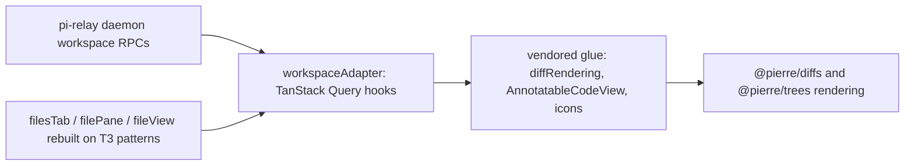

# T3 Code as a Frontend Donor for pi-relay — Partial-Adoption Assessment

**Repo inspected:** `github.com/pingdotgg/t3code` @ commit `6f69b4407f1e6e1aa56e46bbb51a0b133374eeae` (2026-08-08), shallow clone at `/home/schwinns/pi-relay/.pi/migration-research/repos/t3code`. Versions: `apps/web`/`apps/server` **0.0.32**. License: MIT (root `LICENSE`, "Copyright (c) 2026 T3 Tools Inc."). Read-only inspection; no deps installed, no builds run.

**Question:** can pi-relay subsume parts of T3 Code (git/file views) or rely on its provider contract, alongside the prime-agent RLM/IPython backend migration? Builds on `../t3-code-research.md` (2026-07), which rejected wholesale adoption.

## Table of Contents

- A. Component modularity — the git/file views
- B. The provider-driver contract
- C. Server coupling (where the web app gets its data)
- D. License, layout, and practicality of submoduling/vendoring
- E. Recommendation (three options compared)

## TL;DR

- **Git/file views: polished, entirely server-fed, not liftable as-is.** Every panel reads through Effect-atom state (`@effect/atom-react` → `@t3tools/client-runtime` → Effect RPC over WS). Transitive closures: 92–291 files (composer/Lexical, terminal/WASM, connection supervisor included).
- **The rendering tech is not T3's code**: diffs/code-view/editing = **`@pierre/diffs`** (Apache-2.0), file tree = **`@pierre/trees`** (Apache-2.0). pi-relay can npm-install both today.
- **Provider contract: clean SPI, Effect-native.** `ProviderAdapterShape` (`apps/server/src/provider/Services/ProviderAdapter.ts:45`) = 12 methods, all returning `Effect.Effect`, plus a `Stream` of 49 event types. An in-process SPI inside the T3 server — not a wire contract pi-relay's bridge can implement.
- **All git/file logic is server-side** (~12k LOC under `apps/server/src/{vcs,git,checkpointing,review,sourceControl}`). pi-relay's `workspace.list_dir/read_file/git_status/git_diff` already match the shapes the views render (§C.3).
- **Recommendation: Option 3 — cherry-pick.** npm-adopt `@pierre/diffs`/`@pierre/trees`, vendor ~700–900 LOC of T3's pure glue (MIT), wire to pi-relay's existing workspace RPCs via TanStack Query. No fork, no submodule, no T3 provider driver. §E.

---

---

## A. Component modularity — the git/file views

### A.1 Where the components live

All file/git UI lives in `apps/web/src`, mounted from the `ChatView.tsx` monolith (6,480 LOC, 120 imports; panels `lazy()`-imported at `apps/web/src/components/ChatView.tsx:418-419`). No separate "views package" — one app module graph.

| View | File | LOC | Role |
| ---- | ---- | --- | ---- |
| File tree/browser | `apps/web/src/components/files/FileBrowserPanel.tsx` | 379 | Searchable tree, context menu, drag-to-composer mentions |
| File viewer/editor | `apps/web/src/components/files/FilePreviewPanel.tsx` | 1,076 | Breadcrumbs, code view, **in-place editing** (`projects.writeFile`), markdown render, image preview, embedded explorer |
| Diff panel | `apps/web/src/components/DiffPanel.tsx` (+`DiffPanelShell.tsx` 112) | 1,196 | Turn-checkpoint diffs, branch-range + unstaged diffs; split/unified, whitespace toggle, collapse |
| Annotatable code/diff view | `apps/web/src/components/diffs/AnnotatableCodeView.tsx` | 281 | Line-select + review-comment annotations on diffs |
| Git actions (commit/push/PR) | `apps/web/src/components/GitActionsControl.tsx` (+`.logic.ts`) | 2,039 | Status summary, commit/push/pull/init, stacked actions, PR flows; mounted at `components/chat/ChatHeader.tsx:324` |
| Branch/worktree toolbar | `apps/web/src/components/BranchToolbar.tsx` (469) + `BranchToolbarBranchSelector.tsx` + `BranchToolbarEnvModeSelector.tsx` | ~1,000 | Branch picker, local-vs-worktree env mode |
| PR dialog | `apps/web/src/components/PullRequestThreadDialog.tsx` | 305 | Open a thread from a PR ref |
| Worktree lifecycle | *no dedicated panel* — see §A.3 | — | Worktrees are per-thread, via thread create/delete flows |

Pure glue (Effect-free, verified in §A.5): `apps/web/src/lib/diffRendering.ts` (245), `lib/diffCollapse.ts` (13), `lib/turnDiffTree.ts`, `lib/baseRefChoices.ts` (61), `components/files/{filePath,filePreviewMode,fileLineReveal,fileContentRevision,fileCommentAnnotations,fileTreeDragMention}.ts`, `pierre-icons.ts`.

### A.2 What each cluster imports

**FileBrowserPanel** (`FileBrowserPanel.tsx:1-23`): the tree widget is external — `FileTree, useFileTree, useFileTreeSearch` from `@pierre/trees/react` (:6); icons from `~/pierre-icons`. Data: `useProjectEntriesQuery(environmentId, cwd)` (:111) — an Effect-atom wrapper (`projectFilesQueryState.ts:1-16`: `@effect/atom-react`, `effect/unstable/reactivity`, `@t3tools/client-runtime/state/runtime`) over RPC `projects.listEntries`. Also pulls `~/composerHandleContext`, `~/localApi`, `~/hooks/useTheme`, and `~/components/ui/{button,input-group,tooltip,toast}`. Props are clean (`:25-34`: environmentId, cwd, selectedPath, onOpenFile) — the coupling is all in hooks.

**FilePreviewPanel**: imports `effect/Schema` directly (:16), `@t3tools/contracts` (:6), `@t3tools/shared/filePreview` (:7), `@t3tools/client-runtime/state/runtime` (:14). Data: `useProjectFileQuery(...)` (:782) → RPC `projects.readFile`; save via `useAtomCommand(projectEnvironment.writeFile)` (:411) → `projects.writeFile`. Rendering: `File` + `Virtualizer` from `@pierre/diffs/react` (:8-10, used :1019) read-only, `EditProvider` + `<File contentEditable>` via `@pierre/diffs/editor` (:9, :643-700) for editing — **the "file editor" is a pierre component, not T3 code**. Heavy non-data integration: composer drafts, preview panel, review comments, terminal links, asset URLs, open-in-editor.

**DiffPanel** (`DiffPanel.tsx`): imports `@effect/atom-react` (:1), `@t3tools/client-runtime/{state/runtime,errors}`, `@t3tools/contracts`, `@tanstack/react-router`, zustand (`../diffPanelStore`). Data, all Effect atoms:
- `vcsEnvironment.status({...})` (:354-356) → server-pushed stream RPC `subscribeVcsStatus` (`packages/contracts/src/rpc.ts:499-504`, `stream: true`);
- `reviewEnvironment.diffPreview` via `useEnvironmentQuery` (:453,:470) → RPC `review.getDiffPreview` (`rpc.ts:203`);
- `useAtomCommand(reviewEnvironment.diffFileContents)` (:353) → RPC `review.getDiffFileContents` (`rpc.ts:204`);
- `useCheckpointDiff(...)` (:442) → checkpoint diff projection (`orchestration.getTurnDiff`/`getFullThreadDiff`, `packages/contracts/src/orchestration.ts:29-30`);
- `vcsEnvironment.listRefs(...)` (:572-597) → RPC `vcs.listRefs`.

Rendering: `FileDiffContentsLoader` from `@pierre/diffs` (:2, :520) feeding `AnnotatableCodeView`.

**GitActionsControl** (2,039 LOC): `@effect/atom-react`, `effect/Option`, `@t3tools/client-runtime/state/runtime`, `@tanstack/react-router`, `@base-ui/react/radio`; data via `vcsEnvironment.status` (:1083), `sourceControlEnvironment.discovery` (:376), `vcsActionManager` commands (`useVcsPullAction`/`useGitStackedAction`/`useVcsInitAction`, `state/sourceControlActions.ts`), `~/state/{entities,server,threads}`. The most T3-coupled of the cluster — the frontend half of the server's GitManager/stacked-action machinery and source-control provider registry.

**BranchToolbar\***: branch list via `vcsEnvironment.listRefs` atoms; worktree switching dispatches **thread-model mutations** (`worktreePath`, `envMode`) into the orchestration command stream (`BranchToolbarBranchSelector.tsx:154-183`), not a plain git RPC. A "worktree" is a thread property (`packages/contracts/src/orchestration.ts:366`).

### A.3 Worktree management UI

There is **no standalone worktree manager**. Worktrees are created implicitly when a thread starts in `"worktree"` env mode (thread-create payloads carry `worktreePath`/`envMode`, `Sidebar.tsx:2582-2641`), shown as thread metadata (`Sidebar.tsx:498-601`), and removed on thread cleanup (`hooks/useThreadActions.ts:171,413` → RPC `vcs.removeWorktree`). The low-level RPCs exist (`vcs.createWorktree`/`removeWorktree`/`createRef`/`switchRef`, `packages/contracts/src/rpc.ts:191-194`), but the UI semantics are thread-lifecycle semantics — entangled with T3's thread model, not extractable as a module. pi-relay's per-session workspaces have the same shape, so the concept maps; the code doesn't.

### A.4 PR flows

Client: `PullRequestThreadDialog.tsx` (305 LOC, atom-wired) + PR-create UI inside `GitActionsControl`. Server: full source-control stack — `apps/server/src/sourceControl/` with `GitHubCli.ts`, `GitLabCli.ts`, `AzureDevOpsCli.ts`, `BitbucketApi.ts` (shells out to `gh`/`glab`/APIs server-side) plus `git.resolvePullRequest`/`git.preparePullRequestThread` in `apps/server/src/git/GitManager.ts`. Nothing reusable without the server.

### A.5 Coupling verdict per cluster

Measured by transitive import closure (relative + `~/` imports followed):

| Cluster | Closure | Effect in closure? | Lift verdict |
| ------- | ------- | ------------------ | ------------ |
| `FileBrowserPanel` | **282 files** | 29 effect modules, 50 `@t3tools/*` subpaths, Lexical, ghostty WASM | Rewrite data + composer hooks; visual shell (tree config, context menu, reveal logic) portable with ~1–2 days surgery. |
| `FilePreviewPanel` | **291 files** | same + direct `effect/Schema` | Rewrite data hooks; de-integrate preview/composer/terminal-links/review-comments. Editing surface comes free with `@pierre/diffs/editor`. |
| `DiffPanel` | **92 files** | `@effect/atom-react`, client-runtime | Smallest closure but most server-semantics-coupled (checkpoint turns, branch-range sources). Re-skinning onto `workspace.git_status/git_diff` ≈ rewriting the data half (~600 of 1,196 lines). |
| `GitActionsControl` | — | yes + source-control registry | **Do not lift.** Reimplements T3-server git workflows; pi-relay has no commit/push/PR RPCs. |
| `BranchToolbar*` | — | yes | **Do not lift.** Thread-model-coupled. |
| Pure glue (`lib/diffRendering.ts`, `diffCollapse.ts`, `turnDiffTree.ts`, `baseRefChoices.ts`, `files/filePath.ts`, `filePreviewMode.ts`, `fileLineReveal.ts`, `fileContentRevision.ts`, `fileCommentAnnotations.ts`, `pierre-icons.ts`, `diffs/AnnotatableCodeView.tsx` minus comment wiring) | standalone | **none** (zero effect/`@t3tools` imports; `baseRefChoices.ts` imports only two contract types) | **Vendorable as-is** (MIT), ~700–900 LOC. |

### A.6 UI primitives and styling

- Tailwind CSS v4 (`apps/web/src/index.css:1`) — same major as pi-relay.
- Local shadcn-*style* primitives in `apps/web/src/components/ui/`, but built on **Base UI** (`@base-ui/react@^1.4.1`), not Radix (e.g. `components/ui/button.tsx:3-5`: `mergeProps`/`useRender`/`cva`). pi-relay uses Radix — vendored panels need `~/components/ui/*` imports rewritten to pi-relay primitives (mechanical), or ~2.6k LOC of T3 primitives vendored too (button, tooltip, toggle-group, switch, combobox 403, menu 302, scroll-area, input-group, toast 811, input, dialog, spinner, checkbox, radio-group, group, textarea, popover).
- Icons: `lucide-react` (same as pi-relay) + a Nerd Font file-icon font (`assets/fonts/SymbolsNerdFontMono-Regular.woff2`, via `pierre-icons.ts`).
- Tree/diff views render inside **shadow DOM** with `unsafeCSS` escape hatches (`FileBrowserPanel.tsx:36-46`) — token-based, self-contained theming; won't clash with pi-relay's CSS.

---

## B. The provider-driver contract

### B.1 Where it lives

Two layers, both in `apps/server/src/provider/`:

**`ProviderDriver` SPI** (`ProviderDriver.ts`):

```ts
// ProviderDriver.ts:119
export interface ProviderDriver<Config, R = never> {
  readonly driverKind: ProviderDriverKind;              // open branded slug, NOT a closed enum
  readonly metadata: ProviderDriverMetadata;            // displayName, supportsMultipleInstances
  readonly configSchema: Schema.Codec<Config, unknown>; // Effect Schema codec
  readonly defaultConfig: () => Config;
  readonly create: (input: ProviderDriverCreateInput<Config>)
    => Effect.Effect<ProviderInstance, ProviderDriverError, R | Scope.Scope>;  // :154
}
```

`ProviderDriverKind` is an open branded slug (`packages/contracts/src/providerInstance.ts:18,70`), so a `"primeAgent"` kind needs **no contracts change**. `create()` returns a `ProviderInstance` (`ProviderDriver.ts:64`): three captured closures — `snapshot: ServerProviderShape` (availability/models/capabilities + `streamChanges`), `adapter: ProviderAdapterShape`, `textGeneration`. Registration is an array append: `BUILT_IN_DRIVERS` at `apps/server/src/provider/builtInDrivers.ts:47`.

**`ProviderAdapterShape`** (`Services/ProviderAdapter.ts:45`) — the session/turn contract, every method returning `Effect.Effect<_, TError>`:

| Method | Signature |
| ------ | --------- |
| `startSession` | `(ProviderSessionStartInput) → ProviderSession` (:55) |
| `sendTurn` | `(ProviderSendTurnInput) → ProviderTurnStartResult` (:62) |
| `interruptTurn` | `(threadId, turnId?) → void` |
| `respondToRequest` | `(threadId, requestId, decision) → void` — approvals |
| `respondToUserInput` | `(threadId, requestId, answers) → void` — structured input |
| `stopSession` / `stopAll` | `(threadId) → void` / `() → void` |
| `listSessions` / `hasSession` | `() → ProviderSession[]` / `(threadId) → boolean` |
| `readThread` / `rollbackThread` | `(threadId) → ProviderThreadSnapshot` / `(threadId, numTurns) → …` |
| `streamEvents` | `Stream.Stream<ProviderRuntimeEvent>` (:125) — the single outbound channel |

Payloads are plain structs (`packages/contracts/src/provider.ts:54-86`): start = `{threadId, cwd?, modelSelection?, resumeCursor?, approvalPolicy?, sandboxMode?, runtimeMode}`; turn = `{threadId, input?, attachments?, modelSelection?, interactionMode?}`; result = `{threadId, turnId, resumeCursor?}`.

### B.2 The session/event model

Hierarchy **session → thread → turn → item**, with `content.delta` for streaming and `request.opened/resolved` for approvals. `ProviderRuntimeEvent` is a union of **49 event types** (`packages/contracts/src/providerRuntime.ts:149-198`, union at :1139): session/thread/turn lifecycle; `item.started/updated/completed` over canonical item types (`user_message`, `assistant_message`, `reasoning`, `plan`, `command_execution`, `file_change`, `mcp_tool_call`, `collab_agent_tool_call`, `web_search`, `context_compaction`, … :104-134); `request.opened/resolved` over canonical request types (`command_execution_approval`, `file_change_approval`, `apply_patch_approval`, `tool_user_input`, … :136-147); `user-input.requested/resolved`; plus `task.*` (subagent runs), `hook.*`, `tool.progress/summary`, `auth.status`, `account.*`, `mcp.status.updated`, `files.persisted`, `runtime.warning/error`.

Adapters never touch clients. Server-side reactors consume `streamEvents`; `ProviderRuntimeIngestion` translates events into orchestration commands (`thread.message.assistant.delta`, …), the event-sourced engine persists them, clients observe via `orchestration.subscribeThread` (`docs/internals/providers.md`). The orchestration layer genuinely does not know which provider is behind a thread.

### B.3 What a "pi-relay bridge / prime-agent" driver would have to implement

Following the OpenCode precedent (the only driver that attaches to an already-running server via `serverUrl`, `Layers/OpenCodeAdapter.ts:1190`):

1. `Drivers/PrimeAgentDriver.ts` — `driverKind: "primeAgent"`, config schema (daemon URL, token), `create()` wiring snapshot+adapter (~200 LOC; `OpenCodeDriver.ts` is 195).
2. `Layers/PrimeAgentAdapter.ts` — the real work: connect to the pi-relay bridge WebSocket, map `startSession/sendTurn/interrupt/…` onto pi-relay RPCs, subscribe to pi-relay's event stream, **translate pi-relay's 34-event catalog into the 49-type `ProviderRuntimeEvent` union**. Reference shape: `Queue.unbounded<ProviderRuntimeEvent>()`, translate provider-native events in, expose `streamEvents = Stream.fromQueue(queue)` (`OpenCodeAdapter.ts:588,1143,1716-1717`).
3. Register in `BUILT_IN_DRIVERS`. No orchestration/contract/client change (`docs/internals/providers.md:40`).

**Effort reality check:** built-in adapters run 1,182–4,591 LOC (`Layers/ClaudeAdapter.ts` 4,591; `CodexAdapter.ts` 1,997 + `CodexSessionRuntime.ts` 1,915; `OpenCodeAdapter.ts` 1,721; `GrokAdapter.ts` 1,464; `CursorAdapter.ts` 1,182), all idiomatic Effect (`Effect.gen`, `Queue`, `Stream`, `Scope` finalizers). A prime-agent adapter lands in the same range: **~1,000–2,000 LOC of Effect**, plus resolving the checkpointing/orchestration duplication from the 2026-07 research (T3 brackets every turn with git checkpoints via `CheckpointReactor`; pi-relay's runtime owns workspace semantics).

### B.4 Is it "the nice simple contract"?

**No — not for pi-relay's purposes.** The *conceptual* contract is admirable: 12 methods + one event stream, open driver kinds, clean registry separation, plain-struct payloads. But it is an **in-process Effect SPI**, not a wire contract: every method returns `Effect.Effect`, `streamEvents` is an Effect `Stream`, config is a `Schema.Codec` (`ProviderAdapter.ts:45-127`, `ProviderDriver.ts:119-156`); a driver is TypeScript against Effect 4 beta running inside the T3 server with its lifecycle scopes. And the 49-type event model is T3-orchestration-shaped (turns, `turn.diff.updated` checkpoints, realtime audio, MCP status): pi-relay's distinctive concepts (RLM subagent tree, continual-harness state, IPython cell outputs) have no canonical item type — `collab_agent_tool_call` is nearest and lossy.

pi-relay's actual plan — a TS bridge speaking pi-relay's own documented WS contract (`pi-relay-frontend-contract.md` §3) — already has the simpler contract it needs. Implementing T3's SPI means running the bridge inside a T3 server fork; that only makes sense under wholesale adoption, which stays rejected.

---

## C. Server coupling — where the web app gets its data

### C.1 The client data layer

- **No TanStack Query anywhere in T3's web app** (`apps/web/package.json`: `@effect/atom-react`, `effect`, `zustand`; the only TanStack deps are `react-router` and `react-pacer`). All server data flows through **Effect atoms**: `apps/web/src/state/*.ts` are 5–10-line bindings of factories from `@t3tools/client-runtime/state/*` onto `connectionAtomRuntime` (e.g. `apps/web/src/state/git.ts:1-6`, `state/vcs.ts:1-10`).
- The factories (`packages/client-runtime/src/state/{git,filesystem,vcs,review,...}.ts`) wrap `WS_METHODS` RPC tags as query/command/subscription atom families (`packages/client-runtime/src/state/runtime.ts`); components consume via `useEnvironmentQuery`/`useAtomCommand` (`apps/web/src/state/query.ts:25-37`). Example depth: `client-runtime/src/state/vcs.ts` is 341 lines of `Effect.fn`/`Stream`/`Schedule` with a persisted offline refs cache — not portable without Effect.
- Transport: **Effect RPC over WebSocket** (`WsRpcGroup`, served by `RpcServer` from `effect/unstable/rpc`, `apps/server/src/ws.ts:63`), streaming members for server-push (`subscribeVcsStatus`, `rpc.ts:499-504`; `orchestration.subscribeThread/subscribeShell`, `packages/contracts/src/orchestration.ts:26-34`), plus HTTP snapshot bootstrap (`client-runtime/src/state/{threadSnapshotHttp,shellSnapshotHttp}.ts`).

The web app is a **pure renderer over server data**, but the pipe is Effect-RPC-shaped end to end. Feeding it from a non-Effect backend means reimplementing the Effect RPC server protocol (option B of the 2026-07 doc — still the worst option).

### C.2 How much git/file functionality is server-side

**All of the git work, most of the file work.** Server-side (non-test LOC):

| Server area | Key files | LOC | Does |
| ----------- | --------- | --- | ---- |
| `apps/server/src/vcs/` | `GitVcsDriverCore.ts` 3,090; `GitVcsDriver.ts` 888; `VcsStatusBroadcaster.ts` 596 | ~5,600 | status compute + push broadcasts, refs, worktrees, pull, init, jj abstraction |
| `apps/server/src/git/` | `GitManager.ts` 2,229; `GitWorkflowService.ts` 337 | ~2,600 | stacked actions (commit/push/PR), PR resolve/prep, progress streams |
| `apps/server/src/checkpointing/` | `CheckpointStore.ts`, `CheckpointDiffQuery.ts` 291 | ~800 | per-turn hidden-ref checkpoints; turn/thread diff queries |
| `apps/server/src/review/` | `ReviewService.ts` 141 | ~280 | `review.getDiffPreview`/`getDiffFileContents` — runs `git diff`, returns unified text |
| `apps/server/src/sourceControl/` | GitHub/GitLab/AzureDevOps/Bitbucket providers | ~4,000 | PR/MR discovery, create, clone, publish |
| projects/files | handlers in `apps/server/src/ws.ts` (2,239 total) + search index | — | `projects.listEntries` (whole-tree listing from a server-side frecency **search index**, `packages/contracts/src/project.ts:73-82`), `projects.readFile` (contents + `truncated`, `project.ts:194-206`), `filesystem.browse` |

Client side is rendering + interaction state only; even diff *parsing* is delegated to `@pierre/diffs` (`parsePatchFiles`, `apps/web/src/lib/diffRendering.ts:1`).

### C.3 Could pi-relay's existing workspace RPCs feed T3's views?

Yes at the data-shape level:

| T3 view need | T3 RPC / payload | pi-relay equivalent (contract §9.9) | Gap |
| ------------ | ---------------- | ----------------------------------- | --- |
| File tree entries | `projects.listEntries` → whole-tree `{path, kind}[]` | `workspace.list_dir` (paged per-dir) | Shape differs: adapter walks `list_dir` recursively, or the bridge adds an aggregate (pi-relay's lazy model is arguably better for huge trees). |
| File contents | `projects.readFile` → `{contents, byteLength, truncated}` | `workspace.read_file` (prefix + totalSize + mtime) | Trivial: decode prefix, `truncated = totalSize > returned`. |
| File save | `projects.writeFile` | none (pi-relay pane is read-only) | Only if editing is wanted — defer. |
| Git status | `subscribeVcsStatus` stream + `vcs.refreshStatus` | `workspace.git_status` (+ branch comparison w/ PR metadata) + `workspace.fs_changed` | Pull+invalidate vs push-stream; equivalent for UI. |
| Branch/working-tree diff | `review.getDiffPreview` → `{sources: [{kind: working-tree\|branch-range, diff: unified text, truncated}]}` | `workspace.git_diff` (`against: working_tree\|branch`, unified text, binary/truncated flags) | **Near-perfect match** — `@pierre/diffs`' `parsePatchFiles` consumes exactly this. |
| Per-file diff contents | `review.getDiffFileContents` → `{oldContents, newContents}` | derivable from `workspace.git_diff` / `read_file` at refs | Small adapter logic. |
| Refs/branches | `vcs.listRefs` | partly in `workspace.git_status` comparison | Fine for the views pi-relay is building. |
| Turn-checkpoint diffs | `orchestration.getTurnDiff` / `subscribeThread` projection | none (RLM backend has no turn checkpoints) | **Missing concept** — only needed for T3's per-turn diff selector; skip. |
| Commit/push/PR actions | `git.runStackedAction`, `vcs.pull`, source-control RPCs | none | **Missing concept** — out of scope for *viewing*. |

Bottom line: pi-relay's workspace RPCs already carry everything the **viewing** components render. What can't be fed without new backend concepts are the *action* surfaces (stacked git actions, PR creation, turn checkpoints) — which the owner doesn't want anyway.

---

## D. License, layout, and practicality of submoduling/vendoring

### D.1 License

Root `LICENSE`: **MIT, Copyright (c) 2026 T3 Tools Inc.** — confirmed in-repo and via GitHub API. Vendoring requires only retaining the notice. The rendering deps are **Apache-2.0** (`@pierre/diffs@1.3.x`, `@pierre/trees@1.0.0-beta.x` per npm registry) — permissive; normal `node_modules` consumption.

Caveat: `CONTRIBUTING.md` — "We are not actively accepting contributions right now"; external PRs will likely be closed. Combined with **~480 commits in the last 30 days** (GitHub API since 2026-07-08; HEAD pushed 2026-08-09), 17.4k stars, 1.3k open issues: any fork diverges immediately, upstreaming is not a path, and even vendored files drift from upstream within weeks.

### D.2 Monorepo layout

```
apps/        web (React SPA) · server (t3 CLI/runtime) · desktop (Electron) · mobile (Expo) · marketing
packages/    contracts (Effect Schema wire types) · client-runtime (connection+atoms) · shared
             ssh · tailscale · effect-acp · effect-codex-app-server
infra/relay  hosted connect relay
```

Non-test LOC: `apps/web/src` ≈ **128k**, `apps/server/src` ≈ **100k**, `packages/{contracts 13.7k, client-runtime 16.8k, shared 9k}`.

### D.3 Can directories be git-submoduled?

Submodules pin whole repos, not directories. Options:

1. **Whole-repo submodule + sparse checkout** of `apps/web/src/components/{files,diffs,ui}` — technically possible, useless in practice: those directories don't build standalone (they import `~/state/*`, `~/lib/*`, `@t3tools/*` across the app; §A.5 closures are 92–291 files). You'd pin a 260k-LOC monorepo for ~3k LOC of usable view code, against a 480-commit/month upstream.
2. **Vendor (copy with provenance)** — the realistic mechanism. Copy the §E glue files, keep the MIT notice, record the upstream commit in a header. Refresh manually when desired.
3. **npm dependency** — the best "submodule" isn't T3 code: `@pierre/diffs` and `@pierre/trees` are versioned packages. pi-relay's tree is currently `@headless-tree`; swapping to `@pierre/trees` (or not) is a normal dependency decision.

### D.4 Dependency weight of the interesting directories

Verbatim vendoring of the three main panels would drag in:

- **Effect stack**: `effect@4.0.0-beta.103` + `@effect/atom-react@4.0.0-beta.103` (**beta**, v4 line), plus `@t3tools/contracts` (13.7k LOC of Effect Schema) and `@t3tools/client-runtime` (16.8k LOC incl. connection supervisor, relay auth via `jose`, DPoP). Alone disqualifies verbatim vendoring into a no-Effect SPA.
- **Base UI** (`@base-ui/react@^1.4.1`) under `components/ui/*` — a second primitive stack next to pi-relay's Radix.
- **Rendering**: `@pierre/diffs@1.3.0-beta.10` (shiki, `diff`, worker highlighting), `@pierre/trees@1.0.0-beta.4` (**preact-based core**, shadow-DOM rows — a second framework runtime), `@legendapp/list`, `@tanstack/react-pacer`.
- **Lexical** (composer mentions) and ghostty WASM (terminal links) — only via cross-features; droppable.

The pure glue set (§A.5) needs only `@pierre/diffs`, `@pierre/trees` (+icon font), and React — that is the viable vendor footprint.

---

## E. Recommendation

### E.1 Option 1 — adopt T3 wholesale — **still rejected** (re-verified)

The 2026-07 verdict holds and has hardened: Effect-everywhere (now Effect **v4 beta**), ~260k LOC with ~100k of server to run or excise, event-sourced orchestration + turn checkpointing duplicating the RLM backend's session semantics, worktrees-as-thread-properties colliding with pi-relay's workspace model, ~480 commits/month, contributions unwelcome. Nothing in the current tree reduces these costs.

### E.2 Option 2 — home-grown fork — **rejected**

A fork buys the panels but inherits the monolith (`ChatView.tsx` alone: 6,480 LOC / 120 imports; every panel reads through client-runtime atoms). It must either keep the T3 server (option 1 in disguise) or rewrite the whole data layer (§A.5 closures) — all of option 3's rewrite cost plus a permanent divergent fork of an alpha codebase whose upstream won't take patches.

### E.3 Option 3 — cherry-pick/vendor — **recommended, with a twist**

The honest finding: **what the owner likes about T3's git/file views is mostly `@pierre/diffs` and `@pierre/trees`, not T3 source.** T3's own panels are integration code — atom hooks, thread-model wiring, composer/terminal cross-links — exactly the part pi-relay cannot use. So:

**Step 1 (the 80% win): adopt the rendering packages directly.**

```text
npm i @pierre/diffs @pierre/trees        # Apache-2.0; T3 pins 1.3.0-beta.10 / 1.0.0-beta.4
```

- `@pierre/diffs`: split/unified diff views, `File` code viewer (virtualized, Shiki on a worker), `EditProvider` for contentEditable in-place editing, `parsePatchFiles` — consumes exactly the unified text `workspace.git_diff` already returns.
- `@pierre/trees`: shadow-DOM file tree with search, flatten-empty-dirs, icon theming, context menus. (Or keep `@headless-tree` and take only diffs; note its preact core adds a second framework runtime.)
- This replaces pi-relay's current renderers — the react-markdown fenced-block + `rehype-highlight` path in `packages/web/src/fileView.tsx:195-205` and the 50-line `unifiedDiff.ts` — with T3-grade rendering, zero T3 code.

**Step 2: vendor the thin pure glue (MIT, ~700–900 LOC), with a provenance header pinning commit `6f69b44`:**

| Vendor from t3code | LOC | Why |
| ------------------ | --- | --- |
| `apps/web/src/lib/diffRendering.ts` | 245 | theme resolution, patch parsing → `FileDiffMetadata`, render keys — the `workspace.git_diff`-to-`@pierre/diffs` bridge |
| `apps/web/src/lib/diffCollapse.ts` + `lib/turnDiffTree.ts` | ~100 | collapse-all state, diff→tree grouping |
| `apps/web/src/lib/baseRefChoices.ts` | 61 | base-ref picker logic (drop two `@t3tools/contracts` type imports — plain structs) |
| `apps/web/src/components/diffs/AnnotatableCodeView.tsx` | 281 | line-select + gutter annotations over `CodeView` — pi-relay's future review-comment surface |
| `apps/web/src/components/files/{filePath,filePreviewMode,fileLineReveal,fileContentRevision,fileCommentAnnotations,fileTreeDragMention}.ts` + `LocalCommentAnnotation.tsx` | ~250 | breadcrumbs, preview-mode rules, line reveal, comment model |
| `apps/web/src/pierre-icons.ts` + `assets/fonts/SymbolsNerdFontMono-Regular.woff2` | — | file-icon map for the tree |

Verified Effect-free/`@t3tools`-free (§A.5) — compiles against only `@pierre/*` + React.

**Step 3: treat T3's panels as reference implementations, not source.** Read `FileBrowserPanel.tsx` (tree config, reveal-on-select, context menu), `FilePreviewPanel.tsx` (view modes, truncated-file path, markdown toggle), `DiffPanel.tsx` (working-tree/branch source selector, split/unified, whitespace toggle) while rebuilding pi-relay's `filesTab.tsx`/`filePane.tsx`/`fileView.tsx`. Where T3 calls `useProjectEntriesQuery` / `vcsEnvironment.status` / `reviewEnvironment.diffPreview`, substitute TanStack Query hooks over pi-relay's existing contract — the adapter is small because the shapes already match (§C.3):

```ts
// packages/web/src/workspaceAdapter.ts (new, ~150 LOC) — the entire "T3 compatibility layer"
useWorkspaceEntries(projectRoot)  // recursive walk of workspace.list_dir  -> {path, kind}[]
useWorkspaceFile(root, relPath)   // workspace.read_file                    -> {contents, byteLength, truncated}
useGitStatus(root)                // workspace.git_status + fs_changed invalidate
useGitDiff(root, against)         // workspace.git_diff -> parsePatchFiles(diffText) -> FileDiffMetadata[]
```



**Do not vendor:** `GitActionsControl.tsx`, `BranchToolbar*`, `PullRequestThreadDialog.tsx`, `state/*`, `components/ui/*` (pi-relay has Radix equivalents), anything in `packages/client-runtime` or `packages/contracts`.

### E.4 Compared against "just finish pi-relay's own views"

pi-relay's workspace UI today is ~1,400 LOC (`filesTab.tsx` 425, `filePane.tsx` 241, `fileView.tsx` 239, `gitStatus.ts` 116, `gitComparison.tsx` 53, `unifiedDiff.ts` 50, `fileBrowser.ts` 167, `workspaceFileCache.ts` 106) on a contract that already covers what the T3 *views* need. "Just finish it" is viable but caps out at the current renderer (markdown-fence highlighting, hand-rolled diff lines, no virtualization — noticeable on 5k-line files and 50-file diffs, exactly the agent-workflow case). Option 3 is the same work with a better engine: ~3–6 days for the renderer swap + glue vendoring vs ~2–4 days polishing the current renderer — a small delta for a large quality jump, keeping every byte of pi-relay's contract and architecture. Upgrade path preserved: in-place editing later via `@pierre/diffs/editor` (T3's `EditableFileSurface`, `FilePreviewPanel.tsx:433-700`, is the recipe; needs a new `workspace.write_file` RPC).

### E.5 On the provider contract question (for the record)

If the owner ever wants T3 Code as an *alternative* surface over the same backend, the route is a `primeAgent` driver inside the T3 server (§B.3, ~1–2k LOC of Effect) — **not** a bridge the existing SPA can use. Given the explicit "don't want to stick too close to T3" constraint, don't build it now. The migration-relevant finding is negative: **T3's driver SPI cannot serve as pi-relay's bridge contract.**

---

## Appendix — key files index (paths under the t3code clone)

| Topic | Path:lines |
| ----- | ---------- |
| File tree panel | `apps/web/src/components/files/FileBrowserPanel.tsx:6,25-34,111,210-249` |
| File viewer/editor | `apps/web/src/components/files/FilePreviewPanel.tsx:8-16,411,652-700,757-1076` |
| Diff panel | `apps/web/src/components/DiffPanel.tsx:1-2,353-356,442-520` |
| File query atoms | `apps/web/src/components/files/projectFilesQueryState.ts:1-16,124-166` |
| Atom state bindings | `apps/web/src/state/{git,vcs,filesystem,query}.ts` |
| Client-runtime atom factories | `packages/client-runtime/src/state/{git,filesystem,vcs,review}.ts` |
| RPC surface | `packages/contracts/src/rpc.ts:169-204,487-541` |
| Diff contracts | `packages/contracts/src/review.ts:6-50` |
| Project/file contracts | `packages/contracts/src/project.ts:28-38,73-82,194-206` |
| Orchestration WS methods | `packages/contracts/src/orchestration.ts:26-34` |
| ProviderDriver SPI | `apps/server/src/provider/ProviderDriver.ts:64,119-156` |
| ProviderAdapter contract | `apps/server/src/provider/Services/ProviderAdapter.ts:45-127` |
| Event model | `packages/contracts/src/providerRuntime.ts:104-198,1139-1193` |
| Session/turn payloads | `packages/contracts/src/provider.ts:35-111` |
| Open driver-kind slug | `packages/contracts/src/providerInstance.ts:18,70` |
| Driver registry | `apps/server/src/provider/builtInDrivers.ts:47-53` |
| Adapter references | `apps/server/src/provider/Layers/{OpenCodeAdapter.ts:563-588,1143-1151,1716-1717; ClaudeAdapter.ts; CodexAdapter.ts}` |
| Provider docs | `docs/internals/providers.md` |
| Server git/vcs | `apps/server/src/{vcs/GitVcsDriverCore.ts, git/GitManager.ts, checkpointing/, review/ReviewService.ts, sourceControl/}` |
| WS server | `apps/server/src/ws.ts:63` |
| Worktree thread coupling | `apps/web/src/components/BranchToolbarBranchSelector.tsx:154-183`, `apps/web/src/hooks/useThreadActions.ts:171,413`, `packages/contracts/src/orchestration.ts:366` |
| License | `LICENSE` (MIT, T3 Tools Inc. 2026) |
