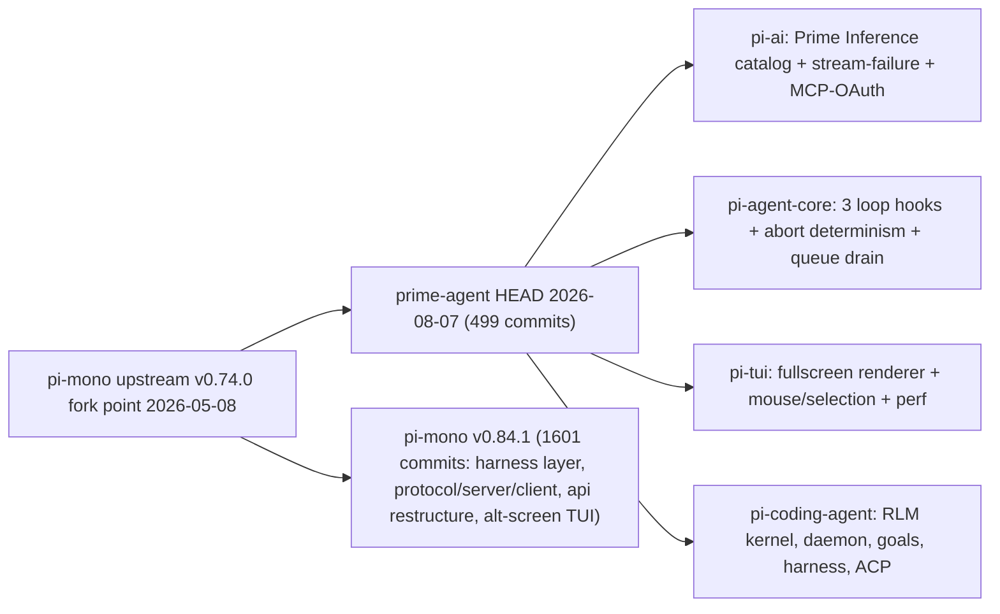
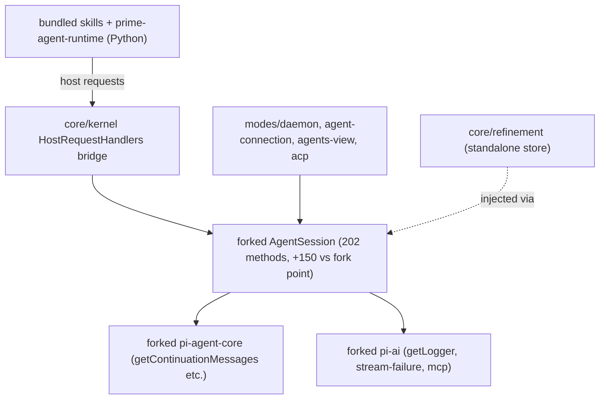

# Upstream Divergence Audit: prime-agent (PA) vs pi-mono (UP)

**Audit date:** 2026-08-09 · **Method:** git merge-base + per-tree diffs, read-only
**Repos:** PA=`repos/prime-agent` (HEAD `a18809e`, 2026-08-07), UP=`repos/pi-mono` (HEAD `4181f66`, 2026-08-08, v0.84.1)

## Headline: Per-Package Verdict Table

Fork point: upstream **v0.74.0** (merge-base `0bcaab4`, 2026-05-08). PA HEAD 2026-08-07 (499 commits). Upstream now **v0.84.1** (1,601 commits since fork; never merged by PA).

| PA tree | Upstream counterpart | PA delta (files, +/− LoC vs fork pt.) | Verdict |
|---|---|---|---|
| `packages/ai` (@earendil-works/pi-ai 0.7.1) | same name @ 0.84.1, restructured (`api/`+`auth/`+images) | 65 files, +11,449/−4,654 (≈2.5k hand-written; rest generated catalog) | **PATCH-UPSTREAM** — owner's "thin" claim confirmed for source; catalog moves to `registerProvider`/`models.json`; PR stream-failure/log/cache-pricing; MCP-OAuth stays PA-side |
| `packages/agent` (pi-agent-core 0.7.1) | same @ 0.84.1 + new `harness/` layer PA lacks | 9 files, +1,786/−266 | **PATCH-UPSTREAM** — 3 loop hooks + queue/abort/retry fixes are upstreamable PRs |
| `packages/tui` (pi-tui 0.7.1) | same @ 0.84.1, alt-screen rewrite | 49 files, +7,818/−439 | **FORK-JUSTIFIED** — both sides rewrote the render core; PA fullscreen/mouse/selection entangled with its renderer |
| `packages/coding-agent` (pi-coding-agent 0.7.1) | same @ 0.84.1 | 667 files, +183,188/−19,744 (416 new files; AgentSession 3.1k→11.2k lines, +150 methods) | **FORK-JUSTIFIED** — the RLM/daemon/kernel/harness product lives here; §6 lists 10 fork-bound behaviors |
| `packages/web-ui` | — | deleted (−16,571) | **DROP-CONFIRMED** |
| upstream `protocol`/`server`/`client`/`session-backends`/`telemetry`/`evals` | post-fork upstream additions | not taken | **STRATEGIC DIVERGENCE** — PA built its own daemon protocol instead |
| `core/kernel`, `core/refinement` | — | 3,329 + 1,018 LoC | **NET-NEW-KEEP** (extractable onto upstream deps) |
| `modes/daemon`+`agent-connection`+`agents-view`+`acp`+`session-worker`, `rlm-runtime`, `agent-messages`, `autonomous`, `goals`, `cron-jobs`, bundled `skills/`, `prime-agent-runtime` | — | ≈36k LoC | **NET-NEW-KEEP** (fork-bound: import forked AgentSession/AgentSessionRuntime) |
| root `prime-agent` bundle + install/postinstall | — | packaging | **NET-NEW-KEEP** |

## 1. Fork Relationship (git evidence)

- **PA clone:** `repos/prime-agent`, origin = `github.com/PrimeIntellect-ai/prime-agent`, HEAD `a18809e` (2026-08-07, "add privacy-safe agent analytics (#521)"). Originally shallow (1 commit); deepened to 1,050 commits for this audit.
- **Upstream:** `github.com/badlogic/pi-mono` fetched as `upstream` into the PA clone (2,251 commits on `upstream/main`); independent clone at `repos/pi-mono` HEAD `4181f66` (2026-08-08, package version **0.84.1**).
- **Merge-base:** `0bcaab4206a3ddbdba60cef2ce61497797f22a0b` — 2026-05-08, *"Add 'herrnel' to approved contributors list"* — i.e. **PA forked upstream at ≈ v0.74.0** (v0.74.0 tagged 2026-05-07; merge-base is one day later).
- **Divergence volume:** PA has **499 commits** since fork; upstream has **1,601 commits** since fork (~3.2× faster). PA's last upstream content is 3 months old.
- **PA never merged or rebased upstream** after forking: `git merge-base HEAD upstream/main` = the fork point, and PA's tree = fork-point + PA commits only. The two repos instead show **convergent parallel fixes** — e.g. the empty-tool-result placeholder bug was fixed independently in PA (`22e9900d`, 2026-06-30, #290) and upstream (`279f53b0`, 2026-07-06, #6290) within one week; same story for LaTeX-in-markdown and `terminal-colors.ts` in pi-tui, and the `"max"` thinking level / serviceTier plumbing in pi-ai.
- **Versioning decoupled:** PA renumbered all four retained packages to **0.7.1** (its own line: v0.0.1 → v0.7.1 tags in the PA clone) while keeping upstream package **names** (`@earendil-works/pi-ai` etc. — `packages/ai/package.json`). The published product is the root package `prime-agent` (root `package.json`) bundling everything into `dist/bundle/cli.js` (`packages/coding-agent/package.json` bin).
- Working-tree-vs-merge-base diffstat per package (PA's own delta, `git diff $MB HEAD`):

| Package | Files | +LoC | −LoC |
|---|---|---|---|
| packages/ai | 65 | 11,449 | 4,654 |
| packages/agent | 9 | 1,786 | 266 |
| packages/tui | 49 | 7,818 | 439 |
| packages/coding-agent | 667 | 183,188 | 19,744 |

(coding-agent insertions are dominated by tests + new dirs; see §3.4 breakdown.)

## 2. Repository Layout & Package Inventory

| PA path | Published name (PA) | Upstream counterpart | Upstream name | Status |
|---|---|---|---|---|
| `packages/ai` | `@earendil-works/pi-ai` @ 0.7.1 | `packages/ai` | `@earendil-works/pi-ai` @ 0.84.1 | FORKED (names retained) |
| `packages/agent` | `@earendil-works/pi-agent-core` @ 0.7.1 | `packages/agent` | same @ 0.84.1 | FORKED |
| `packages/tui` | `@earendil-works/pi-tui` @ 0.7.1 | `packages/tui` | same @ 0.84.1 | FORKED |
| `packages/coding-agent` | `@earendil-works/pi-coding-agent` @ 0.7.1 | `packages/coding-agent` | same @ 0.84.1 | FORKED (heavy) |
| ~~`packages/web-ui`~~ | — | existed at fork (87 files/16.5k LoC) | — | DELETED by PA |
| root package | `prime-agent` (bundled CLI) | — (root is private `pi-monorepo`) | — | NET-NEW packaging |
| `prime-agent-runtime/` (Python pkg) | shipped inside bundle | — | — | NET-NEW |
| `packages/coding-agent/skills/` (13 bundled skills) | shipped inside bundle | — | — | NET-NEW |
| — | — | `packages/protocol` | `@earendil-works/pi-protocol` | NOT-TAKEN (post-fork upstream) |
| — | — | `packages/server` | `@earendil-works/pi-server` | NOT-TAKEN (post-fork upstream) |
| — | — | `packages/client` | `@earendil-works/pi-client` | NOT-TAKEN (post-fork upstream) |
| — | — | `packages/session-backends` | — | NOT-TAKEN (post-fork upstream) |
| — | — | `packages/telemetry` | — | NOT-TAKEN (post-fork upstream); PA separately removed in-tree pi.dev telemetry |
| — | — | `packages/evals` | — (private) | NOT-TAKEN (post-fork upstream) |

Notes:
- No `@primeintellectai/*` scoped packages exist in the repo; PA publishes only `prime-agent` on npm with `file:`-tarball deps on the three renamed-but-not-rescoped pi packages (see prime-agent-deep.md §1).
- PA has **no** web-ui/pods/protocol packages; its remote surface is the bespoke daemon protocol (`packages/coding-agent/src/modes/daemon/daemon-protocol.ts`) + ACP mode, not upstream's pi-protocol/pi-server/pi-client split.
- At the merge-base the monorepo had exactly five packages: `agent`, `ai`, `coding-agent`, `tui`, `web-ui` (`git ls-tree $MB packages/`). PA kept four and **deleted `web-ui`**; upstream's `protocol`/`server`/`client`/`session-backends`/`telemetry`/`evals` are all **post-fork upstream additions** (first commits: protocol `56eb685b`, client `33bc0a7b`, server `8495f9d0`, session-backends `a80008b9`, telemetry `6b461b75`, evals `eafe11fb`) — PA never had them.

## 3. Forked-Package Deltas

All diffs are `git diff <merge-base 0bcaab4>..HEAD -- <path>` in `repos/prime-agent` (PA's own delta; PA never merged upstream). "UP" = `upstream/main` (= pi-mono @ v0.84.1).

### 3.1 packages/ai (pi-ai) — PA delta: 65 files, +11,449/−4,654

**Reality check on the owner's "thin fork" claim: mostly TRUE for source, but the number is inflated by one generated file and PA did add real, used features.** `models.generated.ts` alone is ±11,902 lines of the diff (auto-generated model catalog, regenerated by `scripts/generate-models.ts`, which PA rewrote ~660 lines to emit the **Prime Inference catalog** — commits `6e46b927` "add prime inference provider (#37)", `0bbe37a5` "include the full prime inference catalog (#350)"). Hand-written source delta is only ~2,500 lines:

- **Prime Inference provider/catalog** (PA-only): team-header auth (`13306f5d`), team-gated models (`fcbfd578`), vision gating (`6c116e9f`), catalog entries (glm, kimi, minimax, claude fable/opus, gpt-5.6). Tests: `test/prime-inference-models.test.ts` (221 lines). Woven into `models.generated.ts` + `generate-models.ts`; not separable from the catalog.
- **Stream-failure diagnostics** (PA-only, 232+171 lines): `src/utils/stream-failure.ts` + `src/log.ts` (88 lines, `getLogger` at log.ts:81) — classified `StreamFailureError` with request-id capture wired through anthropic/google/bedrock/vertex/mistral providers (commit `189bb146` "make provider failures diagnosable from logs (#313)"). Re-exported from `index.ts` (`export * from "./log.js"`). **Cross-package coupling: 5 coding-agent files import `getLogger`** — so consuming upstream pi-ai would need this shim re-homed.
- **MCP OAuth client** (PA-only, ~440 lines): `src/mcp/oauth.ts` (380), `mcp/catalog.ts` (53), new `./mcp` package export (package.json) — consumed only by `coding-agent/src/core/mcp/mcp-manager.ts:9`. Linear/Notion integrations (`2706aa2e`).
- **Provider behavior tweaks**: "max" thinking level (`6323ff15`; `ThinkingLevel` extended in agent-core too), OpenAI "fast mode"/service-tier (`fd1bd875`; 18 coding-agent files use `serviceTier`), Anthropic prompt-cache cost accounting via new `cache-pricing.ts` (63), `58c4b7c5` Prime-Inference anthropic caching fix, oauth-page branding (`22636f01`, cosmetic).
- **What PA did NOT take from upstream** (bigger than what PA wrote): upstream restructured pi-ai post-fork into `api/*` protocol impls (+`.lazy.ts` variants), `auth/*` (credential store, device-code, kimi-coding/openrouter/radius/xai OAuth), ~40 new per-provider catalog files, an **images API** (`images*.ts`), `model-catalog.ts`/`models-store.ts`, provider-retry utils. PA's tree is still the fork-era `providers/*` monolith layout. `git diff HEAD upstream/main -- packages/ai` = 340 files, +39k/−33k — the packages no longer converge.

**Compaction/caching note (correcting the wiki's framing):** the `cacheRetention:"none"` + fresh `sessionId` isolation for summarization calls is **not something PA dropped** — it did not exist at the fork point (verified: `git show $MB:.../compaction.ts` has neither). Upstream added it post-fork in `9b3a2059` (2026-07-22, *"isolate summarization requests"*; now `pi-mono/packages/coding-agent/src/core/compaction/compaction.ts:573-574`) together with a `completeSummarization` retry choke point (`:561-582`). PA's `generateSummary` still calls `completeSimple` with bare `{maxTokens, signal, apiKey, headers}` (`PA packages/coding-agent/src/core/compaction/compaction.ts:596`), so PA summaries keep default `cacheRetention:"short"` (anthropic.ts:54-61) = wasted cache writes, and no retry. PA instead built its own provider-retry at the AgentSession layer (`645f5147`, +108 lines in agent-session.ts). PA's pi-ai also ignores `sessionId` outside the faux test provider (`providers/faux.ts:215`); upstream now uses it for `x-session-affinity` headers (`pi-mono/packages/ai/src/api/anthropic-messages.ts:916`).

### 3.2 packages/agent (pi-agent-core) — PA delta: 9 files, +1,786/−266

Smallest fork. Same 5-file shape as fork point (`agent-loop.ts`, `agent.ts`, `types.ts`, `proxy.ts`, `index.ts`). Delta:

- **3 new AgentLoopConfig hooks** (types.ts): `getSystemPrompt?()` (:173 — dynamic system prompt per call), `shouldStopBeforeTurn?()` (:204), `getContinuationMessages?()` (:244 — host-owned continuation policy, the goal/heartbeat engine; commit `6ee71004` "add long-running goal continuation (#24)"). All three are PA-only; upstream has no equivalents (verified against `upstream/main:packages/agent/src/types.ts:178-292`).
- **Abort-determinism overhaul** of `agent-loop.ts` (695→986 lines; ~550 diff lines): `raceWithAbort`, `settlePostTurn`, `throwIfAborted`, `createAbortedAssistantMessage` — deterministic ctrl+c/cancel at every await point, incl. steering/follow-up polls (commits `5fa8ad44`, `c81beaa6`). Behavioral, not cosmetic; this is the delta most entangled with the file's control flow.
- **Queue rework** in `agent.ts` (+118): `enqueue`, `removeWhere` on steering/followUp queues, drain-queued-runs-after-idle (`3fc0ac54` "canonical session-input scheduling… (#540)").
- **Retry config plumbing** (`645f5147`), `serviceTier` (fast mode), "max" thinking level, `rlm-max-depth` session plumbing (`5929ebee`).
- Tests grew 914 lines (agent-loop.test.ts) covering the above.
- **Missed upstream:** the entire new `harness/` layer — agent-harness (lanes/runs API), SessionStorage abstraction (JSONL v4/memory/SQLite + conformance suite), bundled tools, skills/system-prompt helpers, telemetry context (32+ files; pi-mono-deep §3.3). PA's agent-core cannot offer those to dependents.

### 3.3 packages/tui (pi-tui) — PA delta: 49 files, +7,818/−439

A real product-UI fork, but **both sides rewrote the rendering core post-fork** (convergent, incompatible):

- **Fullscreen alternate-screen mode** (PA-only, 705 lines + 1,036 test lines): `src/fullscreen.ts` — scrollable transcript viewport, pinned dock, row-diffed frames, selection/copy incl. table-cell selection (`selection-metadata.ts`, 182), SGR mouse parsing (`mouse.ts`, 56), image fallbacks. ~15 commits (`4f0112fd` + follow-ups). Upstream instead split `tui.ts` into `tui-main-screen.ts`/`tui-alt-screen.ts` + `layout.ts`/`scroll-view.ts` — same feature class, different architecture; a merge would be a rewrite, not a cherry-pick.
- **LaTeX-as-unicode in markdown** (843 lines, `e4e6b518`) — upstream **independently** added `latex.ts` too (exists upstream, different impl). Same for `terminal-colors.ts` (206; exists upstream).
- **Editor work** (editor.ts +541 net): prompt stashing (`f9522609`), mid-prompt slash autocomplete (`ae44196c`), alias resolution (`55812404`), arrow-key navigation (`669a8227`), autocomplete overlay tests.
- **Perf**: `render-cache.ts` (VersionedRenderCache), streaming/flicker fixes (`7c4df729`, `abd0aacf`), scrollback preservation (`49b76db`, `10b0e40e`).
- Both sides touched the same hotspots: `tui.ts` MB 1,319 → PA 1,933 / UP 1,256; `editor.ts` MB 2,292 → PA 2,527 / UP 2,363; `markdown.ts` MB 852 → PA 1,012 / UP 1,010.

### 3.4 packages/coding-agent (pi-coding-agent) — PA delta: 667 files, +183,188/−19,744

The fork's center of gravity. 423 of PA's 499 commits touch this package. Breakdown of the 667 changed files: **416 new**, 231 modified, 19 deleted (the 19 deletions = upstream's `find/grep/ls/read/write` tools, old session-picker UI, superseded tests). The insertion count is inflated by `test/suite/` (54 new test files) and bundled `skills/` (13 skills, ~2k lines of markdown+py); core source delta is ≈60–70k lines.

**A. AgentSession surgery** — `core/agent-session.ts`: 3,110 lines at fork → **11,208 in PA** (upstream today: 3,342). Public/internal method count: 53 at fork → 55 upstream → **202 in PA**. PA's ~150 new methods cluster as: ~36 RLM (`runRlmChild` :9955, `registerRlmChildSession` :9422, `cancelRlmChildRun` :9504, registry/list/delete :9059-9338), ~22 goal state machine (`_startGoal` :1781, `_finishGoalForTerminalAssistantMessage` :1861, `handleGoalHostRequest` :2819), ~23 compaction orchestration (`_shouldStopForThresholdCompaction` :2201, `_mergeUnpersistedCompactionOutcomes` :4154), ~15 autonomous continuation (`_clearQueuedAutonomousContinuations` :2758), ~14 refine (`handleRefineHostRequest` :2902), ~13 inter-agent messaging (`handleAgentMessageHostRequest` :3056, `waitForAgentMessagePromptDelivery` :3247), ~13 queue (`_emitQueueUpdate` :1498, `transitionSessionAction`, prompt admission), heartbeats (`promptHeartbeat` :4512, `handleRlmHeartbeatHostRequest` :2967), kernel host wiring (`_createKernelHostHandlers` :8681, `_rlmKernelEnv` :8819). **Upstream added almost nothing here post-fork** (usage totals + `reload`/`waitForIdle`), so this file has no upstream convergence pressure — but also no upstream home: none of these 150 methods can ride upstream's extension events (see §6).

**B. New runtimes/modes** (all NET-NEW dirs, see §5): `modes/daemon/` (17,958 LoC/24 files; `DaemonSupervisor` daemon-supervisor.ts:579, protocol daemon-protocol.ts), `modes/agent-connection/` (3,773), `modes/agents-view/` (4,052), `modes/acp/` (864, `@agentclientprotocol/sdk ^1.3.0` dep added), `modes/session-worker/` (200), `core/kernel/` (3,329: Jupyter provisioning `bootstrap.ts:919` `ensureKernelPython`, `fork-server.ts:335`, snapshots `state-snapshot.ts`), `core/mcp/` (205 + pi-ai/mcp), `core/refinement/` (1,018: continual-harness CRUD + `formatHarnessStateForPrompt` refinement.ts:429), `core/prompts/` (206: RLM doctrine blocks). New core files: `rlm-runtime.ts` (242), `agent-messages.ts` (636), `agent-observe.ts` (200), `autonomous.ts` (593), `cron-jobs.ts` (1,736), `goals.ts` (290), `prompt-admission.ts`, `session-action-store.ts` (399), `session-lease.ts`, `session-resolver.ts`, `prime-inference-*.ts` (3 files), `telemetry.ts` rewritten (797, privacy-safe analytics replacing pi.dev telemetry; commit `a18809e`).

**C. Tool-surface inversion**: deleted `read/write/find/grep/ls` tools; default tool = single `ipython` (`core/tools/ipython.ts:706` `createIpythonTool`, 708 lines; `sdk.ts` docs: *"pi enables the default built-in tool (ipython)"*); kept `bash.ts`/`edit.ts` (kernel-bridged and `edit` skill). System prompt builds RLM/harness blocks: `system-prompt.ts:106,141` inject `formatHarnessStateForPrompt(...)`; `harnessState` option :35; recursion doctrine via `core/prompts/`. `zeromq ^6.1.2` dep added (Jupyter wire), `@mariozechner/clipboard` dropped.

**D. Session persistence** — `session-manager.ts` 1,425→2,324 (upstream 1,714): same JSONL v3 format (`CURRENT_SESSION_VERSION = 3`, :33 — **compatible**, entries additive), but 5 new entry types (`agent_status`, `session_state` active/archived/crash, `child_usage_attributed`, `service_tier_change`, `git_state`), header fields `parentSession`/`rlmDepth` (:81-91) enabling child-depth derivation (`resolveSessionRlmDepth`), buffer-based parsing for fast load, unique-file allocation, session leases (separate file). Upstream's post-fork persistence energy went into the *new* harness JSONL-v4/SQLite stores (agent-core harness/), which PA does not have.

**E. Queue semantics replaced**: upstream's steering/follow-up polling retained at agent-core level, but session input is re-scheduled through PA's "canonical session-input scheduling" (`3fc0ac54`): durable `session-action-store.ts`, `prompt-admission.ts` (42), preflight callbacks, queueable slash commands; agent.ts drains queued runs after idle. Inter-agent messages are **always steering-delivered** (CHANGELOG 0.7.0 breaking).

**F. Compaction**: core/compaction barely changed (+40: `KERNEL_PERSIST_SUMMARY_NOTE` :498-549, custom-instructions threading, `COMPACT_SKILL_NAME`), but the *trigger/orchestration* moved into AgentSession (threshold compaction + post-compaction autonomous continuation), and PA lacks upstream's post-fork summarization isolation/retry (§3.1 note).

**G. Interactive TUI app**: `interactive-mode.ts` 5,488→9,728 (upstream 6,399); ~15 new components (heartbeat-manager, prime-onboarding-splash, prime-team-selector, scoped-models-selector, configuration-menu/menu-panel, side-question, ipython-cell, subagent-summary-line…). Harness state is injected into the **prompt**, not a TUI menu (no HarnessState references in modes/interactive; surfacing is via system-prompt + agents-view + /goal /compact /refine skills).

**H. main.ts** 727→1,702: new mode wiring (daemon/attach/acp/agents-view), kernel preflight, update-restart; **cli-main.ts + postinstall.cjs** new (bundled dist/bundle/cli.js packaging).

## 4. Dropped Upstream Packages

| Upstream package | At fork? | Fate in PA |
|---|---|---|
| `packages/web-ui` | YES (87 files, 16,571 LoC) | **Deleted wholesale** (`git diff $MB HEAD -- packages/web-ui` = pure deletion). PA's UI story is the TUI + daemon protocol, no web UI. |
| `packages/telemetry` | no (post-fork upstream) | n/a — PA instead rewrote in-tree `core/telemetry.ts` (pi.dev endpoint removed; privacy-safe analytics `a18809e`) |
| `packages/protocol`, `server`, `client` | no (post-fork: protocol `56eb685b`, client `33bc0a7b`, server rename `8495f9d0`) | never taken; PA built its own daemon protocol instead |
| `packages/session-backends` | no (post-fork `a80008b9`) | never taken |
| `packages/evals` | no (post-fork `eafe11fb`) | never taken |

## 5. NET-NEW PA Packages / Trees

| Tree | Size | Purpose | Depends on forked internals? |
|---|---|---|---|
| `packages/coding-agent/src/modes/daemon/` | 17,958 LoC / 24 files | Long-running supervisor (`daemon-supervisor.ts:579`, 4,872 LoC) owning worker processes per session; unix-socket JSONL wire protocol (`daemon-protocol.ts`, 1,172); client (`daemon-client.ts`), crash recovery journals, heartbeat catalog, session catalogs, whole-tree idle eviction. | **YES** — imports forked `AgentSession`/`PromptOptions`/`rlmChildLabel` (daemon-mode.ts:79), `AgentSessionRuntimeConfig`, PA-only `getLogger` from pi-ai (:26), session-lease/resolver/action-store (all PA-only). Cannot sit on published upstream pi-coding-agent. |
| `packages/coding-agent/src/core/kernel/` | 3,329 LoC / 7 files | Jupyter kernel manager: venv provisioning (`bootstrap.ts:919` `ensureKernelPython`), kernel lifecycle, fork server for fast child kernels (`fork-server.ts:335`), state snapshot/restore (`state-snapshot.ts`), `HostRequestHandlers` bridge (kernel/index.ts:62-65). | **NO (bridge side)** — imports are node builtins + `config.js` + pi-ai's `registerSessionResourceCleanup` (exists upstream, session-resources.ts:5). Extractable as a standalone lib. BUT its consumers (host handlers) are AgentSession methods (agent-session.ts:8681-8920), so functionally it is only wired into the fork. |
| `packages/coding-agent/src/core/rlm-runtime.ts` + `agent-messages.ts` + `agent-observe.ts` | 242 + 636 + 200 LoC | RLM child-run runtime options/registry; inter-agent message routing/settlement; read-only family observation. | **YES** — rlm-runtime.ts:3 imports forked `AgentSession` type; message delivery settled via AgentSession queue (always-steering). |
| `packages/coding-agent/src/core/refinement/` | 1,018 LoC | Continual harness: memories/skills/subagents/prompt-notes CRUD + `formatHarnessStateForPrompt` (refinement.ts:429) injected into system prompt (system-prompt.ts:106,141). | **Mostly NO** — pure storage/format module (agent-session imports it, not vice versa). Could run against upstream; the injection point (`harnessState` prompt option) is fork-only. |
| `packages/coding-agent/src/core/autonomous.ts`, `goals.ts`, `cron-jobs.ts`, `prompt-admission.ts`, `session-action-store.ts`, `session-lease.ts`, `session-resolver.ts`, `side-question.ts`, `context-tree.ts` | ≈4,400 LoC | Goal state machine, autonomous continuation policy, heartbeat/cron jobs, durable queued session actions, session leases, side questions. | **Mixed** — goals/cron-jobs/refinement are standalone modules; they only become *behavior* through AgentSession's 202-method surface and the agent-core `getContinuationMessages` hook (PA-only, agent/types.ts:244). |
| `packages/coding-agent/src/modes/agent-connection/`, `agents-view/`, `session-worker/`, `acp/` | 3,773 + 4,052 + 200 + 864 LoC | Connection abstraction over daemon vs in-process sessions; multi-agent roster UI; daemon worker entrypoint; ACP (Zed-style) mode. | **YES** — all consume `AgentSessionRuntime` (forked; implements PA-only `SubagentRuntimeHost`) and PA-only core modules. |
| `packages/coding-agent/src/core/mcp/` (+ pi-ai `mcp/`) | 205 + ~440 LoC | MCP client manager + OAuth (Linear/Notion). Upstream rejected MCP-as-client philosophically (pi-mono-deep §11). | **Partially** — mcp-manager imports `@earendil-works/pi-ai/mcp` (PA-only export). |
| `packages/coding-agent/skills/` (13 bundled) | ≈1,991 LoC (md+py) | Python-backed skills: agent-message, agent-observe, attach-image, compact, edit, goal, linear, notion, prime-intellect, refine, rlm-heartbeat, skill-creator, websearch. | **YES (most)** — they are thin Python shims over kernel host requests (`rlm.run`, `goal.*`, `refine.*`, `agent_message.*`…), i.e. over forked AgentSession handlers. websearch/edit/attach-image are host-agnostic. |
| `prime-agent-runtime/` (root, Python) | 3,007 LoC py | Kernel-side `rlm` package (harness.py, skill.py, mcp_base.py) installed into the provisioned venv; deps: ipykernel, nest-asyncio, tyro. | **YES** — speaks the host-request protocol to forked AgentSession handlers. |
| Root packaging (`prime-agent` pkg, `install.sh`, `prime-agent.sh`, `scripts/bundle.mjs`, `postinstall.cjs`) | small | Single-file bundled CLI (`dist/bundle/cli.js`) with skills + Python runtime embedded; self-update from PrimeIntellect releases. | n/a (packaging). |

## 6. Hard Fork Dependencies (if the coding-agent fork were abandoned)

Cross-referenced against pi-mono-deep.md §11's 27 seams (verified still current on `upstream/main`: extension events list unchanged apart from additions; `ExtensionContext` now also has `sendUserMessage(deliverAs: "steer"|"followUp")`, `sendMessage`, `compact()`, `newSession()`, `fork()`, `appendEntry` — upstream ext-types.ts:1302-1325,344,361,368). "Hard" = no upstream seam can re-host the behavior.

| # | PA behavior | Evidence (PA tree) | Closest upstream seam | Why the seam is insufficient |
|---|---|---|---|---|
| H1 | **In-process RLM child sessions** with depth limits, shared registry, cancellation propagation, usage attribution | `agent-session.ts` `runRlmChild` :9955, `registerRlmChildSession` :9422, `rlmDepth` in session header `session-manager.ts:81-91` | Seam 17 (extension subagent example = subprocess) | Subprocess children can't share the in-process registry, depth accounting, `emitChildUpdate` events, or cancel propagation; upstream core has no child-session concept ("in-process subagents/roster" explicitly absent, pi-mono-deep §11) |
| H2 | **Kernel↔host bridge handlers** (`rlm.run`, `goal.*`, `compact.*`, `refine.*`, `rlm_heartbeat.*`, `agent_message.*`, `agent_observe.*`) | `agent-session.ts` `_createKernelHostHandlers` :8681-8920; `handle*HostRequest` :2819-3124 | Seam 3 (`registerTool`) + seam 9 (tool_call) | A registered tool could spawn a kernel, but host requests are serviced by 150 fork-only AgentSession methods; there is no extension-reachable object with that API |
| H3 | **Goal continuation inside the agent run** (same-run continuation with steering precedence + usage accounting) | `agent/types.ts:244` `getContinuationMessages`; `agent-session.ts` `_runOrQueueGoalContext` :2059 | Seam 24 loop hooks / `agent_end` + `sendUserMessage` | Upstream has no continuation hook (verified `upstream/main:packages/agent/src/types.ts:178-292`); extension emulation restarts a *new* run, losing in-run queue semantics and goal token/wall-clock accounting (`_accountGoalUsageForAssistantMessage` :2108) |
| H4 | **Canonical session-input scheduling**: durable queued commands, prompt admission/preflight, queueable slash commands | `core/session-action-store.ts` (399), `core/prompt-admission.ts`, `agent.ts` drain-after-idle (`3fc0ac54`) | Seam 24 `getSteeringMessages`/`getFollowUpMessages` | Poll hooks return transient message batches; they can't persist, inspect, cancel-by-predicate (`removeWhere`), or preflight-admit commands across restarts |
| H5 | **Daemon supervisor**: worker-process isolation, unix-socket protocol, crash recovery, self-update resume, whole-tree idle eviction | `modes/daemon/` (17,958 LoC), `daemon-supervisor.ts:579`, `46152581`, `d93b3cbe`, `4d19005d` | Seam 27 (`--mode rpc`) / upstream pi-server | RPC mode is single-session stdio; pi-server/pi-client is a different, session-storage-centric architecture PA never took; no supervisor/lease/recovery seam |
| H6 | **Heartbeats / cron wakeups** driving prompts into sessions | `core/cron-jobs.ts` (1,736 LoC), `promptHeartbeat` :4512, daemon `heartbeat-catalog.ts` | none (§11: "wakeups/heartbeats" absent) | No timer/wakeup concept anywhere upstream |
| H7 | **Session ops hardening**: leases, unique-file allocation, crash/archived state entries, RLM-depth derivation from headers | `core/session-lease.ts`, `session-manager.ts` new entry types (`session_state`, `agent_status`, `child_usage_attributed`, `git_state`, `service_tier_change`) | Seam 14 (`appendEntry`) + seam 22 (`SessionStorage`) | Seam 22 lives in upstream's NEW harness layer (`agent/src/harness/session/`) that upstream coding-agent itself doesn't use yet; the shipping JSONL SessionManager is not pluggable |
| H8 | **Always-steering inter-agent delivery with receipts** | `agent-messages.ts` (636), `waitForAgentMessagePromptDelivery` :3247; CHANGELOG 0.7.0 breaking | `sendMessage(deliverAs: "steer")` | Per-session API exists, but cross-session roster routing (parent/children/siblings) and delivery receipts are fork-level |
| H9 | **Fullscreen TUI + agents-view roster UI** | `tui/src/fullscreen.ts` (705), `modes/agents-view/` (4,052) | Seam 18 (`ctx.ui.*` overlays) | Overlays/widgets can't replace the render loop or add a full-screen session-roster mode |
| H10 | **Threshold compaction + post-compaction autonomous continuation + kernel-persistence note** | `agent-session.ts` :2184-2210, `_mergeUnpersistedCompactionOutcomes` :4154, `compaction.ts:498-549` | Seam 15 (`session_before_compact`/`session_compact`) | Mostly re-addable via seam 15 — **the one soft item here** — but the continuation-after-compaction coupling to H3/H4 keeps it fork-bound in practice |

**Re-addable via upstream seams (NOT hard):** the `ipython` tool itself (seam 3; the kernel bridge is separable, §5); harness-state prompt block (seam 6 `before_agent_start` systemPrompt replacement or seam 7 `context`; the refinement store is standalone code); Prime Inference provider+catalog (seam 2 `pi.registerProvider` with models+OAuth, upstream ext-types.ts:1379-1414, or seam 20 `models.json` merge over catalog); stream-failure classification (wrap `streamFn`, upstream agent-loop takes one — `agent/src/types.ts:28-36`); MCP client (upstream-blessed as extension territory); compaction prompt tweaks (seam 15); skills/slash-commands (seams 10/12); themes/status widgets (seam 18/19).

## 7. Verdicts & Summary

**Owner's claim adjudicated:** "pi-ai didn't change enough to justify a new package" — **substantially correct.** Excluding the auto-generated catalog (`models.generated.ts`, ±11.9k lines), PA's pi-ai is ~2.5k hand-written lines: one business-specific catalog generator, one diagnostics feature, one MCP-OAuth client, and small provider fixes, two of which ("max" thinking level, serviceTier plumbing) upstream has since converged on. The same is *not* true for tui (render-core rewrite on both sides) or coding-agent (the product itself).

(Verdicts live in the headline table; rationale details: pi-ai §3.1, pi-agent-core §3.2, pi-tui §3.3, pi-coding-agent §3.4, dropped/not-taken §4, NET-NEW §5, fork-bound behaviors §6.)

### If PA tracked upstream directly, the migration path would be:

1. **pi-ai** → depend on published upstream; move Prime Inference to `registerProvider` + generated `models.json`; PR stream-failure/log/cache-pricing; keep MCP-OAuth as a PA extension package. (effort: medium — rebase onto `api/` restructure)
2. **pi-agent-core** → PR the 3 hooks + queue/abort fixes; until merged, carry a *small* patch fork. (effort: low-medium)
3. **pi-tui** → keep the fork (or port fullscreen/selection onto upstream's alt-screen: a rewrite). (effort: high either way)
4. **pi-coding-agent** → keep the fork; H1–H9 cannot be extensions today. The realistic upstream-tracking play is *selective cherry-picking of upstream post-fork fixes PA lacks* — e.g. summarization isolation/retry (`9b3a2059`, upstream compaction.ts:561-582), `before_provider_headers`, `agent_settled` event — rather than wholesale rebase.
