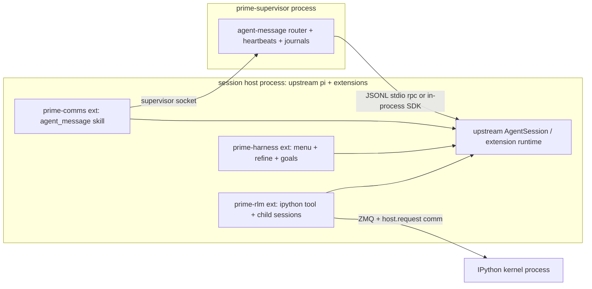

# Upstream Seam Feasibility: Can prime-agent's Differentiators Live as Upstream-pi Extensions/Processes?

**Scope.** Audits whether each prime-agent (PA) differentiator can be re-architected as (a) an npm extension package against upstream pi's extension API, (b) a separate process driving upstream pi via `--mode rpc` / pi-protocol, (c) a small upstream patch, or (d) is fork-forcing. Read-only audit; nothing built or modified.

**Versions audited.**
- Upstream: `repos/pi-mono` @ `4181f66` (packages at **v0.84.1**, `packages/coding-agent/package.json:3`; latest tag `v0.84.1`, fetched today). `origin/main` (`936aff00`) is 3 commits ahead, docs-only: adds `packages/agent/docs/harness-v2-state-machine.md` (1,205-line "explicit-state harness" design — not implemented).
- PA: `repos/prime-agent` @ v0.7.1 (hard fork of pi-mono; see `prime-agent-deep.md` §1).
- OMP: `repos/oh-my-pi` (in-process-subagent reference; see `omp-deep.md` §8).
- Companion context: `pi-mono-deep.md` (upstream surface), `prime-agent-deep.md` (PA internals). Citations below are to **repo files**, verified against the checkouts above.

## Headline answer

**Yes — almost everything PA-specific can live outside a coding-agent fork.** Upstream v0.84.1's extension API covers the seams PA forked for: full system-prompt replacement (`before_agent_start`), post-compaction hooks (`session_compact` **exists upstream**, `extensions/types.ts:1216`), first-class stateful tools (`registerTool`), session-persistent custom entries (`appendEntry`), and — critically — extensions can import the in-process SDK (`createAgentSession`) through the loader's module aliases, so **in-process RLM children are possible from an extension, OMP-style**. The non-extension residue: (i) PA's daemon/supervisor (becomes a PA-owned process wrapping upstream sessions, not a patch); (ii) two narrow gaps needing ≤5-line upstream patches (child-usage attribution; durable queue persistence). The new `AgentHarness` (`packages/agent/src/harness/agent-harness.ts:305`) is a **non-functional API sketch** — every method rejects `HarnessNotImplemented`; the working embed paths remain `sdk.ts` / `--mode rpc`.

## Contents

1. [Upstream extension API map (v0.84.1)](#1-upstream-extension-api-map-v0841)
2. [RPC direction: `--mode rpc`, pi-protocol/pi-client/pi-server, AgentHarness status](#2-rpc-direction)
3. [The differentiator matrix](#3-the-differentiator-matrix) ← headline
4. [Resulting architecture sketch](#4-resulting-architecture-sketch)
5. [Patch list & fork-forcing residue](#5-patch-list--fork-forcing-residue)

---

## 1. Upstream extension API map (v0.84.1)

Primary sources: `packages/coding-agent/src/core/extensions/types.ts` (1,727 lines), `docs/extensions.md` (2,988 lines), loader `src/core/extensions/loader.ts` (737 lines).

### 1.1 Loading, and what extension code can reach

- Extensions are TypeScript loaded by **jiti** at runtime (`loader.ts:17`, `loader.ts:455`) — no build step. Discovery: `~/.pi/agent/extensions/`, project `.pi/extensions/` (trust-gated), Pi Packages (npm/git), plus CLI `-e/--extension <path>` (`src/cli/args.ts:151`) and `--no-extensions` (`args.ts:154`).
- **Module aliasing is the load-bearing detail** (`loader.ts:51-73`): extension imports of `@earendil-works/pi-coding-agent` resolve to the host's own in-process index module (`loader.ts:66`, `:73`). That index **exports the public SDK** — `createAgentSession`, `createAgentSessionRuntime`, `createAgentSessionServices` (`src/index.ts`, "SDK for programmatic usage" block; `src/core/sdk.ts:169`). So an extension can construct additional in-process `AgentSession`s, import `pi-ai` streaming (`loader.ts:62-65`), etc. This is the fact that makes in-process RLM children extension-feasible (§3, row 4).
- Extensions run with **full Node privileges** (no sandbox); project trust only gates *discovery* of project-local extensions.

### 1.2 `registerTool` mechanics — state, subprocesses, streaming

`ToolDefinition` (`types.ts:449-498`): `{name, label, description, promptSnippet?, promptGuidelines?, parameters (TypeBox), execute, renderCall/renderResult, executionMode?}`. `execute(toolCallId, params, signal, onUpdate, ctx)` (`types.ts:480-486`) is an async closure owned by the extension module:

- **Long-lived process state: yes** — module-level state is unrestricted; key per-session resources (e.g. kernels) to `session_start`/`session_shutdown` (`types.ts:1205`,`:1217`).
- **Spawn subprocesses: yes** — full Node access; upstream's own subagent example spawns `pi` (`examples/extensions/subagent/index.ts:335`). `pi.exec()` helper too (`types.ts:1333`).
- **Streaming: yes** — `onUpdate` partials surface as `tool_execution_update` events (forwarded over RPC, §2.1); `TDetails` rides `tool_execution_end` to custom renderers.
- Tools are first-class: model-visible, `promptSnippet`/`promptGuidelines` feed the system prompt (`types.ts:456-459`), toggleable via `setActiveTools` (`:1342`), gated by `tool_call`/`tool_result` like builtins.

### 1.3 Event catalog — compaction events ARE upstream

25+ event types (`ExtensionAPI.on` overloads, `types.ts:1203-1244`). Verified present **upstream** (not PA-added):

| Seam | Event / API | Cite |
|---|---|---|
| Startup | `project_trust`, `session_start`, `resources_discover` | types.ts:1203-1205 |
| Per-prompt intercept | `input` (transform/handle text+images) | types.ts:1244 |
| **System-prompt replace + message injection** | `before_agent_start` → `{message?, systemPrompt?}` | types.ts:1227, :699-709, :1102-1106; applied agent-session.ts:1232-1261 |
| **Rewrite outbound message list per LLM call** | `context` → `{messages?}` | types.ts:1220, :670-673, :1065 |
| Provider payload | `before_provider_headers`/`before_provider_request`/`after_provider_response` | types.ts:1221-1226 |
| Tool gating/mutation | `tool_call` (block/reason/terminate), `tool_result` (content/details/isError/usage) | types.ts:1241-1242, :1071-1095 |
| **Compaction veto/replace + post-hook** | `session_before_compact` (`{cancel?, compaction?}` = full summary replacement) / `session_compact` (fires after append + context swap) | types.ts:1213-1216, :1117-1120; agent-session.ts:1818-1837/:2083-2095, post :1889-1896 |
| Session ops veto | `session_before_switch`/`session_before_fork`/`session_before_tree` (+after) | types.ts:1207-1219 |
| Turn/message stream | `agent_*`, `turn_*`, `message_*`, `tool_execution_*` | types.ts:1228-1238 |

### 1.4 Context-injection seams (the harness-menu question)

- **Replace/append the system prompt**: `before_agent_start` hands the extension the assembled base prompt + `systemPromptOptions` (`types.ts:705-708`) and accepts a chained full replacement, re-requested per submission (agent-session.ts:1232-1261). Static routes: `--system-prompt`/`--append-system-prompt` (`args.ts:95`,`:97`), `BuildSystemPromptOptions{customPrompt, appendSystemPrompt}` (`core/system-prompt.ts:8-25`).
- **Inject messages**: `pi.sendMessage({customType, content, display, details}, {triggerTurn?, deliverAs: "steer"|"followUp"|"nextTurn"})` (`types.ts:1302-1305`); custom messages enter LLM context via `convertToLlm`; "nextTurn" rides alongside the next prompt (agent-session.ts:1226-1230). `appendEntry(customType, data)` = session-persistent non-LLM state (`types.ts:1317`).
- **ExtensionContext** (`types.ts:307-347`): `ui`, `mode`/`hasUI` (`ExtensionMode = "tui"|"rpc"|"json"|"print"`, `:305`), read-only `sessionManager`, `modelRegistry` (incl. one-shot LLM calls via `complete()`, `core/model-registry.ts:108`; precedent `examples/extensions/custom-compaction.ts:79`), `model`, `abort()`, `compact()`, `getSystemPrompt()`. Command context adds `newSession/fork/navigateTree/switchSession/reload` (`types.ts:353-387`); shared extension-to-extension `events: EventBus` (`:1435`).

### 1.5 UI-free headless operation & settings

- Modes: TUI, `--mode json`, `-p` print, `--mode rpc` (`args.ts:11`,`:82`). Extensions load in **all** modes — runtime is built before mode dispatch (`main.ts:843` → `runRpcMode(runtime)` `:925`); `ctx.ui.*` bridges to JSON envelopes in RPC mode (`rpc-mode.ts:134`).
- Settings (`core/settings-manager.ts:90-139`): `steeringMode`/`followUpMode` (`:96-97`), `compaction` (`:99`), `retry`, extra discovery paths `packages`/`extensions`/`skills`/`prompts` (`:114-118`), `enabledModels`, `sessionDir`. No extension-owned settings namespace — extensions keep their own files.

---

## 2. RPC direction

### 2.1 `--mode rpc` — the production wire (today)

Implementation: `src/modes/rpc/rpc-mode.ts` (`runRpcMode(runtime)`, `:54`), types `rpc-types.ts`, framing `jsonl.ts`; docs `docs/rpc.md` (1,578 lines). JSONL over stdin/stdout, strict LF.

- **Commands (~32)** (`rpc-types.ts`, `RpcCommand` union): `prompt` (with `streamingBehavior`), `steer`, `follow_up`, `abort`, `new_session`, `get_state`, `get_messages`, model + thinking-level set/cycle/list, `set_steering_mode`/`set_follow_up_mode`, **`compact`/`set_auto_compaction`**, retry controls, `bash`/`abort_bash`, `get_session_stats`, `export_html`, `switch_session`, `fork`, `clone`, tree/entries/fork-message reads, `set_session_name`, `get_commands`, `extension_ui_response`.
- **Events: the full `AgentSessionEvent` stream.** rpc-mode subscribes to the session and forwards everything (`rpc-mode.ts:355-356` via `toJsonEvent`, `src/modes/json-event.ts`). The union (`core/agent-session.ts:141-181`) = all `AgentEvent`s (`packages/agent/src/types.ts:428-443`: agent/turn/message/tool lifecycles) plus `agent_settled`, `queue_update` (`:150`), `compaction_start/end` (`:154`,`:159`), `entry_appended` (`:155`), retry/summarization events, `extension_error`.
- **Extensions load in rpc mode** (runtime built at `main.ts:843` before dispatch; `session.extensionRunner` used throughout `rpc-mode.ts`, e.g. `:560`,`:681`). Extension UI calls bridge to `extension_ui_request`/`extension_ui_response` envelopes (`rpc-mode.ts:134`).
- **What an RPC client CANNOT do**: inject arbitrary *custom* (non-user) messages (no `append_custom_message` — PA-daemon-only, `prime-agent-deep.md` §3.2); register tools/commands at runtime (extensions load at process start / `-e`); multiplex sessions (one per process; `new_session`/`switch_session` *replace*); any server transport (stdio only). Compaction control = trigger + on/off; custom compaction logic lives in an in-process extension.

### 2.2 pi-protocol / pi-client / pi-server — still experimental, unwired

(Addendum-verified @ v0.84.1.) `packages/protocol` (dep: typebox only): 4-byte BE length-prefix + CBOR framing, `PROTOCOL_VERSION = 1`.

- **Entire command surface = 9 commands** (`packages/protocol/src/schemas.ts:291-323`): `list`, `create{cwd?,name?,model?,thinkingLevel?}`, `attach`, `detach`, `prompt`, `steer`, `abort`, `set_model`, `set_thinking`. **Events: `server_snapshot` / `session_snapshot` / `session_progress` / `session_removed` only** (snapshot-authoritative; progress events are transient hints). No follow_up, no compact, no queue ops, no custom messages, no extension anything.
- `pi-server` (`packages/server`): host supplies `PiServerService` (`listSessions`/`listModels`/`createSession`/`openSession`); `PiSessionRuntime` ≈ `snapshot/getPhase/prompt/steer/abort/setModel/setThinking/subscribe/dispose`. **Unix-socket transport only** (`server/src/transports/unix/`); conflicts reject (`session_locked`/`busy`), never queue.
- `pi-client` (`packages/client`): Node-free `PiClient` over a `ByteTransport` interface (browser-runnable); `exclusive|shared` leases; manual reconnect.
- **Wiring status: still unwired as a product.** `src/cli/experimental/` defines `server`/`client` commands (`commands/server.ts:44` → `context.runServer`) with **no implementations** — `cli/experimental/cli.ts` (7 lines) only composes definitions. New since `pi-mono-deep.md`: coding-agent now depends on pi-client/pi-protocol and ships `src/client/remote-session.ts` (`RemoteSession` over `PiClient` + transcript reducers) and `src/server/create-harness.ts` — but `createCodingAgentHarness` has **no callers** and `remote-session.ts` is unused by any mode. Direction real; product path closed.

### 2.3 `AgentHarness` (pi-agent-core) — design-stage shell, NOT an embed target yet

`packages/agent/src/harness/agent-harness.ts:305` (`export class AgentHarness implements AgentLane`): the future embeddable harness — lanes, queue ops (`steer/followUp/nextRun/cancelQueued`, `:386-401`), `compact`, `navigateTree`, `recordUsage`, skills/template resources, `watchSession()` snapshots, hooks/events. **But every operation rejects** `HarnessNotImplemented` (`:355-417`), registries are `UnavailableRegistry` (`:219`), `create()` throws on existing records (`:350-352`). With the origin/main-only `harness-v2-state-machine.md`, upstream is mid-design of a **durable explicit-state harness** — aligned with PA's goals, unusable today. **Embed calculus unchanged: `sdk.ts` (library) or `--mode rpc` (process) are the only working seams.** `createCodingAgentHarness` (`src/server/create-harness.ts`, no callers) previews the intended adapter: coding-agent's 4 default tools + `buildSystemPrompt` wrapped as `HarnessTool`s.

---
## 3. The differentiator matrix

Verdicts: **EXTENSION-CLEAN** = doable today as a separate npm extension package against v0.84.1 APIs · **RPC-PROCESS** = better as a separate process driving upstream pi via `--mode rpc`/pi-protocol · **SMALL-UPSTREAM-PATCH** = bounded upstream addition (≤5 lines of intent) · **FORK-FORCING** = needs coding-agent internals surgery. PA citations reference `repos/prime-agent/packages/coding-agent/src/`; deep dives in `prime-agent-deep.md`.

| # | PA differentiator (PA cite) | Verdict | How on upstream v0.84.1 | What the extension CANNOT see / gaps |
|---|---|---|---|---|
| 1 | **IPython kernel as sole tool** (`core/tools/ipython.ts` 708 LoC; `core/kernel/index.ts` 1,529 LoC) | **EXTENSION-CLEAN** | `registerTool` with `parameters={code:string}`, async `execute` owning a KernelManager (types.ts:449-498, :1251). Subprocess spawn unrestricted; `onUpdate` streams cell progress; `TDetails` carries stdout/diffs/attachments to renderers + RPC. Bootstrap code, `%%bash` rewriting, interrupt→reset notice all live inside the extension's tool. | Tool allowlisting is host config — ship `--tools ipython`/settings defaults. Per-session kernel keying via `session_start`/`session_shutdown` (:1205/:1217). |
| 2 | **Kernel host comms bridge** (`HOST_COMM_TARGET` Jupyter comm, `kernel/index.ts`; handlers `_createKernelHostHandlers`, agent-session.ts:8681-8760) | **EXTENSION-CLEAN** | The bridge endpoint is *whoever owns the kernel* — post-move, the extension itself. Host-request dispatch (`rlm.run`, `agent_message.send`, `harness.*`) becomes an extension method table; cross-process requests hop extension→supervisor socket (row 11). | None in coding-agent. PA's handlers call AgentSession privates (`_startRlmChildRun` etc.) — re-implemented via §1.1's SDK import + `sendMessage`. |
| 3 | **KernelManager lifecycle + dill snapshots** (`kernel/state-snapshot.ts` 297 LoC; restore notice agent-session.ts:6943-6961) | **EXTENSION-CLEAN** | Process state is extension-owned (row 1). Snapshots = extension files keyed to the session; restore notice via `sendMessage({customType:"ipython_state_restored",…},{deliverAs:"nextTurn"})` on `session_start` (:1302/:1205). Kernel survives compaction (compaction never touches extension state); the "kernel persists" summary reminder rides `session_before_compact`'s `customInstructions` or full `compaction` replacement (:1117-1120; PA's note at `compaction/compaction.ts:498`). | `sessionManager` is **read-only** to extensions (types.ts:317) — artifact-dir layout must be mirrored, not queried. |
| 4 | **RLM children: in-process child AgentSessions + registry + depth cap + terminal notices + usage attribution + passivation** (`_startRlmChildRun` agent-session.ts:9604-9680; usage :9774) | **EXTENSION-CLEAN + SMALL-UPSTREAM-PATCH** (attribution) | **In-process children from an extension are possible today**: import `createAgentSession` through the loader alias (loader.ts:66/:73; exported `src/index.ts`; options `sdk.ts:38-85` — `customTools`, `tools`, `scopedModels`, shared `resourceLoader`/`settingsManager`/`sessionManager`). Exactly OMP's proven pattern: full in-process `createAgentSession` per subagent (omp-deep §8.2, `src/task/executor.ts`) with its own depth guard. Registry/depth cap/name reservation/terminal notices = extension state + `appendEntry` (:1317) + `sendMessage` into parent; progress renders via custom message/entry renderers (:1288-1295) and `entry_appended` events reach RPC clients (agent-session.ts:155). Admission-resolves-immediately = extension's own async task; passivation = extension-serialized descriptors (PA's `rlm-subagents.jsonl` pattern ports). | **Usage attribution onto parent assistant entries has no upstream API** (PA added `appendChildUsageAttribution`, agent-session.ts:9774) → patch P1 (§5); degraded fallback: usage in custom entries. Children load *their own* extensions — no context inheritance, pass config at construction. RPC won't carry PA's bespoke `rlm_child_update` event type; use custom messages/entries. |
| 5 | **Continual harness CRUD** (memory/skill/subagent/prompt-note; `core/refinement/refinement.ts` 1,017 LoC; kernel `rlm.harness.*`) | **EXTENSION-CLEAN** | Storage = extension-owned dirs (global + per-session local) + JSONL audit — PA's format ports. Entry points: extension tools (`registerTool`) and/or kernel bridge handlers (row 2); session-history trail via `appendEntry("prime-agent.refinement",…)` (:1317). | None material. Menu cache recomputes synchronously on the extension's own CRUD calls. |
| 6 | **Harness menu injection into the SYSTEM PROMPT** (`formatHarnessStateForPrompt`, refinement.ts:429; fork-added `BuildSystemPromptOptions.harnessState`, agent-session.ts:4272-4310) | **EXTENSION-CLEAN** | Upstream's seam is *better than PA's fork*: `before_agent_start` provides base prompt + options and accepts a chained full replacement (types.ts:699-709, :1102-1106; applied agent-session.ts:1232-1261) — extension returns `base + "# Continual Harness State …"`. | Re-requested **per prompt submission** (return the cached string every time); not fired for purely queued continuations — matches PA's "next rebuild" semantics (prime-agent-deep §5.3). Chaining order matters with other replacers. |
| 7 | **`/refine` pipeline** (background plan → serialized apply → rollback; agent-session.ts `refine()`) | **EXTENSION-CLEAN** | Planner = extension's own one-shot LLM call via `ctx.modelRegistry.complete(model, context, options)` (model-registry.ts:108; precedent `examples/extensions/custom-compaction.ts:79`) or aliased pi-ai streaming (loader.ts:62-65). Apply = extension file writes + menu-cache invalidation (defer mid-run via `turn_start` gating). `/refine` = `registerCommand` (:1260). Rollback = extension-stored baselines. | Can't *block turn entry* during apply as PA does — worst case one turn runs with the previous menu. |
| 8 | **Post-compaction harness re-injection + auto-refine-after-compaction** (agent-session.ts:7157-7164; `_scheduleAutoRefineAfterCompaction` :7278) | **EXTENSION-CLEAN** | The system-prompt menu **survives compaction** (only messages are swapped, upstream agent-session.ts:1878-1881). Transcript-level notices + auto-refine: `session_compact` fires after append/context-swap (:1889-1896, :2170) → handler calls `sendMessage(…,{deliverAs:"followUp"})` + kicks refine (row 7); `session_before_compact` can cancel/replace the summary (:1117-1120). | None. |
| 9 | **Skills loader incl. `python_import` pre-imported modules** (PA `core/skills.ts` 633 LoC: importName :83, `src/<importName>/__init__.py` :230; bundled `skills/<name>/src/<mod>`) | **EXTENSION-CLEAN** | Base SKILL.md discovery/loading is **already upstream config** (`settings.skills` paths, settings-manager.ts:116; upstream `core/skills.ts`). PA's delta — validating `python_import`, pre-importing modules into the kernel with failure stubs — is kernel-bootstrap code, which the extension owns end-to-end (row 1). | None. |
| 10 | **Durable queue semantics** (steer/follow_up surviving restart; PA daemon `resume_queue`/`restore_next_turn`) | **SMALL-UPSTREAM-PATCH** (P2) | Upstream queues are process-memory only (`PendingMessageQueue`, `packages/agent/src/agent.ts:176-231`; nothing in session-manager). **Workaround for agent-originated traffic**: extension-owned durable outbox (appendEntry + re-drive on `session_start`) — covers heartbeats/agent-messages, which all originate from extension code. | Extensions can't see/persist **user-typed** steering (no `queue_update` extension event — RPC-only, agent-session.ts:150) nor intercept the loop's queues (`getSteeringMessages`/`getFollowUpMessages` are SDK-embedder hooks, `packages/agent/src/types.ts:244/:257`). Hence P2. |
| 11 | **agent_message / agent_observe inter-agent skills** (`core/agent-messages.ts` 636 LoC, `agent-observe.ts` 200 LoC) | **RPC-PROCESS** (router) + extension-clean in one process | Delivery into a session = `sendMessage` steering (:1302) — PA already made agent messages always-steering (prime-agent-deep §1). **Roster + cross-process routing need a supervisor** (§4): per-session extensions talk to it over its socket; `agent_observe` = supervisor-mediated `get_state`/`get_messages` reads. Within one process (all children in-process, row 4), a module-level registry suffices. | No cross-process pub/sub or roster concept upstream. |
| 12 | **Daemon protocol/supervision** (~90 command types, worker tree, recovery/orphan journals, update-restart; `modes/daemon/*`; prime-agent-deep §3) | **RPC-PROCESS** (re-architected) | Upstream has no daemon and never will absorb PA's — but no fork is needed: a supervisor is a *client* of upstream sessions. Per session it spawns `pi --mode rpc` (§2.1: prompt/steer/follow_up/abort/compact/fork/state/messages + full event stream) or embeds `createAgentSession` per tree; journals/leases/restart = plain process management around that. | PA's 90-command wire surface persists as the supervisor's own API translating to upstream calls — PA product protocol, not coding-agent surgery; hence not FORK-FORCING. |
| 13 | **Heartbeat machinery** (cron scheduler in daemon worker, daemon-mode.ts:488-623; `rlm_heartbeat.*` handlers agent-session.ts:8710-8718) | **EXTENSION-CLEAN** in-session + supervisor for idle wakeup | Live session: extension timers → `sendMessage({deliverAs:"nextTurn", triggerTurn:true})` (:1302-1305); schedules persisted via `appendEntry`, resumed on `session_start`; CRUD via kernel bridge (row 2). Firing while nothing is alive = supervisor duty (row 12). | Extension code runs only while its pi process runs; no standalone scheduler upstream. |
| 14 | **Goal machinery** (`core/goals.ts` 290 LoC; `goal.get/create/complete` handlers agent-session.ts:8695-8698) | **EXTENSION-CLEAN** | Goal state = extension store + `appendEntry`; goal block injected via the same `before_agent_start` replacement as row 6; wakeup nudges via `sendMessage`. | None. |
| 15 | **RLM base system prompt** (`core/prompts/rlm.ts` 199 LoC replaces pi's default) | **EXTENSION-CLEAN** | `--system-prompt <file>` (args.ts:95) / `BuildSystemPromptOptions.customPrompt` (system-prompt.ts:10) for the base; per-session dynamics (depth, parent name, menu) via row 6. PA's fork-added option fields (`harnessState`, `rlmDepth`, `rlmParentAgent`, `allowRecursion` — agent-session.ts:4295-4310) collapse into extension-computed suffixes. | None. |

### 3.a Sub-question: can an extension spawn/manage child AgentSessions — RLM without forking?

**Yes** — two upstream-clean shapes:

- **In-process (OMP-proven)**: extension imports `createAgentSession` via the loader alias (loader.ts:66) and builds children itself, as OMP's `src/task/executor.ts` does per subagent (omp-deep §8.2). On OMP's "5 hooks" for rehosting pi-agent-core: `convertToLlm`/`transformContext` **are upstream** (`packages/agent/src/types.ts:178`,`:200`), tool gating ≈ upstream `beforeToolCall`/`afterToolCall` (`:277`,`:292`); `transformProviderContext`/`appendOnlyContext` are **OMP-added** (oh-my-pi `packages/agent/src/agent-loop.ts:1520-1536`, absent upstream) — and RLM children don't need them. PA's fork additions (registry, depth cap agent-session.ts:9617, name reservation :9622-9626, terminal notices, passivation) are ordinary bookkeeping in extension code. **Single true gap: usage attribution** (PA :9774) → patch P1.
- **Subprocesses (upstream doctrine)**: one-shot `pi --mode json -p --no-session` per child (`examples/extensions/subagent/index.ts:294`), or steerable `pi --mode rpc` children (§2.1). Heavier but isolated and supervisor-friendly; parent-side accounting only.

Recommendation: in-process via the aliased SDK (matches PA semantics incl. shared model registry), P1 restoring faithful attribution.

### 3.b Sub-question: bridging kernel host comms (rlm.run / agent_message mid-cell) to extension-land

The channel is a **Jupyter comm** between kernel and its owning Node process (prime-agent-deep §2.1). Ownership moves, protocol doesn't: the extension's KernelManager registers the same `host.request` target and dispatches to extension methods; outside-world requests (child spawn, cross-agent send) are serviced by the extension (rows 4/11) or proxied to the supervisor. Nothing in coding-agent participates — PA already concentrates this in `_createKernelHostHandlers` (agent-session.ts:8681), exactly the code that moves.

### 3.c Sub-question: harness menu into the SYSTEM PROMPT + post-compaction re-injection

Covered by rows 6+8: `before_agent_start` full-replacement (agent-session.ts:1232-1261) for injection; system prompt inherently survives compaction (only messages are swapped, :1878-1881); `session_compact` post-event (:1889-1896) + `sendMessage` for transcript-level re-notices; `session_before_compact` result (:1117-1120) for summary-steering. **PA's fork surgery on `system-prompt.ts` is not needed** — the upstream seam is a superset of what PA uses (PA only appends a formatted section).

### 3.d Sub-question: durable kernel snapshots vs upstream session persistence

Orthogonal by design. Upstream persists the *conversation* (JSONL v3 tree, `core/session-manager.ts`; custom entries via `appendEntry`) and nothing else — process state, queues (agent.ts:176), extension state are out of scope. PA's kernel snapshots (dill + manifest per session dir, `state-snapshot.ts`) stay extension-owned; the restore notice becomes `sendMessage` on `session_start`. The only upstream durability gap is the message queues (row 10, P2).

---
## 4. Resulting architecture sketch

**Processes/packages** (who spawns whom, wire protocols):

1. **`prime-supervisor`** (PA-owned process; successor to the daemon, row 12). Spawns session hosts; owns cross-agent routing (row 11), idle heartbeat firing (row 13), recovery journals, and exposes PA's product protocol to clients (TUI/web). Speaks to each session host over **JSONL stdio (`--mode rpc`)** or in-process SDK calls. Pure client of upstream — no fork.
2. **Session host = upstream `pi`** (npm dep `@earendil-works/pi-coding-agent@0.84.1`, unpatched + patches P1/P2) with three extension packages installed (discovery via `settings.extensions` / Pi Packages, settings-manager.ts:114-115):
   - **`prime-rlm`** — the `ipython` tool + KernelManager + host bridge + kernel snapshots + python-import skills bootstrap (rows 1-3, 9) and RLM children registry/spawning via the aliased SDK (row 4).
   - **`prime-harness`** — continual-harness CRUD + system-prompt menu + `/refine` + post-compaction re-injection + goals (rows 5-8, 14), plus the RLM base prompt (row 15).
   - **`prime-comms`** — `agent_message`/`agent_observe` kernel skills, talking to the supervisor for cross-process delivery (row 11), plus the durable outbox (row 10 workaround until P2).
3. **Kernel processes** — spawned by `prime-rlm` inside each session host; Jupyter wire over ZMQ, `host.request` comm back into the extension (row 2 of §3).

**Parent's sharpened question — browser-facing product, which move?** **(a) pi-server + a WS listener we add**: right long-term shape (snapshot-authoritative protocol is React-friendly) but unwired today (§2.2), and its 9-command surface can't express compact/follow_up/custom-messages/queues — we'd be building upstream's server *and* extending its protocol. **(b) bridge drives per-session `pi --mode rpc`**: works **today** with full per-session control (§2.1); extensions load inside each process so RLM/harness/comms ride along; extension UI already bridged as JSON envelopes. **(c) bridge embeds in-process per session**: only via `sdk.ts` (AgentHarness is a shell, §2.3); fewest moving parts and best for in-process RLM children (row 4), but the bridge then owns lifecycle/recovery that (b) gets from process boundaries. **Recommendation: (b) now — one rpc subprocess per session with the three extension packages — using (c) inside each host for RLM children; revisit (a) when upstream lands server + harness-v2** (which would obsolete P2 and parts of the supervisor).

## 5. Patch list & fork-forcing residue

**Small upstream patches (the entire ask):**
- **P1 — usage attribution**: add `SessionManager.appendChildUsageAttribution(entryId, usage, origin)` (or `recordUsage` on `AgentSession`) so child token spend can land on parent assistant entries. Intent: port PA's session-manager addition (PA agent-session.ts:9774 call site) upstream. ≤5 lines of interface.
- **P2 — durable queue persistence**: persist pending steering/follow-up items as session entries and restore on load. Intent: serialize `PendingMessageQueue` contents (agent.ts:176) into the session JSONL, rehydrate in `createAgentSession`. (Upstream's own harness-v2 design already plans durable queue/operation state — likely to arrive natively.)

**Fork-forcing residue: none.** Every differentiator maps to extension APIs, process composition, or P1/P2. Remaining **PA product code** (not fork): the supervisor protocol/machinery (row 12), three extension packages, the kernel runtime. Fork surgeries this architecture *deletes*: fork-added `BuildSystemPromptOptions` fields (agent-session.ts:4295-4310 → row 6), `_createKernelHostHandlers` (:8681 → §3.b), `_startRlmChildRun` (:9604 → §3.a), `modes/daemon/*` (→ row 12).

**Risks**: (i) pin extension-API fidelity — contract tests against the 25 events + aliased SDK import per upstream release; (ii) harness-v2 redesign in flight — expect `sdk.ts` churn within 1-2 releases (track `packages/agent/docs/harness-v2-state-machine.md`); (iii) jiti aliasing is the load-bearing mechanism for in-process children (loader.ts:51-73) — if scoped down, row 4 falls back to RPC-PROCESS children; (iv) `/reload` must not leak kernels — key disposal to `session_shutdown`.

*Addendum folded in: pi-protocol 9-command/4-event surface, pi-server unix-only + unwired status, `remote-session.ts`/`create-harness.ts` presence (§2.2), AgentHarness shell status (§2.3), rpc-mode ~35-command surface (§2.1), and the (a)/(b)/(c) browser-facing assessment (§4).*
