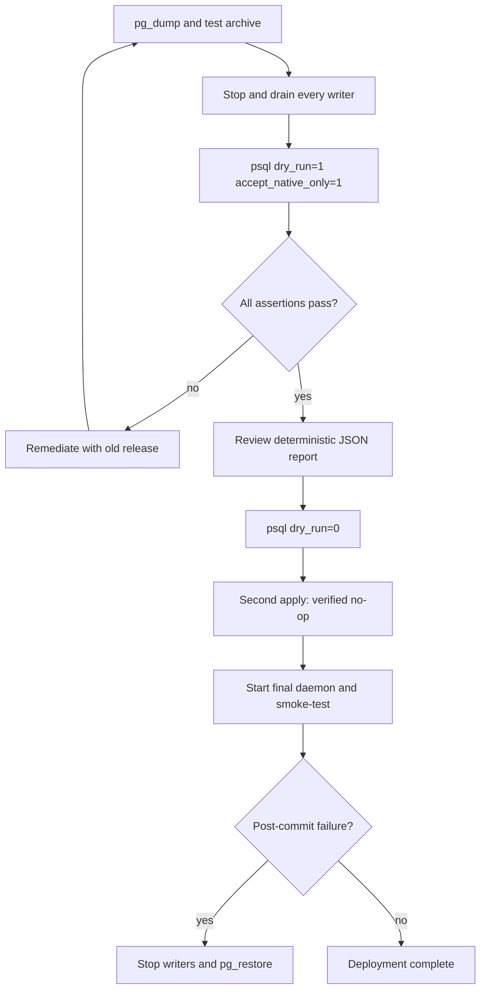

# Native-compaction v1 SQL migration

`rust/migrations/native-compaction-v1.sql` is the one-time migration for
sessions created before the native-only compaction cutover. It is a
self-validating PostgreSQL 16/`psql` patch, not daemon functionality.

There is no automatic migration, runtime compatibility mode, migration ledger,
or application rollback command. The normal daemon stays native-only and does
not parse legacy layouts. A pre-migration `pg_dump` and `pg_restore` are the
post-commit rollback mechanism.

## Required deployment sequence

Use a connection whose `search_path` resolves the pi-relay tables in one
ordinary schema (normally `public`). Keep credentials in `DATABASE_URL`, not in
shell history. The migration role needs `SELECT`, `INSERT`, `UPDATE`, `ALTER`,
and `LOCK` on the application tables plus `USAGE`/`UPDATE` on their sequences.

1. **Back up and test the backup.**

   ```sh
   export DATABASE_URL='postgresql://...'
   pg_dump "$DATABASE_URL" --format=custom \
     --file="pi-relay-before-native-compaction-v1.dump"
   pg_restore --list pi-relay-before-native-compaction-v1.dump >/dev/null
   ```

2. **Stop every daemon and old writer.** Drain queued inputs, delegations, and
   model/tool/compaction work with the old release first. The patch rejects
   unfinished actions, active queue rows, running delegations, every
   `post_compaction_dispatch` intent, and every selected-subagent control still
   in `pending_interrupt` or `interrupt_applied` (even if its queue status is
   inconsistent). It never infers, rewrites, or live-migrates control state.

3. **Run the exact patch as a dry-run.** `accept_native_only=1` acknowledges
   that historical Claude sessions without `remote_mode` behaved as local
   compaction, and that explicit `never`, `auto`, `always`, and enrollment
   selectors will not be retained after the cutover.

   ```sh
   psql "$DATABASE_URL" -X -qAt -v ON_ERROR_STOP=1 \
     -v accept_native_only=1 -v dry_run=1 \
     -f rust/migrations/native-compaction-v1.sql \
     >native-compaction-v1.dry-run.json
   jq . native-compaction-v1.dry-run.json
   ```

   The patch runs its full DDL, planning, rewrites, final checks, and report,
   then executes `ROLLBACK`. Continue only when the JSON `status` is `ready` or
   `clean` and `unresolved_decisions` is empty. Review every category, row ID,
   session ID, checksum, and planned sequence next value.

4. **Apply the same file.**

   ```sh
   psql "$DATABASE_URL" -X -qAt -v ON_ERROR_STOP=1 \
     -v accept_native_only=1 -v dry_run=0 \
     -f rust/migrations/native-compaction-v1.sql \
     >native-compaction-v1.apply.json
   jq -e '.status == "applied" or .status == "no_op"' \
     native-compaction-v1.apply.json
   ```

   Apply takes a transaction-scoped advisory lock and `ACCESS EXCLUSIVE` locks
   on every application table, replans under those locks, and commits one
   `SERIALIZABLE` transaction only after final verification. Any assertion,
   cast, constraint, or SQL error rolls the transaction back.

5. **Verify idempotence while writers remain stopped.**

   ```sh
   psql "$DATABASE_URL" -X -qAt -v ON_ERROR_STOP=1 \
     -v accept_native_only=1 -v dry_run=0 \
     -f rust/migrations/native-compaction-v1.sql \
     >native-compaction-v1.second-apply.json
   jq -e '.status == "no_op" and (.rows | length) == 0
          and .before_checksum == .after_checksum' \
     native-compaction-v1.second-apply.json
   ```

6. **Start the final daemon and smoke-test list/get, branch switching, and one
   follow-up.** Never start an old binary against the migrated database.

If any post-commit check fails, stop writers and restore into a clean database:

```sh
createdb pi_relay_restore
pg_restore --exit-on-error --clean --if-exists \
  --dbname=pi_relay_restore pi-relay-before-native-compaction-v1.dump
```

Adapt database creation/ownership to the deployment. Do not attempt an
in-place hand rollback.



## Transaction and report contract

The patch validates all eight post-#217 application tables and their columns,
including session/delegation linkage and the `queued_inputs.origin` durable
selected-subagent control state. The sidecar-less `transcript_entries` variant
remains the one supported missing-column historical shape. It takes
`ACCESS EXCLUSIVE` locks on all eight tables and includes every table in the
whole-dataset checksums. It uses the configured `search_path`; it does not
accept a schema variable or quote arbitrary identifiers. A 10-second
`lock_timeout` prevents indefinite waiting.

The single JSON object contains:

- mode, schema, acceptance and `ready`/`clean`/`applied`/`no_op` status;
- deterministic per-category counts, row IDs, and session IDs;
- deterministic changed-row operations and before/after MD5 checksums;
- whole-dataset before/after checksums;
- original and planned semantic next values for both owned sequences; and
- an empty `unresolved_decisions` array after every successful run.

Errors are PostgreSQL errors whose message is a JSON object with
`migration_version`, a precise `category`, and row/session details when
available. Because `ON_ERROR_STOP` is enabled both in the file and invocation,
no report is emitted after an error and the open transaction is rolled back.

## Supported and blocked shapes

| Historical shape | Transactional result | Blocks when |
| --- | --- | --- |
| Direct fields under `metadata.compaction` | Move known fields into `compaction.config`; preserve `auto_state`, unrelated fields, and `max_consecutive_failures`. Equal direct/nested values deduplicate. | JSON/type is malformed or direct and nested values conflict. |
| Missing/explicit Claude local/remote selector or retired enrollment | Inventory by category/session after explicit acknowledgement, then remove retired selectors. | A selector is malformed or acknowledgement is not exactly `1`. |
| `auto_state.last_success_root_id` | Derive `last_success_leaf_id` from a unique completed action/event topology fence. | Root/leaf/count facts are missing, conflicting, or ambiguous. |
| `anthropic`/`codex` config or replay wrapper tag | Rewrite to `claude`/`openai`; opaque `raw_json` strings are unchanged. | Provider config or an ordinary replay wrapper is malformed. |
| Embedded assistant replay records | Lift the exact ordered sequence, including duplicates, and remove embedded placeholders. | Existing sidecar is a partial/nonmatching lift or a record is malformed. |
| Valid native compaction checkpoint | Preserve replay byte-for-byte except deliberate wrapper-tag normalization. | Provider/checkpoint shape is invalid; then only the semantic-bootstrap row below is eligible. |
| Replay-free/invalid finished summary | Build an ordinary provider-neutral user turn with deterministic IDs, preserve source facts and original item metadata, and rewrite completed action/event roots and counts. No replay is fabricated. | Semantic fields, source graph, turn grammar, IDs, ordering, or continuation shape cannot be proven. |
| Full active/inactive transcript forest | Verify physical/logical predecessor order and cycles, active leaves, turn/tool grammar, terminal leaves, source links, and completed references. | Any invariant fails. |
| Sequence state | Preserve at least each original semantic next value and raise only when inserted rows require it. | The sequence is absent/unowned or arithmetic overflows. |
| Any unfinished action, active queue/delegation, selected-subagent interrupt phase, or dispatch marker | No migration. | Always; drain or terminalize with the old release. |

The semantic bootstrap accepts only a checkpoint that is a physical root with a
valid historical source and either no child, a provable next-turn
`TurnStarted`, or an ordinary user-message continuation. Other mid-turn forms
are intentionally blocked. Use the old release to finish/cancel the turn and
produce a terminal history before taking a new backup and retrying.

The patch is naturally idempotent: it has no trusted marker and never skips
planning or verification. A second apply verifies current state and reports no
changed rows.
