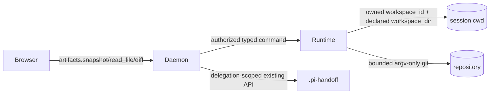

# Artifacts / Git view

Status: current first-release design
Last reviewed: 2026-02-17
Owner: pi-relay

## Scope and UX

The first release is **read-only**. It gives each session a T3-inspired
workspace inspector: a compact header with workspace, branch, and change
summary; a Files/Changes/Handoffs navigation rail; and a bounded file or diff
preview. Handoffs continue to use the existing delegation APIs. There are no
stage, commit, push, branch-switch, edit, or delete controls.

The route is the existing workspace route:

`/w/{host|project}/{id}/run/{session_id}/execution/overview`

The execution view remains responsive: the navigation becomes a horizontal
mobile control and the preview stacks below it on narrow screens.

### Mobile scope

Mobile intentionally uses a list-to-preview drill-in rather than compressing
the desktop two-column inspector:

* the header keeps a compact change/workspace status summary, a workspace
  selector, and the read-only Refresh action;
* the Files, Changes, and Handoffs sections remain reachable as a horizontal
  control, but the active list fills the screen;
* selecting a file or Git change enters a single-item preview state. A
  keyboard-focusable **Back to Files/Changes** control returns to the list;
* the full tree and preview are never shown side by side on small screens;
  Handoffs remains a lightweight explanatory state until its existing
  delegation detail surface is opened elsewhere.

There are no mobile edit, stage, commit, push, branch-switch, or delete
controls. The workspace selector and Refresh action remain read-only and are
disabled while disconnected.

## Boundaries and data flow

`agent-runtime-protocol` owns wire DTOs and runtime command/result variants.
`agent-runtime::workspaces::artifacts` owns path policy, tree walking, Git
parsing, bounded reads, and process limits. `WorkspaceManager` remains the
owner of session workspace roots. `agent-daemon::runtime_hosts` transports
commands; the daemon artifacts RPC validates session ownership, runtime
identity, workspace membership, and never forwards browser paths as host
paths. The React API/types/query-key layer owns browser DTOs and cache policy;
the execution view owns presentation only.

## API contracts

Browser methods are typed WebSocket RPCs:

* `artifacts.snapshot({session_id, workspace_dir})` returns the relative file
  tree, Git metadata, status entries, and bounded change summaries.
* `artifacts.read_file({session_id, workspace_dir, path})` returns at most the
  configured file cap and a truncation marker.
* `artifacts.diff({session_id, workspace_dir, path?})` returns at most the diff
  cap and a truncation marker.

The daemon resolves `session_id` to its persisted `runtime_id`, `workspace_id`,
and `workspaces`; `workspace_dir` must name one persisted workspace. The runtime
receives only those persisted identifiers and declared names. Responses contain
relative paths and no host paths.

## Git baseline and refresh

For Git workspaces, `base_sha` is the persisted materialization baseline.
Snapshot status describes the working tree and the diff endpoint compares the
working tree to that baseline (falling back to `HEAD` only when no baseline is
available). The base invariant is that newly materialized Git sessions persist
`base_sha`; old records missing it are displayed with an explicit unavailable
baseline rather than silently migrated in this task. Local workspaces still
provide file browsing and omit Git sections.

Snapshots are fetched on route entry and by a manual refresh button. The view
may poll while visible, with a modest interval, and must stop polling when
hidden. File and diff reads are on-demand and independently bounded. There is
no database/schema change because this is live filesystem state.
For an untracked Git change, the path-specific diff response instead returns a
bounded working-tree file preview with an explicit no-committed-diff label;
`git diff BASE -- path` cannot represent that file until it is tracked.

## Security limits

The browser cannot provide an absolute path. Every path is validated as a
relative sequence of normal components; `..`, absolute paths, NULs, and
symlink escapes are rejected. Symlink entries are not read. Git uses explicit
arguments, noninteractive environment, `kill_on_drop`, timeouts, and output
caps; status parsing is NUL-safe. `.pi-handoff` is not exposed by artifact
reads; Handoffs remain delegation-authorized and allowlisted.

## Testing and rollout

Rust unit tests cover relative-path and symlink policy, NUL-safe status parsing,
Git output caps, helper disabling, handoff pathspec exclusions, and baseline
selection. Daemon tests cover RPC parsing and session/workspace authorization.
Frontend tests cover artifact API method payloads, execution route rendering,
handoff-warning rendering, and bounded file/diff preview states. Rollout is additive:
existing sessions continue to work through their persisted workspace fields.
No compatibility branch is added to normal runtime behavior and no automatic
old-session migration is attempted; records without `base_sha` retain useful
local browsing and show unavailable Git baseline metadata.
