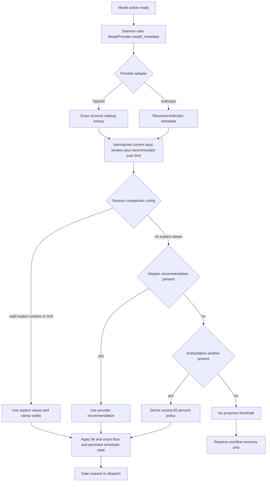
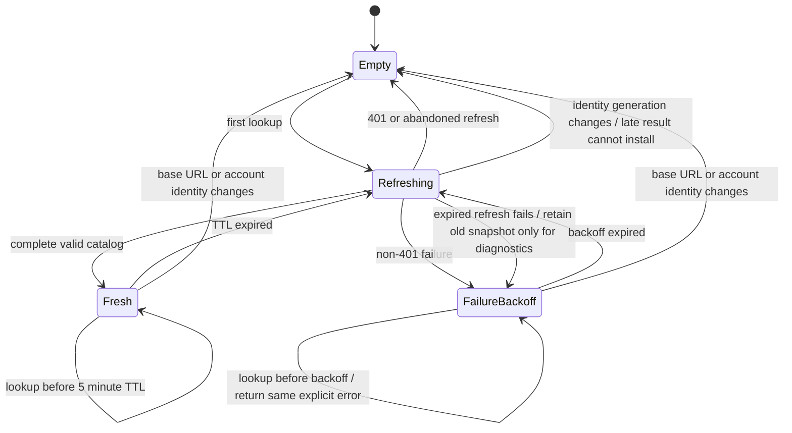

# Stacked PR handoff: authenticated Codex model capabilities

Use this as the body outline for the focused PR stacked on OpenAI Responses
correctness PR #215 (`901c94be72021e2fd0db4c4c6e5497b3d865aa3b`). It records
implementation intent and offline validation; it does **not** claim that this
branch has been exercised against the live private endpoint.

## Summary

- Discover the authenticated account's private Codex model catalog from
  `GET /models?client_version=0.142.3`.
- Share one bounded, account-scoped, memory-only, five-minute catalog cache
  across reconstructed OpenAI provider handles.
- Exact-resolve the configured model before every ordinary and compact request,
  then validate model effort and apply discovered parallel-tool capability.
- Move provider threshold policy into adapters and keep daemon scheduling
  provider-neutral.
- Delete duplicate static OpenAI runtime model/context/effort policy.

## Why

The private catalog is account- and client-version-sensitive. A static table
cannot safely decide whether a selected slug exists, which efforts it accepts,
or which current/default context window should drive proactive compaction. The
sanitized 2026-07-04 probe demonstrates the concrete risk: GPT-5.6 appears only
for newer client versions, Sol/Terra support `ultra` while Luna does not, and
GPT-5.4 advertises a 272k current window alongside a 1M maximum that must not
become the default.

## Provider-neutral metadata path

Provider details stay in adapters:

- OpenAI resolves `context_window.or(max_context_window)` and recommends
  `min(explicit_auto_limit, 90% resolved window)`, deriving 90% when the
  provider limit is null/missing.
- Anthropic preserves the verified 1M→500k recommendation and its generic
  behavior.
- The daemon does not switch on provider/model ids or normalize OpenAI effort.

## Catalog cache state machine

Important cache invariants:

- Whole-catalog, memory-only, no ETag/disk/public-API fallback.
- Base URL + account id scope; when account id is absent, use a cryptographic
  token fingerprint that is never logged.
- One detached refresh for concurrent callers; no lock held over HTTP.
- A stale snapshot never shapes a new request after TTL expiry or refresh
  failure.
- A 401 is not negative-cached and enters the daemon's existing one-time
  credential refresh/rebuild path.

## Request shaping

- One `CODEX_CLIENT_VERSION = "0.142.3"` for the models query and User-Agent.
- Models GET reuses common auth/identity headers but sends no body and no
  generation session/window/turn headers; timeout is five seconds.
- Exact slug only: no aliases, prefixes, namespace stripping, unknown-model
  metadata, or substitution.
- Known configured reasoning efforts must exactly match the selected catalog
  entry. `ultra` is in shared serde/TS vocabulary, but not advertised by the
  static picker.
- `supports_parallel_tool_calls` shapes ordinary and compact bodies.
- Local tool declarations remain authoritative. Catalog search/patch selectors
  do not enable native shell/patch actions in this PR.
- `service_tier: "priority"` remains unconditional for ordinary and compact
  requests.
- The catalog has no output ceiling, so existing explicit
  `max_output_tokens` behavior is unchanged.

## Validation and bounds

- Maximum response body: 4 MiB.
- Maximum complete catalog: 256 models.
- Slugs: nonempty, unique, at most 256 bytes.
- Token limits: positive and safely representable.
- Efforts: at most 16 per model; consumed strings are bounded and unique.
- Any malformed consumed entry rejects the whole response; a successful empty
  catalog is authoritative empty.

Sanitized fixture expectations:

- Sol/Terra/Luna: 372k current/max, null auto limit → 334,800.
- Sol/Terra: `low…ultra`; Luna: `low…max`; no `none`.
- GPT-5.4: 272k current/default plus 1M maximum → 244,800, not 900,000.
- No output-ceiling field.

## Removed

- `agent-daemon/src/model_metadata.rs`.
- Daemon OpenAI model-id context/threshold rows.
- Daemon provider/model effort normalization.
- OpenAI adapter GPT-5.6 special-case/clamp logic.
- Embedded Codex User-Agent version `0.130.0`.

## Explicit non-goals

- Public `api.openai.com` transport.
- Dynamic model picker or new RPC/database catalog storage.
- Disk/ETag cache or stale/static success fallback.
- Service-tier configuration or downgrade.
- Catalog-enabled native shell/patch actions.
- Hosted-search capability claims from ambiguous mappings.
- Long-context paid compaction, local compaction, or replay fallback.
- Changes to the broad five-attempt provider retry behavior.

## Testing

- [x] Exact GET/query/common headers/no body/no generation headers.
- [x] Five-second timeout configuration and explicit timeout error.
- [x] Parse/bounds, unknown fields, empty/duplicate/oversize/invalid catalog.
- [x] Current-vs-max context, null/missing auto derivation, explicit clamp.
- [x] Exact effort support including Sol/Terra `ultra`, Luna rejection, and
      absent `none`.
- [x] Hardcoded priority and discovered parallel-tool shaping for ordinary and
      compact bodies.
- [x] 20 concurrent cold lookups issue one GET; fresh reuse.
- [x] TTL refresh, explicit cold/expired failure, no stale shaping, backoff,
      401 behavior, account generation guard, cancellation safety, and atomic
      replacement.
- [x] Provider-neutral daemon precedence, 334,800 fixture, GPT-5.4 244,800,
      explicit overrides, no static OpenAI threshold, reactive-only fallback,
      Anthropic 1M→500k.
- [ ] Tester live-validates a small ordinary turn for each reviewed model and
      records sanitized results after review.
- [ ] Tester performs the intentionally deferred paid/long-context validation.

## Reviewer focus

1. No path can shape a new OpenAI request from stale/static/unknown metadata.
2. The account/key generation guard prevents cross-account installation.
3. Exact reasoning support is rejected locally rather than normalized.
4. Provider-neutral daemon code contains no OpenAI model-id policy.
5. Existing output fail-closed behavior, hardcoded priority, and broad retry
   count remain unchanged.
