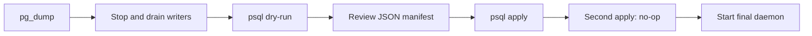

# Provider modernization stack boundaries

This document records the five-commit cumulative local restack on base
`2fda1ae` (durable selected-subagent controls, PR #217). Each branch is
independently buildable and contains final-state hunks for its boundary rather
than temporary development phases. Later branches build on earlier branches in
the order listed here.

## 1. `restack/anthropic-provider-surface`

Modernizes the Anthropic-facing provider surface:

- current Claude model metadata, authenticated Models API discovery, bounded
  caching, and the conservative adapter fallback;
- current hosted web search/fetch schemas and transport headers;
- Fable retention warning and explicit UI selection;
- adapter-owned output ceilings; and
- the provider-neutral model metadata shape required by scheduling.

This boundary does not contain provider-native Anthropic compaction, durable
continuation, Codex discovery, public Ultra configuration, duplicate auth
coordination, or daemon-owned provider/model policy.

## 2. `restack/provider-stream-replay-correctness`

Adds the provider-neutral lifecycle and replay contract plus strict ordinary
OpenAI and Anthropic transport behavior:

- immutable provider-tagged replay with no generic name rewriting or dropping;
- semantic terminal requirements and staged/atomic output reconciliation;
- refusal, incomplete, maximum-output, and usage handling;
- strict Anthropic content-block sequencing; and
- strict canonical parsing for the pre-existing OpenAI remote compaction
  endpoint.

This boundary does not add the Codex catalog, Anthropic native compaction, a
daemon native-only cutover, or permissive compact parsing.

## 3. `restack/codex-model-capabilities`

Adds authenticated account-scoped private Codex model discovery and request
shaping:

- a bounded shared in-memory catalog cache;
- exact slug and public effort validation;
- current/default context-window recommendations;
- catalog-driven parallel-tool shaping;
- a seeded offline-safe web picker that offers catalog-proven `max` for Sol,
  Terra, and Luna without exposing catalog-only `ultra`;
- the existing single auth-refresh boundary; and
- removal of static OpenAI model policy from the daemon.

`max` is the highest public wire effort. Catalog-only `ultra` and future
strings remain bounded metadata and are never public configuration. There is
no duplicate auth coordinator, public Ultra phase, stale/static/public/disk
fallback, proactive agent mode, or native-compaction activation.

## 4. `restack/native-compaction-foundation`

Adds strict Anthropic provider-native compaction and token counting together
with provider-neutral durable continuation:

- exact opaque compaction replay and strict canonical parsing;
- retained open user instructions;
- transactional checkpoint installation;
- dispatch claim, lease, owner/generation fencing, heartbeat, and restart
  recovery; and
- task-registration ownership that prevents stale runners from removing their
  replacements.

Composed with the base controls, startup first reconciles a committed
exact-child control, then recovers post-compaction dispatch intents, then
stale-marks only work protected by neither durable mechanism. Exact-session
task abort and post-compaction registration/lease fencing remain independent.

Reachability uses the pre-existing `remote_mode` configuration path. The
pre-existing local summary, trimming, and compatible fallback modes remain at
this additive boundary, so native Anthropic compaction can be exercised without
performing the breaking cutover. No new rollout marker is introduced.

## 5. `restack/native-only-compaction-cutover`

Makes `ModelProvider::compact` the required path for every manual and automatic
compaction, then deletes the superseded compatibility surface:

- local summarization and trim-and-retry;
- native-to-local failure fallback;
- enrollment and `remote_mode` selectors;
- obsolete remote-result fields;
- old direct metadata-layout compatibility;
- replay-free Claude checkpoints; and
- dead capability seams.

The native-only production behavior remains derived from the tested pre-#217
cutover reference, composed with PR #217's durable control behavior and the
foundation's recovery integration.

Existing databases are cut over by the one-time self-validating
[`native-compaction-v1.sql`](../../migrations/native-compaction-v1.sql) patch.
It is executed directly with `psql` after `pg_dump` and after stopping/draining
all writers. Dry-run and apply execute the same serializable transaction;
dry-run rolls it back, apply commits after final full-forest verification, and
a second apply is a verified no-op. Post-commit rollback is `pg_restore`.
Nothing in this migration is linked into `pi-agentd`; there is no automatic
migration, compatibility fallback, daemon lock, or migration ledger.
The patch validates and checksum-protects the post-#217 schema and blocks
pending/applied selected-subagent interrupts rather than rewriting live control
state.

## Validation expectations

Every branch head must pass Rust formatting and workspace compilation plus the
provider/daemon tests appropriate to its boundary. Web tests and a production
web build cover branches that alter picker or UI behavior. The final branch is
also checked for the native-only cutover behavior while retaining the PR #217
control regressions and PR4 dispatch-recovery fencing.
