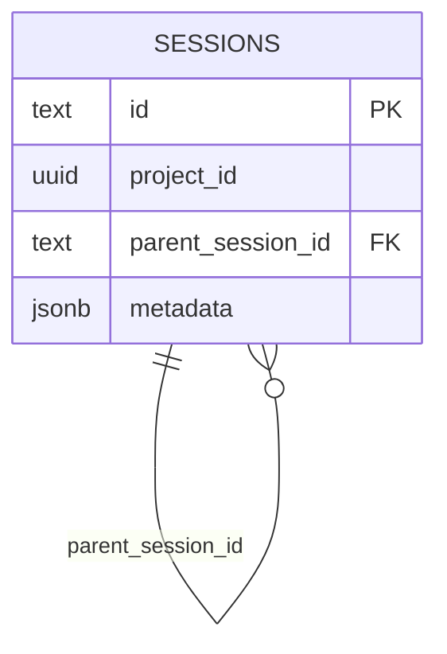
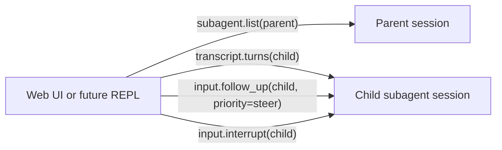
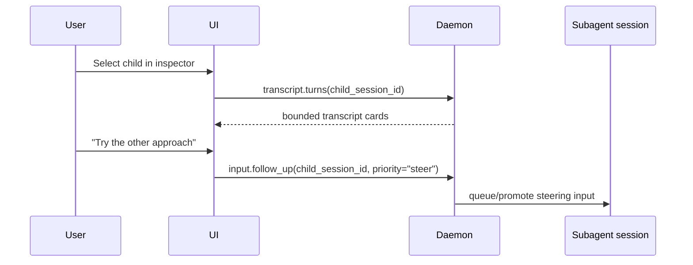

# Subagent orchestration

Status: design reset after removing model-facing workflow tools. Last reviewed
2026-06-09.

## Bird's-eye view

Subagents are regular durable sessions with one extra structural fact:
`sessions.parent_session_id` points at the session that spawned them.

From a user's perspective, a subagent should behave like any other session:

1. it has its own transcript, queue, actions, events, and workspace;
2. it can be read with normal transcript/session RPCs;
3. it can be steered with normal `input.follow_up` using `priority: "steer"`;
4. it can be interrupted with normal `input.interrupt`;
5. the UI may render it under its parent for navigation.

The parent pointer is discovery/topology metadata, not an access-control
primitive and not a separate messaging protocol.

## Goals

- Treat subagents as ordinary sessions everywhere the user can see or control
  them.
- Keep the hierarchy model minimal: direct child discovery uses only
  `sessions.parent_session_id`.
- Let clients steer, follow up, read, and interrupt subagents through the same
  session RPCs used for top-level sessions.
- Keep child filesystem edits isolated until the parent/user explicitly decides
  what to merge or copy.
- Move orchestration out of the regular model tool-use surface and into a
  dedicated stateful Python REPL environment.

## Non-goals

- Do not add a `session_relationships` table for the current v1 hierarchy.
- Do not expose `WorkSpawn`, `WorkAwait`, `WorkRead`, `WorkSend`, `WorkWrite`,
  or `Workflow*` tools to the model.
- Do not create daemon-backed workflow variables; Python orchestration state can
  be normal Python variables unless a later design proves durable variables are
  needed.
- Do not invent subagent-specific send/read RPCs. Use regular session input,
  interrupt, and transcript RPCs once the child session id is known.
- Do not auto-merge child workspace changes into the parent.

## Storage model

Subagent ownership uses the existing session parent pointer:

```text
sessions
  id                  primary key
  parent_session_id   references sessions(id)
```

This answers the only durable topology question needed today: "which direct
children did this session spawn?"



Role/task/display hints can live in child session metadata for UI labels and
debugging, but they are not modeled as relationship rows.

## Current backend surface

The daemon keeps only minimal hierarchy/spawn RPCs:

- `subagent.list`: list direct children for a parent session by reading
  `sessions.parent_session_id`.
- `subagent.spawn`: backend/internal spawn primitive that creates a child
  session, resolves the requested role, forks the workspace, stores
  `parent_session_id`, and dispatches the child's initial message.

Everything else uses ordinary session RPCs:



`subagent.spawn` remains a daemon RPC rather than a model tool so a future
orchestration runtime can create sessions without making orchestration part of
the provider-visible tool schema. It is not a "call" primitive: it returns after
the child session is created and the child's first turn is scheduled. It does
not wait for the child to finish or produce a result.

## Runtime model

### Spawning

`subagent.spawn`:

- validates the parent is a project session;
- resolves the requested role from built-ins (`worker`, `reviewer`, `tester`) or
  a project/user `SKILL.md`;
- forks the child workspace from the parent's current cwd;
- creates the child session with hidden subagent metadata and a durable
  `parent_session_id`;
- schedules the child's initial turn and returns the child session id.

If initial dispatch cannot be scheduled, the daemon cleans up the child
session/workspace so hidden orphans are not left behind. Provider/model work
happens asynchronously after the RPC response.

The current RPC still contains some backend-oriented fields such as optional
child ids, display metadata, provider override, and arbitrary metadata. Those are
not a model-facing schema. A future Python orchestration API should present a
smaller interface.

### Reading and steering

There is no subagent-specific read/send protocol.

Once a client has a child `session_id`, it should use:

- `transcript.turns`, `transcript.turn_detail`, `session.get`, etc. to inspect;
- `input.follow_up` with `priority: "follow_up"` for normal queued input;
- `input.follow_up` with `priority: "steer"` to interrupt the current trajectory
  with a high-priority steering message;
- `input.interrupt` to stop active work.



### Scoping

For now, parent-visible discovery is scoped to direct children: a parent lists
the subagents it spawned. This is a product/UI scoping choice, not a security
boundary. The platform may later support arbitrary sessions steering other
sessions; that should use the same normal session input/read primitives.

## Future Python REPL orchestration

Delegation/orchestration should happen in a stateful Python REPL, not through
the regular provider tool-use API.

The REPL should:

- preserve Python variables between executions;
- expose transcripts as ordinary lists/objects;
- provide preimported helpers for spawning and inspecting agents;
- allow arbitrary Python control flow for loops, races, metric hillclimbs, and
  review cycles;
- keep result values in Python variables by default.

Sketch:

```python
# Preimported by the orchestration environment, not model-visible JSON tools.
review = subagents.call(
    role="reviewer",
    message="Review the proposed patch and return blocking issues.",
    fork_context=True,
)

print(review.transcript[-1])

worker_result = subagents.call(
    role="worker",
    message=f"Fix these issues:\n{review.result}",
    fork_context=False,
)
```

Expected semantics:

- `subagents.call(...)` wraps backend spawn/read/wait mechanics and blocks until
  the subagent has completed enough to return a result.
- `subagents.call_bulk(...)` starts multiple subagent calls in parallel and then
  blocks until all requested results are available.
- Blocking is a Python REPL/helper-layer behavior, not a `subagent.spawn` RPC
  behavior.
- `fork_context=True` means the child receives the parent's context up to that
  point; `False` starts with fresh context plus the initial message.
- Variables are Python variables unless/until a durable variable store is
  separately justified.

Possible helper surface:

```python
result = subagents.call(role="reviewer", message=message, fork_context=False)
results = subagents.call_bulk([
    {"role": "worker", "message": "Try approach A", "fork_context": True},
    {"role": "worker", "message": "Try approach B", "fork_context": True},
])
children = subagents.list(parent_session_id=None)
turns = subagents[child_session_id].transcript
subagents[child_session_id].steer("Change direction...")
subagents[child_session_id].interrupt()
```

This is intentionally a design target. The current PR stack removes the old
provider-visible tool surface and leaves the minimal daemon/session primitives
needed to build this REPL later.
